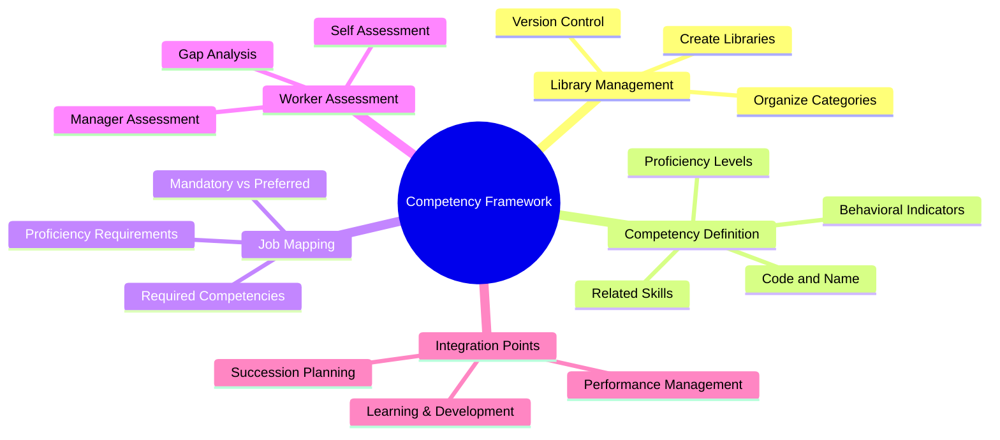
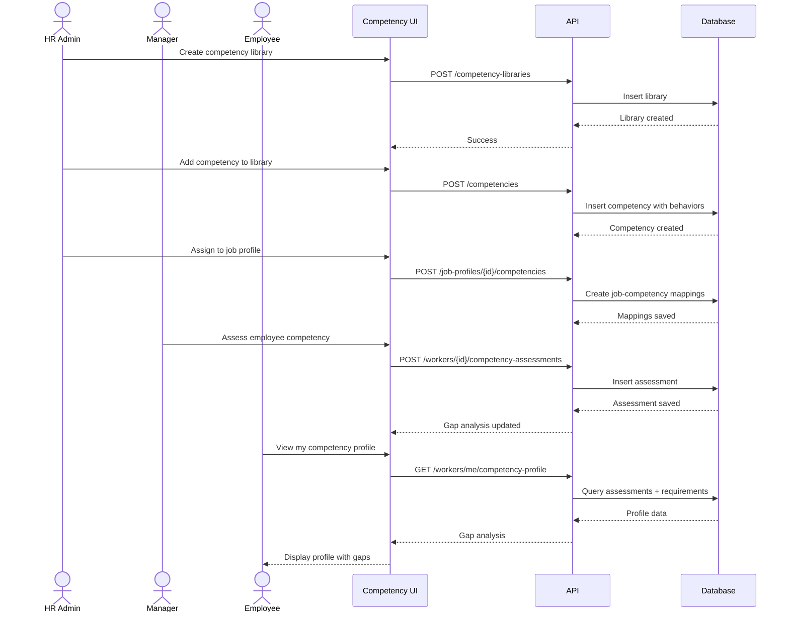

---
# === METADATA ===
id: FEAT-CO-019
type: FEATURE
module: CORE
sub_module: MASTER_DATA
title: "Competency Framework Management (Quản Lý Khung Năng Lực)"
version: "1.0.0"
status: DRAFT
priority: MEDIUM
phase: 2

# === ACTORS ===
actors:
  - HR Administrator
  - Talent Management Specialist
  - HR Manager
  - Department Manager
  - Employee

# === TRIGGERS ===
triggers:
  - "HR Admin navigates to Competency Framework from menu"
  - "Admin needs to create/update competency library"
  - "Manager wants to assess employee competencies"
  - "Employee views their competency profile"

# === PRE-CONDITIONS ===
preconditions:
  - "User is authenticated with appropriate role"
  - "Proficiency scales are configured (from Code List)"
  - "Job Profiles exist for competency mapping"

# === POST-CONDITIONS ===
postconditions:
  - "Competency library available for talent processes"
  - "Competencies mapped to job profiles"
  - "Workers have competency assessments"

# === USER STORY ===
user_story:
  as: "HR Administrator"
  i_want: "manage a structured competency framework with libraries, categories, and behavioral indicators"
  so_that: "we can define clear expectations for roles, assess employee capabilities, and identify development needs"

# === ACCEPTANCE CRITERIA (Gherkin) ===
acceptance_criteria:
  - scenario: "Create competency library"
    given: "HR Admin has permission to manage competency framework"
    when: "Admin creates 'Core Competencies' library"
    then: |
      Library created with name, description, and status
      AND Categories can be added to library
      AND Library version tracked

  - scenario: "Define competency with behavioral indicators"
    given: "Leadership category exists in library"
    when: "Admin creates 'Team Leadership' competency"
    then: |
      Competency has code, name, description
      AND Behavioral indicators defined for each proficiency level (1-5)
      AND Related skills can be linked

  - scenario: "Map competency to job profile"
    given: "Software Engineer job profile exists"
    when: "Admin assigns competencies to profile"
    then: |
      Competencies linked with required proficiency level
      AND Distinction between mandatory vs preferred
      AND Can set weight for importance

  - scenario: "Assess employee competencies"
    given: "Employee has job requiring Leadership competency"
    when: "Manager assesses employee competency"
    then: |
      Assessment recorded with proficiency level
      AND Evidence/comments can be added
      AND Assessment date and assessor tracked
      AND History maintained

  - scenario: "View competency gap analysis"
    given: "Employee has assessed competencies"
    when: "User views employee competency profile"
    then: |
      Shows required vs actual proficiency
      AND Gaps highlighted visually
      AND Gap percentage calculated
      AND Development recommendations available

# === DATA CONTRACT ===
data_contract:
  input:
    createLibrary:
      code: "string"
      name: "string"
      nameVi: "string"
      description: "string?"
      type: "'CORE' | 'LEADERSHIP' | 'FUNCTIONAL' | 'TECHNICAL' | 'CUSTOM'"
      isActive: "boolean"
    
    createCompetency:
      libraryId: "string"
      categoryId: "string"
      code: "string"
      name: "string"
      nameVi: "string"
      description: "string"
      behaviors: 
        - level: "number"
          indicators: "string[]"
      relatedSkillIds: "string[]?"
    
    assignToJobProfile:
      jobProfileId: "string"
      competencies:
        - competencyId: "string"
          requiredLevel: "number"
          isMandatory: "boolean"
          weight: "number?"
    
    assessWorker:
      workerId: "string"
      competencyId: "string"
      assessedLevel: "number"
      evidence: "string?"
      assessorId: "string"
      assessmentDate: "date"
      assessmentType: "'SELF' | 'MANAGER' | 'PEER' | '360'"
  
  output:
    competencyLibrary:
      libraryId: "string"
      code: "string"
      name: "string"
      type: "string"
      categories: 
        - categoryId: "string"
          name: "string"
          competencyCount: "number"
      totalCompetencies: "number"
      isActive: "boolean"
    
    competencyDetail:
      competencyId: "string"
      code: "string"
      name: "string"
      nameVi: "string"
      description: "string"
      category: 
        id: "string"
        name: "string"
      behaviors:
        - level: "number"
          levelName: "string"
          indicators: "string[]"
      relatedSkills: 
        - skillId: "string"
          skillName: "string"
      usageCount:
        jobProfiles: "number"
        workers: "number"
    
    workerCompetencyProfile:
      workerId: "string"
      workerName: "string"
      jobProfile:
        id: "string"
        name: "string"
      competencies:
        - competencyId: "string"
          competencyName: "string"
          category: "string"
          requiredLevel: "number"
          assessedLevel: "number?"
          gap: "number"
          status: "'MET' | 'PARTIAL' | 'NOT_MET' | 'NOT_ASSESSED'"
          lastAssessment: "date?"
      summary:
        totalCompetencies: "number"
        assessed: "number"
        met: "number"
        gapPercentage: "number"

# === REFERENCES ===
requirements:
  - "[[FR-SKL-010]]"
  - "[[FR-SKL-015]]"
  - "[[FR-PRF-020]]"

business_rules:
  - "[[BR-SKL-001]]"
  - "[[BR-SKL-003]]"

related_ontology:
  - "[[CompetencyMaster]]"
  - "[[CompetencyCategory]]"
  - "[[WorkerCompetency]]"
  - "[[JobProfile]]"

related_features:
  - "[[FEAT-CO-040]]"  # Skill Catalog Management

concept_guides:
  - "01-concept/06-skill-management-guide.md"
  - "07-impl-notes/competency-framework-analysis.md"
---

# Competency Framework Management (Quản Lý Khung Năng Lực)

> **Feature**: Comprehensive competency library management with behavioral indicators, job mapping, and worker assessment

## 1. Overview



## 2. User Story

**As an** HR Administrator  
**I want to** manage a structured competency framework with libraries, categories, and behavioral indicators  
**So that** we can define clear expectations for roles, assess employee capabilities, and identify development needs

## 3. Business Context

### Skills vs Competencies

| Aspect | Skills | Competencies |
|--------|--------|--------------|
| **Nature** | Technical abilities | Behavioral capabilities |
| **Examples** | Python, Excel, SQL | Leadership, Communication |
| **Measurement** | Task completion | Observable behaviors |
| **Development** | Training, practice | Experience, coaching |
| **Time to develop** | Weeks to months | Months to years |

### Industry Standard

| Vendor | Solution | Key Feature |
|--------|----------|-------------|
| **Workday** | Competency Framework | Specialties, job family mapping, behavior ratings |
| **SAP** | Center of Capabilities | Library hierarchy, Talent Intelligence Hub |
| **Oracle** | Dynamic Skills | AI-powered Skills Nexus and Advisor |

## 4. Acceptance Criteria

### Scenario 1: Create competency library

```gherkin
Given HR Admin has permission to manage competency framework
When Admin creates a new library:
  | Field       | Value                    |
  | Code        | LIB_CORE_2026            |
  | Name        | Core Competencies 2026   |
  | Type        | CORE                     |
  | Description | Company-wide behaviors   |
Then Library created successfully
  And Library appears in library list
  And Version 1.0 assigned automatically
  And Categories can now be added to library
```

### Scenario 2: Define competency with behavioral indicators

```gherkin
Given "Leadership" category exists in Core Competencies library
When Admin creates "Team Leadership" competency:
  | Field       | Value                           |
  | Code        | COMP_LEAD_001                   |
  | Name        | Team Leadership                 |
  | Name (Vi)   | Lãnh Đạo Nhóm                   |
Then Competency created with behavioral indicators:
  
  Level 1 - Developing:
    - "Understands basic team dynamics"
    - "Follows established team processes"
    
  Level 3 - Competent:
    - "Effectively delegates tasks to team members"
    - "Provides regular and constructive feedback"
    - "Resolves team conflicts appropriately"
    
  Level 5 - Expert:
    - "Builds high-performing teams consistently"
    - "Develops leadership capabilities in others"
    - "Influences organizational culture positively"
```

### Scenario 3: Map competency to job profile

```gherkin
Given "Software Engineer" job profile exists
When Admin assigns competencies to profile:
  | Competency       | Required Level | Mandatory | Weight |
  | Team Leadership  | 2              | No        | 15%    |
  | Problem Solving  | 4              | Yes       | 30%    |
  | Communication    | 3              | Yes       | 25%    |
  | Continuous Learn | 3              | Yes       | 30%    |
Then Profile shows 4 competencies assigned
  And Total weight = 100%
  And Competencies appear in job posting template
```

### Scenario 4: Assess employee competencies

```gherkin
Given Employee Nguyen A has "Software Engineer" job profile
  And Job requires "Problem Solving" at Level 4
When Manager assesses competency:
  | Field           | Value                               |
  | Assessed Level  | 3 (Competent)                       |
  | Evidence        | "Good at debugging, needs complex scenarios" |
  | Assessment Type | MANAGER                             |
Then Assessment recorded with gap = -1
  And Previous assessment kept in history
  And Development recommendation generated
```

### Scenario 5: View competency gap analysis

```gherkin
Given Employee has competency assessments
When Viewing competency profile
Then Gap analysis displayed:
  |──────────────────────────────────────────────────────────────|
  | COMPETENCY PROFILE: NGUYEN VAN A                             |
  | Job: Software Engineer                                       |
  |──────────────────────────────────────────────────────────────|
  |                                                              |
  | Competency        Required  Actual  Gap    Status            |
  | ─────────────────────────────────────────────────────────── |
  | Problem Solving      4        3      -1    ⚠️ PARTIAL        |
  | Communication        3        3       0    ✅ MET            |
  | Continuous Learning  3        4      +1    ✅ EXCEEDS        |
  | Team Leadership      2        -       -    ❓ NOT ASSESSED   |
  |                                                              |
  | SUMMARY: 2/4 competencies met | 75% coverage                 |
  |──────────────────────────────────────────────────────────────|
```

## 5. Data Contract

### Competency Library Response

```json5
{
  libraryId: "lib-core-001",
  code: "LIB_CORE_2026",
  name: "Core Competencies 2026",
  nameVi: "Năng Lực Cốt Lõi 2026",
  type: "CORE",
  description: "Company-wide competencies for all employees",
  version: "1.0",
  isActive: true,
  
  categories: [
    {
      categoryId: "cat-lead-001",
      name: "Leadership",
      nameVi: "Lãnh Đạo",
      competencyCount: 5
    },
    {
      categoryId: "cat-comm-001",
      name: "Communication",
      nameVi: "Giao Tiếp",
      competencyCount: 4
    }
  ],
  
  totalCompetencies: 15,
  usageStats: {
    jobProfilesUsingLibrary: 25,
    workersAssessed: 150
  }
}
```

### Worker Competency Gap Analysis

```json5
{
  workerId: "W-001",
  workerName: "Nguyễn Văn A",
  
  jobProfile: {
    id: "JP-SE-001",
    name: "Software Engineer"
  },
  
  competencies: [
    {
      competencyId: "COMP-PS-001",
      competencyName: "Problem Solving",
      category: "Cognitive",
      requiredLevel: 4,
      assessedLevel: 3,
      gap: -1,
      status: "PARTIAL",
      lastAssessment: "2026-01-05",
      assessor: "Tran Van B"
    },
    {
      competencyId: "COMP-TL-001",
      competencyName: "Team Leadership",
      category: "Leadership",
      requiredLevel: 2,
      assessedLevel: null,
      gap: null,
      status: "NOT_ASSESSED",
      lastAssessment: null
    }
  ],
  
  summary: {
    totalCompetencies: 4,
    assessed: 3,
    met: 2,
    exceeds: 1,
    partial: 1,
    notMet: 0,
    notAssessed: 1,
    gapPercentage: 25  // (1 partial / 4 total) * 100
  }
}
```

## 6. Activities Flow



## 7. UI Sketch

### Desktop: Competency Library List

```
┌──────────────────────────────────────────────────────────────────────────────┐
│  📚 COMPETENCY FRAMEWORK                                  [+ New Library]    │
├──────────────────────────────────────────────────────────────────────────────┤
│                                                                              │
│  ┌─ LIBRARIES ───────────────────────────────────────────────────────────┐   │
│  │                                                                       │   │
│  │  ┌─────────────────────────────────────────────────────────────────┐  │   │
│  │  │ 📗 Core Competencies 2026                    [CORE] [ACTIVE]    │  │   │
│  │  │     15 competencies • 4 categories                              │  │   │
│  │  │     Used by 25 job profiles • 150 workers assessed              │  │   │
│  │  │                                                    [Edit] [→]  │  │   │
│  │  └─────────────────────────────────────────────────────────────────┘  │   │
│  │                                                                       │   │
│  │  ┌─────────────────────────────────────────────────────────────────┐  │   │
│  │  │ 📘 Leadership Competencies                [LEADERSHIP] [ACTIVE] │  │   │
│  │  │     8 competencies • 2 categories                               │  │   │
│  │  │     Used by 10 job profiles • 45 workers assessed               │  │   │
│  │  │                                                    [Edit] [→]  │  │   │
│  │  └─────────────────────────────────────────────────────────────────┘  │   │
│  │                                                                       │   │
│  │  ┌─────────────────────────────────────────────────────────────────┐  │   │
│  │  │ 📙 Technical Competencies               [TECHNICAL] [ACTIVE]    │  │   │
│  │  │     20 competencies • 5 categories                              │  │   │
│  │  │     Used by 15 job profiles • 200 workers assessed              │  │   │
│  │  │                                                    [Edit] [→]  │  │   │
│  │  └─────────────────────────────────────────────────────────────────┘  │   │
│  │                                                                       │   │
│  └───────────────────────────────────────────────────────────────────────┘   │
│                                                                              │
└──────────────────────────────────────────────────────────────────────────────┘
```

### Desktop: Competency Detail with Behaviors

```
┌──────────────────────────────────────────────────────────────────────────────┐
│  ← Core Competencies > Leadership > Team Leadership            [Edit] [×]    │
├──────────────────────────────────────────────────────────────────────────────┤
│                                                                              │
│  TEAM LEADERSHIP (Lãnh Đạo Nhóm)                                             │
│  Code: COMP_LEAD_001                                                         │
│  ──────────────────────────────────────────────────────────────────────────  │
│                                                                              │
│  Description:                                                                │
│  The ability to guide, motivate, and develop team members to achieve         │
│  common goals while fostering collaboration and individual growth.           │
│                                                                              │
│  ╭────────────────────────────────────────────────────────────────────────╮  │
│  │ BEHAVIORAL INDICATORS BY PROFICIENCY LEVEL                             │  │
│  ├────────────────────────────────────────────────────────────────────────┤  │
│  │                                                                        │  │
│  │  ▸ Level 1 - DEVELOPING                                               │  │
│  │    • Understands basic team dynamics                                   │  │
│  │    • Follows established team processes                                │  │
│  │    • Participates constructively in team activities                    │  │
│  │                                                                        │  │
│  │  ▸ Level 2 - BASIC                                                     │  │
│  │    • Contributes ideas in team settings                                │  │
│  │    • Supports team decisions once made                                 │  │
│  │    • Helps onboard new team members                                    │  │
│  │                                                                        │  │
│  │  ▸ Level 3 - COMPETENT                                                 │  │
│  │    • Effectively delegates tasks to team members                       │  │
│  │    • Provides regular and constructive feedback                        │  │
│  │    • Resolves team conflicts appropriately                             │  │
│  │    • Sets clear team goals and expectations                            │  │
│  │                                                                        │  │
│  │  ▸ Level 4 - PROFICIENT                                                │  │
│  │    • Develops team capabilities and skills                             │  │
│  │    • Creates high-trust team environment                               │  │
│  │    • Adapts leadership style to team needs                             │  │
│  │                                                                        │  │
│  │  ▸ Level 5 - EXPERT                                                    │  │
│  │    • Builds high-performing teams consistently                         │  │
│  │    • Develops leadership capabilities in others                        │  │
│  │    • Influences organizational culture positively                      │  │
│  ╰────────────────────────────────────────────────────────────────────────╯  │
│                                                                              │
│  Related Skills: Communication, Problem Solving, Emotional Intelligence      │
│                                                                              │
│  Job Profiles Using This: Software Engineer Lead, Product Manager, ...       │
│                                                                              │
└──────────────────────────────────────────────────────────────────────────────┘
```

### Desktop: Worker Competency Gap Analysis

```
┌──────────────────────────────────────────────────────────────────────────────┐
│  👤 COMPETENCY PROFILE: NGUYỄN VĂN A                                         │
│  Job: Software Engineer • Department: Engineering                            │
├──────────────────────────────────────────────────────────────────────────────┤
│                                                                              │
│  ┌─ SUMMARY ────────────────────────────────────────────────────────────┐    │
│  │                                                                      │    │
│  │   ┌────────┐ ┌────────┐ ┌────────┐ ┌────────┐                        │    │
│  │   │ 4/5    │ │ 80%    │ │ 2      │ │ 1      │                        │    │
│  │   │ Met    │ │Coverage│ │ Gaps   │ │ Pending│                        │    │
│  │   └────────┘ └────────┘ └────────┘ └────────┘                        │    │
│  │                                                                      │    │
│  └──────────────────────────────────────────────────────────────────────┘    │
│                                                                              │
│  ┌─ COMPETENCY GAP ANALYSIS ────────────────────────────────────────────┐    │
│  │                                                                      │    │
│  │  Competency            Required  Actual  Gap     Status              │    │
│  │  ─────────────────────────────────────────────────────────────────── │    │
│  │  Problem Solving           ████░     ███░░   -1    ⚠️ Partial        │    │
│  │                            (4)       (3)                             │    │
│  │                                                                      │    │
│  │  Communication             ███░░     ███░░    0    ✅ Met            │    │
│  │                            (3)       (3)                             │    │
│  │                                                                      │    │
│  │  Continuous Learning       ███░░     ████░   +1    ✅ Exceeds        │    │
│  │                            (3)       (4)                             │    │
│  │                                                                      │    │
│  │  Team Leadership           ██░░░     ─────    -    ❓ Not Assessed   │    │
│  │                            (2)       (-)                [Assess →]   │    │
│  │                                                                      │    │
│  └──────────────────────────────────────────────────────────────────────┘    │
│                                                                              │
│  ┌─ DEVELOPMENT RECOMMENDATIONS ────────────────────────────────────────┐    │
│  │  📈 Problem Solving: Consider advanced problem-solving workshop       │    │
│  │  📘 Team Leadership: Schedule initial assessment with manager         │    │
│  └──────────────────────────────────────────────────────────────────────┘    │
│                                                                              │
└──────────────────────────────────────────────────────────────────────────────┘
```

## 8. Business Rules

### Library Management
- Library code must be unique across organization
- At least one category required per library
- Cannot delete library with active job mappings

### Competency Definition
- Competency code unique within library
- Behavioral indicators required for at least 3 levels (1, 3, 5)
- Each behavior should be observable and measurable

### Assessment Rules
| Rule | Description |
|------|-------------|
| Self-assessment frequency | Max once per quarter |
| Manager assessment validity | 12 months |
| Gap threshold warning | -2 or more triggers alert |
| Multiple assessors | Average when same period |

## 9. Integration Points

| Integration | Description |
|-------------|-------------|
| **Performance Management** | Competencies → Performance goals and reviews |
| **Learning & Development** | Gaps → Course recommendations |
| **Succession Planning** | Readiness based on leadership competencies |
| **Recruitment** | Job competencies → Candidate matching |

## 10. Success Metrics

| Metric | Target |
|--------|--------|
| Library coverage | 100% core roles defined |
| Assessment completion | > 80% employees assessed annually |
| Gap closure rate | > 50% gaps addressed within 12 months |
| User adoption | > 70% managers using for reviews |
