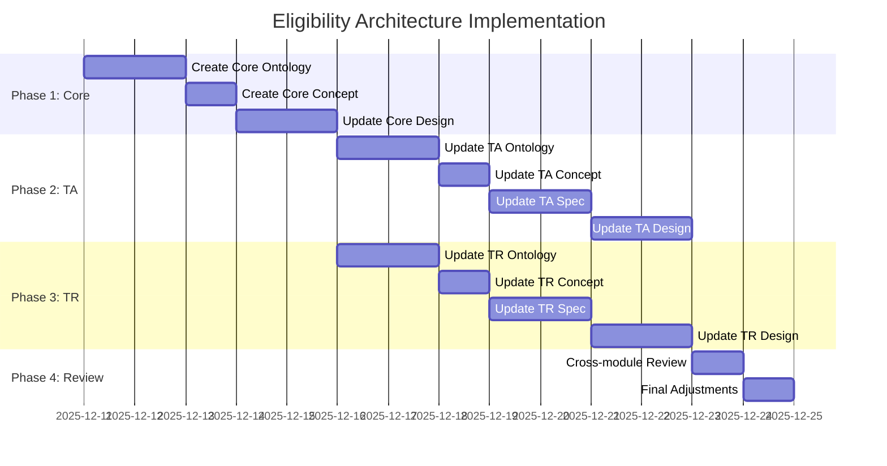

# Implementation Plan: Hybrid Eligibility Architecture

**Version**: 1.0  
**Date**: 2025-12-11  
**Scope**: CO (Core), TA (Time & Absence), TR (Total Rewards) modules

---

## 📋 Overview

### Objective
Implement Hybrid Eligibility Architecture across all modules:
- Create **Core Eligibility Engine** in CO module
- Update **TA module** to use Core eligibility for absence rules
- Update **TR module** to use Core eligibility for benefits/compensation

### Approach
- **Hybrid Model**: Default eligibility at Class/Type level + Override at Rule level
- **Organizational Scope**: Managed by `EligibilityProfile` (Core module)
- **Object Scope**: Remains in individual rules (`leaveTypeId`, `benefitPlanId`, etc.)

### Reference Documents
- [eligibility-architecture-analysis.md](file:///Users/nguyenhuyvu/Library/CloudStorage/OneDrive-VNGCorporation/Apps/mygit/a4b-doc-xtalent/product/xTalent/docs/01-modules/CO/07-impl-notes/eligibility-architecture-analysis.md)
- [eligibility-hybrid-design.md](file:///Users/nguyenhuyvu/Library/CloudStorage/OneDrive-VNGCorporation/Apps/mygit/a4b-doc-xtalent/product/xTalent/docs/01-modules/CO/07-impl-notes/eligibility-hybrid-design.md)
- [eligibility-quick-reference.md](file:///Users/nguyenhuyvu/Library/CloudStorage/OneDrive-VNGCorporation/Apps/mygit/a4b-doc-xtalent/product/xTalent/docs/01-modules/CO/07-impl-notes/eligibility-quick-reference.md)

---

## 🎯 Implementation Phases



---

## 📦 Phase 1: Core Module - Eligibility Engine

### 1.1 Update Core Eligibility Ontology

**Files**: 
- `CO/00-ontology/core-ontology.yaml` (UPDATE - add eligibility entities)
- `CO/00-ontology/glossary-eligibility.md` (NEW - create glossary)

**Tasks**:
- [ ] Add `EligibilityProfile` entity to `core-ontology.yaml`
- [ ] Add `EligibilityMember` entity to `core-ontology.yaml`
- [ ] Add `EligibilityEvaluation` entity (for audit) to `core-ontology.yaml`
- [ ] Define relationships and constraints
- [ ] Add SCD Type 2 support
- [ ] Document business rules
- [ ] Create `glossary-eligibility.md` with all eligibility terms
- [ ] Update main ontology file references

**Key Entities to Add**:
```yaml
# In core-ontology.yaml

entities:
  # ... existing entities
  
  EligibilityProfile:
    description: |\
      Defines eligibility criteria for HR programs across modules (Absence, Benefits, 
      Compensation). Uses dynamic rules to determine WHO is eligible based on 
      organizational attributes (BU, LE, country, grade, tenure, etc.).
    attributes:
      - id: string (UUID)
      - code: string # Unique identifier, e.g., "ELIG_SENIOR_STAFF"
      - name: string # Display name
      - domain: enum [ABSENCE, BENEFITS, COMPENSATION, CORE]
      - description: string (nullable)
      - rule_json: jsonb # Dynamic criteria
      - priority: integer
      - isActive: boolean
      - effectiveDate: date
      - endDate: date (nullable)
      - createdAt: datetime
      - updatedAt: datetime
    
    relationships:
      - hasMembers: EligibilityMember[]
      - hasEvaluations: EligibilityEvaluation[]
      - usedByLeaveClasses: LeaveClass[] # Cross-module
      - usedByBenefitPlans: BenefitPlan[] # Cross-module
    
    constraints:
      - "code must be unique"
      - "effectiveDate must be <= endDate if endDate is set"
    
    validations:
      - "code: required, uppercase, alphanumeric + underscore, max 50"
      - "name: required, max 255"
      - "domain: required, must be valid enum value"
      - "rule_json: required, valid JSON"

  EligibilityMember:
    description: |\
      Cached membership list for fast eligibility lookups. Stores which employees 
      currently match an eligibility profile. Updated automatically when employee 
      data changes or when profile rules are modified.
    attributes:
      - id: string (UUID)
      - profileId: string (UUID)
      - employeeId: string (UUID)
      - startDate: date
      - endDate: date (nullable)
      - lastEvaluatedAt: datetime
      - evaluationSource: enum [AUTO, MANUAL, OVERRIDE]
      - evaluationReason: string (nullable)
      - metadata: jsonb (nullable)
    
    relationships:
      - belongsToProfile: EligibilityProfile
      - belongsToEmployee: Employee
    
    constraints:
      - "Unique combination of (profileId, employeeId, startDate)"
    
    rules:
      - "startDate must be <= endDate if endDate is set"
      - "Cannot have overlapping active memberships for same profile and employee"

  EligibilityEvaluation:
    description: |\
      Audit log of eligibility evaluations. Tracks when and why employees were 
      added or removed from eligibility profiles.
    attributes:
      - id: string (UUID)
      - profileId: string (UUID)
      - employeeId: string (UUID)
      - evaluatedAt: datetime
      - evaluationResult: enum [ELIGIBLE, NOT_ELIGIBLE]
      - evaluationReason: string
      - triggeredBy: enum [EMPLOYEE_CHANGE, RULE_CHANGE, MANUAL, SCHEDULED]
      - triggeredById: string (UUID, nullable)
      - metadata: jsonb
    
    relationships:
      - forProfile: EligibilityProfile
      - forEmployee: Employee
```

**Glossary File Structure** (`glossary-eligibility.md`):
```markdown
# Eligibility Glossary

## Core Concepts

### Eligibility Profile
Definition, purpose, examples...

### Eligibility Member
Definition, purpose, examples...

### Organizational Scope
vs Object Scope...

## Terms

### Domain
### Rule JSON
### Evaluation Source
### Hybrid Model
### Default Eligibility
### Override Eligibility
```

**Deliverables**: 
- Updated `CO/00-ontology/core-ontology.yaml`
- New `CO/00-ontology/glossary-eligibility.md`

---

### 1.2 Create Core Eligibility Concept Guide

**Files**:
- `CO/01-concept/11-eligibility-engine-guide.md` (NEW)
- `CO/01-concept/README.md` (UPDATE - add reference)
- `CO/01-concept/CORE-MODULE-CONCEPT-OVERVIEW.md` (UPDATE - add section)

**Tasks**:
- [ ] Create `11-eligibility-engine-guide.md`
- [ ] Explain Eligibility Engine concept
- [ ] Document Hybrid Model (Default + Override)
- [ ] Explain Dynamic Group evaluation
- [ ] Document Cached Membership pattern
- [ ] Provide cross-module examples (TA, TR)
- [ ] Document resolution logic
- [ ] Add best practices
- [ ] Update `README.md` to reference new guide
- [ ] Update `CORE-MODULE-CONCEPT-OVERVIEW.md` with eligibility section

**Structure**:
```markdown
# Eligibility Engine Guide

## Overview
- What is Eligibility Engine
- Why Hybrid Model
- Cross-module Architecture

## Core Concepts
- EligibilityProfile (Dynamic Rules)
- EligibilityMember (Cached Membership)
- Resolution Hierarchy

## Usage Patterns
- Default at Class/Type Level
- Override at Rule Level
- Cross-module Reusability

## Examples
- TA: Leave eligibility
- TR: Benefits eligibility
- TR: Compensation eligibility

## Best Practices
- When to use default vs override
- Performance optimization
- Audit and compliance
```

**Deliverable**: `CO/01-concept/10-eligibility-engine-guide.md`

---

### 1.3 Update Core Database Design

**File**: `CO/03-design/1.Core.V4.dbml`

**Tasks**:
- [ ] Add `core.eligibility_profile` table
- [ ] Add `core.eligibility_member` table
- [ ] Add `core.eligibility_evaluation` table (audit)
- [ ] Add indexes for performance
- [ ] Add constraints and checks
- [ ] Document relationships
- [ ] Add comments with `changed 11dec2025`

**Schema Addition**:
```sql
// ========================
// ELIGIBILITY ENGINE
// ========================

Table core.eligibility_profile {
  id                uuid [pk, default: `gen_random_uuid()`]
  code              varchar(50) [unique, not null]
  name              varchar(255) [not null]
  domain            varchar(50) [not null]  // ABSENCE | BENEFITS | COMPENSATION | CORE
  description       text
  
  rule_json         jsonb [not null]
  priority          int [default: 10]
  is_active         boolean [default: true]
  
  effective_start_date date [not null]
  effective_end_date   date
  is_current_flag      boolean [default: true]
  
  created_at        timestamp [default: `now()`]
  updated_at        timestamp
  
  Indexes {
    (domain, code, effective_start_date) [unique]
    (domain, is_active)
  }
  
  Note: 'changed 11dec2025: NEW - Core eligibility engine for cross-module reusability'
}

Table core.eligibility_member {
  id                uuid [pk, default: `gen_random_uuid()`]
  profile_id        uuid [ref: > core.eligibility_profile.id, not null]
  employee_id       uuid [ref: > employment.employee.id, not null]
  
  start_date        date [not null]
  end_date          date
  
  last_evaluated_at timestamp [not null]
  evaluation_source varchar(50) [not null]  // AUTO | MANUAL | OVERRIDE
  evaluation_reason text
  
  metadata          jsonb
  
  Indexes {
    (profile_id, employee_id, start_date) [unique]
    (profile_id, employee_id) [where: end_date IS NULL]
    (employee_id, profile_id) [where: end_date IS NULL]
  }
  
  Note: 'changed 11dec2025: NEW - Cached membership for fast O(1) eligibility lookup'
}
```

**Deliverable**: Updated `CO/03-design/1.Core.V4.dbml`

---

## 📦 Phase 2: TA Module Updates

### 2.1 Update TA Ontology

**Files**: 
- `TA/00-ontology/time-absence-ontology.yaml` (UPDATE - latest combined file)
- `TA/00-ontology/absence-glossary.md` (UPDATE - add eligibility terms)

**Tasks**:
- [ ] Add `default_eligibility_profile_id` to `LeaveClass`
- [ ] Add `default_eligibility_profile_id` to `LeaveType`
- [ ] Add `eligibility_profile_id` to all rule entities:
  - `AccrualRule`
  - `CarryoverRule`
  - `LimitRule`
  - `OverdraftRule`
  - `ProrationRule`
  - `RoundingRule`
  - `ValidationRule`
- [ ] Update relationships to reference `core.EligibilityProfile`
- [ ] Remove organizational scope fields from rules (if any)
- [ ] Update business rules documentation

**Changes**:
```yaml
LeaveClass:
  attributes:
    # ... existing attributes
    - defaultEligibilityProfileId: string (UUID, nullable)  # NEW
  
  relationships:
    - hasDefaultEligibility: EligibilityProfile  # NEW
    - hasEligibilityRules: EligibilityRule[]     # DEPRECATED - remove
    # ... other relationships

LeaveType:
  attributes:
    # ... existing attributes
    - defaultEligibilityProfileId: string (UUID, nullable)  # NEW
  
  relationships:
    - hasDefaultEligibility: EligibilityProfile  # NEW
    - hasEligibilityRules: EligibilityRule[]     # DEPRECATED - remove

AccrualRule:
  attributes:
    # ... existing attributes
    - leaveTypeId: string (UUID, nullable)       # KEEP
    - leaveClassId: string (UUID, nullable)      # KEEP
    - eligibilityProfileId: string (UUID, nullable)  # NEW - override
    # REMOVE: minTenureMonths, employmentTypes, locations, etc.
  
  relationships:
    - hasEligibility: EligibilityProfile  # NEW
```

**Deliverables**: 
- Updated `TA/00-ontology/time-absence-ontology.yaml`
- Updated `TA/00-ontology/absence-glossary.md`

**Note**: Review both `absence-ontology.yaml` and `time-attendance-ontology.yaml` for context, but update the combined `time-absence-ontology.yaml` file.

---

### 2.2 Update TA Concept Guides

**Files**:
- `TA/01-concept/02-conceptual-guide.md` (UPDATE)
- `TA/01-concept/01-concept-overview.md` (UPDATE - add eligibility overview)

**Tasks**:
- [ ] Update `02-conceptual-guide.md`:
  - Add section on Eligibility Architecture
  - Explain Default vs Override pattern
  - Update examples to show eligibility usage
  - Add cross-reference to Core Eligibility Guide
  - Update diagrams to show eligibility flow
- [ ] Update `01-concept-overview.md`:
  - Add eligibility overview in relevant sections
  - Update architecture diagrams
  - Add cross-module references

**New Section**:
```markdown
## Eligibility Architecture

### Overview
TA module uses the Core Eligibility Engine to manage WHO is eligible for leave policies.

### Hybrid Model
- **Default Eligibility**: Set at LeaveClass or LeaveType level
- **Override Eligibility**: Set at individual rule level

### Example
LeaveClass: PTO
  default_eligibility: All Full-Time Employees

AccrualRule: Junior Accrual
  eligibility: Junior Staff (G1-G3)  ← Override
  
AccrualRule: Senior Accrual
  eligibility: Senior Staff (G4+)    ← Override

CarryoverRule: Standard
  eligibility: (inherit from LeaveClass)  ← Use default
```

**Deliverables**: 
- Updated `TA/01-concept/02-conceptual-guide.md`
- Updated `TA/01-concept/01-concept-overview.md`

---

### 2.3 Update TA Specification

**File**: `TA/02-spec/01-absence-behaviour-spec.md`

**Tasks**:
- [ ] Update business rules to reference eligibility
- [ ] Add eligibility resolution logic
- [ ] Update validation rules
- [ ] Add examples with eligibility

**Updated Business Rules**:
```markdown
### BR-ABS-005: Eligibility Check (UPDATED)

**Rule**: Before processing any absence rule, system must verify employee eligibility

**Logic**:
1. Get effective eligibility profile for the rule:
   - If rule has `eligibility_profile_id`: Use this
   - Else if LeaveType has `default_eligibility_profile_id`: Use this
   - Else if LeaveClass has `default_eligibility_profile_id`: Use this
   - Else: No restriction (all eligible)

2. If eligibility profile exists:
   - Lookup in `core.eligibility_member`
   - Check if employee is active member
   - If not found: Employee not eligible

3. Return eligibility status

**Example**:
Employee G2 requests annual leave
→ System checks AccrualRule
→ AccrualRule has eligibility_profile_id = "ELIG_JUNIOR"
→ Lookup: Is Employee G2 in ELIG_JUNIOR?
→ Yes → Eligible
```

**Deliverable**: Updated `TA/02-spec/01-absence-behaviour-spec.md`

---

### 2.4 TA Database Design (DEFERRED)

**Status**: ❌ **NOT IN THIS PHASE** - Will be done in separate DB update plan

**Future Tasks** (for reference):
- [ ] Add `default_eligibility_profile_id` to `absence.leave_class`
- [ ] Add `default_eligibility_profile_id` to `absence.leave_type`
- [ ] Add `eligibility_profile_id` to all rule tables
- [ ] Add foreign key references to `core.eligibility_profile`
- [ ] Remove organizational scope fields from rules
- [ ] Add helper views for eligibility resolution
- [ ] Add comments with `changed 11dec2025`

**Schema Changes**:
```sql
// TA Module - Absence

Table absence.leave_class {
  // ... existing fields
  
  default_eligibility_profile_id uuid [ref: > core.eligibility_profile.id, null]
  
  Note: 'changed 11dec2025: Added default_eligibility_profile_id for hybrid eligibility model'
}

Table absence.leave_type {
  // ... existing fields
  
  default_eligibility_profile_id uuid [ref: > core.eligibility_profile.id, null]
  
  Note: 'changed 11dec2025: Added default_eligibility_profile_id (can override class default)'
}

Table absence.accrual_rule {
  // ... existing fields
  
  leave_type_id     uuid [ref: > absence.leave_type.id, null]     // KEEP
  leave_class_id    uuid [ref: > absence.leave_class.id, null]    // KEEP
  
  eligibility_profile_id uuid [ref: > core.eligibility_profile.id, null]  // NEW
  
  // REMOVE: min_tenure_months, employment_types, locations, etc.
  
  Note: 'changed 11dec2025: Added eligibility_profile_id for organizational scope override'
}

// Helper View
CREATE VIEW absence.accrual_rule_effective_eligibility AS
SELECT 
  ar.id,
  COALESCE(
    ar.eligibility_profile_id,
    lt.default_eligibility_profile_id,
    lc.default_eligibility_profile_id
  ) AS effective_eligibility_profile_id
FROM absence.accrual_rule ar
LEFT JOIN absence.leave_type lt ON ar.leave_type_id = lt.id
LEFT JOIN absence.leave_class lc ON COALESCE(ar.leave_class_id, lt.leave_class_id) = lc.id;
```

**Deliverable**: None (deferred to separate DB update plan)

---

## 📦 Phase 3: TR Module Updates

### 3.1 Update TR Ontology

**Files**: 
- `TR/00-ontology/tr-ontology.yaml` (UPDATE - main ontology file)
- `TR/00-ontology/glossary-benefits.md` (UPDATE - add eligibility terms)
- `TR/00-ontology/glossary-variable-pay.md` (UPDATE - add eligibility terms)

**Tasks**:
- [ ] Update `tr-ontology.yaml`:
  - Add `default_eligibility_profile_id` to `BenefitPlan`
  - Add `eligibility_profile_id` to `BenefitOption`
  - Add `default_eligibility_profile_id` to `VariablePayPlan`
  - Add `eligibility_profile_id` to `CommissionTier`
  - Update relationships to reference `core.EligibilityProfile`
  - Remove organizational scope fields
- [ ] Update `glossary-benefits.md` with eligibility terms
- [ ] Update `glossary-variable-pay.md` with eligibility terms

**Changes**:
```yaml
# Benefits
BenefitPlan:
  attributes:
    - defaultEligibilityProfileId: string (UUID, nullable)  # NEW
  relationships:
    - hasDefaultEligibility: EligibilityProfile  # NEW

BenefitOption:
  attributes:
    - eligibilityProfileId: string (UUID, nullable)  # NEW - override
  relationships:
    - hasEligibility: EligibilityProfile  # NEW

# Compensation
VariablePayPlan:
  attributes:
    - defaultEligibilityProfileId: string (UUID, nullable)  # NEW
  relationships:
    - hasDefaultEligibility: EligibilityProfile  # NEW
```

**Deliverables**: 
- Updated `TR/00-ontology/tr-ontology.yaml`
- Updated `TR/00-ontology/glossary-benefits.md`
- Updated `TR/00-ontology/glossary-variable-pay.md`

---

### 3.2 Update TR Concept Guide

**File**: `TR/01-concept/09-eligibility-rules-guide.md`

**Tasks**:
- [ ] Update to reference Core Eligibility Engine
- [ ] Add note about cross-module reusability
- [ ] Update examples to show hybrid model
- [ ] Add TA integration examples

**Updates**:
```markdown
## Architecture (UPDATED)

The Eligibility Engine is now part of the **Core Module** and is shared across:
- **TA Module**: Leave eligibility
- **TR Module**: Benefits and Compensation eligibility
- **Future Modules**: Training, Recognition, etc.

### Hybrid Model in TR

BenefitPlan: Health Insurance
  default_eligibility: All Employees

  BenefitOption: Basic
    eligibility: (inherit)  ← All employees
  
  BenefitOption: Premium
    eligibility: Senior Staff  ← Override
  
  BenefitOption: Executive
    eligibility: Executives  ← Override
```

**Deliverable**: Updated `TR/01-concept/09-eligibility-rules-guide.md`

---

### 3.3 Update TR Specification

**Files**:
- `TR/02-spec/01-functional-requirements.md` (UPDATE)
- `TR/02-spec/04-business-rules.md` (UPDATE)

**Tasks**:
- [ ] Update `01-functional-requirements.md`:
  - Add eligibility requirements for benefits
  - Add eligibility requirements for compensation
  - Document hybrid model usage
- [ ] Update `04-business-rules.md`:
  - Update business rules to reference Core eligibility
  - Add eligibility resolution logic
  - Update validation rules
  - Add cross-module examples

**Deliverables**:
- Updated `TR/02-spec/01-functional-requirements.md`
- Updated `TR/02-spec/04-business-rules.md`

---

### 3.4 TR Database Design (DEFERRED)

**Status**: ❌ **NOT IN THIS PHASE** - TR database design not yet created

**Future Tasks** (for reference):
- [ ] Add `default_eligibility_profile_id` to benefit/compensation plans
- [ ] Add `eligibility_profile_id` to options/tiers
- [ ] Add foreign key references to `core.eligibility_profile`
- [ ] Add helper views for eligibility resolution
- [ ] Add comments with `changed 11dec2025`

**Schema Changes**:
```sql
// TR Module - Benefits

Table benefits.benefit_plan {
  // ... existing fields
  
  default_eligibility_profile_id uuid [ref: > core.eligibility_profile.id, null]
  
  Note: 'changed 11dec2025: Added default_eligibility_profile_id for hybrid eligibility'
}

Table benefits.benefit_option {
  // ... existing fields
  
  eligibility_profile_id uuid [ref: > core.eligibility_profile.id, null]
  
  Note: 'changed 11dec2025: Added eligibility_profile_id for override'
}

// TR Module - Compensation

Table compensation.variable_pay_plan {
  // ... existing fields
  
  default_eligibility_profile_id uuid [ref: > core.eligibility_profile.id, null]
  
  Note: 'changed 11dec2025: Added default_eligibility_profile_id'
}
```

**Deliverable**: None (TR database design not yet created)

---

## 📦 Phase 4: Cross-Module Review & Finalization

### 4.1 Cross-Module Consistency Check

**Tasks**:
- [ ] Verify consistent eligibility pattern across CO, TA, TR
- [ ] Check all foreign key references
- [ ] Validate resolution logic consistency
- [ ] Review examples for accuracy
- [ ] Check terminology consistency

### 4.2 Documentation Review

**Tasks**:
- [ ] Review all ontology files
- [ ] Review all concept guides
- [ ] Review all specifications
- [ ] Review all database designs
- [ ] Check cross-references

### 4.3 Create Migration Guide

**File**: `CO/07-impl-notes/eligibility-migration-guide.md`

**Tasks**:
- [ ] Document data migration strategy
- [ ] Create SQL migration scripts
- [ ] Document rollback procedures
- [ ] Add testing checklist

---

## 📊 Deliverables Summary

### Core Module (CO)
- [ ] `CO/00-ontology/core-ontology.yaml` (UPDATED - add eligibility entities)
- [ ] `CO/00-ontology/glossary-eligibility.md` (NEW)
- [ ] `CO/01-concept/11-eligibility-engine-guide.md` (NEW)
- [ ] `CO/01-concept/README.md` (UPDATED)
- [ ] `CO/01-concept/CORE-MODULE-CONCEPT-OVERVIEW.md` (UPDATED)
- [ ] `CO/03-design/1.Core.V4.dbml` (UPDATED)

### TA Module
- [ ] `TA/00-ontology/time-absence-ontology.yaml` (UPDATED)
- [ ] `TA/00-ontology/absence-glossary.md` (UPDATED)
- [ ] `TA/01-concept/01-concept-overview.md` (UPDATED)
- [ ] `TA/01-concept/02-conceptual-guide.md` (UPDATED)
- [ ] `TA/02-spec/01-absence-behaviour-spec.md` (UPDATED)
- [ ] ~~`TA/03-design/TA-database-design-v5.dbml`~~ (DEFERRED)

### TR Module
- [ ] `TR/00-ontology/tr-ontology.yaml` (UPDATED)
- [ ] `TR/00-ontology/glossary-benefits.md` (UPDATED)
- [ ] `TR/00-ontology/glossary-variable-pay.md` (UPDATED)
- [ ] `TR/01-concept/09-eligibility-rules-guide.md` (UPDATED)
- [ ] `TR/02-spec/01-functional-requirements.md` (UPDATED)
- [ ] `TR/02-spec/04-business-rules.md` (UPDATED)
- [ ] ~~`TR/03-design/TR-database-design.dbml`~~ (DEFERRED - not yet created)

### Implementation Notes
- [ ] `CO/07-impl-notes/eligibility-migration-guide.md` (NEW)

---

## 🎯 Success Criteria

### Functional
- ✅ Core Eligibility Engine defined and documented
- ✅ TA module uses Core eligibility for all absence rules
- ✅ TR module uses Core eligibility for benefits and compensation
- ✅ Hybrid model (default + override) implemented consistently
- ✅ Cross-module reusability demonstrated

### Technical
- ✅ All ontology files updated and consistent
- ✅ All concept guides updated with examples
- ✅ All specifications updated with business rules
- ✅ All database designs updated with schema changes
- ✅ Foreign key relationships properly defined

### Documentation
- ✅ Clear examples for each module
- ✅ Resolution logic documented
- ✅ Migration guide created
- ✅ Cross-references validated

---

## 📅 Estimated Timeline

| Phase | Duration | Dependencies |
|-------|----------|--------------|
| Phase 1: Core Module | 3-5 days | None |
| Phase 2: TA Module | 5-7 days | Phase 1 complete |
| Phase 3: TR Module | 5-7 days | Phase 1 complete |
| Phase 4: Review | 2-3 days | Phases 2 & 3 complete |
| **Total** | **15-22 days** | Sequential + Parallel |

---

## 🚀 Next Steps

1. **Review this plan** with stakeholders
2. **Start Phase 1**: Create Core Eligibility ontology
3. **Proceed sequentially** through phases
4. **Review after each phase** before proceeding
5. **Create migration guide** in Phase 4

---

## ✅ Approval

- [ ] Architecture approved
- [ ] Implementation plan approved
- [ ] Ready to start Phase 1
