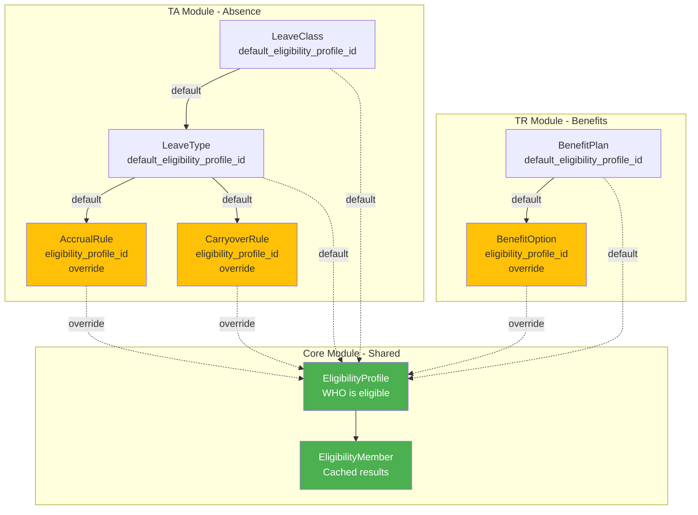

# Hybrid Eligibility Architecture - Quick Reference

**Approach**: Default at Class/Type + Override at Rule Level

---

## 🎯 Core Concept



---

## 📋 Two Types of Scope

| Scope Type | Stored In | Example | Purpose |
|------------|-----------|---------|---------|
| **Object Scope** | Rule itself | `leaveTypeId: "ANNUAL_LEAVE"` | WHAT this rule applies to |
| **Organizational Scope** | `EligibilityProfile` | `countries: ["VN"]`<br/>`grades: ["G4", "G5"]` | WHO this rule applies to |

---

## 🔄 Resolution Flow

```
When checking if Employee X is eligible for AccrualRule Y:

1. Get AccrualRule Y
   ├─ Has eligibility_profile_id? 
   │  └─ YES → Use this (OVERRIDE) ✅
   │  └─ NO → Continue to step 2
   │
2. Get LeaveType (from AccrualRule.leave_type_id)
   ├─ Has default_eligibility_profile_id?
   │  └─ YES → Use this (TYPE DEFAULT) ✅
   │  └─ NO → Continue to step 3
   │
3. Get LeaveClass (from LeaveType.leave_class_id)
   ├─ Has default_eligibility_profile_id?
   │  └─ YES → Use this (CLASS DEFAULT) ✅
   │  └─ NO → No restriction (ALL ELIGIBLE) ✅
   │
4. Lookup in eligibility_member table
   └─ Fast O(1) lookup: Is Employee X in this profile?
```

---

## 💡 Practical Examples

### Example 1: Simple - All Rules Use Class Default

```yaml
LeaveClass: PTO
  default_eligibility_profile_id: ELIG_FULLTIME_VN
  
LeaveType: ANNUAL_LEAVE
  leave_class_id: PTO
  default_eligibility_profile_id: null  # Inherit from class

AccrualRule: STANDARD_ACCRUAL
  leave_type_id: ANNUAL_LEAVE
  eligibility_profile_id: null  # Inherit from type → class
  accrual_amount: 1.67

CarryoverRule: STANDARD_CARRYOVER
  leave_type_id: ANNUAL_LEAVE
  eligibility_profile_id: null  # Inherit from type → class
  max_carryover: 5

# Result: All rules use ELIG_FULLTIME_VN
# Only full-time employees in Vietnam eligible
```

### Example 2: Complex - Different Rules, Different Eligibility

```yaml
LeaveClass: PTO
  default_eligibility_profile_id: ELIG_ALL_FULLTIME

LeaveType: ANNUAL_LEAVE
  leave_class_id: PTO
  default_eligibility_profile_id: null

# Junior staff: 12 days/year
AccrualRule: JUNIOR_ACCRUAL
  leave_type_id: ANNUAL_LEAVE
  eligibility_profile_id: ELIG_JUNIOR  # OVERRIDE
  accrual_amount: 1.0

# Senior staff: 15 days/year
AccrualRule: SENIOR_ACCRUAL
  leave_type_id: ANNUAL_LEAVE
  eligibility_profile_id: ELIG_SENIOR  # OVERRIDE
  accrual_amount: 1.25

# Everyone can carry over
CarryoverRule: STANDARD_CARRYOVER
  leave_type_id: ANNUAL_LEAVE
  eligibility_profile_id: null  # Use default (all full-time)
  max_carryover: 5

# Eligibility Profiles
ELIG_JUNIOR:
  rule_json: {grades: ["G1", "G2", "G3"]}

ELIG_SENIOR:
  rule_json: {grades: ["G4", "G5", "M3", "M4", "M5"]}

ELIG_ALL_FULLTIME:
  rule_json: {employment_types: ["FULL_TIME"]}
```

**Result**:
- Employee G2: Gets JUNIOR_ACCRUAL (12 days), can carry over 5
- Employee G5: Gets SENIOR_ACCRUAL (15 days), can carry over 5
- Part-time: No accrual (not in ELIG_ALL_FULLTIME)

### Example 3: TR Benefits - Tiered Plans

```yaml
BenefitPlan: HEALTH_INSURANCE
  default_eligibility_profile_id: ELIG_ALL_EMPLOYEES

# Basic tier - everyone
BenefitOption: BASIC
  benefit_plan_id: HEALTH_INSURANCE
  eligibility_profile_id: null  # Use plan default
  coverage: 50000

# Premium tier - senior staff only
BenefitOption: PREMIUM
  benefit_plan_id: HEALTH_INSURANCE
  eligibility_profile_id: ELIG_SENIOR  # OVERRIDE
  coverage: 100000

# Executive tier - executives only
BenefitOption: EXECUTIVE
  benefit_plan_id: HEALTH_INSURANCE
  eligibility_profile_id: ELIG_EXEC  # OVERRIDE
  coverage: 200000
```

**Result**:
- All employees: Can enroll in BASIC
- Senior staff (G4+): Can choose BASIC or PREMIUM
- Executives (M5+): Can choose BASIC, PREMIUM, or EXECUTIVE

---

## 🗂️ Schema Summary

### Core Module

```sql
core.eligibility_profile
  - id, code, name
  - domain (ABSENCE | BENEFITS | COMPENSATION)
  - rule_json (organizational criteria)

core.eligibility_member
  - profile_id, employee_id
  - start_date, end_date
  - (cached membership for fast lookup)
```

### TA Module

```sql
absence.leave_class
  - default_eligibility_profile_id  ← NEW

absence.leave_type
  - default_eligibility_profile_id  ← NEW

absence.accrual_rule
  - leave_type_id / leave_class_id  ← KEEP (object scope)
  - eligibility_profile_id          ← NEW (override)

absence.carryover_rule
  - leave_type_id / leave_class_id  ← KEEP
  - eligibility_profile_id          ← NEW
```

### TR Module

```sql
benefits.benefit_plan
  - default_eligibility_profile_id  ← NEW

benefits.benefit_option
  - benefit_plan_id                 ← KEEP
  - eligibility_profile_id          ← NEW (override)

compensation.variable_pay_plan
  - default_eligibility_profile_id  ← NEW
```

---

## ✅ Key Benefits

1. **Flexibility**: Simple cases use defaults, complex cases override
2. **Performance**: O(1) lookup via cached membership
3. **Reusability**: Same eligibility profile across modules
4. **Maintainability**: Update once, apply everywhere
5. **Clarity**: Clear resolution hierarchy (Rule > Type > Class)

---

## 🚀 Next Actions

- [ ] Update TA ontology with hybrid eligibility
- [ ] Update TR ontology with hybrid eligibility
- [ ] Create Core eligibility ontology
- [ ] Update DBML files
- [ ] Create migration plan
