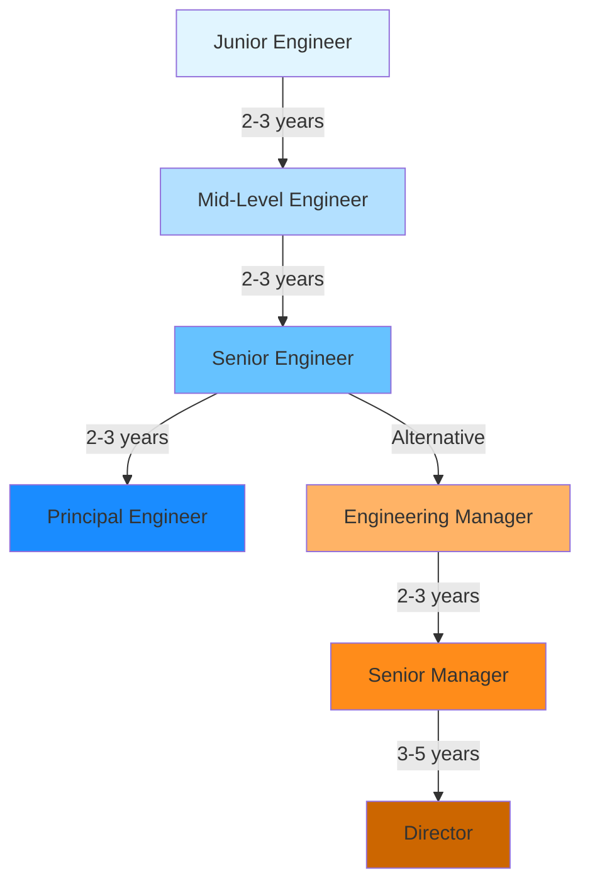

# Career Glossary

## Overview

This glossary defines the career management entities used in the xTalent HCM system. Career entities support career path planning, progression tracking, and internal mobility.

---

## Entities

### CareerPath

**Definition:** Defined career progression route showing possible career moves and advancement opportunities within the organization.

**Purpose:**
- Define structured career progression routes
- Support career planning and development
- Enable internal mobility
- Facilitate succession planning
- Guide employee development

**Key Attributes:**

| Attribute | Type | Required | Description |
|-----------|------|----------|-------------|
| `id` | UUID | Yes | Unique identifier |
| `code` | string(50) | Yes | Career path code |
| `name` | string(150) | No | Career path name |
| `path_type` | enum | No | VERTICAL, LATERAL, CROSS_FUNCTIONAL |
| `source_job_id` | UUID | No | Starting job |
| `target_job_id` | UUID | No | Target/destination job |
| `job_family_code` | string(50) | No | Job family this path belongs to |
| `description` | text | No | Path description |
| `typical_duration_months` | integer | No | Typical time to complete path |
| `difficulty_level` | enum | No | EASY, MODERATE, CHALLENGING, EXPERT |
| `is_active` | boolean | Yes | Active status (default: true) |
| `metadata` | jsonb | No | Additional path attributes |
| `effective_start_date` | date | Yes | Effective start date |
| `effective_end_date` | date | No | Effective end date |
| `is_current_flag` | boolean | Yes | Current record indicator |

**Path Types:**

| Type | Description | Example |
|------|-------------|---------|
| `VERTICAL` | Upward progression in same function | Junior → Mid → Senior Engineer |
| `LATERAL` | Move to similar level different function | Backend Engineer → Frontend Engineer |
| `CROSS_FUNCTIONAL` | Move to different function/department | Engineer → Product Manager |
| `LEADERSHIP` | Individual contributor to management | Senior Engineer → Engineering Manager |

**Metadata Structure:**
```json
{
  "prerequisites": {
    "min_time_in_current_role": 24,
    "required_skills": ["skill_leadership", "skill_project_mgmt"],
    "required_competencies": ["comp_strategic_thinking"],
    "required_certifications": [],
    "min_performance_rating": 3.5
  },
  "development_activities": [
    {
      "activity_type": "TRAINING",
      "name": "Leadership Development Program",
      "duration_hours": 40,
      "is_mandatory": true
    },
    {
      "activity_type": "MENTORING",
      "name": "Executive Mentorship",
      "duration_months": 6,
      "is_mandatory": false
    }
  ],
  "success_metrics": {
    "completion_rate": 0.65,
    "average_duration_months": 18,
    "satisfaction_score": 4.2
  },
  "visibility": "PUBLIC"
}
```

**Relationships:**
- **References** `Job` (source job)
- **References** `Job` (target job)
- **Has many** `CareerStep` (intermediate steps)
- **Has many** `JobProgression` (actual progressions)

**Business Rules:**
- Career path code must be unique
- Source and target jobs should be different
- Path can have multiple intermediate steps
- SCD Type 2 for historical tracking
- Prerequisites should be clearly defined

**Examples:**

```yaml
# Vertical Path: Technical Track
id: path_tech_ic_001
code: TECH_IC_VERTICAL
name: Technical Individual Contributor Path
path_type: VERTICAL
source_job_id: job_junior_eng
target_job_id: job_principal_eng
job_family_code: ENG
description: "Career progression for technical individual contributors"
typical_duration_months: 60
difficulty_level: MODERATE

# Cross-Functional Path
id: path_eng_to_pm_001
code: ENG_TO_PM
name: Engineering to Product Management
path_type: CROSS_FUNCTIONAL
source_job_id: job_senior_eng
target_job_id: job_product_mgr
description: "Transition from engineering to product management"
typical_duration_months: 12
difficulty_level: CHALLENGING
```

**Use Cases:**
- Employee career planning discussions
- Succession planning
- Talent development programs
- Internal mobility initiatives
- Skill gap analysis

---

### CareerStep

**Definition:** Individual step or milestone within a career path, representing intermediate positions or achievements required for progression.

**Purpose:**
- Break down career paths into manageable steps
- Define intermediate milestones
- Track progression through path
- Support phased development

**Key Attributes:**

| Attribute | Type | Required | Description |
|-----------|------|----------|-------------|
| `id` | UUID | Yes | Unique identifier |
| `career_path_id` | UUID | Yes | Career path reference |
| `step_number` | integer | Yes | Step sequence (1, 2, 3...) |
| `job_id` | UUID | No | Job at this step |
| `job_level_id` | UUID | No | Required job level |
| `step_name` | string(150) | No | Step name/milestone |
| `description` | text | No | Step description |
| `typical_duration_months` | integer | No | Typical time in this step |
| `is_mandatory` | boolean | Yes | Mandatory step (default: true) |
| `metadata` | jsonb | No | Step requirements, activities |

**Metadata Structure:**
```json
{
  "requirements": {
    "skills_to_develop": ["skill_system_design", "skill_mentoring"],
    "competencies_to_develop": ["comp_leadership"],
    "min_performance_rating": 3.0,
    "projects_completed": 2
  },
  "development_activities": [
    "Complete advanced technical training",
    "Lead at least 2 major projects",
    "Mentor 2 junior engineers"
  ],
  "success_criteria": [
    "Demonstrated technical leadership",
    "Positive peer feedback",
    "Successful project delivery"
  ]
}
```

**Relationships:**
- **Belongs to** `CareerPath`
- **References** `Job` (job at this step)
- **References** `JobLevel`

**Business Rules:**
- Step number must be sequential within path
- Steps should be ordered logically
- Mandatory steps cannot be skipped
- Each step should have clear requirements

**Example:**

```yaml
# Step 1: Mid-Level Engineer
id: step_001
career_path_id: path_tech_ic_001
step_number: 1
job_id: job_mid_eng
step_name: "Mid-Level Engineer"
description: "Develop core technical skills and project delivery"
typical_duration_months: 24
is_mandatory: true

# Step 2: Senior Engineer
id: step_002
career_path_id: path_tech_ic_001
step_number: 2
job_id: job_senior_eng
step_name: "Senior Engineer"
description: "Technical leadership and mentoring"
typical_duration_months: 24
is_mandatory: true

# Step 3: Principal Engineer
id: step_003
career_path_id: path_tech_ic_001
step_number: 3
job_id: job_principal_eng
step_name: "Principal Engineer"
description: "Strategic technical leadership and architecture"
typical_duration_months: 12
is_mandatory: true
```

---

### JobProgression

**Definition:** Actual career progression record tracking an employee's movement through career paths and job changes.

**Purpose:**
- Track actual career movements
- Measure career path effectiveness
- Support career analytics
- Enable progression reporting

**Key Attributes:**

| Attribute | Type | Required | Description |
|-----------|------|----------|-------------|
| `id` | UUID | Yes | Unique identifier |
| `worker_id` | UUID | Yes | Worker reference |
| `career_path_id` | UUID | No | Career path followed (if applicable) |
| `from_job_id` | UUID | Yes | Previous job |
| `to_job_id` | UUID | Yes | New job |
| `from_position_id` | UUID | No | Previous position |
| `to_position_id` | UUID | No | New position |
| `progression_type` | enum | Yes | PROMOTION, LATERAL_MOVE, DEMOTION, TRANSFER |
| `progression_date` | date | Yes | Effective date of progression |
| `reason_code` | string(50) | No | Reason for progression |
| `is_planned` | boolean | No | Was this progression planned? |
| `metadata` | jsonb | No | Additional progression details |
| `created_at` | timestamp | Yes | Record creation timestamp |

**Progression Types:**

| Type | Description |
|------|-------------|
| `PROMOTION` | Upward move to higher level/grade |
| `LATERAL_MOVE` | Move to same level different function |
| `DEMOTION` | Downward move to lower level |
| `TRANSFER` | Move to different location/unit |
| `RECLASSIFICATION` | Job reclassification without move |

**Metadata Structure:**
```json
{
  "progression_details": {
    "salary_increase_percent": 15.0,
    "grade_change": "P2 → P3",
    "level_change": "SENIOR → PRINCIPAL",
    "approval_chain": ["manager_id", "director_id", "hr_id"]
  },
  "readiness_assessment": {
    "skills_gap_closed": true,
    "performance_rating": 4.5,
    "manager_recommendation": "STRONGLY_RECOMMEND",
    "assessment_date": "2025-11-15"
  },
  "development_completed": [
    "Leadership Development Program",
    "Technical Architecture Course"
  ],
  "notes": "Exceptional performance, ready for next level"
}
```

**Relationships:**
- **Belongs to** `Worker`
- **References** `CareerPath` (optional)
- **References** `Job` (from and to)
- **References** `Position` (from and to, optional)

**Business Rules:**
- Progression date must be valid
- From and to jobs should be different
- Progression type should match job level change
- Track both planned and unplanned progressions

**Example:**

```yaml
id: prog_001
worker_id: worker_emp_123
career_path_id: path_tech_ic_001
from_job_id: job_senior_eng
to_job_id: job_principal_eng
from_position_id: pos_senior_be_001
to_position_id: pos_principal_be_001
progression_type: PROMOTION
progression_date: "2025-12-01"
reason_code: MERIT_PROMOTION
is_planned: true
metadata:
  progression_details:
    salary_increase_percent: 15.0
    grade_change: "P3 → P4"
  readiness_assessment:
    performance_rating: 4.8
```

---

## Career Path Visualization



---

## Use Cases

### Career Planning
- Define clear career paths for all job families
- Communicate progression opportunities to employees
- Support career development discussions
- Enable self-service career exploration

### Talent Development
- Identify skill gaps for progression
- Design targeted development programs
- Track development activity completion
- Measure development effectiveness

### Succession Planning
- Identify high-potential employees
- Map successors to critical positions
- Track readiness for next level
- Plan development for successors

### Internal Mobility
- Promote internal career opportunities
- Support lateral moves and transfers
- Reduce external hiring costs
- Improve employee retention

### Analytics & Reporting
- Track progression rates by job family
- Measure time-to-promotion
- Analyze career path effectiveness
- Identify bottlenecks in progression

---

## Best Practices

### Career Path Design

1. **Clear and Realistic:**
   - Define achievable progression steps
   - Set realistic timeframes
   - Align with business needs
   - Regular review and updates

2. **Multiple Paths:**
   - Technical track (individual contributor)
   - Management track (people leadership)
   - Cross-functional opportunities
   - Lateral movement options

3. **Transparent Requirements:**
   - Clear skill requirements
   - Defined competency levels
   - Performance expectations
   - Development activities

### Implementation

1. **Communication:**
   - Publish career paths to all employees
   - Provide self-service access
   - Regular career conversations
   - Manager training on career coaching

2. **Development Support:**
   - Provide required training programs
   - Offer mentoring opportunities
   - Support job shadowing
   - Enable stretch assignments

3. **Tracking and Measurement:**
   - Monitor progression rates
   - Track development completion
   - Measure employee satisfaction
   - Analyze retention impact

---

## Integration Points

### Internal Modules

| Module | Usage |
|--------|-------|
| **Core** | Job, Position, Worker data |
| **Talent Management** | Performance, Skills, Competencies |
| **Learning** | Development programs, Training completion |
| **Succession** | Successor identification, Readiness assessment |

### External Systems

| System | Purpose |
|--------|---------|
| **Learning Management System** | Track development activities |
| **Performance Management** | Performance ratings, Assessments |
| **Career Portal** | Self-service career exploration |

---

## Metrics & KPIs

### Career Path Effectiveness

- **Progression Rate:** % of employees progressing annually
- **Time to Promotion:** Average months between levels
- **Path Completion Rate:** % completing defined paths
- **Internal Fill Rate:** % of positions filled internally

### Development Impact

- **Development Completion:** % completing required activities
- **Skill Gap Closure:** % closing identified skill gaps
- **Readiness Score:** Average readiness for next level
- **Satisfaction:** Employee satisfaction with career opportunities

### Business Impact

- **Retention Rate:** Retention of high-potential employees
- **Internal Mobility Rate:** % of moves that are internal
- **Succession Coverage:** % of critical roles with ready successors
- **Cost Savings:** Reduced external hiring costs

---

## Version History

| Version | Date | Changes |
|---------|------|---------|
| 2.0 | 2025-12-01 | Enhanced with progression tracking, metrics |
| 1.0 | 2025-11-01 | Initial career ontology |

---

## References

- **Career Development Best Practices:** Industry standards for career pathing
- **Competency Frameworks:** Skill and competency requirements
- **Job Architecture:** Job family and level structures
