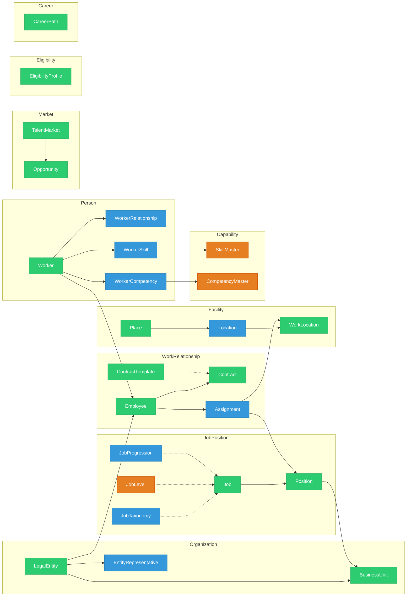

# Core HR Ontology

> **Module**: Core HR (CO)  
> **Version**: 1.0  
> **Last Updated**: 2026-01-06

---

## Overview

**Legend:** 🟢 AGGREGATE_ROOT | 🔵 ENTITY | 🟠 REFERENCE_DATA

---

## Entity List (26 entities)

### Organization (3)
| Entity | File | Type |
|--------|------|------|
| LegalEntity | [legal-entity.onto.md](domain/organization/legal-entity.onto.md) | A |
| BusinessUnit | [business-unit.onto.md](domain/organization/business-unit.onto.md) | A |
| EntityRepresentative | [entity-representative.onto.md](domain/organization/entity-representative.onto.md) | E |

### Person (4)
| Entity | File | Type |
|--------|------|------|
| Worker | [worker.onto.md](domain/person/worker.onto.md) | A |
| WorkerRelationship | [worker-relationship.onto.md](domain/person/worker-relationship.onto.md) | E |
| WorkerSkill | [worker-skill.onto.md](domain/person/worker-skill.onto.md) | E |
| WorkerCompetency | [worker-competency.onto.md](domain/person/worker-competency.onto.md) | E |

### Work Relationship (5)
| Entity | File | Type |
|--------|------|------|
| **WorkRelationship** | [work-relationship.onto.md](domain/work-relationship/work-relationship.onto.md) | **A** |
| Employee | [employee.onto.md](domain/work-relationship/employee.onto.md) | A |
| Contract | [contract.onto.md](domain/work-relationship/contract.onto.md) | A |
| ContractTemplate | [contract-template.onto.md](domain/work-relationship/contract-template.onto.md) | A |
| Assignment | [assignment.onto.md](domain/work-relationship/assignment.onto.md) | E |

### Job Position (5)
| Entity | File | Type |
|--------|------|------|
| Job | [job.onto.md](domain/job-position/job.onto.md) | A |
| Position | [position.onto.md](domain/job-position/position.onto.md) | A |
| JobTaxonomy | [job-taxonomy.onto.md](domain/job-position/job-taxonomy.onto.md) | E |
| JobLevel | [job-level.onto.md](domain/job-position/job-level.onto.md) | R |
| JobProgression | [job-progression.onto.md](domain/job-position/job-progression.onto.md) | E |

### Facility (3)
| Entity | File | Type |
|--------|------|------|
| Place | [place.onto.md](domain/facility/place.onto.md) | A |
| Location | [location.onto.md](domain/facility/location.onto.md) | E |
| WorkLocation | [work-location.onto.md](domain/facility/work-location.onto.md) | A |

### Capability (2)
| Entity | File | Type |
|--------|------|------|
| SkillMaster | [skill-master.onto.md](domain/capability/skill-master.onto.md) | R |
| CompetencyMaster | [competency-master.onto.md](domain/capability/competency-master.onto.md) | R |

### Market (2)
| Entity | File | Type |
|--------|------|------|
| TalentMarket | [talent-market.onto.md](domain/market/talent-market.onto.md) | A |
| Opportunity | [opportunity.onto.md](domain/market/opportunity.onto.md) | A |

### Eligibility (1)
| Entity | File | Type |
|--------|------|------|
| EligibilityProfile | [eligibility-profile.onto.md](domain/eligibility/eligibility-profile.onto.md) | A |

### Career (1)
| Entity | File | Type |
|--------|------|------|
| CareerPath | [career-path.onto.md](domain/career/career-path.onto.md) | A |

---

## See Also

- [Domain Research](_research/core-analysis.md)
- [Existing core-ontology.yaml](core-ontology.yaml)
