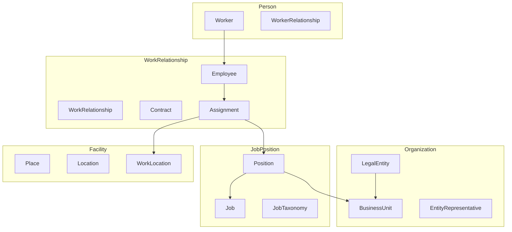

# Domain Research: Core HR

> **Domain**: Core HR (CO)  
> **Skill**: domain-research  
> **Date**: 2026-01-06

---

## 1. Scope

**Problem**: Central management of organizational structure, workforce, jobs, and positions for an enterprise HCM solution.

**In Scope**:
- Organization structure (Legal Entity, Business Unit)
- Person/Worker management
- Employment relationships (Employee, Contract)
- Job architecture (Job, Position, Taxonomy)
- Facility/Location management
- Skills & Competencies
- Career paths
- Talent marketplace
- Eligibility engine

**Out of Scope**:
- Reference data (code_list, currency, timezone)
- Snapshots/audit logs
- Tag/mapping tables

---

## 2. Glossary

| Term | Definition | Vietnamese |
|------|------------|------------|
| **Legal Entity** | Company/branch registered legally | Pháp nhân |
| **Business Unit** | Operational unit (dept, team) | Đơn vị kinh doanh |
| **Worker** | Person with HR relationship | Người lao động |
| **Employee** | Worker with employment contract | Nhân viên |
| **Work Relationship** | Classification: Employee/Contractor/Alumni | Quan hệ lao động |
| **Contract** | Employment agreement | Hợp đồng lao động |
| **Job** | Template for position | Chức danh |
| **Position** | Slot in organization | Vị trí |
| **Assignment** | Employee-Position link | Bổ nhiệm |
| **Place** | Physical location | Địa điểm |
| **Work Location** | Work site (office, factory) | Nơi làm việc |
| **Skill** | Technical capability | Kỹ năng |
| **Competency** | Behavioral capability | Năng lực |
| **Career Path** | Job progression route | Lộ trình nghề nghiệp |

---

## 3. Entity Map

---

## 4. Business Rules

### Organization
- **ORG-001**: Legal Entity has hierarchy (parent-child)
- **ORG-002**: Business Unit belongs to Legal Entity
- **ORG-003**: BU has manager (must be Employee)

### Employment
- **EMP-001**: Worker can have multiple Employees across Legal Entities
- **EMP-002**: Employee has one primary Contract
- **EMP-003**: Assignment links Employee to Position
- **EMP-004**: Contract inherits from ContractTemplate

### Job Architecture
- **JOB-001**: Job has multi-tree structure (corp vs BU)
- **JOB-002**: Position references Job for grade/level
- **JOB-003**: Job belongs to Taxonomy (Family/Group/Track)

### Facility
- **FAC-001**: Place → Location → WorkLocation hierarchy
- **FAC-002**: WorkLocation belongs to Legal Entity

---

## 5. Industry Context

### Standards
| Standard | Application |
|----------|-------------|
| **ISO 3166** | Country codes |
| **ISO 639** | Language codes |
| **ISIC/NAICS** | Industry codes |

### Vietnam Regulations
| Regulation | Impact |
|------------|--------|
| **Labor Code 2019** | Employment types, contracts |
| **Enterprise Law** | Legal entity requirements |

---

## 6. Entity Classification

### AGGREGATE_ROOT (Independent lifecycle)
LegalEntity, BusinessUnit, Worker, Employee, Contract, ContractTemplate, Job, Position, Place, WorkLocation, CareerPath, TalentMarket, Opportunity, EligibilityProfile

### ENTITY (Dependent on parent)
EntityRepresentative, EntityLicense, WorkerRelationship, WorkerSkill, WorkerCompetency, Assignment, Location, JobTaxonomy, JobProgression

### REFERENCE_DATA (Lookup tables)
SkillMaster, CompetencyMaster, JobLevel
