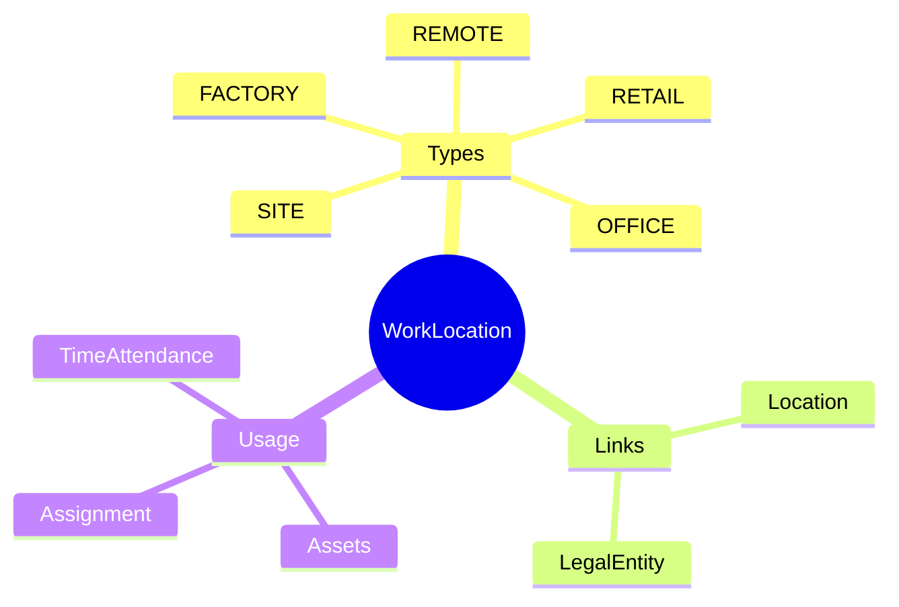
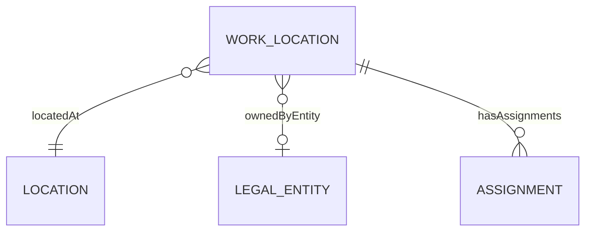
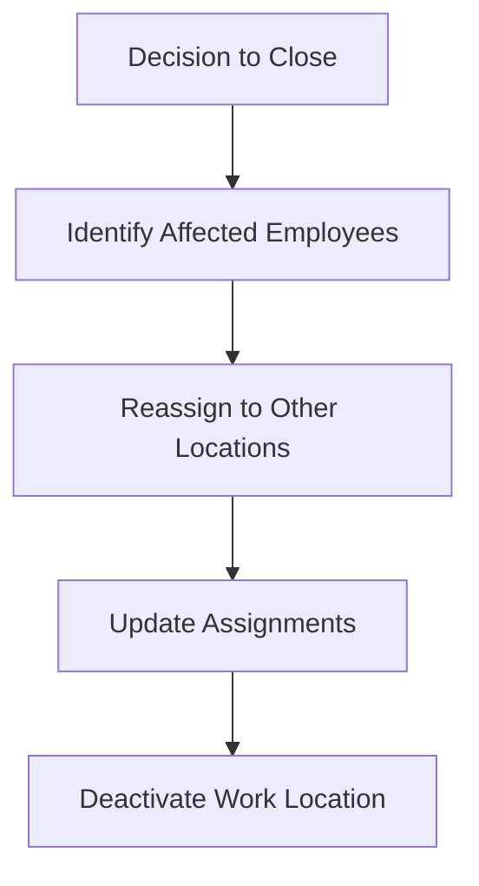

# WorkLocation

## Overview

A **WorkLocation** represents a place where employees work - an office, factory, remote location, or project site. This is where [[Assignment]]s are placed. WorkLocation links to [[Location]] for physical address details and to [[LegalEntity]] for ownership.

## Business Context

### Key Stakeholders
- **Facilities**: Manages physical locations
- **HR Admin**: Assigns employees to locations
- **IT**: Equipment provisioning by location
- **EHS**: Safety compliance by location

### Business Processes
This entity is central to:
- **Assignment**: Employee primary work location
- **Time & Attendance**: Location-based time rules
- **Shift Scheduling**: Location capacity planning
- **Asset Management**: Equipment by location

### Business Value
Proper work location tracking enables location-based policies, capacity planning, and compliance with local regulations.

## Attributes Guide

### Identification
- **code**: Unique identifier. Format: WL-VN-HCM-HQ.
- **name**: Display name. e.g., "VNG HQ - Ho Chi Minh".

### Classification
- **workLocTypeCode**: Type of work environment:
  - *OFFICE*: Standard office
  - *FACTORY*: Manufacturing/production
  - *REMOTE*: Remote/home office
  - *SITE*: Project/client site
  - *RETAIL*: Store/branch

### Physical Details
- **locationId**: Links to [[Location]] for address, coordinates.
- **timezoneCode**: For scheduling, time calculations.
- **capacity**: Maximum people/desks. For space planning.

### Ownership
- **legalEntityId**: Which [[LegalEntity]] owns/operates this location.

## Relationships Explained

### Physical Location
- **locatedAt** → [[Location]]: Physical address and coordinates. Location may have multiple work locations.

### Ownership
- **ownedByEntity** → [[LegalEntity]]: Entity responsible for location. Determines applicable policies.

### People
- **hasAssignments** → [[Assignment]]: Employees assigned to work here. Count = location headcount.

## Lifecycle & Workflows

### State Definitions

| State | Business Meaning | System Impact |
|-------|------------------|---------------|
| **active** | Operating | Can assign employees |
| **inactive** | Closed/suspended | No new assignments |

### Location Closure Process

## Actions & Operations

### create
**Who**: Facilities, HR Admin  
**When**: New office, site opening  
**Required**: code, name, locationId, workLocTypeCode  
**Process**:
1. Create Location (if new address)
2. Create WorkLocation
3. Link to legal entity

### deactivate
**Who**: Facilities with HR  
**When**: Closing location  
**Process**:
1. Verify no active assignments (or relocate)
2. Set isActive = false
3. Archive for history

## Business Rules

### Data Integrity

#### Unique Code (uniqueCode)
**Rule**: Work location code globally unique.  
**Reason**: Master identifier.  
**Violation**: System prevents save.

### Business Logic

#### Relocate Before Close (relocateBeforeClose)
**Rule**: Cannot close with active employees.  
**Reason**: Employees need valid work location.  
**Violation**: System blocks with list of affected employees.

## Examples

### Example 1: Corporate HQ
- **code**: WL-VN-HCM-HQ
- **name**: VNG Tower - Ho Chi Minh
- **workLocTypeCode**: OFFICE
- **legalEntityId**: VNG_CORP
- **capacity**: 2000

### Example 2: Remote Work
- **code**: WL-REMOTE-VN
- **name**: Remote - Vietnam
- **workLocTypeCode**: REMOTE
- **legalEntityId**: VNG_CORP

## Related Entities

| Entity | Relationship | Description |
|--------|--------------|-------------|
| [[Location]] | locatedAt | Physical address |
| [[LegalEntity]] | ownedByEntity | Owner |
| [[Assignment]] | hasAssignments | Employees here |
