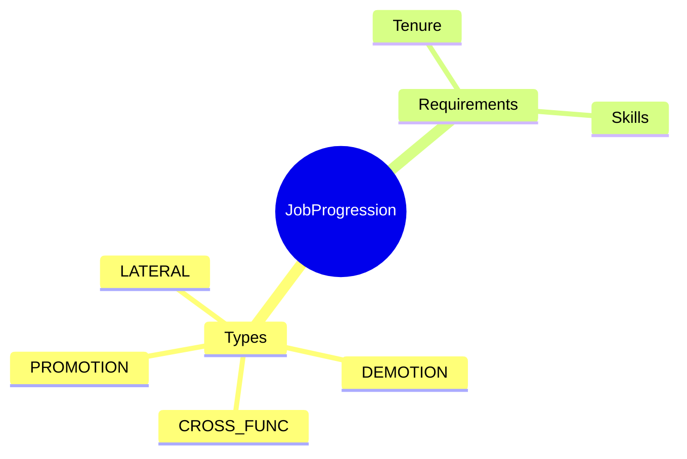
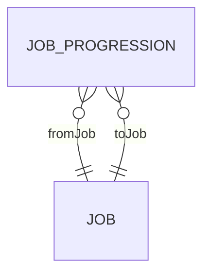

# JobProgression

## Overview

**JobProgression** defines allowed transitions between [[Job]]s - promotion paths, lateral moves, and cross-functional opportunities. Used by career tools to show employees where they can go next and what requirements exist for advancement.



## Business Context

### Key Stakeholders
- **HR Compensation**: Defines career paths
- **Manager**: Career guidance
- **Employee**: Sees progression options

### Business Processes
- **Career Planning**: Next role recommendations
- **Succession Planning**: Pipeline visibility
- **Development**: Gap identification

### Business Value
Clear progression rules enable transparent career development and targeted skill building.

## Attributes Guide

### Path Definition
- **fromJobId**: Current job (source).
- **toJobId**: Target job (destination).
- **progressionTypeCode**: Type of move:
  - *PROMOTION*: Upward (higher level)
  - *LATERAL*: Same level, different area
  - *CROSS_FUNC*: Different function
  - *DEMOTION*: Downward

### Requirements
- **minTenureMonths**: Minimum time in current role.
- **requiredSkills**: Skills needed for target.

## Relationships Explained



### Jobs
- **fromJob/toJob** → [[Job]]: Source and target of progression.

## Lifecycle & Workflows

| State | Meaning |
|-------|---------|
| **active** | Path available |
| **inactive** | Path closed |

## Examples

### Example: Developer Career Path
```
Junior Dev → Developer (PROMOTION, 12 months)
Developer → Senior Dev (PROMOTION, 24 months)
Developer → DevOps (LATERAL)
```

## Related Entities

| Entity | Relationship |
|--------|--------------|
| [[Job]] | fromJob, toJob |
| [[CareerPath]] | usedBy |
