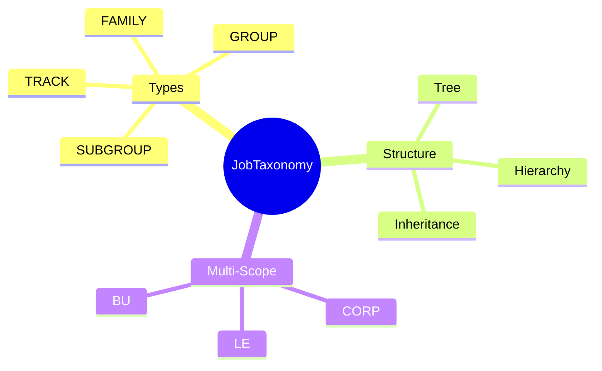
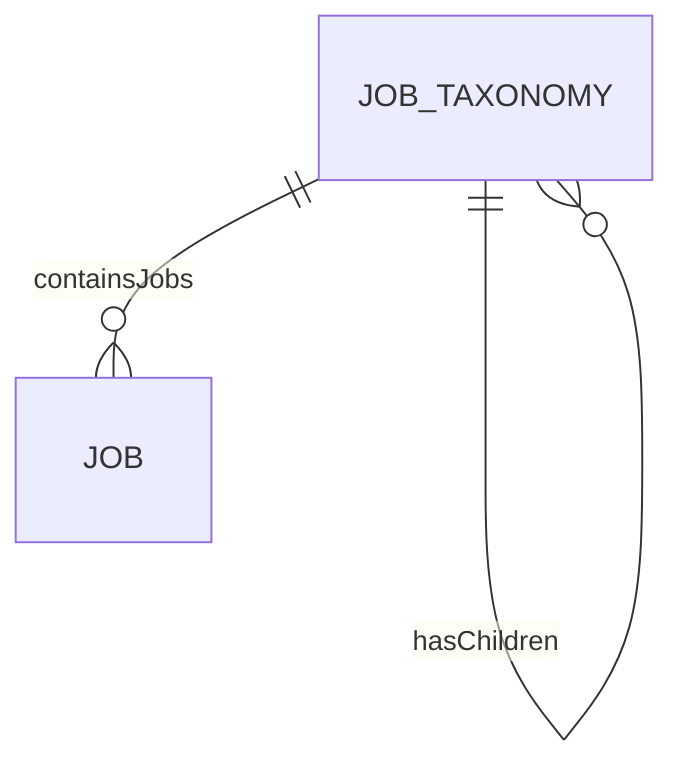
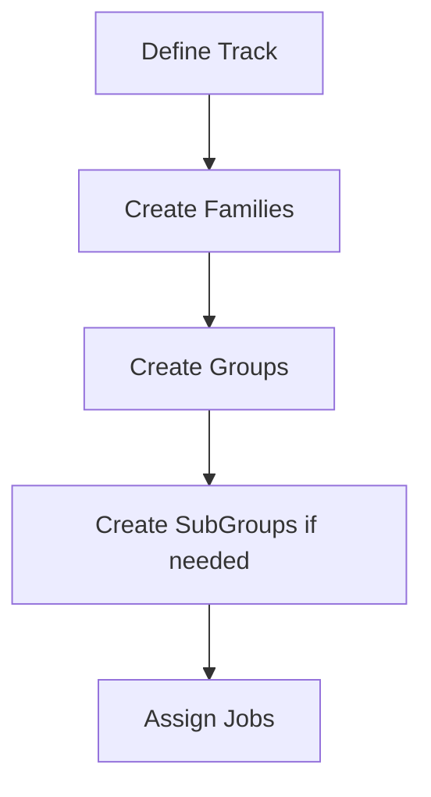

# JobTaxonomy

## Overview

**JobTaxonomy** provides a hierarchical classification structure for organizing [[Job]]s - by Family, Group, Track, or SubGroup. This enables flexible job categorization, reporting, and career pathing. Taxonomy supports multi-tree architecture and inheritance for corporate vs. BU customization.



## Business Context

### Key Stakeholders
- **HR Compensation**: Designs taxonomy structure
- **Talent Analytics**: Reports by job family/group
- **Career Development**: Uses for career tracks
- **Workforce Planning**: Analyzes by family

### Business Processes
This entity is central to:
- **Job Organization**: Categorizing jobs logically
- **Reporting**: Headcount by family/group
- **Career Pathing**: Track-based progression
- **Compensation**: Family-based pay analysis

### Business Value
A well-designed job taxonomy enables meaningful workforce analytics, career planning, and targeted talent programs.

## Attributes Guide

### Identification
- **taxonomyCode**: Unique within tree+type. Format: FAM-ENG, GRP-BACKEND.
- **taxonomyName**: Display name. e.g., "Engineering", "Backend Development".
- **treeId**: Which taxonomy tree this belongs to.

### Classification
- **taxonomyType**: Level in hierarchy:
  - *TRACK*: Highest level (Engineering, Sales, Operations)
  - *FAMILY*: Sub-division of track
  - *GROUP*: Sub-division of family
  - *SUBGROUP*: Lowest level

### Hierarchy

```
TRACK: Engineering
└── FAMILY: Software Development
    ├── GROUP: Backend
    │   ├── SUBGROUP: Java
    │   └── SUBGROUP: Python
    └── GROUP: Frontend
```

### Multi-Tree (Corp vs BU)
- **ownerScope**: Who owns this node (CORP, LE, BU).
- **inheritFlag**: If true, inherits from parent tree. If false, overrides.

## Relationships Explained



### Jobs
- **containsJobs** → [[Job]]: Jobs classified under this node. Many-to-many (job can be in multiple families).

### Hierarchy
- **hasChildren** → [[JobTaxonomy]]: Sub-nodes. Creates tree structure.

## Lifecycle & Workflows

### State Definitions

| State | Business Meaning | System Impact |
|-------|------------------|---------------|
| **active** | In use | Jobs can be assigned |
| **inactive** | Deprecated | Hidden but preserved |

### Taxonomy Design Flow



## Actions & Operations

### create
**Who**: HR Compensation  
**When**: Building/extending taxonomy  
**Required**: treeId, taxonomyCode, taxonomyName, taxonomyType, ownerScope, effectiveStartDate  
**Process**:
1. Select parent (if not Track level)
2. Define code and name
3. Create node

### assignJobs
**Who**: HR Compensation  
**When**: Categorizing jobs  
**Process**:
1. Select jobs
2. Link to taxonomy node
3. Job may link to multiple nodes

## Business Rules

### Data Integrity

#### Unique In Tree (uniqueInTreeAndType)
**Rule**: Code unique within tree and type.  
**Reason**: Allows same code in different trees.  
**Violation**: System prevents save.

#### Valid Hierarchy (validHierarchy)
**Rule**: Parent must be of higher level.  
**Reason**: Maintains clean hierarchy.  
**Example**: GROUP parent must be FAMILY or TRACK.

## Examples

### Example 1: Engineering Track
- **taxonomyCode**: TRACK-ENG
- **taxonomyType**: TRACK
- **ownerScope**: CORP
- **Children**: Software, Infrastructure, QA

### Example 2: Backend Group (BU Override)
- **taxonomyCode**: GRP-BE-GAME
- **taxonomyType**: GROUP
- **ownerScope**: BU
- **ownerUnitId**: GAME_DIV
- **inheritFlag**: false (custom for Games)

## Related Entities

| Entity | Relationship | Description |
|--------|--------------|-------------|
| [[Job]] | containsJobs | Categorized jobs |
| [[CareerPath]] | usedBy | Career tracks |
