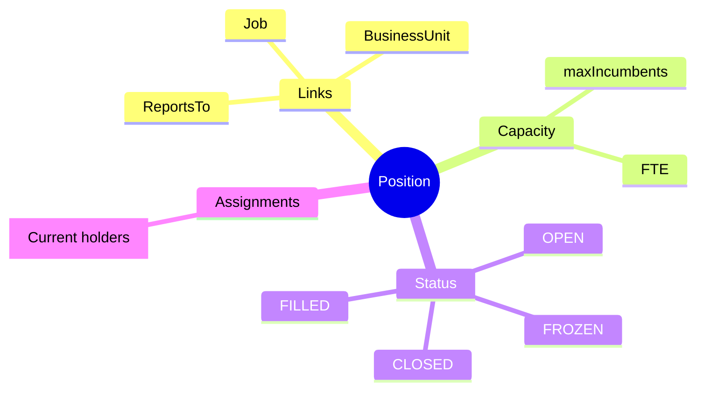
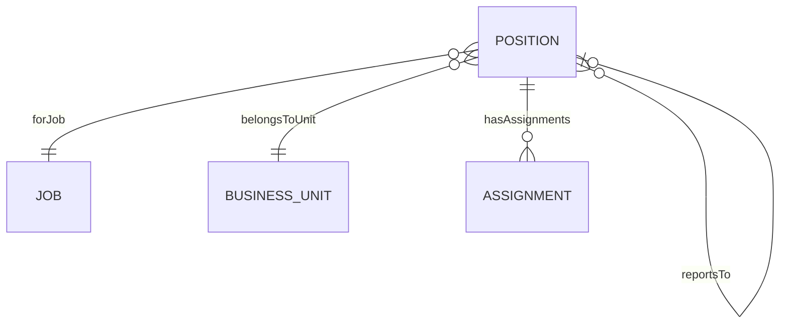
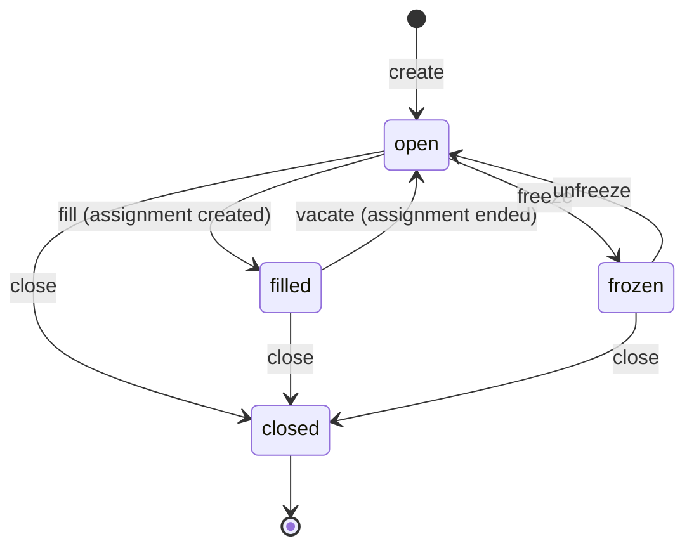

# Position

## Overview

A **Position** represents a specific slot in the organizational structure - a concrete instance of a [[Job]] within a [[BusinessUnit]]. Positions define where people work (org placement, reporting line) while Jobs define what work is done. Employees are linked to Positions via [[Assignment]]s.

## Business Context

### Key Stakeholders
- **HR Admin**: Creates positions, manages capacity
- **Manager**: Requests positions, assigns employees
- **Recruiter**: Fills open positions
- **Finance**: Uses for headcount planning, budget

### Business Processes
This entity is central to:
- **Workforce Planning**: Position count = planned headcount
- **Hiring**: Open positions trigger requisitions
- **Org Chart**: Position hierarchy = reporting structure
- **Compensation**: Position → Job → Grade → PayRange

### Business Value
Positions enable precise headcount control, clear organizational structure, and accurate labor cost budgeting.

## Attributes Guide

### Identification
- **code**: Unique identifier. Format: POS-XXXX. Used in org charts, requisitions.
- **title**: Display name. Usually same as Job title but can be customized.
- **jobId**: Links to [[Job]] template. Required - determines grade for compensation.

### Organizational Placement
- **businessUnitId**: Which [[BusinessUnit]] owns this position. Determines cost center, reporting.
- **reportsToId**: Supervisor position (not person). Creates org hierarchy independent of who fills it.

### Classification
- **positionTypeCode**: Employment type for this slot:
  - *REGULAR*: Permanent, full benefits
  - *TEMPORARY*: Fixed duration
  - *CONTRACTOR*: External, different HR treatment
- **positionClassCode**: Additional classification for reporting.

### Capacity
- **maxIncumbents**: How many people can fill this position simultaneously.
  - Default 1 (single seat)
  - Can be higher for shared positions (e.g., Customer Service Rep)
- **fullTimeEquiv**: FTE value of position. Affects budget calculations.

## Relationships Explained

### Job Template
- **forJob** → [[Job]]: The job this position instantiates. Position inherits job's grade, level, taxonomy. When job changes, position follows.

### Organizational Placement
- **belongsToUnit** → [[BusinessUnit]]: Organizational home. Position cost charged to this unit's budget.
- **reportsTo** → [[Position]]: Supervisor position. Defines reporting line in org chart. Null for top-level positions.

### Incumbents
- **hasAssignments** → [[Assignment]]: Current employees filling this position. Count cannot exceed maxIncumbents.

## Lifecycle & Workflows

### State Definitions

| State | Business Meaning | System Impact |
|-------|------------------|---------------|
| **open** | Available for hiring | Appears in requisition pool |
| **filled** | Has incumbent(s) | Normal operation |
| **frozen** | No hiring allowed | Hidden from requisitions |
| **closed** | Position eliminated | No new assignments allowed |

### State Diagram

### Multi-Incumbent Flow

For positions with maxIncumbents > 1:
- Status moves to `filled` when ANY assignment exists
- Status returns to `open` when ALL assignments end

## Actions & Operations

### create
**Who**: HR Admin, Manager (with approval)  
**When**: New headcount needed  
**Required**: code, title, jobId, businessUnitId, positionTypeCode, effectiveStartDate  
**Process**:
1. Verify job is active
2. Verify budget/headcount approval
3. Create position in open state

**Downstream effects**:
- Appears in headcount reports
- Available for requisition

### fill
**Who**: System (triggered by Assignment)  
**When**: Employee assigned to position  
**Process**:
1. Validate incumbent count < maxIncumbents
2. Create Assignment
3. Auto-transition to filled

### freeze
**Who**: HR Admin, Finance  
**When**: Hiring freeze, budget cut  
**Process**:
1. Set status = frozen
2. Hidden from requisition pool

**Note**: Existing assignments unaffected

### close
**Who**: HR Admin with approval  
**When**: Position eliminated permanently  
**Process**:
1. Verify no active assignments (or handle transfer)
2. Set status = closed
3. Archive for historical reporting

## Business Rules

### Data Integrity

#### Unique Code (uniqueCode)
**Rule**: Position code unique globally.  
**Reason**: Master identifier for all integrations.  
**Violation**: System prevents save.

#### Valid Job (validJob)
**Rule**: Job must exist and be active.  
**Reason**: Position inherits job properties.  
**Violation**: System prevents save.

### Business Logic

#### Incumbent Limit (incumbentLimit)
**Rule**: Active assignments ≤ maxIncumbents.  
**Reason**: Prevents overstaffing, budget control.  
**Violation**: Assignment creation blocked.

## Examples

### Example 1: Standard Single-Seat Position
- **code**: POS-00123
- **title**: Senior Software Engineer
- **jobId**: JOB-SWE-SR
- **businessUnitId**: ENGINEERING
- **maxIncumbents**: 1
- **statusCode**: FILLED

### Example 2: Multi-Incumbent Position
- **code**: POS-CSR-HCM
- **title**: Customer Service Representative
- **businessUnitId**: CUSTOMER_SERVICE
- **maxIncumbents**: 10
- **Current assignments**: 8
- **statusCode**: FILLED

## Related Entities

| Entity | Relationship | Description |
|--------|--------------|-------------|
| [[Job]] | forJob | Job template |
| [[BusinessUnit]] | belongsToUnit | Owning unit |
| [[Assignment]] | hasAssignments | Current holders |
| [[Position]] | reportsTo | Supervisor |
