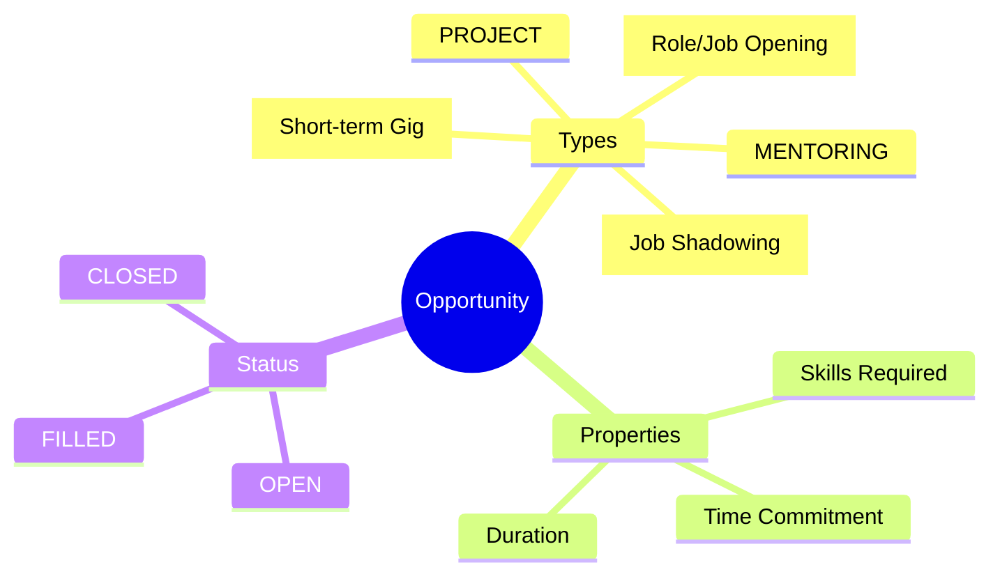
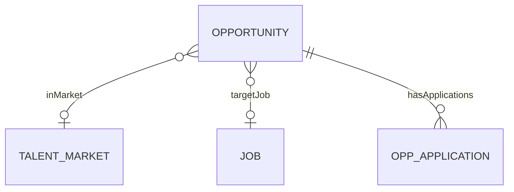
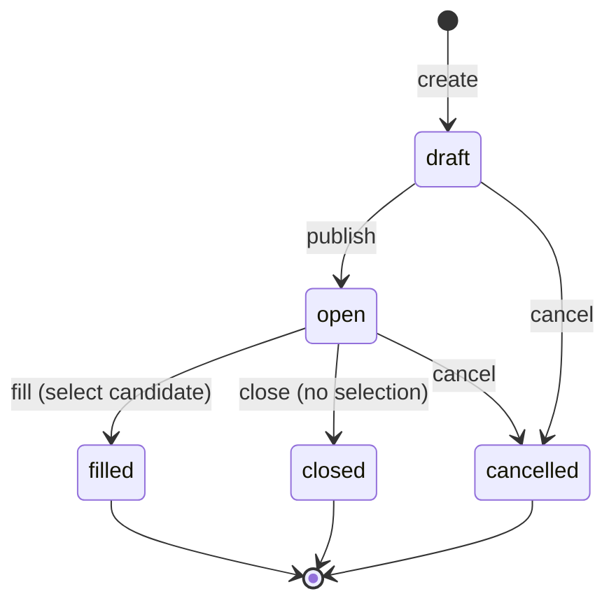
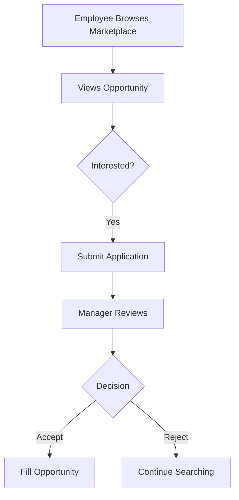

# Opportunity

## Overview

An **Opportunity** represents an internal mobility chance - a job opening, project assignment, gig, mentoring slot, or job shadowing experience. Part of the [[TalentMarket]] ecosystem, opportunities enable employees to discover and apply for growth experiences within the organization.

## Business Context

### Key Stakeholders
- **Hiring Manager**: Posts role opportunities
- **Project Lead**: Posts project opportunities
- **Employee**: Browses and applies
- **HR/Talent**: Administers marketplace

### Business Processes
This entity is central to:
- **Internal Hiring**: Internal job postings
- **Project Staffing**: Cross-functional projects
- **Gig Economy**: Short-term assignments
- **Development**: Mentoring, shadowing

### Business Value
Internal opportunity marketplace improves retention by showing growth paths, enables skill utilization across organization, and reduces external hiring costs.

## Attributes Guide

### Identification
- **oppCode**: Unique identifier. Format: OPP-2024-0001.
- **oppTitle**: Display title. e.g., "Senior Developer - Payments Team".
- **description**: Full opportunity details.

### Classification
- **oppTypeCode**: Type of opportunity:
  - *ROLE*: Open position (links to Job/Position)
  - *PROJECT*: Project assignment
  - *GIG*: Short task (< 1 month)
  - *MENTORING*: Mentor/mentee slot
  - *SHADOW*: Job shadowing experience

### Requirements
- **requiredSkills**: Skills needed (array of skill codes).
- **estimatedHoursPerWeek**: Time commitment expected.
- **targetJobId**: For ROLE type, links to [[Job]].

### Timing
- **openDate / closeDate**: Application window.

### Ownership
- **ownerUnitId**: [[BusinessUnit]] posting this.
- **hostEmployeeId**: Person hosting/managing.

## Relationships Explained

### Market
- **inMarket** → [[TalentMarket]]: Which talent market/region.

### Role Link
- **targetJob** → [[Job]]: For ROLE type, the job being filled.

### Applications
- **hasApplications** → OpportunityApplication: All employee applications.

## Lifecycle & Workflows

### State Definitions

| State | Business Meaning | System Impact |
|-------|------------------|---------------|
| **draft** | Being prepared | Not visible |
| **open** | Accepting applications | Listed in marketplace |
| **closed** | Manually closed | No new applications |
| **filled** | Candidate selected | Success state |
| **cancelled** | Opportunity withdrawn | Removed |

### State Diagram

### Application Flow

## Actions & Operations

### create
**Who**: Hiring Manager, Project Lead  
**When**: New opportunity arises  
**Required**: oppCode, oppTitle, oppTypeCode, openDate  
**Process**:
1. Define opportunity details
2. Set requirements
3. Save as draft

### publish
**Who**: Opportunity owner  
**When**: Ready for applications  
**Process**:
1. Verify details complete
2. Transition to open
3. Visible in marketplace

### apply
**Who**: Employee  
**When**: Interested in opportunity  
**Process**:
1. Create OpportunityApplication
2. Include statement of interest
3. Manager notified

### fill
**Who**: Opportunity owner  
**When**: Selecting candidate  
**Process**:
1. Choose from applicants
2. Transition to filled
3. Notify all applicants

## Business Rules

### Data Integrity

#### Unique Code (uniqueCode)
**Rule**: Opportunity code unique.  
**Reason**: Tracking reference.  
**Violation**: System prevents save.

#### Valid Dates (closeDateAfterOpen)
**Rule**: Close date after open date.  
**Reason**: Logical sequence.  
**Violation**: System prevents save.

## Examples

### Example 1: Internal Job Opening
- **oppCode**: OPP-2024-0042
- **oppTitle**: Senior Backend Developer
- **oppTypeCode**: ROLE
- **targetJobId**: JOB-SWE-SR
- **statusCode**: OPEN

### Example 2: Project Gig
- **oppCode**: OPP-2024-0050
- **oppTitle**: AI Hackathon Support
- **oppTypeCode**: GIG
- **estimatedHoursPerWeek**: 10
- **Duration**: 2 weeks

## Related Entities

| Entity | Relationship | Description |
|--------|--------------|-------------|
| [[TalentMarket]] | inMarket | Market context |
| [[Job]] | targetJob | Position being filled |
| [[OpportunityApplication]] | hasApplications | Applications |
