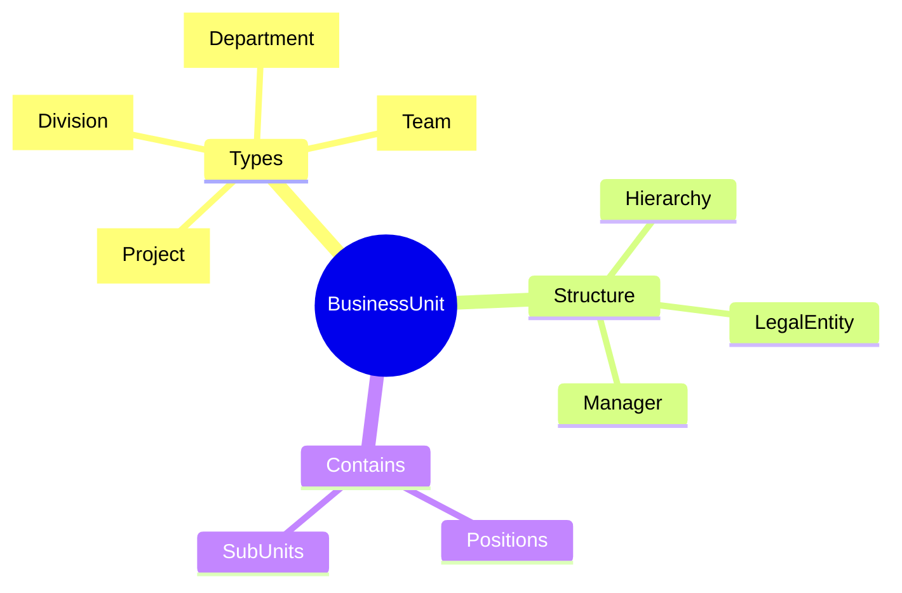
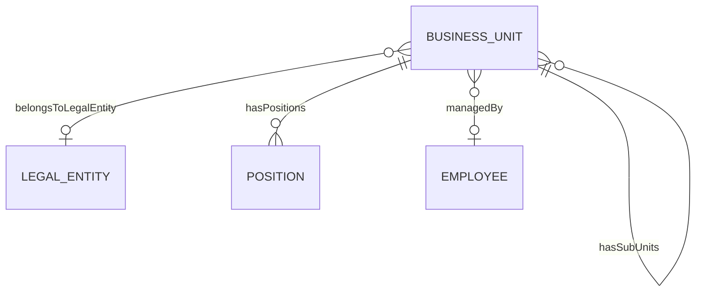
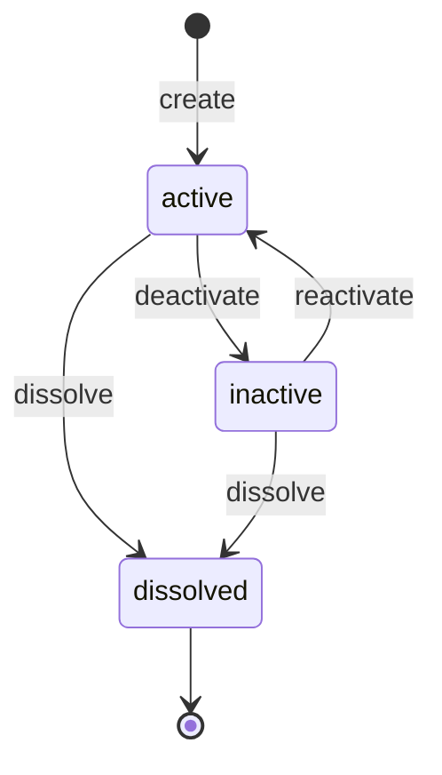
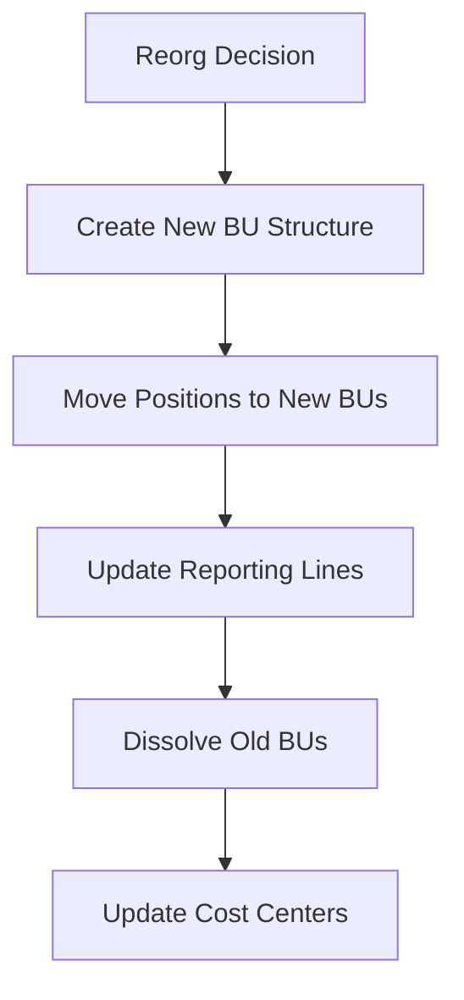

# BusinessUnit

## Overview

A **BusinessUnit** represents an operational organizational unit - division, department, team, or project group. BUs form the organizational hierarchy for management reporting, cost allocation, and access control. Unlike [[LegalEntity]] which is for legal/tax purposes, BUs are for operational management.

## Business Context

### Key Stakeholders
- **HR Admin**: Creates/modifies BU structure
- **BU Manager**: Owns the unit, manages people
- **Finance**: Uses for cost center accounting
- **Executive**: Makes org structure decisions

### Business Processes
This entity is central to:
- **Org Design**: Structure changes, reorgs
- **Budgeting**: Cost allocation by BU
- **Access Control**: System permissions by BU
- **Reporting**: Headcount, cost by unit

### Business Value
BU structure enables proper management accountability, budget control, and organizational clarity. It answers "who belongs where" for operational purposes.

## Attributes Guide

### Identification
- **code**: Internal identifier. Format: ENG, ENG-BE, ENG-BE-JAVA. Used in reporting.
- **name**: Display name. e.g., "Engineering", "Backend Team".
- **path**: Materialized path for hierarchy queries. Format: /VNG/ENG/BE/JAVA

### Classification
- **typeId**: Organizational level:
  - *DIV*: Division - top level, reports to executive
  - *DEPT*: Department - mid level, multiple teams
  - *TEAM*: Team - front-line work unit
  - *PROJECT*: Project team - temporary, cross-functional

### Hierarchy
- **parentId**: Parent BU. Creates org tree.
- **legalEntityCode**: Which [[LegalEntity]] this BU belongs to. Important for multi-entity groups.

### Management
- **managerEmployeeId**: Employee who manages this BU. Appears as approver in workflows.
- **costCenterCode**: Finance cost center. BU may share cost center with parent.

## Relationships Explained

### Legal Structure
- **belongsToLegalEntity** → [[LegalEntity]]: Links operational structure to legal structure. Required for statutory reporting.

### Organizational Content
- **hasPositions** → [[Position]]: Positions belonging to this BU. BU headcount = sum of position assignments.
- **hasSubUnits** → [[BusinessUnit]]: Child units. Creates the org tree.

### Leadership
- **managedBy** → [[Employee]]: The BU manager. Must be active employee. Null for unmanned units during transitions.

## Lifecycle & Workflows

### State Definitions

| State | Business Meaning | System Impact |
|-------|------------------|---------------|
| **active** | Operating normally | Employees can be assigned |
| **inactive** | Temporarily suspended | No new assignments |
| **dissolved** | Permanently closed | Archived, read-only |

### State Diagram

### Reorganization Workflow

## Actions & Operations

### create
**Who**: HR Admin, Org Design team  
**When**: New department, team formation  
**Required**: code, name, typeId, effectiveStartDate  
**Process**:
1. Verify code uniqueness
2. Set parent (if not top-level)
3. Compute path
4. Link to legal entity

### assignManager
**Who**: HR Admin with executive approval  
**When**: New manager, manager change  
**Process**:
1. Verify employee is active in same entity
2. Update managerEmployeeId
3. Update workflow routing

### merge
**Who**: HR Admin with executive approval  
**When**: Consolidating units  
**Process**:
1. Move all positions to target BU
2. Update cost center mapping
3. Dissolve source BU

### restructure
**Who**: HR Admin, Org Design  
**When**: Moving BU in hierarchy  
**Process**:
1. Update parentId
2. Recalculate path for self and all descendants
3. May trigger cost center changes

## Business Rules

### Data Integrity

#### Unique Code (uniqueCode)
**Rule**: BU code globally unique.  
**Reason**: Master identifier across systems.  
**Violation**: System prevents save.

#### Valid Manager (managerMustBeEmployee)
**Rule**: Manager must be active Employee in same Legal Entity.  
**Reason**: Ensures proper authority and access.  
**Violation**: System prevents save.

### Hierarchy

#### No Cycles (noCircularHierarchy)
**Rule**: BU cannot be ancestor of itself.  
**Reason**: Org structure must be a tree.  
**Violation**: System prevents save when moving BU.

## Examples

### Example 1: Division
- **code**: ENG
- **name**: Engineering Division
- **typeId**: DIV
- **parentId**: null (top level)
- **managerEmployeeId**: EMP-001 (CTO)

### Example 2: Team
- **code**: ENG-BE-JAVA
- **name**: Java Backend Team
- **typeId**: TEAM
- **parentId**: ENG-BE
- **path**: /VNG/ENG/BE/JAVA

## Related Entities

| Entity | Relationship | Description |
|--------|--------------|-------------|
| [[LegalEntity]] | belongsToLegalEntity | Legal parent |
| [[Position]] | hasPositions | Positions in BU |
| [[Employee]] | managedBy | BU manager |
| [[BusinessUnit]] | hasSubUnits | Child units |
