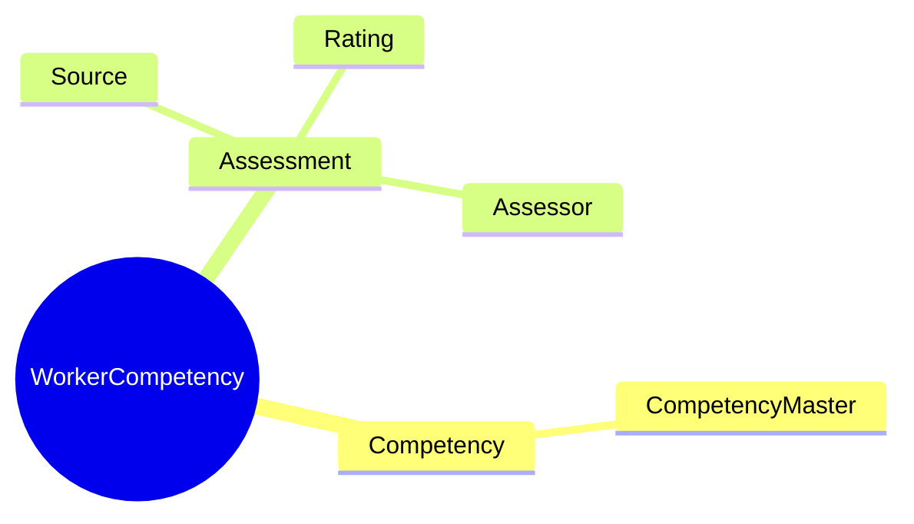
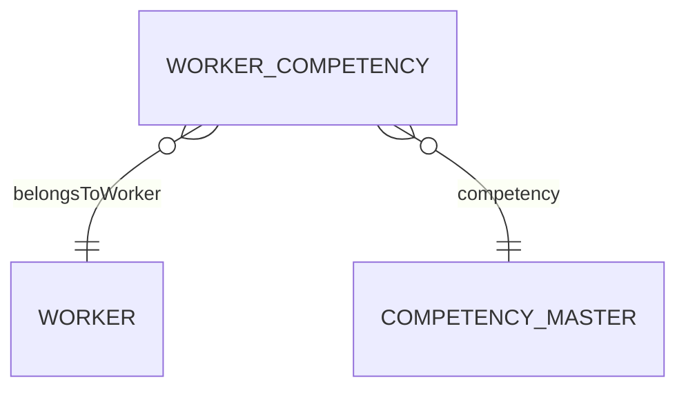

# WorkerCompetency

## Overview

**WorkerCompetency** records a worker's behavioral competency assessment from [[CompetencyMaster]] - leadership, communication, problem-solving. Unlike [[WorkerSkill]] (technical abilities), competencies focus on behavioral traits and soft skills assessed through performance reviews and 360 feedback.

## Business Context

### Key Stakeholders
- **Manager**: Performance assessment
- **HR/L&D**: Competency analytics
- **Employee**: Development planning

### Business Processes
- **Performance Reviews**: Competency ratings
- **360 Feedback**: Multi-source assessment
- **Leadership Development**: Gap identification

### Business Value
Competency tracking enables targeted leadership development and performance improvement.

## Attributes Guide

### Assessment
- **competencyId**: Links to [[CompetencyMaster]].
- **ratingValue**: 1-5 scale per competency framework.
- **sourceCode**: Assessment origin:
  - *SELF*: Self-assessment
  - *MANAGER*: Manager review
  - *360*: 360-degree feedback
  - *SURVEY*: Organization survey

## Relationships Explained

## Lifecycle & Workflows

| State | Meaning |
|-------|---------|
| **active** | Current assessment |
| **inactive** | Historical |

## Examples

### Example: Leadership Rating
- **competencyId**: COMP-LEADERSHIP
- **ratingValue**: 4
- **sourceCode**: MANAGER
- **assessedDate**: 2024-06-15

## Related Entities

| Entity | Relationship |
|--------|--------------|
| [[Worker]] | belongsToWorker |
| [[CompetencyMaster]] | competency |
