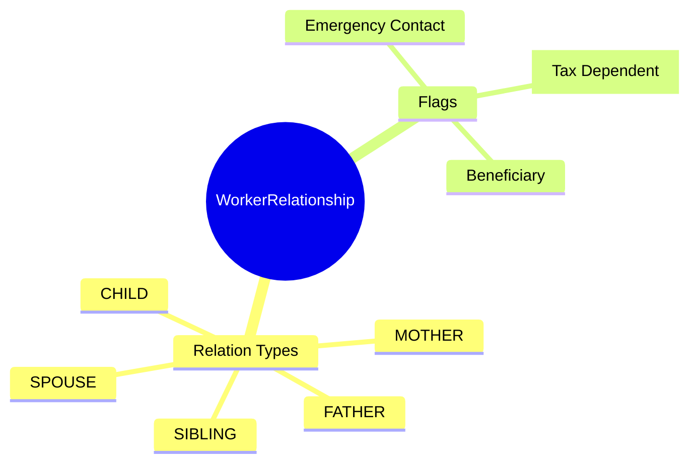
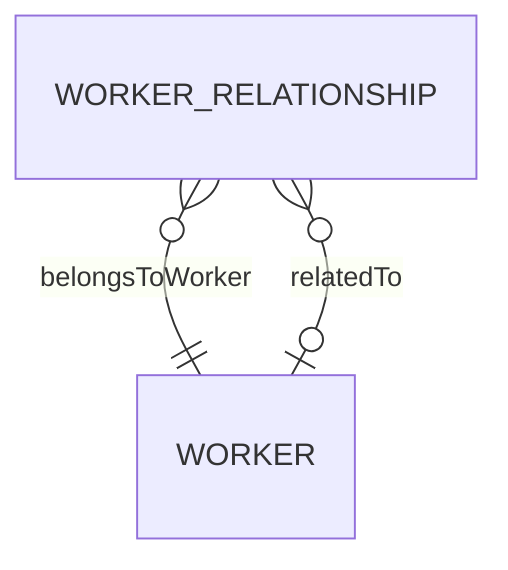

# WorkerRelationship

## Overview

**WorkerRelationship** records family and personal relationships of a [[Worker]] - spouse, parents, children, emergency contacts, and beneficiaries. Used for tax dependents, emergency contact lists, and insurance beneficiaries.

## Business Context

### Key Stakeholders
- **Employee**: Maintains family info
- **HR**: Emergency contact management
- **Payroll**: Tax dependent calculations
- **Benefits**: Beneficiary management

### Business Processes
- **Emergency Response**: Contact notification
- **Tax Calculation**: Dependent deductions (Vietnam PIT)
- **Benefits Enrollment**: Beneficiary designation
- **Insurance**: Coverage for dependents

### Business Value
Accurate family data enables proper tax treatment, emergency response, and benefits administration.

## Attributes Guide

### Relationship
- **relationCode**: Type of relationship:
  - *FATHER/MOTHER*: Parents
  - *SPOUSE*: Husband/Wife
  - *CHILD*: Son/Daughter
  - *SIBLING*: Brother/Sister
  - *OTHER*: Other relatives

### Related Person
- **relatedWorkerId**: If person is also an employee, link to their Worker record.
- **fullName**: If not in system, store name directly.

### Flags
- **isEmergency**: Include in emergency contact list.
- **dependencyFlag**: Tax dependent (reduces PIT).
- **beneficiaryFlag**: Insurance beneficiary.

## Relationships Explained

### Subject
- **belongsToWorker** → [[Worker]]: The employee.

### Related Person
- **relatedTo** → [[Worker]]: If related person is also in system.

## Lifecycle & Workflows

| State | Meaning |
|-------|---------|
| **active** | Current relationship |
| **inactive** | Ended (divorce, death) |

## Actions & Operations

### add
**Who**: Employee (self-service), HR  
**Required**: workerId, relationCode, effectiveStartDate

### update
**Who**: Employee, HR  
**When**: Details change

## Business Rules

#### Emergency Required (emergencyRequired)
**Rule**: Employee should have at least one emergency contact.

## Examples

### Example: Spouse
- **workerId**: WRK-00042
- **relationCode**: SPOUSE
- **fullName**: Nguyễn Thị B
- **isEmergency**: true
- **dependencyFlag**: false

### Example: Dependent Child
- **workerId**: WRK-00042
- **relationCode**: CHILD
- **dependencyFlag**: true (for PIT deduction)

## Related Entities

| Entity | Relationship |
|--------|--------------|
| [[Worker]] | belongsToWorker |
