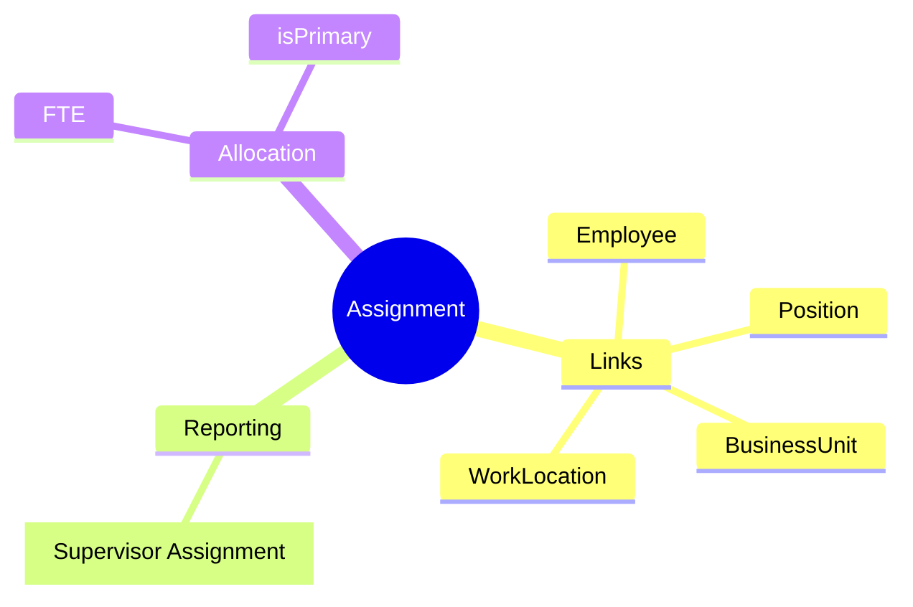
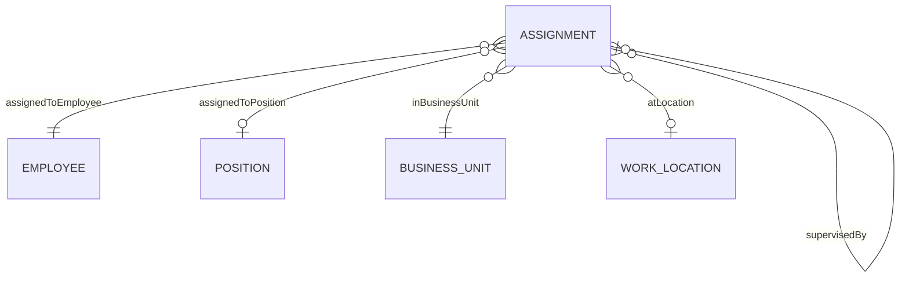
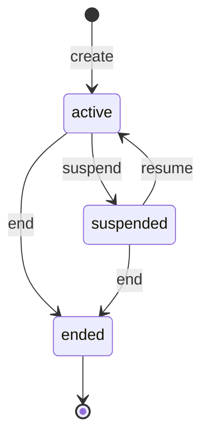
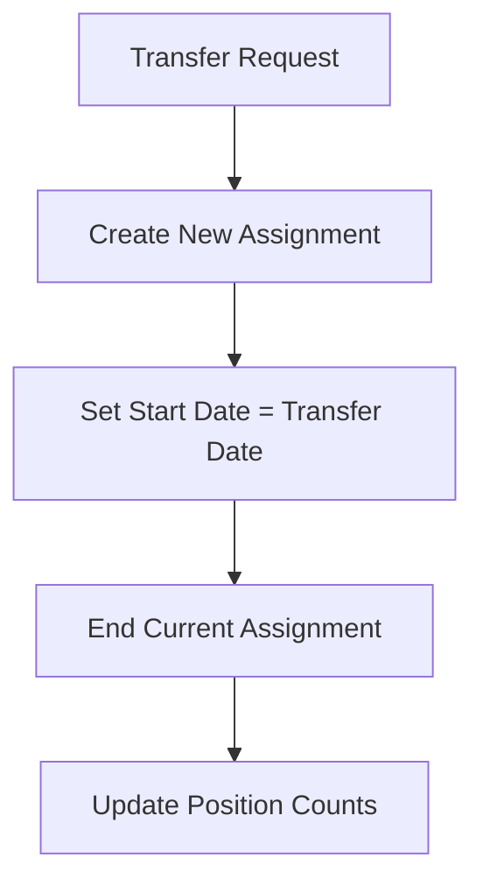

# Assignment

## Overview

An **Assignment** links an [[Employee]] to a [[Position]] and [[BusinessUnit]], defining where they work and who they report to. Assignments are the core of the organizational structure - they create the org chart, determine cost allocation, and establish reporting relationships.

## Business Context

### Key Stakeholders
- **Manager**: Owns the assignment, approves changes
- **HR Admin**: Creates assignments, processes transfers
- **Finance**: Uses for cost allocation (BU cost center)
- **Org Design**: Analyzes org structure via assignments

### Business Processes
This entity is central to:
- **Onboarding**: Assignment created as part of hire process
- **Transfers**: Moving employees between positions/BUs
- **Org Chart**: Supervisor chain = org hierarchy
- **Headcount**: Assignment count = actual headcount per BU

### Business Value
Assignment is the operational placement of people. It answers: "Where do you work?" "Who do you report to?" "What do you do?"

## Attributes Guide

### Core Links
- **employeeId**: The employee being assigned. Required.
- **positionId**: The position slot. Optional for matrix/project assignments.
- **businessUnitId**: The organizational unit. Required - for cost allocation.

### Work Details
- **primaryLocationId**: Where employee physically works. For remote workers, may be home office.
- **fte**: Full-time equivalent. 1.0 = full-time, 0.5 = half-time. Used for headcount calculations.
- **isPrimary**: Employee's main assignment. Determines primary manager, cost center.

### Reporting Line
- **supervisorAssignmentId**: Points to supervisor's assignment (not person). This creates the reporting chain.
  - When supervisor changes position, their subordinates' reporting unchanged
  - When employee transferred, reporting line ends with this assignment

## Relationships Explained

### Employee Link
- **assignedToEmployee** → [[Employee]]: The person. Employee can have multiple assignments (primary + secondary/project).

### Position Link
- **assignedToPosition** → [[Position]]: The role slot. Position may have multiple assignments if maxIncumbents > 1.

### Organization
- **inBusinessUnit** → [[BusinessUnit]]: Cost center and organizational home.
- **atLocation** → [[WorkLocation]]: Physical work location.

### Hierarchy
- **supervisedBy** → [[Assignment]]: Links to supervisor's assignment. Creates reporting tree without person dependency.

## Lifecycle & Workflows

### State Definitions

| State | Business Meaning | System Impact |
|-------|------------------|---------------|
| **active** | Currently working | Included in headcount, org chart |
| **suspended** | Temporary hold | May exclude from active headcount |
| **ended** | Assignment complete | Historical only |

### State Diagram

### Transfer Workflow

## Actions & Operations

### create
**Who**: HR Admin  
**When**: Hire, transfer, additional assignment  
**Required**: employeeId, businessUnitId, startDate  
**Process**:
1. Verify position has available slot (if applicable)
2. Verify employee has active status
3. Create assignment in active state
4. Update position incumbent count

### transfer
**Who**: HR Admin with manager approval  
**When**: Moving to new position or BU  
**Process**:
1. End current assignment
2. Create new assignment with new position/BU
3. Reporting line may change

### changeSupervisor
**Who**: HR Admin  
**When**: Reorg, manager change  
**Process**:
1. Verify no circular reporting
2. Update supervisorAssignmentId

### end
**Who**: HR Admin  
**When**: Transfer, termination, project end  
**Process**:
1. Set endDate
2. Update position incumbent count
3. Status → ended

## Business Rules

### Data Integrity

#### One Primary (onePrimary)
**Rule**: Exactly one primary assignment per employee at any time.  
**Reason**: Determines main manager, cost allocation.  
**Violation**: System enforces; new primary demotes old.

#### Valid Position (validPosition)
**Rule**: Position must have available slot.  
**Reason**: Prevents overstaffing.  
**Violation**: System blocks if maxIncumbents reached.

### Hierarchy

#### No Cycles (supervisorHierarchy)
**Rule**: Supervisor chain cannot form cycles.  
**Reason**: Org hierarchy must be a tree.  
**Violation**: System prevents save.

## Examples

### Example 1: Standard Assignment
- **employeeId**: EMP-00042
- **positionId**: POS-00123
- **businessUnitId**: ENGINEERING
- **fte**: 1.0
- **isPrimary**: true
- **supervisorAssignmentId**: ASN-00010

### Example 2: Secondary Assignment (Project)
- **employeeId**: EMP-00042
- **positionId**: null (project-based)
- **businessUnitId**: INNOVATION_LAB
- **fte**: 0.2
- **isPrimary**: false

## Related Entities

| Entity | Relationship | Description |
|--------|--------------|-------------|
| [[Employee]] | assignedToEmployee | The employee |
| [[Position]] | assignedToPosition | The position |
| [[BusinessUnit]] | inBusinessUnit | Cost center |
| [[WorkLocation]] | atLocation | Work site |
