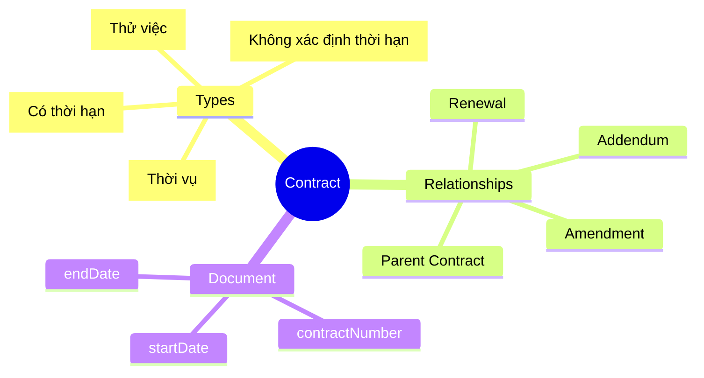
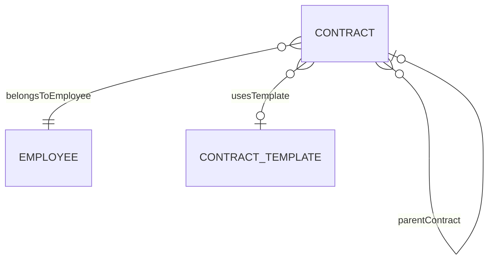
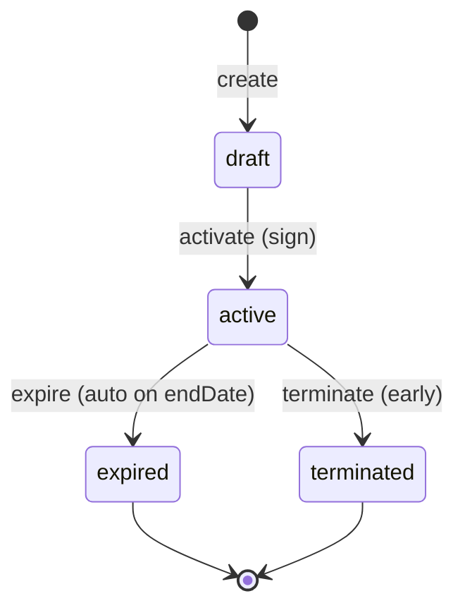
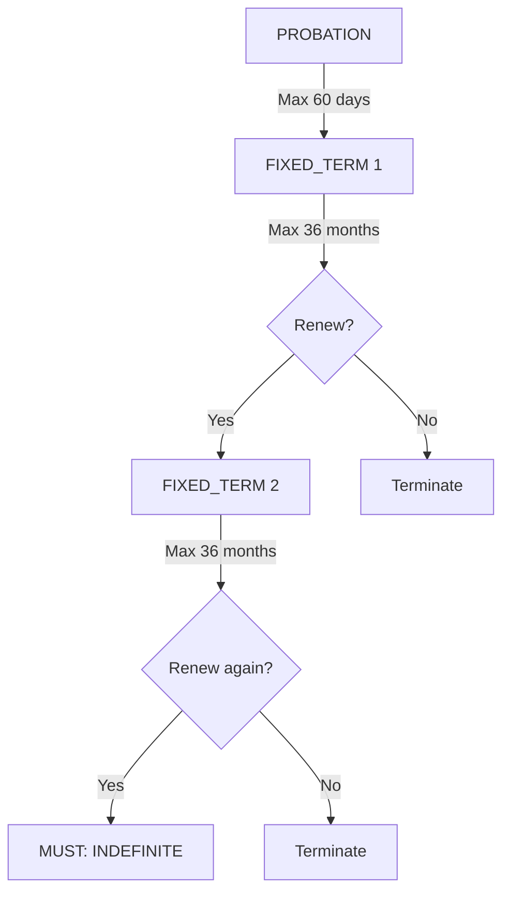

# Contract

## Overview

A **Contract** represents the employment agreement between an [[Employee]] and the organization. Contracts define legal terms, duration, and working conditions. They follow Vietnam Labor Code requirements including contract types, renewal limits, and mandatory conversions.

## Business Context

### Key Stakeholders
- **HR Admin**: Creates, manages, renews contracts
- **Legal**: Reviews terms, ensures compliance
- **Employee**: Signs, receives copy
- **Payroll**: Uses contract type for tax/SI calculation

### Business Processes
This entity is central to:
- **Onboarding**: Contract creation part of hire process
- **Contract Renewal**: Tracking expiry, renewal workflow
- **Compliance**: Labor law adherence (contract types, limits)
- **Termination**: Contract termination triggers exit process

### Business Value
Contract is the legal basis for employment. Proper management ensures compliance with Vietnam Labor Code and protects both organization and employee.

## Attributes Guide

### Identification
- **contractNumber**: Official contract reference. Format: HD-YYYY-XXXX. Printed on physical contract.
- **employeeId**: Links to [[Employee]]. Each contract belongs to exactly one employee.

### Contract Terms
- **contractTypeCode**: Type per Vietnam Labor Code 2019:
  - *INDEFINITE*: Không xác định thời hạn - preferred for long-term
  - *FIXED_TERM*: Có thời hạn - 12-36 months
  - *SEASONAL*: Thời vụ - < 12 months for seasonal work
  - *PROBATION*: Thử việc - max 60 days for senior roles
- **startDate / endDate**: Contract validity period. INDEFINITE has no endDate.
- **workScheduleTypeCode**: Full-time, Part-time, Shift work.

### Template & Amendments
- **templateId**: Links to [[ContractTemplate]] for standardized terms.
- **parentContractId**: For amendments/renewals, links to original contract.
- **parentRelationshipType**: How this contract relates to parent:
  - *AMENDMENT*: Modifies existing terms (salary, position)
  - *ADDENDUM*: Adds new terms (bonus agreement)
  - *RENEWAL*: Extends duration
  - *SUPERSESSION*: Replaces parent entirely

## Relationships Explained

### Employee Link
- **belongsToEmployee** → [[Employee]]: The employee party to this contract. Employee may have multiple contracts (e.g., initial + amendments).

### Template
- **usesTemplate** → [[ContractTemplate]]: Standardized template providing default terms, clauses, probation rules.

### Contract Chain
- **parentContract** → [[Contract]]: Links amendments/renewals to original. Enables full contract history tracking.

## Lifecycle & Workflows

### State Definitions

| State | Business Meaning | System Impact |
|-------|------------------|---------------|
| **draft** | Being prepared, not yet signed | Not legally binding |
| **active** | Currently in force | Employee actively working |
| **expired** | End date reached normally | Auto-transition, no action needed |
| **terminated** | Early termination | May trigger consequences |

### State Diagram

### Vietnam Labor Code Compliance Flow

## Actions & Operations

### create
**Who**: HR Admin  
**When**: New employee or contract renewal  
**Required**: employeeId, contractTypeCode, contractNumber, startDate  
**Process**:
1. Select or create from template
2. Populate contract details
3. Create in draft state

### activate
**Who**: HR Admin  
**When**: Contract signed by both parties  
**Process**:
1. Verify all required fields
2. Transition to active
3. Notify payroll, IT

### amend
**Who**: HR Admin  
**When**: Changing terms (salary, position)  
**Process**:
1. Create new contract with parentRelationshipType = AMENDMENT
2. Link to parent contract
3. Set amendmentTypeCode (SALARY_CHANGE, POSITION_CHANGE)

### renew
**Who**: HR Admin  
**When**: Extending expiring contract  
**Process**:
1. Check renewal limits (max 2 FIXED_TERM)
2. Create new contract with parentRelationshipType = RENEWAL
3. If 3rd renewal, force INDEFINITE type

## Business Rules

### Data Integrity

#### Unique Number (uniqueNumber)
**Rule**: Contract number globally unique.  
**Reason**: Legal document reference.  
**Violation**: System prevents save.

#### Date Validation (validDates)
**Rule**: endDate >= startDate.  
**Reason**: Logical consistency.  
**Violation**: System prevents save.

### Vietnam Labor Code Compliance

#### Fixed-Term Limit (fixedTermLimit)
**Rule**: FIXED_TERM max 36 months.  
**Reason**: Article 22, Labor Code 2019.  
**Violation**: Warning shown, recommend INDEFINITE.

#### Renewal Limit (renewalLimit)
**Rule**: Max 2 consecutive FIXED_TERM contracts.  
**Reason**: Article 20, Labor Code 2019. Third renewal must be INDEFINITE.  
**Implementation**: System warns at 2nd renewal, blocks 3rd unless INDEFINITE.

## Examples

### Example 1: Standard INDEFINITE Contract
- **contractNumber**: HD-2023-00042
- **contractTypeCode**: INDEFINITE
- **startDate**: 2023-01-15
- **endDate**: null
- **primaryFlag**: true

### Example 2: Amendment for Salary Change
- **contractNumber**: HD-2023-00042-A1
- **parentContractId**: HD-2023-00042
- **parentRelationshipType**: AMENDMENT
- **amendmentTypeCode**: SALARY_CHANGE
- **startDate**: 2024-01-01

## Related Entities

| Entity | Relationship | Description |
|--------|--------------|-------------|
| [[Employee]] | belongsToEmployee | Contract holder |
| [[ContractTemplate]] | usesTemplate | Standard template |
| [[Contract]] | parentContract | Parent (for amendments) |
