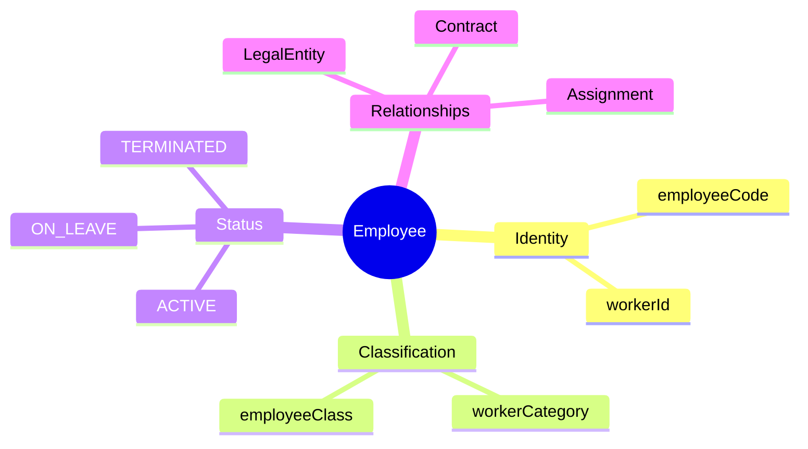
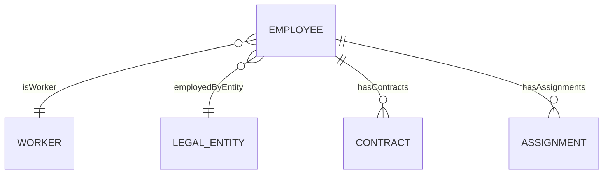
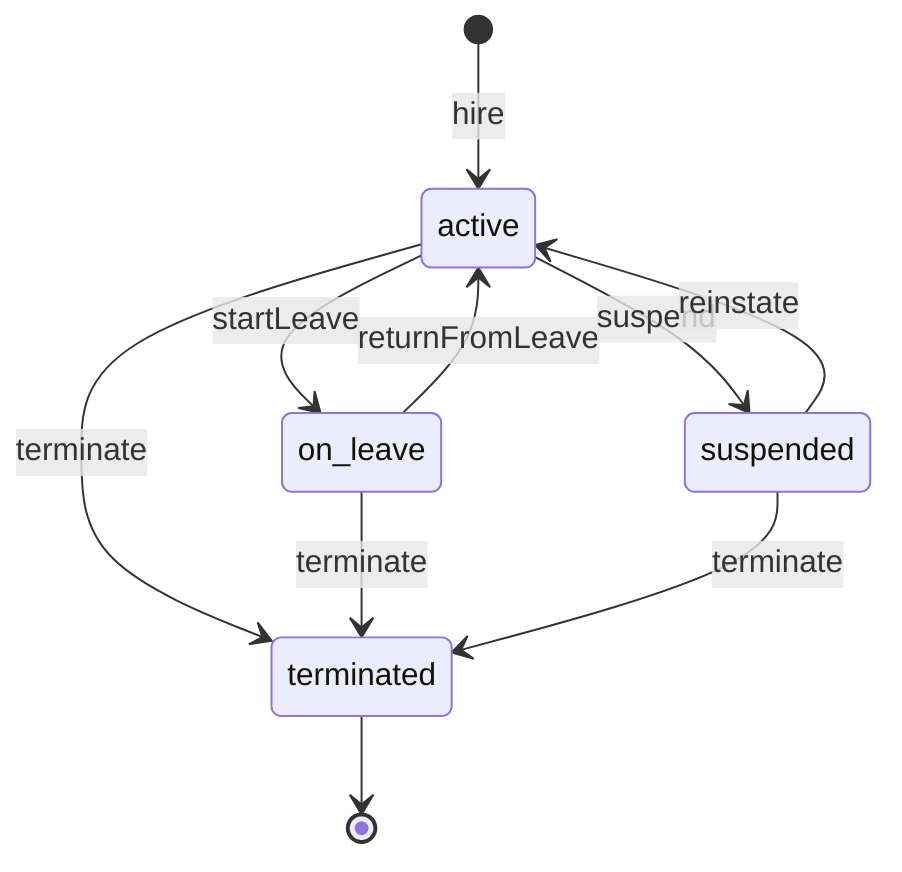

# Employee

## Overview

An **Employee** represents a person who has an employment relationship with a specific Legal Entity. This entity is the core of HR operations - from hiring and payroll to performance management and offboarding. One Worker can have multiple Employee records across different Legal Entities.

## Business Context

### Key Stakeholders
- **HR Admin**: Creates/manages employee records, processes terminations
- **Payroll**: Uses for salary calculation, tax deductions
- **Manager**: Views direct reports, approves leave
- **IT**: Provisions system access based on status

### Business Processes
This entity is central to:
- **Onboarding**: Employee creation triggers account provisioning, orientation
- **Payroll Processing**: Status and classification determine pay rules
- **Benefits Administration**: Eligibility based on class and tenure
- **Termination**: Drives exit workflow, final pay, access revocation

### Business Value
Employee is the authoritative source for "who works here" - enabling accurate headcount, labor cost, and compliance reporting.

## Attributes Guide

### Identification
- **employeeCode**: Public identifier in format EMP-XXXX. Used in all communications, reports, and integrations. Unique within Legal Entity. Once assigned, never changes.
- **workerId**: Links to [[Worker]] for person identity. Allows same person to have multiple employments.

### Classification
- **workerCategoryCode**: High-level grouping (EXECUTIVE, STAFF, WORKER)
  - *EXECUTIVE*: Senior leadership, different policies
  - *STAFF*: Office/professional roles
  - *WORKER*: Operational/production roles
- **employeeClassCode**: Detailed classification for benefits/payroll
  - *PERMANENT*: Chính thức - full benefits
  - *PROBATION*: Thử việc - limited benefits
  - *CONTRACT*: Hợp đồng dịch vụ - no SI/benefits

### Employment Dates
- **hireDate**: Start of employment. Determines tenure, anniversary, benefits eligibility.
- **terminationDate**: End of employment. Set only when terminated.

### Status
- **statusCode**: Current lifecycle state. Drives system access, payroll inclusion, reporting.

## Relationships Explained

### Person Link
- **isWorker** → [[Worker]]: Links to person identity. Worker contains personal info (name, DOB, nationality). Employee contains employment-specific data. One Worker = one person lifetime; can have many Employees across entities.

### Organizational Placement
- **employedByEntity** → [[LegalEntity]]: The company that employs this person. Determines tax jurisdiction, labor law, payroll processing. Transfer between entities creates new Employee record.

### Employment Details
- **hasContracts** → [[Contract]]: Employment contracts/addendums. Primary contract defines terms. Amendments track changes.
- **hasAssignments** → [[Assignment]]: Links to Position and BusinessUnit. Defines job role, reporting line, work location.

## Lifecycle & Workflows

### State Definitions

| State | Business Meaning | System Impact |
|-------|------------------|---------------|
| **active** | Currently employed and working | Full access, included in headcount, payroll active |
| **on_leave** | Approved temporary absence | Access may suspend, excluded from assignments |
| **suspended** | Disciplinary or investigation | Access suspended, payroll may pause |
| **terminated** | Employment ended | No access, final pay processed, archived |

### State Diagram

### Transition Workflows

#### Hiring → Active
1. HR creates employee record with required fields
2. System auto-assigns employeeCode
3. Status set to `active`
4. Triggers: IT provisioning, payroll setup, orientation

**Typical duration**: Same day

#### Active → Terminated
1. Resignation/termination decision made
2. HR triggers `terminate` with terminationDate
3. Status becomes `terminated`
4. Triggers: Access revocation, final pay, exit interview

**Notice period**: Per contract (typically 30-60 days)

## Actions & Operations

### hire
**Who**: HR Administrators only  
**When**: New employee joining organization  
**Required**: workerId, legalEntityCode, employeeCode, hireDate  
**Process**:
1. Verify Worker exists
2. Verify employeeCode unique in entity
3. Create record with status = active
4. Log effective date

**Downstream effects**:
- Creates IT account request
- Notifies payroll for setup
- Adds to onboarding queue

### terminate
**Who**: HR Administrators with approval  
**When**: Employment ending (resignation, termination)  
**Required**: terminationDate  
**Process**:
1. Validate no blocking conditions
2. Set terminationDate and status = terminated
3. Close all active assignments

**Downstream effects**:
- Revokes system access
- Calculates final pay and leave payout
- Archives for retention

### transfer
**Who**: HR Administrators  
**When**: Moving to different Legal Entity  
**Process**:
1. Terminate current Employee record
2. Create new Employee in target entity
3. Link via previousEmployment on Worker

## Business Rules

### Data Integrity

#### Unique Employee Code (uniqueCodePerEntity)
**Rule**: Employee code must be unique within Legal Entity.  
**Reason**: Prevents confusion in payroll, reporting, integrations.  
**Violation**: System prevents save; HR must choose different code.

#### Hire Date Validation (hireDateNotFuture)
**Rule**: Hire date cannot be in the future.  
**Reason**: Prevents premature access. Future hires stay in recruiting system.  
**Violation**: System prevents save.

### Compliance

#### Data Retention (dataRetention)
**Rule**: Terminated records retained for 7 years.  
**Reason**: Vietnam Labor Code requires retention for tax, social insurance audits.  
**Implementation**: Records archived, accessible to HR/Legal only.

## Examples

### Example 1: Standard Full-Time Employee
- **employeeCode**: EMP-0042
- **statusCode**: ACTIVE
- **workerCategoryCode**: STAFF
- **employeeClassCode**: PERMANENT
- **hireDate**: 2023-01-15
- **legalEntityCode**: VNG_CORP

### Example 2: Employee on Maternity Leave
- **employeeCode**: EMP-0108
- **statusCode**: ON_LEAVE
- **hireDate**: 2020-06-01
- **Leave type**: Maternity (180 days per Vietnam law)

## Related Entities

| Entity | Relationship | Description |
|--------|--------------|-------------|
| [[Worker]] | isWorker | Person identity |
| [[LegalEntity]] | employedByEntity | Employer |
| [[Contract]] | hasContracts | Employment contracts |
| [[Assignment]] | hasAssignments | Position assignments |
