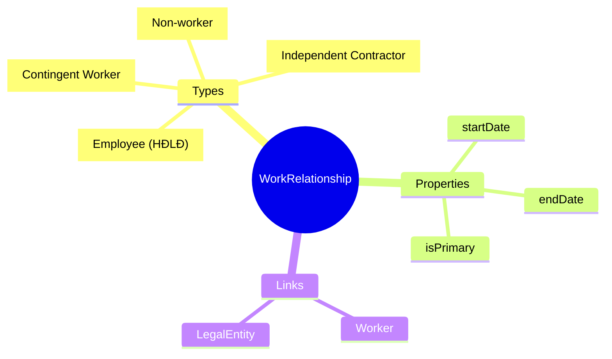
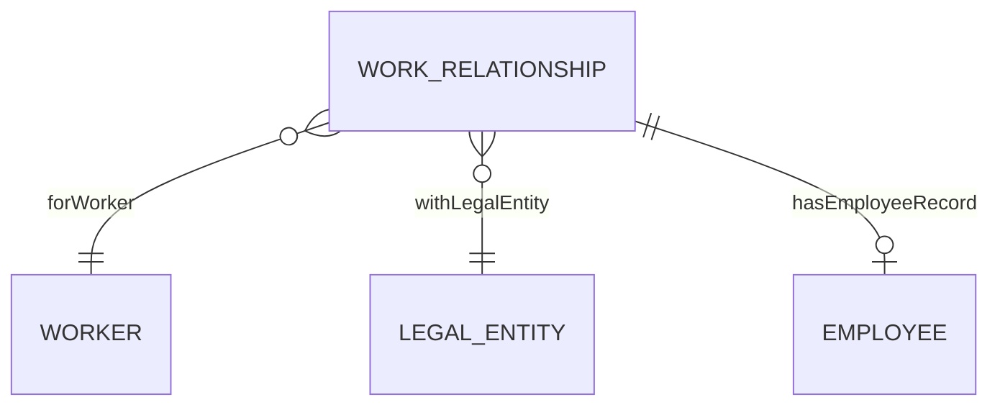
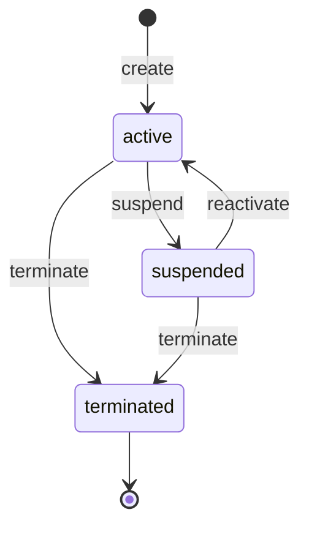

# WorkRelationship

## Overview

A **WorkRelationship** represents the **employment relationship type** between a [[Worker]] and a [[LegalEntity]]. This defines HOW the person is engaged with the organization - as an employee, contractor, contingent worker, or non-worker (board member, dependent).

This is distinct from [[Employee]] which contains employment DETAILS - WorkRelationship is the classification of the relationship itself.

## Business Context

### What is WorkRelationship?

WorkRelationship answers: **"What TYPE of working arrangement does this person have with this legal entity?"**

| Type | Description | Example |
|------|-------------|---------|
| **EMPLOYEE** | Người lao động theo HĐLĐ | Full-time, Part-time employees |
| **CONTINGENT** | Lao động phụ thuộc qua agency | Temps, Agency workers |
| **CONTRACTOR** | Nhà thầu độc lập | Freelancers, Consultants |
| **NON_WORKER** | Không phải lao động | Board members, Dependents |

### Key Stakeholders
- **HR Admin**: Creates/manages relationships
- **Procurement**: Manages CONTRACTOR relationships
- **Legal**: Ensures correct classification (employee vs contractor)
- **Payroll**: Different processing by type

### Business Processes
This entity is central to:
- **Hiring**: Create EMPLOYEE relationship
- **Contractor Engagement**: Create CONTRACTOR relationship
- **Compliance**: Correct worker classification (avoid misclassification risk)
- **Multi-Entity**: Same person, different relationships in different entities

### Business Value
Proper worker classification ensures legal compliance (labor law, tax), enables correct payroll processing, and provides complete workforce visibility.

## Attributes Guide

### Classification
- **relationshipTypeCode**: Type of working relationship:
  - *EMPLOYEE*: Has employment contract (HĐLĐ), employment benefits
  - *CONTINGENT*: Agency worker, temp - employed elsewhere but works here
  - *CONTRACTOR*: Independent, own business, service agreement
  - *NON_WORKER*: No labor relationship but tracked (board member, dependent)

### Scope
- **workerId**: The [[Worker]] (person).
- **legalEntityCode**: Which [[LegalEntity]] this relationship is with. **Required** - every work relationship is with a specific legal entity.
- **startDate / endDate**: Relationship duration.

### Status
- **statusCode**: Lifecycle state (ACTIVE, SUSPENDED, TERMINATED).
- **isPrimary**: If worker has multiple relationships, one must be primary.

## Relationships Explained

### Worker
- **forWorker** → [[Worker]]: The person. Worker can have multiple WorkRelationships (different types or different entities).

### Legal Entity
- **withLegalEntity** → [[LegalEntity]]: The employer/engaging entity. Required.

### Employment Details
- **hasEmployeeRecord** → [[Employee]]: When type = EMPLOYEE, links to detailed employment record (employee code, hire date, etc.).

## Lifecycle & Workflows

### State Definitions

| State | Business Meaning | System Impact |
|-------|------------------|---------------|
| **active** | Currently engaged | Included in workforce |
| **suspended** | Temporarily paused | Limited access |
| **terminated** | Relationship ended | Historical only |

### State Diagram

## Actions & Operations

### create
**Who**: HR Admin  
**When**: New engagement with organization  
**Required**: workerId, relationshipTypeCode, legalEntityCode, startDate  
**Process**:
1. Verify worker exists
2. Check for duplicate type+entity
3. Create relationship
4. If EMPLOYEE type → create [[Employee]] record

### terminate
**Who**: HR Admin  
**When**: Ending engagement (offboarding, contract end)  
**Process**:
1. Set endDate
2. Transition to terminated
3. If EMPLOYEE type → terminate [[Employee]] record

## Business Rules

### Data Integrity

#### One Per Type Per Entity (uniqueTypePerEntity)
**Rule**: One active relationship of each type per legal entity.  
**Reason**: Prevents duplicate classifications.  
**Example OK**: EMPLOYEE at VNG_CORP + CONTRACTOR at ZaloPay  
**Example NOT OK**: Two EMPLOYEE at VNG_CORP

#### Entity Required (entityRequired)
**Rule**: Legal entity is required for all types.  
**Reason**: Work relationship is always with a specific legal entity.

### Business Logic

#### Primary Required (primaryRequired)
**Rule**: If worker has any relationships, exactly one must be primary.  
**Reason**: Default for reporting, payroll.

## Examples

### Example 1: Regular Employee
- **workerId**: WRK-00042
- **relationshipTypeCode**: EMPLOYEE
- **legalEntityCode**: VNG_CORP
- **startDate**: 2023-01-15
- **isPrimary**: true
- **statusCode**: ACTIVE

### Example 2: Independent Contractor
- **workerId**: WRK-00100
- **relationshipTypeCode**: CONTRACTOR
- **legalEntityCode**: ZALOPAY
- **startDate**: 2024-06-01
- **statusCode**: ACTIVE

### Example 3: Multi-Entity Worker
Same person with two relationships:
- EMPLOYEE at VNG_CORP (primary)
- CONTRACTOR at ZaloPay (secondary)

## Related Entities

| Entity | Relationship | Description |
|--------|--------------|-------------|
| [[Worker]] | forWorker | The person |
| [[LegalEntity]] | withLegalEntity | Employer |
| [[Employee]] | hasEmployeeRecord | Employment details |
