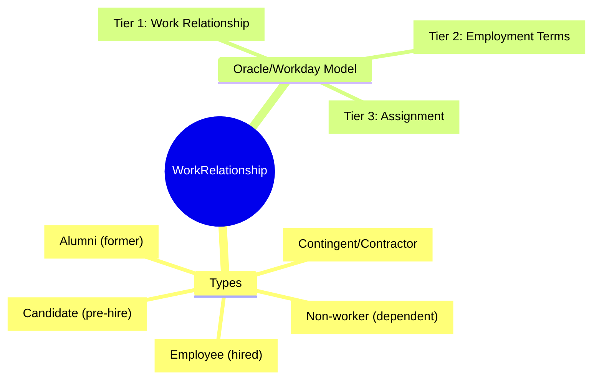
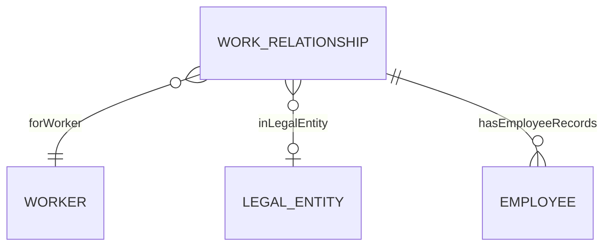
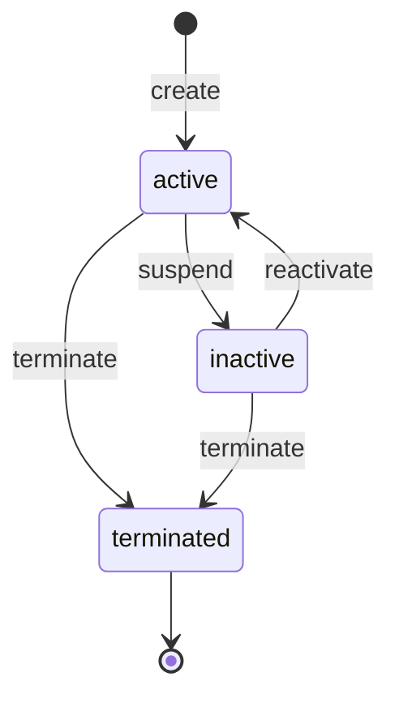
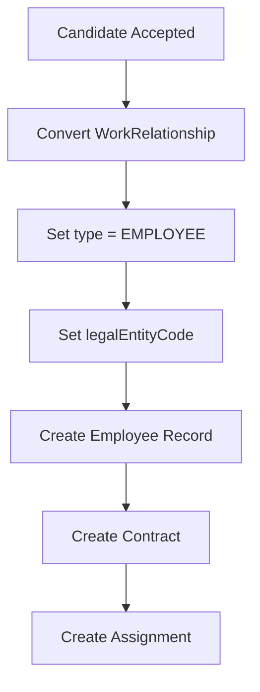

# WorkRelationship

## Overview

A **WorkRelationship** represents the fundamental classification of a [[Worker]]'s affiliation with the organization. This is the **Tier 1** of the Employment Model (per Oracle HCM/Workday patterns). It answers: "What TYPE of worker is this person?" before any employment details.

This entity separates the **classification** (Employee, Contingent, Candidate, Alumnus) from the **employment details** ([[Employee]], [[Contract]], [[Assignment]]).

## Business Context

### Why This Entity Exists

Leading HR solutions (Oracle HCM, Workday, SAP SuccessFactors) separate:
- **Work Relationship**: Legal tie between person and employer
- **Employee**: Specific employment record with details
- **Assignment**: Role placement (position, department)

This separation enables:
- Pre-hire tracking (candidates)
- Contingent worker management (contractors without full employment)
- Alumni tracking (former employees for rehire/networking)
- Multi-entity employment (same person, multiple relationships)

### Key Stakeholders
- **Recruiter**: Manages CANDIDATE relationships
- **HR Admin**: Creates EMPLOYEE relationships on hire
- **Procurement**: Manages CONTINGENT relationships
- **Alumni Relations**: Tracks ALUMNUS relationships

### Business Processes
This entity is central to:
- **Recruiting to Hiring**: CANDIDATE → EMPLOYEE conversion
- **Contingent Workforce**: Track contractors without full employment
- **Alumni Management**: Former employee engagement
- **Multi-Entity Workers**: Multiple relationships across legal entities

### Business Value
WorkRelationship provides a unified view of ALL person-organization affiliations, not just employees. Enables complete workforce visibility and proper classification for compliance.

## Attributes Guide

### Core Classification
- **relationshipTypeCode**: Type of affiliation:
  - *EMPLOYEE*: Has employment contract, is an employee
  - *CONTINGENT*: Contractor, consultant, agency worker
  - *CANDIDATE*: In recruiting pipeline, not yet hired
  - *ALUMNUS*: Former employee
  - *NONWORKER*: Dependent, pensioner, board member

### Scope
- **workerId**: The [[Worker]] (person).
- **legalEntityCode**: Which [[LegalEntity]] this relationship is with. CANDIDATE may have null until conversion.
- **startDate / endDate**: Relationship duration.

### Status
- **statusCode**: Lifecycle state.
- **isPrimary**: If worker has multiple relationships, one must be primary.

## Relationships Explained

### Worker
- **forWorker** → [[Worker]]: The person. Worker can have multiple WorkRelationships (different types, different entities).

### Legal Entity
- **inLegalEntity** → [[LegalEntity]]: The employing entity. May be null for CANDIDATE.

### Employment Details
- **hasEmployeeRecords** → [[Employee]]: When type = EMPLOYEE, links to detailed employment records.

## Lifecycle & Workflows

### State Definitions

| State | Business Meaning | System Impact |
|-------|------------------|---------------|
| **active** | Current affiliation | Included in workforce |
| **inactive** | Temporarily suspended | Limited access |
| **terminated** | Relationship ended | Historical only |

### State Diagram

### Candidate to Employee Conversion

## Actions & Operations

### create
**Who**: Recruiter (CANDIDATE), HR (others)  
**When**: New person-organization relationship  
**Required**: workerId, relationshipTypeCode, startDate  
**Process**:
1. Verify worker exists
2. Check for duplicate type+entity
3. Create relationship

### terminate
**Who**: HR Admin  
**When**: Ending relationship (offboarding)  
**Process**:
1. Set endDate
2. Transition to terminated
3. If EMPLOYEE type, triggers Employee termination

### convert
**Who**: HR Admin  
**When**: Changing relationship type (hire, conversion)  
**Process**:
1. Update relationshipTypeCode
2. Set legalEntityCode if needed
3. Create downstream records (Employee, Contract)

## Business Rules

### Data Integrity

#### One Per Type Per Entity (uniqueTypePerEntity)
**Rule**: One active relationship of each type per legal entity.  
**Reason**: Prevents duplicate classifications.  
**Violation**: System prevents save.

### Business Logic

#### Primary Required (primaryRequired)
**Rule**: If worker has any relationships, exactly one must be primary.  
**Reason**: Default for reporting, payroll.  
**Implementation**: System auto-selects first as primary.

#### Candidate No Entity (candidateNoEntity)
**Rule**: CANDIDATE type may not have legal entity assigned.  
**Reason**: Not yet hired.  
**Implementation**: Set on conversion to EMPLOYEE.

## Examples

### Example 1: Full-Time Employee
- **workerId**: WRK-00042
- **relationshipTypeCode**: EMPLOYEE
- **legalEntityCode**: VNG_CORP
- **startDate**: 2023-01-15
- **isPrimary**: true
- **statusCode**: ACTIVE

### Example 2: Candidate (Pre-Hire)
- **workerId**: WRK-00100
- **relationshipTypeCode**: CANDIDATE
- **legalEntityCode**: null (not yet assigned)
- **startDate**: 2024-06-01
- **statusCode**: ACTIVE

### Example 3: Alumnus (Former Employee)
- **workerId**: WRK-00030
- **relationshipTypeCode**: ALUMNUS
- **legalEntityCode**: VNG_CORP
- **startDate**: 2015-01-01
- **endDate**: 2023-12-31
- **statusCode**: TERMINATED

## Edge Cases

### Multiple Relationships
Worker may have:
- EMPLOYEE at VNG_CORP (primary)
- CONTINGENT at ZaloPay (secondary)

### Conversion
When CANDIDATE converts to EMPLOYEE:
1. Keep same WorkRelationship record
2. Update type from CANDIDATE → EMPLOYEE
3. Create new [[Employee]] record

## Related Entities

| Entity | Relationship | Description |
|--------|--------------|-------------|
| [[Worker]] | forWorker | The person |
| [[LegalEntity]] | inLegalEntity | Employer |
| [[Employee]] | hasEmployeeRecords | Employment details |
