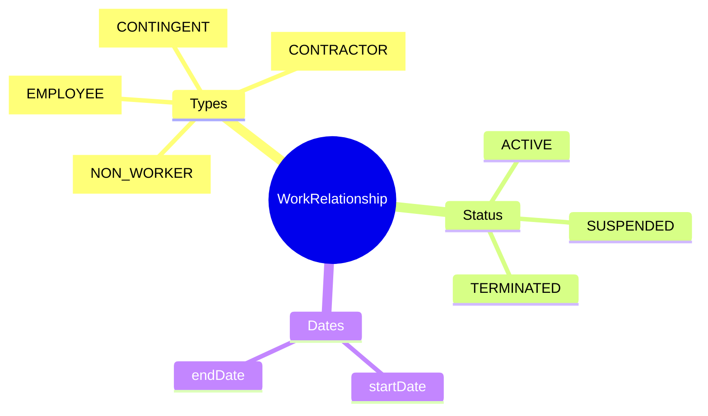
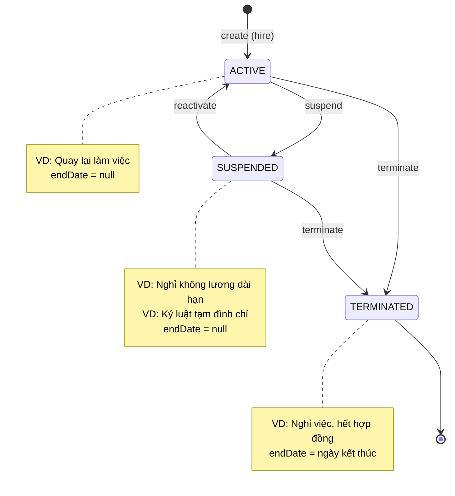
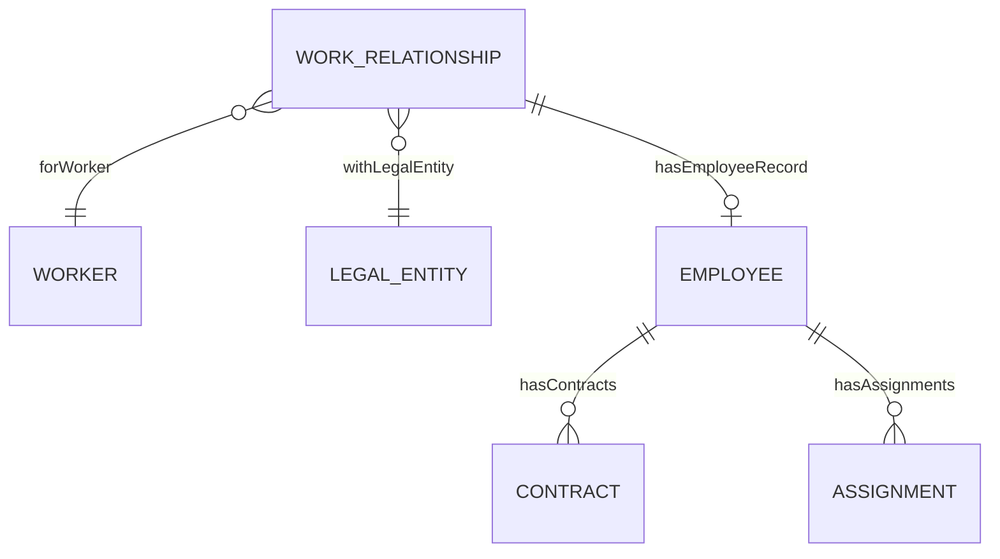

# WorkRelationship

## Overview

A **WorkRelationship** represents the **employment relationship type** between a [[Worker]] and a [[LegalEntity]]. This defines HOW the person is engaged with the organization.



---

## Relationship Type Mapping

### Complete Mapping của TẤT CẢ các loại mối quan hệ lao động

| Real-world Scenario | WorkRelationship Type | Employee Class | Notes |
|---------------------|----------------------|----------------|-------|
| **Nhân viên chính thức** | EMPLOYEE | PERMANENT | Có HĐLĐ không xác định thời hạn |
| **Nhân viên thử việc** | EMPLOYEE | PROBATION | Có HĐTT, thử việc 60 ngày |
| **Nhân viên có thời hạn** | EMPLOYEE | FIXED_TERM | HĐLĐ 12-36 tháng |
| **Nhân viên thời vụ** | EMPLOYEE | SEASONAL | HĐLĐ < 12 tháng |
| **Nhân viên bán thời gian** | EMPLOYEE | PART_TIME | < 8h/ngày hoặc < 40h/tuần |
| **Thực tập sinh có lương** | EMPLOYEE | INTERN | Có HĐTT/HĐLĐ, đóng BHXH |
| **Lao động thuê qua agency** | CONTINGENT | - | Thuộc payroll của agency |
| **Temp staff / Outsource** | CONTINGENT | - | Làm việc tại công ty nhưng HĐLĐ với bên thứ 3 |
| **Freelancer** | CONTRACTOR | - | Tự kinh doanh, HĐDV |
| **Consultant** | CONTRACTOR | - | Tư vấn độc lập, HĐDV |
| **Nhà thầu phụ** | CONTRACTOR | - | Công ty/cá nhân cung cấp dịch vụ |
| **Thực tập sinh không lương** | NON_WORKER | - | Thỏa thuận thực tập, không đóng BHXH |
| **Tình nguyện viên** | NON_WORKER | - | Không có nghĩa vụ pháp lý |
| **Thành viên HĐQT** | NON_WORKER | - | Không phải lao động |
| **Cố vấn cao cấp** | NON_WORKER | - | Nếu không có HĐDV/HĐLĐ |
| **Người phụ thuộc** | NON_WORKER | - | Tracked for benefits/tax |

### Type Definitions

| Type | Tên tiếng Việt | Đặc điểm pháp lý | BHXH | Payroll |
|------|----------------|------------------|------|---------|
| **EMPLOYEE** | Người lao động | Có HĐLĐ/HĐTT với công ty | ✅ Có | ✅ Internal |
| **CONTINGENT** | Lao động phụ thuộc | HĐLĐ với bên thứ 3 (agency) | ❌ External | ❌ External |
| **CONTRACTOR** | Nhà thầu độc lập | HĐDV, tự kinh doanh | ❌ Tự đóng | ❌ Invoice |
| **NON_WORKER** | Không lao động | Không quan hệ lao động | ❌ Không | ❌ Không |

---

## Status & Lifecycle

### Status Definitions

| Status | Ý nghĩa | endDate | Có thể reactivate? |
|--------|---------|---------|-------------------|
| **ACTIVE** | Đang có hiệu lực | null | N/A |
| **SUSPENDED** | Tạm ngưng (LOA, disciplinary) | **null** (chưa kết thúc) | ✅ Có |
| **TERMINATED** | Đã kết thúc | **Set = ngày kết thúc** | ❌ Không (tạo mới) |

### State Diagram với Examples



---

## Date Behavior Chi Tiết

### startDate vs endDate

| Trường | Mô tả | Set khi nào | Thay đổi? |
|--------|-------|-------------|-----------|
| **startDate** | Ngày bắt đầu quan hệ lao động | Create | ❌ Không thay đổi |
| **endDate** | Ngày kết thúc quan hệ | Terminate | ✅ Set khi terminate |

### Quy tắc Date theo Status

| Status | startDate | endDate |
|--------|-----------|---------|
| ACTIVE | ✅ Có | ❌ null |
| SUSPENDED | ✅ Có | ❌ null (chưa kết thúc) |
| TERMINATED | ✅ Có | ✅ Có (ngày kết thúc) |

---

## Business Scenarios Chi Tiết

### Scenario 1: Nhân viên mới vào làm
```
Action: create
startDate: 2024-01-15
endDate: null
status: ACTIVE
→ Tạo Employee record với employeeClassCode = PROBATION
```

### Scenario 2: Nhân viên nghỉ không lương dài hạn (Leave of Absence)
```
Action: suspend
Reason: LEAVE_OF_ABSENCE
startDate: 2024-01-15 (không đổi)
endDate: null (vẫn null - chưa kết thúc hẳn)
status: SUSPENDED
→ Employee status = SUSPENDED
→ Không tính payroll, nhưng vẫn giữ quan hệ
```

### Scenario 3: Nhân viên quay lại làm việc sau LOA
```
Action: reactivate
startDate: 2024-01-15 (không đổi - vẫn là ngày vào ban đầu)
endDate: null
status: ACTIVE
→ Employee status = ACTIVE
→ Resume payroll
```

### Scenario 4: Kỷ luật tạm đình chỉ công tác
```
Action: suspend
Reason: DISCIPLINARY
startDate: 2024-01-15 (không đổi)
endDate: null
status: SUSPENDED
→ Sau khi xử lý kỷ luật: reactivate hoặc terminate
```

### Scenario 5: Nhân viên nghỉ việc (Resignation)
```
Action: terminate
Reason: RESIGNATION
startDate: 2024-01-15 (không đổi)
endDate: 2024-12-31 (ngày làm việc cuối)
status: TERMINATED
→ Employee status = TERMINATED
→ Không thể reactivate (phải tạo WorkRelationship mới nếu rehire)
```

### Scenario 6: Hết hạn hợp đồng
```
Action: terminate
Reason: CONTRACT_EXPIRED
startDate: 2023-01-01
endDate: 2024-12-31 (ngày hết HĐ)
status: TERMINATED
→ Nếu ký lại HĐ: tạo WorkRelationship MỚI với startDate mới
```

### Scenario 7: Sa thải do vi phạm
```
Action: terminate
Reason: TERMINATION_FOR_CAUSE
startDate: 2024-01-15
endDate: 2024-06-15 (ngày quyết định)
status: TERMINATED
```

### Scenario 8: Rehire (tuyển lại cựu nhân viên)
```
Old WorkRelationship:
  startDate: 2020-01-01, endDate: 2023-12-31, status: TERMINATED

New WorkRelationship (tạo mới):
  startDate: 2025-01-15, endDate: null, status: ACTIVE
→ Worker có 2 WorkRelationship records (1 old terminated, 1 new active)
→ Seniority có thể tính cộng dồn nếu policy cho phép
```

---

## Khi nào KHÔNG thể Reactivate?

| Tình huống | Có thể Reactivate? | Lý do |
|------------|-------------------|-------|
| SUSPENDED (LOA) | ✅ Có | Quay lại làm việc |
| SUSPENDED (Disciplinary) | ✅ Có | Sau xử lý kỷ luật |
| TERMINATED | ❌ Không | Quan hệ đã kết thúc pháp lý |
| TERMINATED muốn quay lại | → Tạo mới | Rehire = WorkRelationship mới |

---

## Relationships Explained



### Relationship với Employee

- **EMPLOYEE type**: Bắt buộc có [[Employee]] record
- **Other types**: Không có Employee record (CONTINGENT, CONTRACTOR, NON_WORKER)

```
WorkRelationship (type=EMPLOYEE)
    │
    └── Employee (employeeCode, hireDate, classCode)
            │
            ├── Contract (HĐLĐ/HĐTT)
            └── Assignment (Position, BU)
```

---

## Business Context

### Key Stakeholders
- **HR Admin**: Tạo và quản lý relationships
- **Manager**: Request suspend/terminate
- **Payroll**: Xác định ai được trả lương
- **Legal**: Xác định đúng loại quan hệ (compliance)

### Quyết định phân loại quan trọng

| Câu hỏi | Nếu Có | Nếu Không |
|---------|--------|-----------|
| Có HĐLĐ/HĐTT với công ty này? | EMPLOYEE | Next question |
| Có HĐLĐ với agency/outsource? | CONTINGENT | Next question |
| Có HĐDV, tự kinh doanh? | CONTRACTOR | NON_WORKER |

### Vietnam Labor Law Considerations

- **EMPLOYEE**: Áp dụng Bộ luật Lao động 2019
- **CONTINGENT**: Công ty chịu trách nhiệm về an toàn lao động, không phải BHXH
- **CONTRACTOR**: Áp dụng Bộ luật Dân sự (HĐDV)
- **NON_WORKER**: Không áp dụng Luật Lao động

---

## Business Rules

### Data Integrity

#### One Per Type Per Entity
**Rule**: Worker chỉ có 1 active relationship mỗi type per legal entity.
**OK**: EMPLOYEE @ VNG + CONTRACTOR @ ZaloPay  
**NOT OK**: 2x EMPLOYEE @ VNG

#### Required Legal Entity
**Rule**: Legal entity bắt buộc.
**Reason**: Mọi quan hệ lao động đều với một pháp nhân cụ thể.

### Date Rules

#### startDate immutable
**Rule**: startDate không thay đổi sau khi tạo.
**Reason**: Đây là ngày bắt đầu chính thức, dùng tính seniority.

#### endDate only on terminate
**Rule**: endDate chỉ set khi status = TERMINATED.
**Reason**: SUSPENDED vẫn là active relationship (chưa kết thúc).

---

## Examples

### Example 1: Full-time Employee
```yaml
id: "wr-001"
workerId: "wrk-00042"
relationshipTypeCode: "EMPLOYEE"
legalEntityCode: "VNG_CORP"
startDate: "2023-01-15"
endDate: null
statusCode: "ACTIVE"
isPrimary: true
```

### Example 2: Suspended Employee (LOA)
```yaml
id: "wr-001"
workerId: "wrk-00042"
relationshipTypeCode: "EMPLOYEE"
legalEntityCode: "VNG_CORP"
startDate: "2023-01-15"
endDate: null              # vẫn null vì chưa terminate
statusCode: "SUSPENDED"
isPrimary: true
```

### Example 3: Terminated Employee
```yaml
id: "wr-001"
workerId: "wrk-00042"
relationshipTypeCode: "EMPLOYEE"
legalEntityCode: "VNG_CORP"
startDate: "2023-01-15"
endDate: "2024-12-31"      # set khi terminate
statusCode: "TERMINATED"
isPrimary: false           # không còn primary vì đã kết thúc
```

### Example 4: Contractor
```yaml
id: "wr-002"
workerId: "wrk-00100"
relationshipTypeCode: "CONTRACTOR"
legalEntityCode: "ZALOPAY"
startDate: "2024-06-01"
endDate: null
statusCode: "ACTIVE"
isPrimary: true
```

---

## Related Entities

| Entity | Relationship | Description |
|--------|--------------|-------------|
| [[Worker]] | forWorker | The person |
| [[LegalEntity]] | withLegalEntity | Employer |
| [[Employee]] | hasEmployeeRecord | Details (if EMPLOYEE type) |
