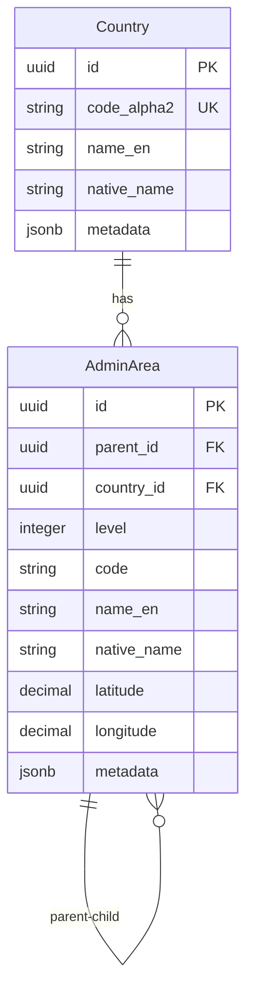

# Thuật ngữ Địa lý (Geographic Glossary)

## Tổng quan

Bảng thuật ngữ này định nghĩa các thực thể dữ liệu chủ địa lý được sử dụng trong toàn bộ hệ thống xTalent HCM. Các thực thể địa lý cung cấp nền tảng cho các hoạt động dựa trên vị trí, tuân thủ và báo cáo.

---

## Các thực thể (Entities)

### Country (Quốc gia)

**Định nghĩa:** Dữ liệu chủ quốc gia theo tiêu chuẩn ISO-3166 cung cấp mã và tên quốc gia chuẩn hóa cho các hoạt động toàn cầu.

**Mục đích:**
- Chuẩn hóa tham chiếu quốc gia trên toàn hệ thống
- Hỗ trợ hoạt động đa quốc gia
- Cho phép tuân thủ và quy định cụ thể theo quốc gia
- Cung cấp hỗ trợ bản địa hóa

**Các thuộc tính chính:**

| Thuộc tính | Kiểu dữ liệu | Bắt buộc | Mô tả |
|------------|--------------|----------|-------|
| `id` | UUID | Có | Định danh duy nhất |
| `code_alpha2` | string(2) | Có | Mã ISO-3166 alpha-2 (ví dụ: VN, US, FR) |
| `name_en` | string(255) | Không | Tên quốc gia bằng tiếng Anh |
| `native_name` | string(255) | Không | Tên quốc gia bằng ngôn ngữ bản địa |
| `metadata` | jsonb | Không | Dữ liệu bổ sung (alpha-3, mã số, khu vực, mã vùng điện thoại) |
| `effective_start_date` | date | Có | Ngày bắt đầu hiệu lực |
| `effective_end_date` | date | Không | Ngày kết thúc hiệu lực |
| `is_current_flag` | boolean | Có | Cờ chỉ định bản ghi hiện tại (mặc định: true) |

**Các trường Metadata:**
```json
{
  "code_alpha3": "VNM",
  "code_numeric": "704",
  "region": "Southeast Asia",
  "subregion": "South-Eastern Asia",
  "phone_prefix": "+84",
  "currency_code": "VND",
  "languages": ["vi", "en"],
  "capital": "Hanoi",
  "continent": "Asia"
}
```

**Mối quan hệ:**
- **Có nhiều** `AdminArea` (các khu vực hành chính trong quốc gia)

**Quy tắc nghiệp vụ:**
- Mã quốc gia (alpha-2) phải là duy nhất
- Phải tuân theo tiêu chuẩn ISO-3166
- Sử dụng SCD Type 2 để theo dõi lịch sử
- Metadata nên bao gồm mã alpha-3 và mã số để tương thích chéo hệ thống

**Ví dụ:**

```yaml
# Vietnam
id: country_vn_001
code_alpha2: VN
name_en: Vietnam
native_name: Việt Nam
metadata:
  code_alpha3: VNM
  code_numeric: "704"
  region: Southeast Asia
  phone_prefix: "+84"
  currency_code: VND

# United States
id: country_us_001
code_alpha2: US
name_en: United States
native_name: United States
metadata:
  code_alpha3: USA
  code_numeric: "840"
  region: Northern America
  phone_prefix: "+1"
  currency_code: USD
```

**Các trường hợp sử dụng:**
- Xác thực địa chỉ nhân viên
- Đăng ký pháp nhân
- Xác định quốc gia trả lương
- Xác định khu vực tài phán thuế
- Quản lý giấy phép lao động và thị thực
- Theo dõi phân công công tác toàn cầu

---

### AdminArea (Khu vực hành chính)

**Định nghĩa:** Các khu vực hành chính (tỉnh/bang, quận/huyện, phường/xã) trong các quốc gia. Hỗ trợ cấu trúc địa lý phân cấp lên đến 3 cấp.

**Mục đích:**
- Cung cấp dữ liệu vị trí địa lý chi tiết
- Hỗ trợ xác thực và chuẩn hóa địa chỉ
- Cho phép báo cáo và phân tích dựa trên vị trí
- Tạo điều kiện tuân thủ các quy định địa phương

**Các thuộc tính chính:**

| Thuộc tính | Kiểu dữ liệu | Bắt buộc | Mô tả |
|------------|--------------|----------|-------|
| `id` | UUID | Có | Định danh duy nhất |
| `parent_id` | UUID | Không | Khu vực hành chính cha (null cho cấp cao nhất) |
| `country_id` | UUID | Có | Tham chiếu quốc gia |
| `level` | integer | Không | Cấp độ phân cấp (1=Tỉnh/Bang, 2=Quận/Huyện, 3=Phường/Xã) |
| `code` | string(20) | Không | Mã khu vực hành chính |
| `name_en` | string(255) | Không | Tên tiếng Anh |
| `native_name` | string(255) | Không | Tên bằng ngôn ngữ địa phương |
| `latitude` | decimal(9,6) | Không | Vĩ độ địa lý |
| `longitude` | decimal(9,6) | Không | Kinh độ địa lý |
| `metadata` | jsonb | Không | Dữ liệu bổ sung (loại, dân số, mã bưu chính) |
| `effective_start_date` | date | Có | Ngày bắt đầu hiệu lực |
| `effective_end_date` | date | Không | Ngày kết thúc hiệu lực |
| `is_current_flag` | boolean | Có | Cờ chỉ định bản ghi hiện tại (mặc định: true) |

**Các cấp độ phân cấp:**

| Cấp độ | Mô tả | Ví dụ |
|--------|-------|-------|
| 1 | Tỉnh / Bang / Vùng | Hà Nội, California, Île-de-France |
| 2 | Quận / Huyện / Sở | Quận Ba Đình, Hạt Los Angeles |
| 3 | Phường / Xã / Thành phố | Phường Phúc Xá, Santa Monica |

**Các trường Metadata:**
```json
{
  "type": "PROVINCE",
  "population": 8246600,
  "area_km2": 3358.6,
  "postal_codes": ["100000", "100100"],
  "timezone": "Asia/Ho_Chi_Minh",
  "iso_code": "VN-HN",
  "official_website": "https://hanoi.gov.vn"
}
```

**Mối quan hệ:**
- **Thuộc về** `Country` (quốc gia cha)
- **Thuộc về** `AdminArea` (khu vực hành chính cha cho cấp 2-3)
- **Có nhiều** `AdminArea` (khu vực hành chính con)

**Quy tắc nghiệp vụ:**
- Sự kết hợp của `country_id`, `level`, và `code` phải là duy nhất
- Khu vực cấp 1 có `parent_id = null`
- Khu vực cấp 2 phải có cha cấp 1
- Khu vực cấp 3 phải có cha cấp 2
- Tối đa 3 cấp độ phân cấp
- Sử dụng SCD Type 2 để theo dõi lịch sử
- Vĩ độ/kinh độ là tùy chọn nhưng được khuyến nghị cho bản đồ

**Ràng buộc:**
```sql
UNIQUE (country_id, level, code)
CHECK (level >= 1 AND level <= 3)
CHECK (level = 1 IMPLIES parent_id IS NULL)
CHECK (level > 1 IMPLIES parent_id IS NOT NULL)
```

**Ví dụ:**

```yaml
# Cấp 1: Thành phố Hà Nội (Cấp Tỉnh)
id: admin_vn_hanoi
parent_id: null
country_id: country_vn_001
level: 1
code: HN
name_en: Hanoi
native_name: Hà Nội
latitude: 21.028511
longitude: 105.804817
metadata:
  type: PROVINCE
  population: 8246600
  iso_code: VN-HN

# Cấp 2: Quận Ba Đình
id: admin_vn_badinh
parent_id: admin_vn_hanoi
country_id: country_vn_001
level: 2
code: BD
name_en: Ba Dinh District
native_name: Quận Ba Đình
latitude: 21.034444
longitude: 105.819722
metadata:
  type: DISTRICT
  population: 221893

# Cấp 3: Phường Phúc Xá
id: admin_vn_phucxa
parent_id: admin_vn_badinh
country_id: country_vn_001
level: 3
code: PX
name_en: Phuc Xa Ward
native_name: Phường Phúc Xá
metadata:
  type: WARD
  population: 12500
```

**Các trường hợp sử dụng:**
- Quản lý địa chỉ nhân viên
- Định nghĩa địa điểm làm việc
- Theo dõi địa điểm cơ sở vật chất
- Xác định khu vực tài phán thuế
- Báo cáo và phân tích theo khu vực
- Geofencing cho chấm công
- Khớp địa điểm khảo sát lương
- Tuân thủ luật lao động địa phương

---

## Mối quan hệ



---

## Quản trị dữ liệu

### Quy tắc chất lượng dữ liệu

1. **Country:**
   - Phải sử dụng mã ISO-3166 chính thức
   - Tên tiếng Anh phải khớp với tiêu chuẩn ISO
   - Tên bản địa phải sử dụng cách viết chính thức của địa phương
   - Metadata phải đầy đủ cho các quốc gia đang hoạt động

2. **AdminArea:**
   - Mã phải tuân theo tiêu chuẩn cụ thể của quốc gia
   - Tên phải được xác minh với các nguồn chính thức
   - Phân cấp phải nhất quán về mặt logic
   - Tọa độ phải chính xác cho bản đồ

### Quyền sở hữu dữ liệu

- **Nhóm Dữ liệu Chủ (Master Data Team):** Duy trì dữ liệu quốc gia và khu vực hành chính
- **Vận hành Nhân sự (HR Operations):** Xác thực dữ liệu địa điểm cho nhân viên
- **Nhóm Tuân thủ (Compliance Team):** Đảm bảo đáp ứng các yêu cầu quy định

### Tần suất cập nhật

- **Country:** Hiếm khi cập nhật (chỉ khi có quốc gia mới hoặc thay đổi ISO)
- **AdminArea:** Cập nhật khi ranh giới hành chính thay đổi

---

## Điểm tích hợp

### Các mô-đun nội bộ

| Mô-đun | Sử dụng |
|--------|---------|
| **Core** | Địa chỉ pháp nhân, địa chỉ nhân viên, địa điểm cơ sở vật chất |
| **Employment** | Địa điểm làm việc của nhân viên, địa điểm phân công |
| **Payroll** | Khu vực tài phán thuế, quốc gia trả lương |
| **Total Rewards** | Địa điểm khảo sát lương, điều chỉnh chi phí sinh hoạt |
| **Time & Attendance** | Theo dõi địa điểm làm việc, geofencing |

### Các hệ thống bên ngoài

| Hệ thống | Mục đích |
|----------|----------|
| **Dịch vụ Xác thực Địa chỉ** | Xác thực và chuẩn hóa địa chỉ |
| **Dịch vụ Bản đồ** | Mã hóa địa lý, tính toán khoảng cách |
| **Hệ thống Thuế** | Xác định khu vực tài phán thuế |
| **Cơ sở dữ liệu Chính phủ** | Đồng bộ với các đơn vị hành chính chính thức |

---

## Các thực hành tốt nhất

### Triển khai

1. **Tải trước dữ liệu chuẩn:**
   - Nhập dữ liệu quốc gia ISO-3166
   - Tải các đơn vị hành chính cho các quốc gia đang hoạt động
   - Xác minh độ chính xác của dữ liệu trước khi vận hành

2. **Duy trì chất lượng dữ liệu:**
   - Kiểm toán thường xuyên so với các nguồn chính thức
   - Xác thực tọa độ về độ chính xác
   - Giữ metadata cập nhật

3. **Tối ưu hóa hiệu suất:**
   - Đánh chỉ mục trên `country_id`, `level`, `code`
   - Cache các địa điểm thường xuyên truy cập
   - Sử dụng materialized paths cho các truy vấn phân cấp

### Hướng dẫn sử dụng

1. **Nhập địa chỉ:**
   - Luôn sử dụng mã quốc gia chuẩn hóa
   - Xác thực khu vực hành chính theo phân cấp
   - Thu thập tọa độ khi có sẵn

2. **Báo cáo:**
   - Sử dụng phân cấp cho báo cáo tổng hợp
   - Tận dụng metadata cho phân tích phong phú
   - Xem xét sự khác biệt múi giờ cho các báo cáo toàn cầu

3. **Tuân thủ:**
   - Theo dõi thay đổi địa điểm để kiểm toán
   - Duy trì dữ liệu lịch sử theo SCD Type 2
   - Tài liệu hóa các quy định cụ thể theo địa điểm

---

## Lịch sử phiên bản

| Phiên bản | Ngày | Thay đổi |
|-----------|------|----------|
| 2.0 | 2025-12-01 | Cấu trúc metadata nâng cao, thêm tọa độ |
| 1.0 | 2025-11-01 | Ontology địa lý ban đầu |

---

## Tài liệu tham khảo

- **ISO 3166:** Tiêu chuẩn quốc tế cho mã quốc gia
- **Đơn vị hành chính:** Các nguồn chính thức cụ thể theo quốc gia
- **Tiêu chuẩn mã hóa địa lý:** Hệ tọa độ WGS84
