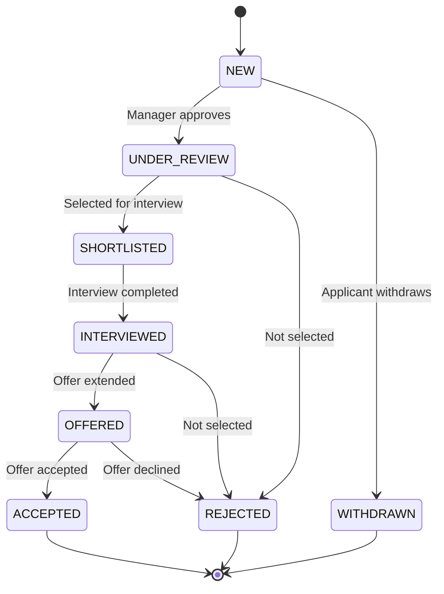

# Talent Market Glossary

## Overview

This glossary defines the internal talent marketplace entities used in the xTalent HCM system. The talent marketplace enables internal mobility, gig opportunities, and skills-based talent matching.

---

## Entities

### Opportunity

**Definition:** Internal opportunity posted for employees to apply, including full-time positions, project assignments, gigs, mentoring, and learning opportunities.

**Purpose:**
- Enable internal talent marketplace
- Promote internal mobility
- Support skills-based matching
- Facilitate project staffing
- Encourage knowledge sharing

**Key Attributes:**

| Attribute | Type | Required | Description |
|-----------|------|----------|-------------|
| `id` | UUID | Yes | Unique identifier |
| `code` | string(50) | Yes | Opportunity code |
| `title` | string(150) | Yes | Opportunity title |
| `opportunity_type` | enum | Yes | FULL_TIME, PROJECT, GIG, MENTORING, LEARNING, ROTATION |
| `job_id` | UUID | No | Job reference (for full-time) |
| `position_id` | UUID | No | Position reference (for full-time) |
| `business_unit_id` | UUID | Yes | Posting business unit |
| `location_id` | UUID | No | Work location |
| `hiring_manager_id` | UUID | Yes | Hiring manager/sponsor |
| `description` | text | Yes | Opportunity description |
| `responsibilities` | text | No | Key responsibilities |
| `requirements` | text | No | Required qualifications |
| `duration_months` | integer | No | Duration (for temporary opportunities) |
| `time_commitment_percent` | decimal(5,2) | No | Time commitment (0-100%) |
| `start_date` | date | No | Planned start date |
| `end_date` | date | No | Planned end date (for temporary) |
| `application_deadline` | date | No | Application deadline |
| `status_code` | enum | Yes | DRAFT, OPEN, CLOSED, FILLED, CANCELLED |
| `visibility` | enum | Yes | PUBLIC, RESTRICTED, PRIVATE |
| `metadata` | jsonb | No | Additional opportunity details |
| `created_at` | timestamp | Yes | Creation timestamp |
| `created_by` | UUID | Yes | Creator worker ID |
| `updated_at` | timestamp | No | Last update timestamp |
| `is_active` | boolean | Yes | Active status |

**Opportunity Types:**

| Type | Description | Duration | Commitment |
|------|-------------|----------|------------|
| `FULL_TIME` | Permanent position | Permanent | 100% |
| `PROJECT` | Project assignment | 3-12 months | 50-100% |
| `GIG` | Short-term task/project | Days to weeks | 10-50% |
| `MENTORING` | Mentoring opportunity | 3-6 months | 5-10% |
| `LEARNING` | Learning/training opportunity | Varies | 5-20% |
| `ROTATION` | Job rotation/shadowing | 1-6 months | 100% |
| `STRETCH` | Stretch assignment | 1-3 months | 20-50% |

**Status Codes:**

| Status | Description |
|--------|-------------|
| `DRAFT` | Being prepared, not visible |
| `OPEN` | Published and accepting applications |
| `CLOSED` | No longer accepting applications |
| `FILLED` | Position filled |
| `CANCELLED` | Opportunity cancelled |

**Visibility Levels:**

| Level | Description |
|-------|-------------|
| `PUBLIC` | Visible to all employees |
| `RESTRICTED` | Visible to specific groups/departments |
| `PRIVATE` | Visible only to invited employees |

**Metadata Structure:**
```json
{
  "required_skills": [
    {
      "skill_id": "skill_python",
      "proficiency_required": 4,
      "is_mandatory": true,
      "weight": 0.3
    },
    {
      "skill_id": "skill_leadership",
      "proficiency_required": 3,
      "is_mandatory": false,
      "weight": 0.2
    }
  ],
  "preferred_competencies": [
    {
      "competency_id": "comp_innovation",
      "level_required": 3
    }
  ],
  "eligibility": {
    "min_tenure_months": 12,
    "min_performance_rating": 3.0,
    "current_level_codes": ["SENIOR", "PRINCIPAL"],
    "excluded_departments": []
  },
  "compensation": {
    "salary_range_min": 50000000,
    "salary_range_max": 80000000,
    "currency_code": "VND",
    "additional_benefits": ["Stock options", "Performance bonus"]
  },
  "work_arrangement": {
    "work_model": "HYBRID",
    "remote_eligible": true,
    "travel_required": "Occasional"
  },
  "matching": {
    "auto_match_enabled": true,
    "match_threshold": 0.70,
    "notify_matched_employees": true
  },
  "approval": {
    "requires_manager_approval": true,
    "requires_hr_approval": false,
    "max_applications_per_employee": 3
  }
}
```

**Relationships:**
- **References** `Job` (for full-time opportunities)
- **References** `Position` (for full-time opportunities)
- **Belongs to** `Unit` (posting business unit)
- **References** `WorkLocation`
- **References** `Worker` (hiring manager)
- **Has many** `OpportunitySkill` (required skills)
- **Has many** `OpportunityApplication` (applications)

**Business Rules:**
- Opportunity code must be unique
- Application deadline must be after posting date
- Duration required for temporary opportunities
- Status transitions must follow workflow
- Visibility determines who can view/apply

**Examples:**

```yaml
# Full-Time Position
id: opp_senior_backend_001
code: OPP-2025-001
title: "Senior Backend Engineer"
opportunity_type: FULL_TIME
job_id: job_senior_backend
position_id: pos_backend_001
business_unit_id: bu_engineering
hiring_manager_id: worker_mgr_001
description: "Join our backend team to build scalable services..."
duration_months: null
time_commitment_percent: 100.0
application_deadline: "2025-12-31"
status_code: OPEN
visibility: PUBLIC

# Project Opportunity
id: opp_ai_project_001
code: OPP-PROJ-2025-015
title: "AI Platform Development - 6 Month Project"
opportunity_type: PROJECT
business_unit_id: bu_innovation
hiring_manager_id: worker_pm_001
description: "Help build our new AI platform..."
duration_months: 6
time_commitment_percent: 80.0
start_date: "2026-01-15"
end_date: "2026-07-15"
status_code: OPEN
visibility: RESTRICTED

# Gig Opportunity
id: opp_gig_ux_review
code: OPP-GIG-2025-042
title: "UX Review for Mobile App"
opportunity_type: GIG
business_unit_id: bu_product
hiring_manager_id: worker_prod_001
description: "Need UX expert to review our mobile app design..."
duration_months: null
time_commitment_percent: 10.0
application_deadline: "2025-12-10"
status_code: OPEN
visibility: PUBLIC
```

---

### OpportunitySkill

**Definition:** Skills required or preferred for an opportunity, with proficiency levels and weights for matching.

**Purpose:**
- Define skill requirements for opportunities
- Enable skills-based matching
- Support talent discovery
- Facilitate skill gap analysis

**Key Attributes:**

| Attribute | Type | Required | Description |
|-----------|------|----------|-------------|
| `id` | UUID | Yes | Unique identifier |
| `opportunity_id` | UUID | Yes | Opportunity reference |
| `skill_id` | UUID | Yes | Skill master reference |
| `proficiency_required` | integer | Yes | Required proficiency level (1-5) |
| `is_mandatory` | boolean | Yes | Mandatory skill flag |
| `weight` | decimal(5,2) | No | Matching weight (0.0-1.0) |
| `metadata` | jsonb | No | Additional skill details |

**Metadata Structure:**
```json
{
  "skill_context": "Backend development with Python and FastAPI",
  "assessment_method": "TECHNICAL_INTERVIEW",
  "certification_preferred": "AWS Certified Developer",
  "years_experience_preferred": 3,
  "can_train": false
}
```

**Relationships:**
- **Belongs to** `Opportunity`
- **References** `SkillMaster`

**Business Rules:**
- Combination of opportunity and skill must be unique
- Proficiency level must be 1-5
- Weight must be between 0.0 and 1.0
- Sum of weights should equal 1.0 for matching

**Example:**

```yaml
# Mandatory Skill
id: opp_skill_001
opportunity_id: opp_senior_backend_001
skill_id: skill_python
proficiency_required: 4
is_mandatory: true
weight: 0.30

# Preferred Skill
id: opp_skill_002
opportunity_id: opp_senior_backend_001
skill_id: skill_aws
proficiency_required: 3
is_mandatory: false
weight: 0.20
```

---

### OpportunityApplication

**Definition:** Employee application to an internal opportunity, tracking application status and evaluation.

**Purpose:**
- Track employee applications
- Manage application workflow
- Support selection process
- Enable application analytics

**Key Attributes:**

| Attribute | Type | Required | Description |
|-----------|------|----------|-------------|
| `id` | UUID | Yes | Unique identifier |
| `opportunity_id` | UUID | Yes | Opportunity reference |
| `worker_id` | UUID | Yes | Applicant worker ID |
| `application_date` | timestamp | Yes | Application submission date |
| `status_code` | enum | Yes | NEW, UNDER_REVIEW, SHORTLISTED, INTERVIEWED, OFFERED, ACCEPTED, REJECTED, WITHDRAWN |
| `match_score` | decimal(5,2) | No | System-calculated match score (0-100) |
| `cover_letter` | text | No | Cover letter/motivation |
| `resume_url` | string(255) | No | Resume/CV URL |
| `current_manager_id` | UUID | No | Current manager (for approval) |
| `manager_approval_status` | enum | No | PENDING, APPROVED, REJECTED |
| `manager_approval_date` | timestamp | No | Manager approval date |
| `manager_comments` | text | No | Manager comments |
| `hiring_manager_notes` | text | No | Hiring manager notes |
| `interview_date` | timestamp | No | Interview date |
| `interview_feedback` | text | No | Interview feedback |
| `offer_date` | timestamp | No | Offer date |
| `offer_accepted_date` | timestamp | No | Offer acceptance date |
| `rejection_reason` | text | No | Rejection reason |
| `metadata` | jsonb | No | Additional application data |
| `created_at` | timestamp | Yes | Creation timestamp |
| `updated_at` | timestamp | No | Last update timestamp |

**Application Status Workflow:**



**Metadata Structure:**
```json
{
  "skill_match_details": {
    "matched_skills": ["skill_python", "skill_aws"],
    "missing_skills": ["skill_kubernetes"],
    "skill_gap_score": 0.15
  },
  "assessment_results": {
    "technical_score": 85,
    "behavioral_score": 90,
    "overall_score": 87.5,
    "assessor_id": "worker_interviewer_001"
  },
  "timeline": {
    "applied": "2025-12-01T09:00:00Z",
    "manager_approved": "2025-12-02T14:30:00Z",
    "interviewed": "2025-12-05T10:00:00Z",
    "offered": "2025-12-06T16:00:00Z"
  },
  "transition_plan": {
    "notice_period_days": 30,
    "planned_start_date": "2026-01-15",
    "knowledge_transfer_required": true,
    "backfill_required": true
  }
}
```

**Relationships:**
- **Belongs to** `Opportunity`
- **Belongs to** `Worker` (applicant)
- **References** `Worker` (current manager)

**Business Rules:**
- One application per worker per opportunity
- Application date must be before deadline
- Manager approval required for internal moves
- Status transitions must follow workflow
- Match score calculated from skills

**Examples:**

```yaml
# New Application
id: app_001
opportunity_id: opp_senior_backend_001
worker_id: worker_emp_123
application_date: "2025-12-01T09:00:00Z"
status_code: NEW
match_score: 85.5
cover_letter: "I am excited to apply for this position..."
current_manager_id: worker_mgr_current
manager_approval_status: PENDING

# Accepted Application
id: app_002
opportunity_id: opp_ai_project_001
worker_id: worker_emp_456
application_date: "2025-11-20T14:30:00Z"
status_code: ACCEPTED
match_score: 92.0
manager_approval_status: APPROVED
manager_approval_date: "2025-11-21T10:00:00Z"
interview_date: "2025-11-25T15:00:00Z"
offer_date: "2025-11-26T16:00:00Z"
offer_accepted_date: "2025-11-27T09:00:00Z"
```

---

## Talent Matching Algorithm

### Skills-Based Matching

**Match Score Calculation:**

```
Match Score = Σ (Skill Weight × Skill Match Score)

Where:
- Skill Weight: Importance of skill (from OpportunitySkill.weight)
- Skill Match Score: 
  - 1.0 if worker proficiency >= required proficiency
  - 0.5 if worker proficiency = required - 1
  - 0.0 if worker proficiency < required - 1
```

**Example:**

```
Opportunity requires:
- Python (proficiency 4, weight 0.30, mandatory)
- AWS (proficiency 3, weight 0.20, optional)
- Leadership (proficiency 3, weight 0.20, optional)

Worker has:
- Python: 5 → Match: 1.0
- AWS: 3 → Match: 1.0
- Leadership: 2 → Match: 0.5

Match Score = (0.30 × 1.0) + (0.20 × 1.0) + (0.20 × 0.5) = 0.60 = 60%
```

### Additional Matching Factors

- **Eligibility:** Tenure, performance rating, current level
- **Availability:** Time commitment, start date
- **Location:** Work location preference
- **Career Goals:** Alignment with career interests
- **Manager Endorsement:** Manager recommendation

---

## Use Cases

### Internal Mobility
- Post open positions internally first
- Enable employees to discover opportunities
- Support career development
- Reduce external hiring costs

### Project Staffing
- Find talent for project assignments
- Enable cross-functional collaboration
- Support innovation initiatives
- Optimize resource utilization

### Gig Economy
- Enable micro-assignments
- Share expertise across teams
- Support knowledge transfer
- Encourage collaboration

### Mentoring & Learning
- Connect mentors and mentees
- Share knowledge and skills
- Support professional development
- Build learning culture

### Skills Development
- Identify skill gaps
- Provide development opportunities
- Track skill acquisition
- Support career progression

---

## Best Practices

### Opportunity Management

1. **Clear Descriptions:**
   - Write compelling opportunity descriptions
   - Define clear requirements
   - Set realistic expectations
   - Include growth opportunities

2. **Skills Definition:**
   - Use standardized skill taxonomy
   - Define proficiency levels clearly
   - Distinguish mandatory vs. preferred
   - Set appropriate weights

3. **Timely Processing:**
   - Review applications promptly
   - Provide feedback to applicants
   - Keep status updated
   - Close filled opportunities

### Application Management

1. **Manager Approval:**
   - Require manager approval for moves
   - Set approval SLAs
   - Provide approval guidelines
   - Support development conversations

2. **Fair Selection:**
   - Use consistent evaluation criteria
   - Document selection decisions
   - Provide feedback to all applicants
   - Support unsuccessful applicants

3. **Smooth Transitions:**
   - Plan transition timelines
   - Arrange knowledge transfer
   - Plan backfill if needed
   - Support both teams

---

## Integration Points

### Internal Modules

| Module | Usage |
|--------|-------|
| **Core** | Worker, Job, Position, Skills |
| **Talent Management** | Performance, Skills, Career goals |
| **Learning** | Skill development, Training |
| **Succession** | Talent pools, High potentials |

### External Systems

| System | Purpose |
|--------|---------|
| **Career Portal** | Opportunity discovery, Application |
| **Skills Platform** | Skill assessment, Matching |
| **Learning Management** | Development recommendations |
| **Communication** | Notifications, Alerts |

---

## Metrics & KPIs

### Marketplace Activity

- **Opportunities Posted:** Number of opportunities per month
- **Application Rate:** Applications per opportunity
- **Fill Rate:** % of opportunities filled
- **Time to Fill:** Days from posting to acceptance

### Internal Mobility

- **Internal Fill Rate:** % of positions filled internally
- **Mobility Rate:** % of employees moving internally per year
- **Cross-Functional Moves:** % of moves across functions
- **Retention Impact:** Retention rate of mobile employees

### Matching Effectiveness

- **Match Score Distribution:** Average match scores
- **Acceptance Rate:** % of offers accepted
- **Success Rate:** % of placements successful (after 6 months)
- **Skill Gap Closure:** % of skill gaps closed through moves

### Employee Engagement

- **Profile Completeness:** % of employees with complete profiles
- **Active Users:** % of employees browsing opportunities
- **Application Participation:** % of employees applying
- **Satisfaction:** Employee satisfaction with marketplace

---

## Version History

| Version | Date | Changes |
|---------|------|---------|
| 2.0 | 2025-12-01 | Enhanced matching algorithm, gig support |
| 1.0 | 2025-11-01 | Initial talent marketplace ontology |

---

## References

- **Internal Talent Marketplace:** Industry best practices
- **Skills-Based Hiring:** Modern talent acquisition approaches
- **Gig Economy:** Internal gig models and frameworks
