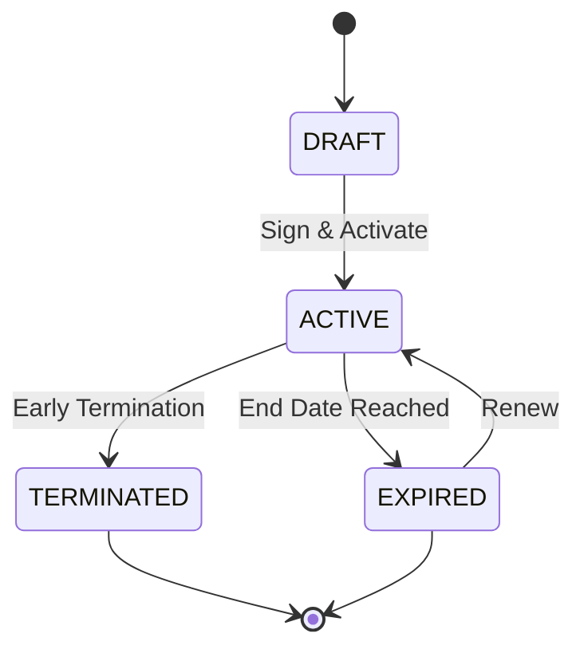
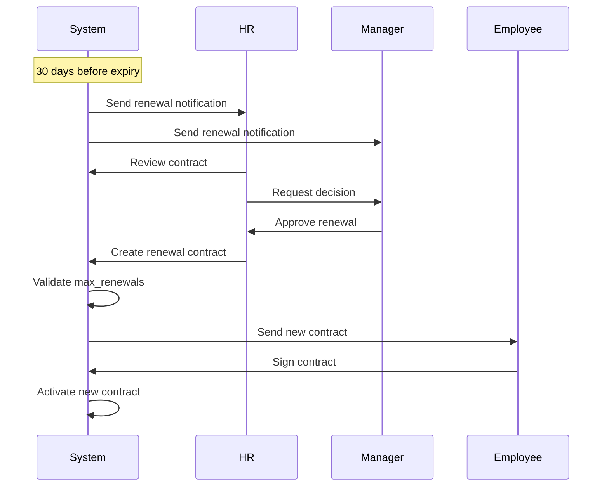

# Contract Management Guide

**Version**: 1.0  
**Last Updated**: 2025-12-10  
**Module**: Core (CO)  
**Purpose**: Comprehensive guide to employment contract management

---

## 📋 Overview

### Purpose

This guide provides a comprehensive overview of the Contract Management system in xTalent, covering:
- Contract lifecycle and state management
- Contract templates for standardization
- Contract hierarchy and relationships
- Renewal workflows and compliance
- Country-specific labor law requirements

### Key Concepts

**Contract**: An employment contract defines the terms and conditions of employment between the company and an employee. Contracts can be:
- **PERMANENT**: Indefinite duration, no end date
- **FIXED_TERM**: Specific duration with end date
- **PROBATION**: Trial period before permanent employment
- **SEASONAL**: Recurring seasonal work

**Contract Template**: Pre-configured contract terms that ensure standardization and compliance across the organization. Templates can be scoped by:
- Country (e.g., Vietnam-specific rules)
- Legal Entity (e.g., VNG Corporation)
- Business Unit (e.g., Technology Division)

**Contract Hierarchy**: Contracts can have parent-child relationships to track changes over time:
- **AMENDMENT**: Modify existing terms (e.g., salary increase)
- **ADDENDUM**: Add new clauses (e.g., add bonus structure)
- **RENEWAL**: Extend contract period (e.g., re-sign for another year)
- **SUPERSESSION**: Replace contract type (e.g., Probation → Permanent)

---

## 🔄 Contract Lifecycle

### Contract States



| State | Description | Allowed Transitions |
|-------|-------------|---------------------|
| **DRAFT** | Contract being prepared | → ACTIVE |
| **ACTIVE** | Contract in effect | → EXPIRED, TERMINATED |
| **EXPIRED** | Contract reached end date | → ACTIVE (via renewal) |
| **TERMINATED** | Contract terminated early | (final state) |

### State Transition Rules

**DRAFT → ACTIVE**:
- All required fields must be completed
- Contract must be signed by both parties
- Start date must be today or future
- Compliance validation must pass

**ACTIVE → EXPIRED**:
- Automatic transition when `end_date` is reached
- Only applies to FIXED_TERM contracts
- Triggers renewal notification workflow

**ACTIVE → TERMINATED**:
- Requires termination reason
- Notice period must be respected (or waived)
- All related assignments must be ended
- Employee status updated to TERMINATED

**EXPIRED → ACTIVE (Renewal)**:
- Creates new contract with `parent_relationship_type = RENEWAL`
- Validates against `max_renewals` limit
- New `start_date` = old `end_date` + 1 day

---

## 📝 Contract Templates

### Template Hierarchy

Templates are selected based on scope specificity (most specific wins):

```yaml
Priority Order:
  1. Business Unit Specific (business_unit_id matches)
  2. Legal Entity Specific (legal_entity_id matches)
  3. Country Specific (country_code matches)
  4. Global (no scope specified)
```

**Example**:
```yaml
# Vietnam Technology Division - Fixed Term 12 Months
template:
  code: VN_TECH_FIXED_12M
  name: "Vietnam Tech - Fixed Term 12 Months"
  contract_type: FIXED_TERM
  country_code: VN
  business_unit_id: tech-division-uuid
  
  # Duration rules
  default_duration_value: 12
  default_duration_unit: MONTH
  min_duration_value: 6
  max_duration_value: 36  # Vietnam labor law limit
  
  # Probation rules
  probation_required: true
  probation_duration_value: 60
  probation_duration_unit: DAY
  
  # Renewal rules
  allows_renewal: true
  max_renewals: 1  # Vietnam: max 2 consecutive fixed-term contracts
  renewal_notice_days: 30
  
  # Compliance
  legal_requirements:
    max_consecutive_fixed_terms: 2
    mandatory_clauses:
      - social_insurance
      - termination_notice
      - working_hours
```

### Template Selection Logic

When creating a contract:

1. **User selects template** (optional)
2. **System finds matching template** based on:
   - Employee's business unit
   - Employee's legal entity
   - Employee's work location country
3. **System inherits defaults**:
   - `duration_value` ← `template.default_duration_value`
   - `probation_end_date` ← calculated from `template.probation_duration`
   - `notice_period_days` ← `template.default_notice_period_days`
4. **User can override** (within template constraints):
   - Duration must be between `min_duration` and `max_duration`
   - If `probation_required = true`, probation cannot be skipped

### Template Override Example

```yaml
# Template defaults
template:
  default_duration_value: 12
  min_duration_value: 6
  max_duration_value: 36

# User creates contract
contract:
  template_id: VN_TECH_FIXED_12M
  duration_value: 18  # Override: 18 months instead of 12
  duration_unit: MONTH
  # ✅ Valid: 18 is between 6 and 36

# Invalid override
contract:
  template_id: VN_TECH_FIXED_12M
  duration_value: 48  # ❌ Invalid: exceeds max_duration (36)
  # Error: "Duration 48 MONTH exceeds maximum 36 MONTH"
```

---

## 🔗 Contract Hierarchy & Relationships

### Parent-Child Relationships

Contracts can reference a parent contract to track changes over time:

```yaml
parent_contract_id: uuid-of-parent
parent_relationship_type: AMENDMENT | ADDENDUM | RENEWAL | SUPERSESSION
```

### Relationship Types Explained

#### 1. AMENDMENT (Modify Existing Terms)

**Purpose**: Change existing contract terms without creating a new contract type.

**Common Use Cases**:
- Salary increase
- Working hours reduction
- Location change

**Example**:
```yaml
# Original Contract (Probation)
contract_1:
  id: contract-001
  contract_type: PROBATION
  start_date: 2025-01-01
  end_date: 2025-03-01
  base_salary: 50000000
  working_hours_per_week: 40

# Amendment (Salary Increase)
contract_2:
  id: contract-002
  parent_contract_id: contract-001
  parent_relationship_type: AMENDMENT
  effective_date: 2025-02-01
  base_salary: 60000000  # Changed
  working_hours_per_week: 40  # Unchanged
```

**Business Rules**:
- At least one field must differ from parent
- Cannot change `contract_type`
- Cannot change `employee_id`

---

#### 2. ADDENDUM (Add New Clauses)

**Purpose**: Add supplementary terms without modifying existing contract.

**Common Use Cases**:
- Add performance bonus structure
- Add stock option plan
- Add confidentiality clause

**Example**:
```yaml
# Original Contract
contract_1:
  id: contract-001
  contract_type: PERMANENT
  base_salary: 80000000

# Addendum (Add Bonus)
contract_2:
  id: contract-002
  parent_contract_id: contract-001
  parent_relationship_type: ADDENDUM
  effective_date: 2025-04-01
  metadata:
    addendum_type: PERFORMANCE_BONUS
    bonus_structure:
      target_percentage: 20
      max_percentage: 40
```

**Business Rules**:
- Adds to existing contract, doesn't replace
- Both parent and addendum remain active
- Multiple addendums allowed for same parent

---

#### 3. RENEWAL (Extend Contract Period)

**Purpose**: Extend a fixed-term contract for another period.

**Common Use Cases**:
- Renew 12-month contract for another 12 months
- Extend seasonal contract for next season

**Example**:
```yaml
# Original Contract (Fixed-Term)
contract_1:
  id: contract-001
  contract_type: FIXED_TERM
  start_date: 2025-01-01
  end_date: 2025-12-31
  duration_value: 12
  duration_unit: MONTH

# Renewal
contract_2:
  id: contract-002
  parent_contract_id: contract-001
  parent_relationship_type: RENEWAL
  contract_type: FIXED_TERM  # Same type
  start_date: 2026-01-01  # = parent.end_date + 1 day
  end_date: 2026-12-31
  duration_value: 12
  duration_unit: MONTH
```

**Business Rules**:
- Parent must be FIXED_TERM
- Parent must be expiring or expired
- `start_date` = `parent.end_date` + 1 day (or same day)
- Validates against `template.max_renewals`
- Renewal count is tracked

**Renewal Count Tracking**:
```yaml
# First contract
contract_1: renewal_count = 0

# First renewal
contract_2: renewal_count = 1

# Second renewal (if max_renewals = 2)
contract_3: renewal_count = 2

# Third renewal attempt
# ❌ Error: "Maximum 2 renewals exceeded"
```

---

#### 4. SUPERSESSION (Replace Contract Type)

**Purpose**: Replace a contract with a different contract type.

**Common Use Cases**:
- Probation → Permanent (most common)
- Fixed-Term → Permanent
- Probation → Fixed-Term (if probation failed but want to continue)

**Example**:
```yaml
# Original Contract (Probation)
contract_1:
  id: contract-001
  contract_type: PROBATION
  start_date: 2025-01-01
  end_date: 2025-03-01
  probation_end_date: 2025-03-01

# Supersession (Probation → Permanent)
contract_2:
  id: contract-002
  parent_contract_id: contract-001
  parent_relationship_type: SUPERSESSION
  contract_type: PERMANENT  # Different type
  start_date: 2025-03-01  # = parent.probation_end_date
  end_date: null  # Permanent has no end date
  base_salary: 65000000  # Often includes raise
```

**Business Rules**:
- `contract_type` must differ from parent
- Parent contract is ended when supersession becomes active
- Only one supersession allowed per parent

---

### Complete Contract History Example

**Scenario**: Employee journey from probation to permanent with amendments and renewal

```yaml
# 1. Initial Probation Contract (60 days)
contract_1:
  id: C001
  contract_type: PROBATION
  start_date: 2025-01-01
  end_date: 2025-03-01
  base_salary: 50000000
  parent_contract_id: null

# 2. Amendment during probation (salary increase)
contract_2:
  id: C002
  parent_contract_id: C001
  parent_relationship_type: AMENDMENT
  effective_date: 2025-02-01
  base_salary: 55000000

# 3. Supersession to Permanent (probation passed)
contract_3:
  id: C003
  parent_contract_id: C001
  parent_relationship_type: SUPERSESSION
  contract_type: PERMANENT
  start_date: 2025-03-01
  end_date: null
  base_salary: 60000000

# 4. Amendment (working hours reduction)
contract_4:
  id: C004
  parent_contract_id: C003
  parent_relationship_type: AMENDMENT
  effective_date: 2025-06-01
  working_hours_per_week: 35

# 5. Addendum (add bonus structure)
contract_5:
  id: C005
  parent_contract_id: C003
  parent_relationship_type: ADDENDUM
  effective_date: 2025-07-01
  metadata:
    bonus_structure: {...}
```

**Hierarchy Visualization**:
```
C001 (PROBATION)
├── C002 (AMENDMENT: salary)
├── C003 (SUPERSESSION → PERMANENT)
    ├── C004 (AMENDMENT: hours)
    └── C005 (ADDENDUM: bonus)
```

---

## 🔄 Renewal Management

### Renewal Workflow



### Renewal Notification Rules

Notifications are sent based on `template.renewal_notice_days`:

```yaml
template:
  renewal_notice_days: 30

# System behavior:
# - 30 days before end_date: Send notification to HR + Manager
# - 15 days before end_date: Send reminder
# - 7 days before end_date: Send urgent reminder
# - On end_date: Contract expires (status = EXPIRED)
```

### Renewal Validation

When creating a renewal, system validates:

1. **Parent is FIXED_TERM**:
   ```sql
   WHERE parent.contract_type_code = 'FIXED_TERM'
   ```

2. **Parent is expiring**:
   ```sql
   WHERE parent.end_date <= CURRENT_DATE + INTERVAL '90 days'
   ```

3. **Max renewals not exceeded**:
   ```sql
   WHERE renewal_count < template.max_renewals
   ```

4. **Start date follows parent**:
   ```sql
   WHERE new.start_date = parent.end_date + INTERVAL '1 day'
   OR new.start_date = parent.end_date  -- same day renewal
   ```

---

## ⚖️ Compliance & Labor Laws

### Vietnam Labor Law Requirements

**Fixed-Term Contracts**:
- **Maximum duration**: 36 months
- **Maximum consecutive renewals**: 1 (total 2 contracts)
- **After 2nd contract**: Must convert to permanent or terminate

**Probation Periods**:
- **Non-management**: Maximum 60 days
- **Management**: Maximum 180 days
- **Cannot extend** probation period

**Notice Periods**:
- **Probation**: 3 days
- **< 12 months contract**: 30 days
- **Permanent**: 45 days

**Template Example**:
```yaml
template:
  code: VN_FIXED_TERM
  country_code: VN
  max_duration_value: 36
  max_duration_unit: MONTH
  max_renewals: 1
  legal_requirements:
    max_consecutive_fixed_terms: 2
    probation_max_days_non_mgmt: 60
    probation_max_days_mgmt: 180
    notice_period_probation: 3
    notice_period_fixed: 30
    notice_period_permanent: 45
```

### Singapore Employment Act

**Fixed-Term Contracts**:
- **No maximum duration** (unlike Vietnam)
- **Renewals**: No legal limit

**Probation Periods**:
- **Typical**: 3-6 months
- **Maximum**: No legal limit, but 6 months is standard

**Notice Periods**:
- **< 26 weeks service**: 1 day
- **26 weeks - 2 years**: 1 week
- **2-5 years**: 2 weeks
- **> 5 years**: 4 weeks

**Template Example**:
```yaml
template:
  code: SG_FIXED_TERM
  country_code: SG
  max_duration_value: null  # No limit
  max_renewals: null  # No limit
  probation_duration_value: 90
  probation_duration_unit: DAY
  legal_requirements:
    notice_period_by_service:
      - service_weeks: 26
        notice_days: 1
      - service_weeks: 104  # 2 years
        notice_days: 7
      - service_weeks: 260  # 5 years
        notice_days: 14
```

### Compliance Validation

System validates contracts against labor laws:

```yaml
# Vietnam validation
IF country_code = 'VN' AND contract_type = 'FIXED_TERM':
  - duration_value <= 36 MONTH
  - renewal_count <= 1
  - probation_duration <= 60 DAY (non-mgmt) OR 180 DAY (mgmt)

# Singapore validation  
IF country_code = 'SG':
  - probation_duration <= 180 DAY (recommended)
  - notice_period based on service length
```

**Validation Errors**:
```
❌ "VN: Fixed-term contract cannot exceed 36 months"
❌ "VN: Maximum 1 renewal allowed for fixed-term"
❌ "VN: Probation period exceeds 60 days for non-management"
❌ "SG: Notice period must be at least 7 days for 2+ years service"
```

---

## 💡 Best Practices

### 1. When to Use Templates

**✅ DO use templates for**:
- Standard employment contracts
- Contracts that need compliance validation
- Contracts with country-specific rules
- High-volume hiring (e.g., seasonal workers)

**❌ DON'T use templates for**:
- Executive contracts (highly customized)
- One-off special arrangements
- Contracts with unique terms

### 2. Contract Amendment Patterns

**Salary Increase**:
```yaml
# Use AMENDMENT
parent_relationship_type: AMENDMENT
base_salary: 70000000  # Updated
# Keep other fields same
```

**Add Bonus Structure**:
```yaml
# Use ADDENDUM
parent_relationship_type: ADDENDUM
metadata:
  bonus_structure: {...}
```

**Probation → Permanent**:
```yaml
# Use SUPERSESSION
parent_relationship_type: SUPERSESSION
contract_type: PERMANENT
base_salary: 65000000  # Often includes raise
```

### 3. Renewal Best Practices

**Timing**:
- Start renewal process 60 days before expiry
- Complete renewal 30 days before expiry
- Avoid last-minute renewals

**Communication**:
- Notify employee early
- Get manager approval
- Document renewal decision

**Compliance**:
- Check renewal count
- Validate against max_renewals
- Consider converting to permanent if at limit

### 4. Template Design

**Scope Hierarchy**:
```
Global Template (fallback)
└── Country Template (VN, SG, US)
    └── Legal Entity Template (VNG Corp)
        └── Business Unit Template (Tech Division)
```

**Naming Convention**:
```
{COUNTRY}_{DEPARTMENT}_{TYPE}_{DURATION}
Examples:
- VN_TECH_FIXED_12M
- SG_SALES_PROBATION_3M
- US_EXEC_PERMANENT
```

---

## 🔍 Common Scenarios

### Scenario 1: New Hire with Probation

```yaml
# Step 1: Create probation contract
contract:
  template_id: VN_TECH_PROBATION_60D
  contract_type: PROBATION
  start_date: 2025-01-01
  duration_value: 60
  duration_unit: DAY
  end_date: 2025-03-01  # Auto-calculated
  probation_end_date: 2025-03-01
  base_salary: 50000000

# Step 2: After probation passes, supersede to permanent
contract_permanent:
  parent_contract_id: {probation_contract_id}
  parent_relationship_type: SUPERSESSION
  contract_type: PERMANENT
  start_date: 2025-03-01
  end_date: null
  base_salary: 60000000
```

### Scenario 2: Fixed-Term with Renewals

```yaml
# Year 1: Initial fixed-term
contract_1:
  template_id: VN_TECH_FIXED_12M
  contract_type: FIXED_TERM
  start_date: 2025-01-01
  end_date: 2025-12-31
  renewal_count: 0

# Year 2: First renewal (allowed)
contract_2:
  parent_contract_id: contract_1.id
  parent_relationship_type: RENEWAL
  start_date: 2026-01-01
  end_date: 2026-12-31
  renewal_count: 1

# Year 3: Second renewal attempt
# ❌ Error: "VN: Maximum 1 renewal allowed"
# ✅ Solution: Convert to permanent or terminate
contract_3:
  parent_contract_id: contract_1.id
  parent_relationship_type: SUPERSESSION
  contract_type: PERMANENT
  start_date: 2027-01-01
```

### Scenario 3: Mid-Contract Salary Adjustment

```yaml
# Original contract
contract_1:
  contract_type: PERMANENT
  start_date: 2025-01-01
  base_salary: 80000000

# Amendment for salary increase
contract_2:
  parent_contract_id: contract_1.id
  parent_relationship_type: AMENDMENT
  effective_date: 2025-07-01
  base_salary: 90000000
  # Other fields inherited from parent
```

---

## 📚 Related Documentation

- [Employment Lifecycle Guide](./01-employment-lifecycle-guide.md) - Overall employment process
- [Data Model Guide](./04-data-model-guide.md) - Contract entity relationships
- [Functional Requirements](../02-spec/01-functional-requirements.md) - FR-CONTRACT-001 to FR-CONTRACT-010
- [Business Rules](../02-spec/04-business-rules.md) - BR-CONTRACT-001 to BR-CONTRACT-010
- [API Specification](../02-spec/02-api-specification.md) - Contract API endpoints
- [Data Specification](../02-spec/03-data-specification.md) - Contract table schemas

---

## 🎯 Quick Reference

### Contract Types

| Type | End Date | Duration | Use Case |
|------|----------|----------|----------|
| PERMANENT | NULL | Indefinite | Standard employment |
| FIXED_TERM | Required | Specified | Project-based, temporary |
| PROBATION | Required | 60-180 days | Trial period |
| SEASONAL | Required | Recurring | Seasonal workers |

### Relationship Types

| Type | Purpose | Parent Type | Example |
|------|---------|-------------|---------|
| AMENDMENT | Modify terms | Any | Salary increase |
| ADDENDUM | Add clauses | Any | Add bonus |
| RENEWAL | Extend period | FIXED_TERM | Re-sign for another year |
| SUPERSESSION | Change type | Any | Probation → Permanent |

### Vietnam Limits

| Item | Limit |
|------|-------|
| Fixed-term max duration | 36 months |
| Fixed-term max renewals | 1 (total 2 contracts) |
| Probation (non-mgmt) | 60 days |
| Probation (mgmt) | 180 days |
| Notice period (probation) | 3 days |
| Notice period (fixed) | 30 days |
| Notice period (permanent) | 45 days |
