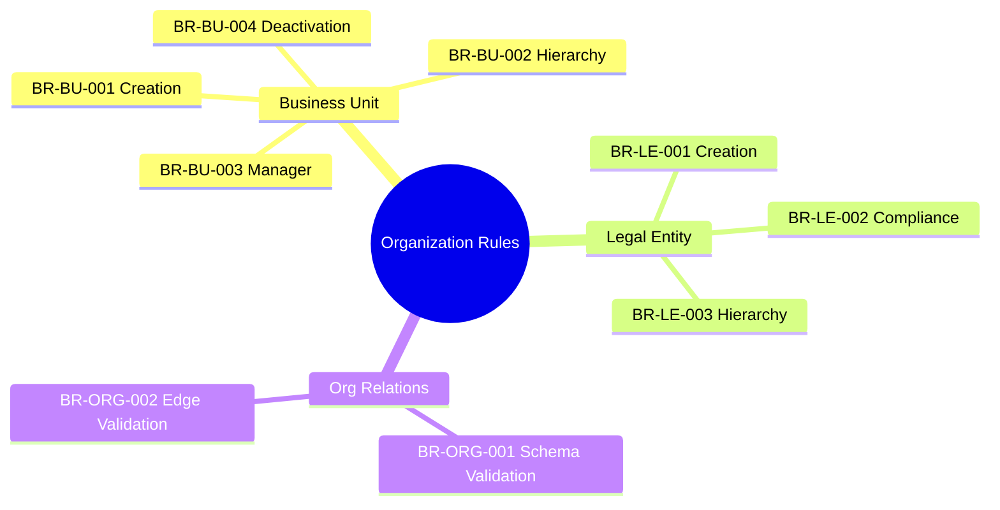
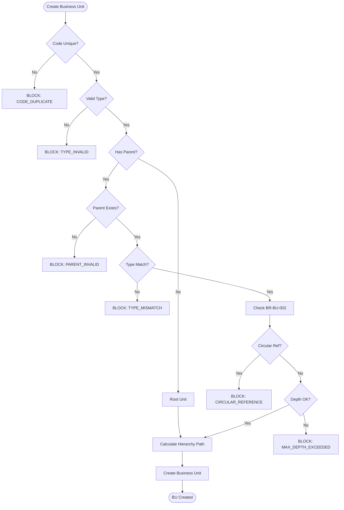
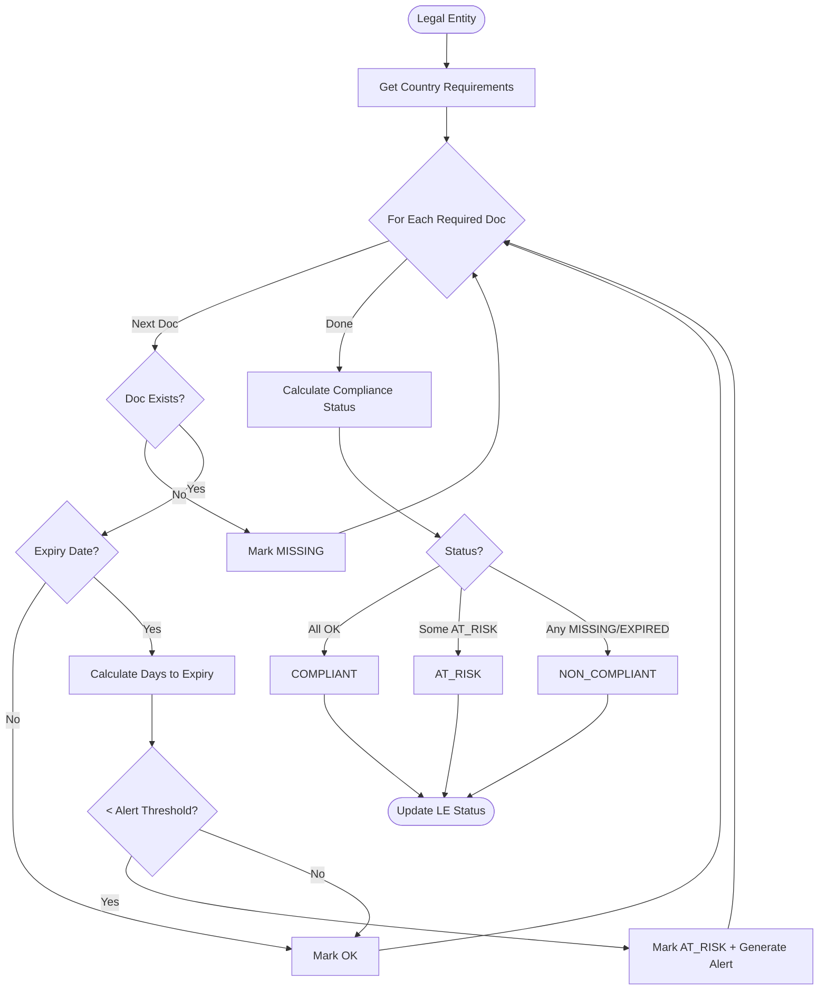
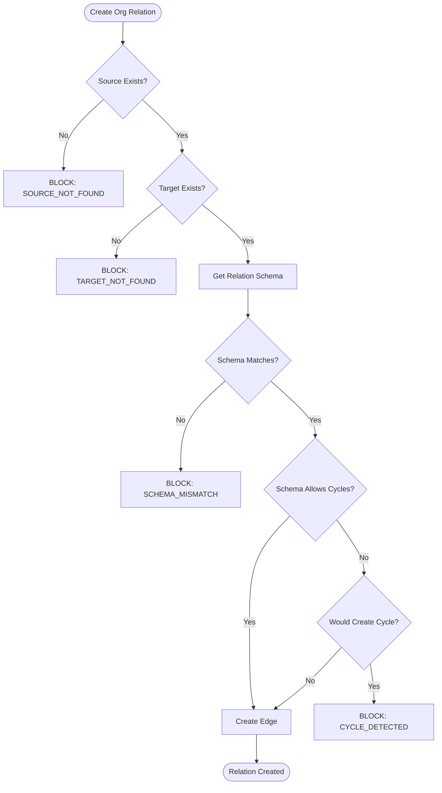

---
# === METADATA ===
id: BRS-CO-ORG
module: CORE
sub_module: ORGANIZATION_STRUCTURE
title: "Organization Structure Business Rules"
version: "1.0.0"
status: ACTIVE
owner: "Core Platform Team"
last_updated: "2026-01-08"
tags:
  - organization
  - business-unit
  - legal-entity
  - hierarchy
  - org-relation

# === BUSINESS RULES DATA ===
business_rules:
  - id: BR-BU-001
    title: "Business Unit Creation"
    description: "Business unit creation must validate code uniqueness, type, parent hierarchy, and effective dates."
    category: Validation
    severity: BLOCK
    priority: MUST
    status: ACTIVE
    condition: "bu_code IS UNIQUE AND unit_type IS VALID AND (parent_unit IS NULL OR parent_unit EXISTS AND is_valid_parent)"
    action: "Create business unit with calculated hierarchy path"
    exception: "Root unit has no parent (parent_unit_id = NULL)"
    related_entities:
      - "[[BusinessUnit]]"
      - "[[LegalEntity]]"
    enforced_by:
      - "FR-BU-001"

  - id: BR-BU-002
    title: "Business Unit Hierarchy"
    description: "Business unit hierarchy must prevent circular references and respect maximum depth constraints."
    category: Validation
    severity: BLOCK
    priority: MUST
    status: ACTIVE
    condition: "NOT circular_reference_exists AND hierarchy_depth <= max_depth AND hierarchy_path IS CALCULATED"
    action: "Calculate and store hierarchy path as /parent_id/current_id/"
    exception: "None"
    related_entities:
      - "[[BusinessUnit]]"
    enforced_by:
      - "FR-BU-015"

  - id: BR-BU-003
    title: "Business Unit Manager"
    description: "Business unit manager must be an active employee assigned to the unit or its parent."
    category: Validation
    severity: WARN
    priority: SHOULD
    status: ACTIVE
    condition: "manager IS ACTIVE_EMPLOYEE AND (manager.assignment.business_unit_id = bu_id OR manager.assignment.business_unit_id IN bu_parents)"
    action: "Assign manager to business unit"
    exception: "None"
    related_entities:
      - "[[BusinessUnit]]"
      - "[[Employee]]"
    enforced_by:
      - "FR-BU-010"

  - id: BR-BU-004
    title: "Business Unit Deactivation"
    description: "Business unit deactivation must validate no active assignments, no active child units, and proper closure process."
    category: Workflow
    severity: BLOCK
    priority: SHOULD
    status: ACTIVE
    condition: "active_assignments.count = 0 AND active_child_units.count = 0"
    action: "Set end_date and deactivate business unit"
    exception: "None"
    related_entities:
      - "[[BusinessUnit]]"
      - "[[Assignment]]"
    enforced_by:
      - "FR-BU-020"

  - id: BR-LE-001
    title: "Legal Entity Creation"
    description: "Legal entity creation must validate registration details, country requirements, and tax identification."
    category: Validation
    severity: BLOCK
    priority: MUST
    status: ACTIVE
    condition: "registration_number IS UNIQUE AND country_code IS VALID AND legal_form IS VALID_FOR_COUNTRY"
    action: "Create legal entity with compliance tracking"
    exception: "None"
    related_entities:
      - "[[LegalEntity]]"
      - "[[Country]]"
    enforced_by:
      - "FR-LE-001"

  - id: BR-LE-002
    title: "Legal Entity Compliance"
    description: "Legal entity must maintain required compliance documents and registrations per country regulations."
    category: Compliance
    severity: BLOCK
    priority: MUST
    status: ACTIVE
    condition: "required_documents_per_country ARE VALID AND NOT expired"
    action: "Track compliance status, generate alerts for expiring documents"
    exception: "None"
    related_entities:
      - "[[LegalEntity]]"
      - "[[Document]]"
    enforced_by:
      - "FR-LE-010"

  - id: BR-LE-003
    title: "Legal Entity Hierarchy"
    description: "Legal entity parent-child relationships must be valid and cannot create circular references."
    category: Validation
    severity: WARN
    priority: SHOULD
    status: ACTIVE
    condition: "parent_legal_entity EXISTS AND NOT circular_reference AND parent.country IN allowed_countries"
    action: "Establish parent-child relationship"
    exception: "Root legal entities have no parent"
    related_entities:
      - "[[LegalEntity]]"
    enforced_by:
      - "FR-LE-015"

  - id: BR-ORG-001
    title: "Org Relation Schema Validation"
    description: "Organization relationship schema must define valid source/target entity types and relationship types."
    category: Validation
    severity: BLOCK
    priority: SHOULD
    status: ACTIVE
    condition: "source_entity_type IS VALID AND target_entity_type IS VALID AND relation_type IS VALID"
    action: "Create or update org relation schema"
    exception: "None"
    related_entities:
      - "[[EntityProfile]]"
      - "[[OrgRelationEdge]]"
    enforced_by:
      - "FR-ORG-001"

  - id: BR-ORG-002
    title: "Org Relation Edge Validation"
    description: "Organization relationship edges must conform to defined schema and prevent invalid connections."
    category: Validation
    severity: BLOCK
    priority: SHOULD
    status: ACTIVE
    condition: "source_entity EXISTS AND target_entity EXISTS AND relation_type MATCHES schema AND NOT creates_cycle"
    action: "Create relationship edge between entities"
    exception: "None"
    related_entities:
      - "[[EntityProfile]]"
      - "[[OrgRelationEdge]]"
    enforced_by:
      - "FR-ORG-002"

# === RELATED ONTOLOGY ===
related_ontology:
  - "[[BusinessUnit]]"
  - "[[LegalEntity]]"
  - "[[EntityProfile]]"
  - "[[OrgRelationEdge]]"
  - "[[EntityRepresentative]]"
  - "[[Employee]]"
  - "[[Assignment]]"
  - "[[Country]]"
  - "[[Document]]"
---

# Business Rules: Organization Structure

> **Scope**: This BRS file defines all business rules for Organization Structure management in the Core module. These rules govern Business Units, Legal Entities, and generic Organization Relationships through the Entity Profile framework.

## 1. Rule Scope



## 2. Rule Catalog

| ID | Rule | Category | Severity | Status |
|----|------|----------|----------|--------|
| `[[BR-BU-001]]` | **Business Unit Creation**<br>Validate code uniqueness, type, parent hierarchy | Validation | BLOCK | ACTIVE |
| `[[BR-BU-002]]` | **Business Unit Hierarchy**<br>Prevent circular references, respect max depth | Validation | BLOCK | ACTIVE |
| `[[BR-BU-003]]` | **Business Unit Manager**<br>Manager must be active employee in unit or parent | Validation | WARN | ACTIVE |
| `[[BR-BU-004]]` | **Business Unit Deactivation**<br>No active assignments or child units allowed | Workflow | BLOCK | ACTIVE |
| `[[BR-LE-001]]` | **Legal Entity Creation**<br>Validate registration, country, tax ID | Validation | BLOCK | ACTIVE |
| `[[BR-LE-002]]` | **Legal Entity Compliance**<br>Track required documents per country regulations | Compliance | BLOCK | ACTIVE |
| `[[BR-LE-003]]` | **Legal Entity Hierarchy**<br>Valid parent-child, no circular references | Validation | WARN | ACTIVE |
| `[[BR-ORG-001]]` | **Org Relation Schema Validation**<br>Define valid entity types and relation types | Validation | BLOCK | ACTIVE |
| `[[BR-ORG-002]]` | **Org Relation Edge Validation**<br>Conform to schema, prevent cycles | Validation | BLOCK | ACTIVE |

## 3. Detailed Specifications

### [[BR-BU-001]] Business Unit Creation

*   **Priority**: MUST
*   **Description**: Business unit creation must validate code uniqueness, type validity, parent hierarchy, and effective dates.
*   **Condition**: 
    ```sql
    bu_code IS UNIQUE (case-insensitive)
    AND unit_type IN ('OPERATIONAL', 'SUPERVISORY')
    AND (parent_unit_id IS NULL OR 
         (parent_unit EXISTS AND parent_unit.is_active = true AND
          (unit_type = parent_unit.type OR parent_unit.type = 'OPERATIONAL')))
    AND effective_start_date IS NOT NULL
    ```
*   **Action**: Create business unit with auto-calculated hierarchy path
*   **Validation Rules**:
    1. Business unit code must be unique (case-insensitive)
    2. Business unit name is required (max 200 characters)
    3. Unit type required: OPERATIONAL or SUPERVISORY
    4. Parent unit must exist if specified
    5. Parent unit must be same type OR parent must be OPERATIONAL
    6. Effective start date is required
    7. Hierarchy path calculated automatically: /parent_id/current_id/
    8. Legal entity is required
*   **Exception**: Root unit has no parent (parent_unit_id = NULL allowed)
*   **Error Messages**:
    - `BU_CODE_DUPLICATE`: "Business unit code already exists"
    - `BU_PARENT_INVALID`: "Invalid parent unit"
    - `BU_TYPE_MISMATCH`: "Parent unit type mismatch - parent must be same type or OPERATIONAL"
    - `BU_LEGAL_ENTITY_REQUIRED`: "Legal entity is required"
*   **Related Entities**: `[[BusinessUnit]]`, `[[LegalEntity]]`
*   **Enforced By**: FR-BU-001

---

### [[BR-BU-002]] Business Unit Hierarchy

*   **Priority**: MUST
*   **Description**: Business unit hierarchy must prevent circular references, respect maximum depth, and maintain hierarchy paths.
*   **Condition**: 
    ```sql
    NOT EXISTS (SELECT 1 FROM bu_hierarchy WHERE descendant_id = :parent_id AND ancestor_id = :current_id)
    AND hierarchy_depth <= :max_depth (default 10)
    AND hierarchy_path IS CALCULATED AS CONCAT('/parent_path/', current_id, '/')
    ```
*   **Action**: Calculate and store hierarchy path, validate depth
*   **Validation Rules**:
    1. Circular references not allowed (unit cannot be ancestor of its own parent)
    2. Maximum hierarchy depth: 10 levels (configurable via system parameter)
    3. Hierarchy path format: `/parent_id/current_id/` or `/id1/id2/id3/` for deeper levels
    4. Hierarchy path is recalculated on parent change
    5. Child units inherit parent's legal entity by default
    6. Hierarchy table maintained for efficient queries
*   **Exception**: None
*   **Error Messages**:
    - `BU_CIRCULAR_REFERENCE`: "Circular reference detected - unit cannot be its own ancestor"
    - `BU_MAX_DEPTH_EXCEEDED`: "Maximum hierarchy depth of {max_depth} exceeded"
*   **Related Entities**: `[[BusinessUnit]]`
*   **Enforced By**: FR-BU-015

---

### [[BR-BU-003]] Business Unit Manager

*   **Priority**: SHOULD
*   **Description**: Business unit manager must be an active employee currently assigned to the unit or one of its parent units.
*   **Condition**: 
    ```sql
    manager IS ACTIVE_EMPLOYEE
    AND EXISTS (SELECT 1 FROM assignments 
                WHERE employee_id = :manager_id 
                AND (business_unit_id = :bu_id 
                     OR business_unit_id IN (SELECT ancestor_id FROM bu_hierarchy WHERE descendant_id = :bu_id))
                AND is_active = true)
    ```
*   **Action**: Assign manager to business unit with effective dates
*   **Validation Rules**:
    1. Manager must be an active employee
    2. Manager must have active assignment in the business unit OR parent unit
    3. Multiple managers allowed (primary vs secondary designation)
    4. Manager assignment has effective dates
    5. Manager changes create audit trail
*   **Exception**: None
*   **Error Messages**:
    - `BU_MANAGER_NOT_EMPLOYEE`: "Manager must be an active employee"
    - `BU_MANAGER_NOT_IN_UNIT`: "Manager must be assigned to this unit or parent unit"
*   **Related Entities**: `[[BusinessUnit]]`, `[[Employee]]`
*   **Enforced By**: FR-BU-010

---

### [[BR-BU-004]] Business Unit Deactivation

*   **Priority**: SHOULD
*   **Description**: Business unit deactivation must validate no active dependencies exist (assignments, child units).
*   **Condition**: 
    ```sql
    (SELECT COUNT(*) FROM assignments WHERE business_unit_id = :bu_id AND is_active = true) = 0
    AND (SELECT COUNT(*) FROM business_units WHERE parent_unit_id = :bu_id AND is_active = true) = 0
    ```
*   **Action**: Set end_date and deactivate business unit
*   **Validation Rules**:
    1. No active employee assignments to the business unit
    2. No active child business units
    3. End date must be >= effective start date
    4. Deactivated units preserved for historical reporting
    5. Closure reason may be required
*   **Exception**: None
*   **Error Messages**:
    - `BU_HAS_ACTIVE_ASSIGNMENTS`: "Cannot deactivate business unit with {count} active assignments"
    - `BU_HAS_ACTIVE_CHILDREN`: "Cannot deactivate business unit with {count} active child units"
    - `BU_END_DATE_INVALID`: "End date must be after effective start date"
*   **Related Entities**: `[[BusinessUnit]]`, `[[Assignment]]`
*   **Enforced By**: FR-BU-020

---

### [[BR-LE-001]] Legal Entity Creation

*   **Priority**: MUST
*   **Description**: Legal entity creation must validate registration details, country-specific requirements, and tax identification.
*   **Condition**: 
    ```sql
    registration_number IS UNIQUE
    AND country_code IS VALID
    AND legal_form IS VALID_FOR_COUNTRY(:country_code)
    AND (tax_id IS NULL OR tax_id MATCHES country_tax_format)
    ```
*   **Action**: Create legal entity with compliance tracking initialized
*   **Validation Rules**:
    1. Registration number must be unique globally
    2. Country code is required and must be valid
    3. Legal form must be valid for the specified country (e.g., LLC, GmbH, Plc)
    4. Tax ID format validated per country rules
    5. Legal name is required
    6. Incorporation date may be required
    7. Registered address required
*   **Exception**: None
*   **Error Messages**:
    - `LE_REGISTRATION_DUPLICATE`: "Registration number already exists"
    - `LE_COUNTRY_INVALID`: "Invalid country code"
    - `LE_LEGAL_FORM_INVALID`: "Legal form '{form}' not valid for country '{country}'"
    - `LE_TAX_ID_INVALID`: "Tax ID format invalid for country '{country}'"
*   **Related Entities**: `[[LegalEntity]]`, `[[Country]]`
*   **Enforced By**: FR-LE-001

---

### [[BR-LE-002]] Legal Entity Compliance

*   **Priority**: MUST
*   **Description**: Legal entity must maintain required compliance documents and registrations per country-specific regulations.
*   **Condition**: 
    ```sql
    FOR EACH required_document IN country_compliance_requirements
    WHERE required_document.country_code = legal_entity.country_code
    VALIDATE document EXISTS AND NOT expired
    ```
*   **Action**: Track compliance status, generate alerts for expiring documents
*   **Validation Rules**:
    1. Required documents based on country and legal form
    2. Document expiry dates tracked
    3. Alert thresholds: 90, 60, 30 days before expiry
    4. Compliance status calculated: COMPLIANT, AT_RISK, NON_COMPLIANT
    5. Annual report requirements tracked
    6. Beneficial ownership disclosure (GDPR/PDPA regions)
*   **Exception**: None
*   **Error Messages**:
    - `LE_DOCUMENT_MISSING`: "Required document '{type}' missing for legal entity"
    - `LE_DOCUMENT_EXPIRED`: "Document '{type}' has expired"
    - `LE_COMPLIANCE_AT_RISK`: "Compliance at risk - {count} documents expiring soon"
*   **Related Entities**: `[[LegalEntity]]`, `[[Document]]`
*   **Enforced By**: FR-LE-010

---

### [[BR-LE-003]] Legal Entity Hierarchy

*   **Priority**: SHOULD
*   **Description**: Legal entity parent-child relationships must be valid and cannot create circular references.
*   **Condition**: 
    ```sql
    (parent_legal_entity_id IS NULL OR
     (parent_legal_entity EXISTS AND
      NOT EXISTS (SELECT 1 FROM le_hierarchy WHERE descendant_id = :parent_id AND ancestor_id = :current_id) AND
      parent_legal_entity.country_code IN allowed_parent_countries))
    ```
*   **Action**: Establish parent-child relationship for corporate structure
*   **Validation Rules**:
    1. Parent legal entity must exist if specified
    2. Circular references not allowed
    3. Parent legal entity country must allow foreign subsidiaries (if different country)
    4. Ownership percentage may be tracked
    5. Hierarchical consolidation rules apply
*   **Exception**: Root legal entities (holding companies) have no parent
*   **Error Messages**:
    - `LE_PARENT_NOT_FOUND`: "Parent legal entity not found"
    - `LE_CIRCULAR_REFERENCE`: "Circular reference detected in legal entity hierarchy"
    - `LE_PARENT_COUNTRY_INVALID`: "Parent legal entity country does not allow foreign subsidiaries"
*   **Related Entities**: `[[LegalEntity]]`
*   **Enforced By**: FR-LE-015

---

### [[BR-ORG-001]] Org Relation Schema Validation

*   **Priority**: SHOULD
*   **Description**: Organization relationship schema must define valid source/target entity types and relationship types for flexible org modeling.
*   **Condition**: 
    ```sql
    source_entity_type IS VALID_ENTITY_TYPE
    AND target_entity_type IS VALID_ENTITY_TYPE
    AND relation_type IS VALID_RELATION_TYPE
    AND cardinality IN ('ONE_TO_ONE', 'ONE_TO_MANY', 'MANY_TO_MANY')
    ```
*   **Action**: Create or update org relation schema definition
*   **Validation Rules**:
    1. Source entity type must be valid (e.g., BUSINESS_UNIT, LEGAL_ENTITY, COST_CENTER)
    2. Target entity type must be valid
    3. Relation type must be defined (e.g., REPORTS_TO, OWNS, MANAGES)
    4. Cardinality must be specified
    5. Bidirectional flag indicates if reverse relation is automatic
*   **Exception**: None
*   **Error Messages**:
    - `ORG_SCHEMA_ENTITY_TYPE_INVALID`: "Entity type '{type}' is not valid"
    - `ORG_SCHEMA_RELATION_TYPE_INVALID`: "Relation type '{type}' is not defined"
*   **Related Entities**: `[[EntityProfile]]`, `[[OrgRelationEdge]]`
*   **Enforced By**: FR-ORG-001

---

### [[BR-ORG-002]] Org Relation Edge Validation

*   **Priority**: SHOULD
*   **Description**: Organization relationship edges must conform to defined schema and prevent invalid connections or cycles.
*   **Condition**: 
    ```sql
    source_entity EXISTS IN entity_profiles
    AND target_entity EXISTS IN entity_profiles
    AND relation_type MATCHES SCHEMA(source_entity.type, target_entity.type)
    AND (schema.allow_cycles = true OR NOT creates_cycle)
    ```
*   **Action**: Create relationship edge between entities according to schema
*   **Validation Rules**:
    1. Source entity must exist in entity_profiles
    2. Target entity must exist in entity_profiles
    3. Relation type must match schema for these entity types
    4. Cycle detection if schema.allow_cycles = false
    5. Effective dates tracked for temporal relationships
    6. Strength/weight can be assigned to edges
*   **Exception**: None
*   **Error Messages**:
    - `ORG_EDGE_SOURCE_NOT_FOUND`: "Source entity not found"
    - `ORG_EDGE_TARGET_NOT_FOUND`: "Target entity not found"
    - `ORG_EDGE_SCHEMA_MISMATCH`: "Relation '{type}' not allowed between '{source_type}' and '{target_type}'"
    - `ORG_EDGE_CYCLE_DETECTED`: "Relationship would create circular reference"
*   **Related Entities**: `[[EntityProfile]]`, `[[OrgRelationEdge]]`
*   **Enforced By**: FR-ORG-002

---

## 4. Decision Logic

### Business Unit Creation Flow



### Legal Entity Compliance Tracking Flow



### Org Relation Edge Validation Flow


