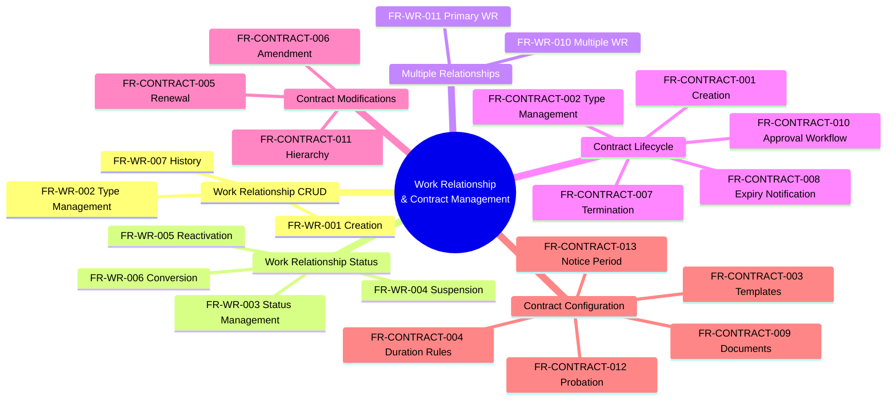

---
# === METADATA ===
id: FRS-CO-WORK-RELATIONSHIP
module: CO
sub_module: work-relationship
title: "Work Relationship & Contract Management Requirements"
version: "1.0.0"
status: DRAFT
owner: "Core HR Team"
last_updated: "2026-01-08"
tags:
  - work-relationship
  - contract
  - employment
  - legal-entity

# === REQUIREMENTS DATA ===
requirements:
  - id: FR-WR-001
    title: "Create Work Relationship"
    description: "System shall allow creating work relationships for workers to establish employment, contractor, or other relationship types with the organization."
    priority: MUST
    type: Functional
    risk: high
    status: Defined
    acceptance_criteria:
      - "Worker must exist before creating work relationship"
      - "Relationship type must be specified (EMPLOYEE, CONTRACTOR, CONSULTANT, INTERN)"
      - "Legal entity must be specified and valid"
      - "Start date is required"
      - "End date is optional but must be after start date if provided"
      - "System prevents overlapping EMPLOYEE relationships for same worker"
      - "Multiple CONTRACTOR relationships are allowed"
      - "Work relationship created with status = ACTIVE"
    dependencies:
      - "[[Worker]]"
      - "[[LegalEntity]]"
      - "[[WorkRelationship]]"
    implemented_by: []

  - id: FR-WR-002
    title: "Work Relationship Type Management"
    description: "System shall manage different types of work relationships with specific rules and constraints for each type."
    priority: MUST
    type: Configuration
    risk: medium
    status: Defined
    acceptance_criteria:
      - "System supports EMPLOYEE, CONTRACTOR, CONSULTANT, INTERN types"
      - "Each type has different validation rules"
      - "EMPLOYEE requires employee record creation"
      - "CONTRACTOR does not create employee record"
      - "Type cannot be changed after creation"
      - "Type determines benefits eligibility"
      - "Type determines payroll processing"
    dependencies:
      - "[[WorkRelationship]]"
      - "[[CodeList]]"
    implemented_by: []

  - id: FR-WR-003
    title: "Work Relationship Status Management"
    description: "System shall manage work relationship lifecycle status transitions with proper validations."
    priority: MUST
    type: Workflow
    risk: medium
    status: Defined
    acceptance_criteria:
      - "Valid statuses: ACTIVE, SUSPENDED, TERMINATED"
      - "New relationships start with ACTIVE status"
      - "ACTIVE → SUSPENDED transition allowed"
      - "SUSPENDED → ACTIVE transition allowed"
      - "Any status → TERMINATED transition allowed"
      - "TERMINATED is terminal state"
      - "Status change requires reason and effective date"
      - "Status change triggers notifications"
    dependencies:
      - "[[WorkRelationship]]"
    implemented_by: []

  - id: FR-WR-004
    title: "Work Relationship Suspension"
    description: "System shall allow temporarily suspending work relationships for leave, investigation, or administrative reasons."
    priority: SHOULD
    type: Workflow
    risk: medium
    status: Defined
    acceptance_criteria:
      - "Only ACTIVE relationships can be suspended"
      - "Suspension requires reason code"
      - "Suspension requires effective date"
      - "Suspension can have optional return date"
      - "Suspended relationships retain all history"
      - "Assignments can be suspended concurrently"
      - "Notifications sent to employee and manager"
    dependencies:
      - "[[WorkRelationship]]"
      - "[[Assignment]]"
    implemented_by: []

  - id: FR-WR-005
    title: "Work Relationship Reactivation"
    description: "System shall allow reactivating suspended work relationships when conditions are resolved."
    priority: SHOULD
    type: Workflow
    risk: medium
    status: Defined
    acceptance_criteria:
      - "Only SUSPENDED relationships can be reactivated"
      - "Reactivation requires effective date"
      - "Reactivation reason can be documented"
      - "Assignments can be reactivated"
      - "System validates no conflicts with other active relationships"
      - "Notifications sent to employee and manager"
    dependencies:
      - "[[WorkRelationship]]"
      - "[[Assignment]]"
    implemented_by: []

  - id: FR-WR-006
    title: "Work Relationship Conversion"
    description: "System shall support converting work relationship types when business needs change."
    priority: SHOULD
    type: Workflow
    risk: high
    status: Defined
    acceptance_criteria:
      - "Common conversion: CONTRACTOR → EMPLOYEE"
      - "Conversion creates new work relationship"
      - "Original relationship is terminated"
      - "New relationship references original"
      - "Conversion requires approval"
      - "Employee record created if converting to EMPLOYEE"
      - "History of both relationships is retained"
    dependencies:
      - "[[WorkRelationship]]"
      - "[[Employee]]"
    implemented_by: []

  - id: FR-WR-007
    title: "Work Relationship History"
    description: "System shall maintain complete history of all work relationship changes using SCD Type 2."
    priority: MUST
    type: Functional
    risk: low
    status: Defined
    acceptance_criteria:
      - "All changes create new version records"
      - "Previous versions retained with effective dates"
      - "Current version flagged with is_current_flag = true"
      - "History shows status changes over time"
      - "History shows field value changes"
      - "History can be queried by effective date"
      - "Timeline view available for users"
    dependencies:
      - "[[WorkRelationship]]"
    implemented_by: []

  - id: FR-WR-010
    title: "Multiple Work Relationships"
    description: "System shall allow workers to have multiple work relationships simultaneously for different roles or legal entities."
    priority: SHOULD
    type: Functional
    risk: medium
    status: Defined
    acceptance_criteria:
      - "Worker can have multiple CONTRACTOR relationships"
      - "Worker can have only one EMPLOYEE relationship at a time"
      - "Each relationship must be for different legal entity OR different role"
      - "System validates no conflicts in dates"
      - "Each relationship tracks FTE independently"
      - "Combined FTE across relationships can exceed 100%"
    dependencies:
      - "[[Worker]]"
      - "[[WorkRelationship]]"
    implemented_by: []

  - id: FR-WR-011
    title: "Primary Work Relationship"
    description: "System shall designate one work relationship as primary when multiple relationships exist."
    priority: MUST
    type: Validation
    risk: low
    status: Defined
    acceptance_criteria:
      - "One relationship must be marked as primary"
      - "Primary relationship used for default assignment"
      - "Primary relationship used for benefits"
      - "Primary relationship cannot be terminated if others exist"
      - "System prompts to change primary before termination"
      - "Primary flag is boolean field"
    dependencies:
      - "[[WorkRelationship]]"
    implemented_by: []

  - id: FR-CONTRACT-001
    title: "Create Employment Contract"
    description: "System shall allow creating employment contracts linked to work relationships with all required terms and conditions."
    priority: MUST
    type: Functional
    risk: high
    status: Defined
    acceptance_criteria:
      - "Contract linked to work relationship"
      - "Contract type specified (PERMANENT, FIXED_TERM, PROBATION, SEASONAL)"
      - "Start date and end date set"
      - "Duration can be specified (value + unit)"
      - "Contract can reference template for defaults"
      - "Probation period tracked"
      - "Notice period specified"
      - "Contract document can be attached"
      - "Contract history retained (SCD Type 2)"
    dependencies:
      - "[[WorkRelationship]]"
      - "[[Contract]]"
      - "[[ContractTemplate]]"
    implemented_by: []

  - id: FR-CONTRACT-002
    title: "Contract Type Management"
    description: "System shall manage different contract types with specific rules and compliance requirements."
    priority: MUST
    type: Configuration
    risk: medium
    status: Defined
    acceptance_criteria:
      - "Support PERMANENT, FIXED_TERM, PROBATION, SEASONAL types"
      - "PERMANENT has no end date"
      - "FIXED_TERM requires end date"
      - "PROBATION has probation_end_date"
      - "SEASONAL has recurring pattern"
      - "Each type has different renewal rules"
      - "Type determines legal compliance checks"
    dependencies:
      - "[[Contract]]"
      - "[[CodeList]]"
    implemented_by: []

  - id: FR-CONTRACT-003
    title: "Contract Template Management"
    description: "System shall provide contract templates with pre-configured terms for standardization and compliance."
    priority: SHOULD
    type: Configuration
    risk: medium
    status: Defined
    acceptance_criteria:
      - "Template has code and name"
      - "Template scoped by country, legal entity, or business unit"
      - "Template sets default duration (value + unit)"
      - "Template sets min/max duration limits"
      - "Template configures probation requirements"
      - "Template configures renewal rules"
      - "Template sets default notice period"
      - "Template can be activated/deactivated"
      - "Template history retained (SCD Type 2)"
    dependencies:
      - "[[ContractTemplate]]"
      - "[[LegalEntity]]"
    implemented_by: []

  - id: FR-CONTRACT-004
    title: "Contract Duration Rules"
    description: "System shall enforce contract duration rules based on type and country labor laws."
    priority: MUST
    type: Validation
    risk: high
    status: Defined
    acceptance_criteria:
      - "FIXED_TERM contracts validate max duration (e.g., 36 months in Vietnam)"
      - "Duration calculated from start_date and end_date"
      - "System validates against template min/max duration"
      - "Duration can be extended via amendment"
      - "System warns when approaching max duration"
      - "Compliance rules configured per country"
    dependencies:
      - "[[Contract]]"
      - "[[ContractTemplate]]"
    implemented_by: []

  - id: FR-CONTRACT-005
    title: "Contract Renewal"
    description: "System shall support contract renewal process with validation against template rules and compliance limits."
    priority: SHOULD
    type: Workflow
    risk: medium
    status: Defined
    acceptance_criteria:
      - "Renewal creates child contract with parent_relationship_type = RENEWAL"
      - "New start_date = old end_date + 1 day"
      - "New duration specified"
      - "System validates against max_renewals from template"
      - "Renewal count tracked"
      - "Notification sent before renewal deadline"
      - "Renewal requires approval if configured"
    dependencies:
      - "[[Contract]]"
      - "[[ContractTemplate]]"
    implemented_by: []

  - id: FR-CONTRACT-006
    title: "Contract Amendment"
    description: "System shall allow amending existing contracts to modify terms without creating entirely new contracts."
    priority: SHOULD
    type: Workflow
    risk: medium
    status: Defined
    acceptance_criteria:
      - "Amendment creates child contract with parent_relationship_type = AMENDMENT"
      - "Amendment can modify salary, working hours, other terms"
      - "Amendment has effective date"
      - "Original contract remains in history"
      - "Amendment linked to parent via parent_contract_id"
      - "Amendment requires approval"
    dependencies:
      - "[[Contract]]"
    implemented_by: []

  - id: FR-CONTRACT-007
    title: "Contract Termination"
    description: "System shall support contract termination as part of employment termination workflow."
    priority: MUST
    type: Workflow
    risk: high
    status: Defined
    acceptance_criteria:
      - "Contract termination linked to work relationship termination"
      - "Termination date specified"
      - "Termination reason required"
      - "Notice period validated"
      - "Contract status set to TERMINATED"
      - "Termination triggers final settlement calculation"
      - "Contract history retained"
    dependencies:
      - "[[Contract]]"
      - "[[WorkRelationship]]"
    implemented_by: []

  - id: FR-CONTRACT-008
    title: "Contract Expiry Notification"
    description: "System shall send automated notifications before contract expiry to enable timely renewal or termination decisions."
    priority: SHOULD
    type: Workflow
    risk: low
    status: Defined
    acceptance_criteria:
      - "Notifications sent based on template.renewal_notice_days"
      - "Notifications sent to HR Admin and Manager"
      - "Notification includes contract details and renewal options"
      - "Notification frequency configurable"
      - "Notification via email and in-app"
      - "Notification history logged"
    dependencies:
      - "[[Contract]]"
      - "[[ContractTemplate]]"
    implemented_by: []

  - id: FR-CONTRACT-009
    title: "Contract Document Attachment"
    description: "System shall allow attaching signed contract documents (PDF) to contract records for legal compliance."
    priority: SHOULD
    type: Functional
    risk: low
    status: Defined
    acceptance_criteria:
      - "Document linked via document_id"
      - "Document type = CONTRACT"
      - "Document stored securely"
      - "Document can be downloaded"
      - "Document access controlled (HR + Employee only)"
      - "Document version history tracked"
      - "Multiple documents can be attached (original + amendments)"
    dependencies:
      - "[[Contract]]"
      - "[[Document]]"
    implemented_by: []

  - id: FR-CONTRACT-010
    title: "Contract Approval Workflow"
    description: "System shall route contracts through approval workflow based on type and business rules."
    priority: SHOULD
    type: Workflow
    risk: medium
    status: Planned
    acceptance_criteria:
      - "Approval workflow triggered on contract creation"
      - "Approval rules configured per contract type"
      - "Approval chain based on amount or level"
      - "Approvers notified via email"
      - "Contract cannot be activated until approved"
      - "Approval history retained"
      - "Rejection triggers notification to creator"
    dependencies:
      - "[[Contract]]"
      - "[[WorkflowDefinition]]"
    implemented_by: []

  - id: FR-CONTRACT-011
    title: "Contract Hierarchy (Parent-Child)"
    description: "System shall support contract parent-child relationships for renewals, amendments, addenda, and supersessions."
    priority: COULD
    type: Functional
    risk: low
    status: Defined
    acceptance_criteria:
      - "Contract can have parent_contract_id"
      - "Parent relationship type: AMENDMENT, ADDENDUM, RENEWAL, SUPERSESSION"
      - "AMENDMENT modifies existing terms"
      - "ADDENDUM adds new clauses"
      - "RENEWAL extends contract period"
      - "SUPERSESSION replaces contract type (e.g., Probation → Permanent)"
      - "Contract hierarchy displayed in timeline"
      - "All versions retained"
    dependencies:
      - "[[Contract]]"
    implemented_by: []

  - id: FR-CONTRACT-012
    title: "Probation Period in Contract"
    description: "System shall track probation periods specified in employment contracts with notification and confirmation workflows."
    priority: MUST
    type: Functional
    risk: medium
    status: Defined
    acceptance_criteria:
      - "Probation period length specified in contract"
      - "Probation_end_date calculated from start_date"
      - "Notifications sent before probation end (e.g., 7 days)"
      - "Manager must confirm or terminate before probation_end_date"
      - "Probation can be extended once (max +90 days)"
      - "Probation confirmation converts to permanent"
      - "Probation history tracked"
    dependencies:
      - "[[Contract]]"
      - "[[Employee]]"
    implemented_by: []

  - id: FR-CONTRACT-013
    title: "Notice Period Configuration"
    description: "System shall enforce notice period requirements based on contract type, country laws, and tenure."
    priority: MUST
    type: Configuration
    risk: medium
    status: Defined
    acceptance_criteria:
      - "Notice period specified in contract (default from template)"
      - "Notice period varies by contract type"
      - "Notice period varies by tenure (e.g., 30 days for <1 year, 60 days for 1-5 years)"
      - "Notice period configurable per country"
      - "Emergency termination can bypass notice period with justification"
      - "System calculates last working day from notice date"
    dependencies:
      - "[[Contract]]"
      - "[[ContractTemplate]]"
    implemented_by: []

# === ONTOLOGY REFERENCES ===
related_ontology:
  - "[[WorkRelationship]]"
  - "[[Contract]]"
  - "[[ContractTemplate]]"
  - "[[Worker]]"
  - "[[LegalEntity]]"
  - "[[Employee]]"
  - "[[Assignment]]"
  - "[[Document]]"
  - "[[CodeList]]"
---

# Work Relationship & Contract Management Requirements

> **Module**: CO (Core HCM)  
> **Sub-module**: Work Relationship & Contract Management  
> **Total Requirements**: 24

---

## 1. Functional Scope



---

## 2. Requirement Catalog

### Work Relationship Management

| ID | Requirement Detail | Priority | Type |
|----|-------------------|----------|------|
| `[[FR-WR-001]]` | **Create Work Relationship**<br>Establish employment, contractor, or other relationship types | MUST | Functional |
| `[[FR-WR-002]]` | **Work Relationship Type Management**<br>Manage different relationship types with specific rules | MUST | Configuration |
| `[[FR-WR-003]]` | **Work Relationship Status Management**<br>Manage lifecycle status transitions | MUST | Workflow |
| `[[FR-WR-004]]` | **Work Relationship Suspension**<br>Temporarily suspend relationships | SHOULD | Workflow |
| `[[FR-WR-005]]` | **Work Relationship Reactivation**<br>Reactivate suspended relationships | SHOULD | Workflow |
| `[[FR-WR-006]]` | **Work Relationship Conversion**<br>Convert relationship types | SHOULD | Workflow |
| `[[FR-WR-007]]` | **Work Relationship History**<br>Maintain complete change history | MUST | Functional |
| `[[FR-WR-010]]` | **Multiple Work Relationships**<br>Allow multiple concurrent relationships | SHOULD | Functional |
| `[[FR-WR-011]]` | **Primary Work Relationship**<br>Designate primary relationship | MUST | Validation |

### Contract Management

| ID | Requirement Detail | Priority | Type |
|----|-------------------|----------|------|
| `[[FR-CONTRACT-001]]` | **Create Employment Contract**<br>Create contracts with all terms and conditions | MUST | Functional |
| `[[FR-CONTRACT-002]]` | **Contract Type Management**<br>Manage contract types with compliance rules | MUST | Configuration |
| `[[FR-CONTRACT-003]]` | **Contract Template Management**<br>Standardized contract templates | SHOULD | Configuration |
| `[[FR-CONTRACT-004]]` | **Contract Duration Rules**<br>Enforce duration rules and labor law compliance | MUST | Validation |
| `[[FR-CONTRACT-005]]` | **Contract Renewal**<br>Renew expiring contracts | SHOULD | Workflow |
| `[[FR-CONTRACT-006]]` | **Contract Amendment**<br>Amend existing contracts | SHOULD | Workflow |
| `[[FR-CONTRACT-007]]` | **Contract Termination**<br>Terminate contracts as part of employment termination | MUST | Workflow |
| `[[FR-CONTRACT-008]]` | **Contract Expiry Notification**<br>Automated expiry notifications | SHOULD | Workflow |
| `[[FR-CONTRACT-009]]` | **Contract Document Attachment**<br>Attach signed contract documents | SHOULD | Functional |
| `[[FR-CONTRACT-010]]` | **Contract Approval Workflow**<br>Route contracts through approval process | SHOULD | Workflow |
| `[[FR-CONTRACT-011]]` | **Contract Hierarchy**<br>Track contract parent-child relationships | COULD | Functional |
| `[[FR-CONTRACT-012]]` | **Probation Period in Contract**<br>Track probation with confirmation workflow | MUST | Functional |
| `[[FR-CONTRACT-013]]` | **Notice Period Configuration**<br>Enforce notice period requirements | MUST | Configuration |

---

## 3. Detailed Specifications

### Work Relationship Management

#### [[FR-WR-001]] Create Work Relationship

*   **Description**: System shall allow creating work relationships for workers to establish employment, contractor, or other relationship types with the organization.
*   **Acceptance Criteria**:
    *   Worker must exist before creating work relationship
    *   Relationship type must be specified (EMPLOYEE, CONTRACTOR, CONSULTANT, INTERN)
    *   Legal entity must be specified and valid
    *   Start date is required
    *   End date is optional but must be after start date if provided
    *   System prevents overlapping EMPLOYEE relationships for same worker
    *   Multiple CONTRACTOR relationships are allowed
    *   Work relationship created with status = ACTIVE
*   **Dependencies**:
    *   Depends on: `[[Worker]]`, `[[LegalEntity]]`
    *   Creates: `[[WorkRelationship]]`
    *   Enforces: `[[BR-WR-001]]`, `[[BR-WR-002]]`, `[[BR-WR-004]]`
*   **Mapped Features**: Implemented by: `[[FEAT-WR-001]]`

---

#### [[FR-WR-002]] Work Relationship Type Management

*   **Description**: System shall manage different types of work relationships with specific rules and constraints for each type.
*   **Acceptance Criteria**:
    *   System supports EMPLOYEE, CONTRACTOR, CONSULTANT, INTERN types
    *   Each type has different validation rules
    *   EMPLOYEE requires employee record creation
    *   CONTRACTOR does not create employee record
    *   Type cannot be changed after creation
    *   Type determines benefits eligibility
    *   Type determines payroll processing
*   **Dependencies**:
    *   Depends on: `[[WorkRelationship]]`, `[[CodeList]]`
    *   Enforces: `[[BR-WR-003]]`
*   **Mapped Features**: Implemented by: `[[FEAT-WR-002]]`

---

#### [[FR-WR-003]] Work Relationship Status Management

*   **Description**: System shall manage work relationship lifecycle status transitions with proper validations.
*   **Acceptance Criteria**:
    *   Valid statuses: ACTIVE, SUSPENDED, TERMINATED
    *   New relationships start with ACTIVE status
    *   ACTIVE → SUSPENDED transition allowed
    *   SUSPENDED → ACTIVE transition allowed
    *   Any status → TERMINATED transition allowed
    *   TERMINATED is terminal state
    *   Status change requires reason and effective date
    *   Status change triggers notifications
*   **Dependencies**:
    *   Depends on: `[[WorkRelationship]]`
    *   Enforces: `[[BR-WR-006]]`
*   **Mapped Features**: Implemented by: `[[FEAT-WR-003]]`

---

#### [[FR-WR-004]] Work Relationship Suspension

*   **Description**: System shall allow temporarily suspending work relationships for leave, investigation, or administrative reasons.
*   **Acceptance Criteria**:
    *   Only ACTIVE relationships can be suspended
    *   Suspension requires reason code
    *   Suspension requires effective date
    *   Suspension can have optional return date
    *   Suspended relationships retain all history
    *   Assignments can be suspended concurrently
    *   Notifications sent to employee and manager
*   **Dependencies**:
    *   Depends on: `[[WorkRelationship]]`, `[[Assignment]]`
    *   Enforces: `[[BR-WR-010]]`
*   **Mapped Features**: Implemented by: `[[FEAT-WR-004]]`

---

#### [[FR-WR-005]] Work Relationship Reactivation

*   **Description**: System shall allow reactivating suspended work relationships when conditions are resolved.
*   **Acceptance Criteria**:
    *   Only SUSPENDED relationships can be reactivated
    *   Reactivation requires effective date
    *   Reactivation reason can be documented
    *   Assignments can be reactivated
    *   System validates no conflicts with other active relationships
    *   Notifications sent to employee and manager
*   **Dependencies**:
    *   Depends on: `[[WorkRelationship]]`, `[[Assignment]]`
    *   Enforces: `[[ BR-WR-011]]`
*   **Mapped Features**: Implemented by: `[[FEAT-WR-005]]`

---

#### [[FR-WR-006]] Work Relationship Conversion

*   **Description**: System shall support converting work relationship types when business needs change.
*   **Acceptance Criteria**:
    *   Common conversion: CONTRACTOR → EMPLOYEE
    *   Conversion creates new work relationship
    *   Original relationship is terminated
    *   New relationship references original
    *   Conversion requires approval
    *   Employee record created if converting to EMPLOYEE
    *   History of both relationships is retained
*   **Dependencies**:
    *   Depends on: `[[WorkRelationship]]`, `[[Employee]]`
    *   Enforces: `[[BR-WR-012]]`
*   **Mapped Features**: Implemented by: `[[FEAT-WR-006]]`

---

#### [[FR-WR-007]] Work Relationship History

*   **Description**: System shall maintain complete history of all work relationship changes using SCD Type 2.
*   **Acceptance Criteria**:
    *   All changes create new version records
    *   Previous versions retained with effective dates
    *   Current version flagged with is_current_flag = true
    *   History shows status changes over time
    *   History shows field value changes
    *   History can be queried by effective date
    *   Timeline view available for users
*   **Dependencies**:
    *   Depends on: `[[WorkRelationship]]`
    *   Enforces: `[[BR-WR-015]]`
*   **Mapped Features**: Implemented by: `[[FEAT-WR-007]]`

---

#### [[FR-WR-010]] Multiple Work Relationships

*   **Description**: System shall allow workers to have multiple work relationships simultaneously for different roles or legal entities.
*   **Acceptance Criteria**:
    *   Worker can have multiple CONTRACTOR relationships
    *   Worker can have only one EMPLOYEE relationship at a time
    *   Each relationship must be for different legal entity OR different role
    *   System validates no conflicts in dates
    *   Each relationship tracks FTE independently
    *   Combined FTE across relationships can exceed 100%
*   **Dependencies**:
    *   Depends on: `[[Worker]]`, `[[WorkRelationship]]`
    *   Enforces: `[[BR-WR-005]]`
*   **Mapped Features**: Implemented by: `[[FEAT-WR-010]]`

---

#### [[FR-WR-011]] Primary Work Relationship

*   **Description**: System shall designate one work relationship as primary when multiple relationships exist.
*   **Acceptance Criteria**:
    *   One relationship must be marked as primary
    *   Primary relationship used for default assignment
    *   Primary relationship used for benefits
    *   Primary relationship cannot be terminated if others exist
    *   System prompts to change primary before termination
    *   Primary flag is boolean field
*   **Dependencies**:
    *   Depends on: `[[WorkRelationship]]`
    *   Enforces: `[[BR-WR-013]]`
*   **Mapped Features**: Implemented by: `[[FEAT-WR-011]]`

---

### Contract Management

#### [[FR-CONTRACT-001]] Create Employment Contract

*   **Description**: System shall allow creating employment contracts linked to work relationships with all required terms and conditions.
*   **Acceptance Criteria**:
    *   Contract linked to work relationship
    *   Contract type specified (PERMANENT, FIXED_TERM, PROBATION, SEASONAL)
    *   Start date and end date set
    *   Duration can be specified (value + unit)
    *   Contract can reference template for defaults
    *   Probation period tracked
    *   Notice period specified
    *   Contract document can be attached
    *   Contract history retained (SCD Type 2)
*   **Dependencies**:
    *   Depends on: `[[WorkRelationship]]`, `[[ContractTemplate]]`
    *   Creates: `[[Contract]]`
    *   Enforces: `[[BR-CONTRACT-001]]`, `[[BR-CONTRACT-002]]`
*   **Mapped Features**: Implemented by: `[[FEAT-CONTRACT-001]]`

---

#### [[FR-CONTRACT-002]] Contract Type Management

*   **Description**: System shall manage different contract types with specific rules and compliance requirements.
*   **Acceptance Criteria**:
    *   Support PERMANENT, FIXED_TERM, PROBATION, SEASONAL types
    *   PERMANENT has no end date
    *   FIXED_TERM requires end date
    *   PROBATION has probation_end_date
    *   SEASONAL has recurring pattern
    *   Each type has different renewal rules
    *   Type determines legal compliance checks
*   **Dependencies**:
    *   Depends on: `[[Contract]]`, `[[CodeList]]`
    *   Enforces: `[[BR-CONTRACT-003]]`
*   **Mapped Features**: Implemented by: `[[FEAT-CONTRACT-002]]`

---

#### [[FR-CONTRACT-003]] Contract Template Management

*   **Description**: System shall provide contract templates with pre-configured terms for standardization and compliance.
*   **Acceptance Criteria**:
    *   Template has code and name
    *   Template scoped by country, legal entity, or business unit
    *   Template sets default duration (value + unit)
    *   Template sets min/max duration limits
    *   Template configures probation requirements
    *   Template configures renewal rules
    *   Template sets default notice period
    *   Template can be activated/deactivated
    *   Template history retained (SCD Type 2)
*   **Dependencies**:
    *   Depends on: `[[LegalEntity]]`
    *   Creates: `[[ContractTemplate]]`
    *   Enforces: `[[BR-CONTRACT-TEMPLATE-001]]`
*   **Mapped Features**: Implemented by: `[[FEAT-CONTRACT-003]]`

---

#### [[FR-CONTRACT-004]] Contract Duration Rules

*   **Description**: System shall enforce contract duration rules based on type and country labor laws.
*   **Acceptance Criteria**:
    *   FIXED_TERM contracts validate max duration (e.g., 36 months in Vietnam)
    *   Duration calculated from start_date and end_date
    *   System validates against template min/max duration
    *   Duration can be extended via amendment
    *   System warns when approaching max duration
    *   Compliance rules configured per country
*   **Dependencies**:
    *   Depends on: `[[Contract]]`, `[[ContractTemplate]]`
    *   Enforces: `[[BR-CONTRACT-004]]`
*   **Mapped Features**: Implemented by: `[[FEAT-CONTRACT-004]]`

---

#### [[FR-CONTRACT-005]] Contract Renewal

*   **Description**: System shall support contract renewal process with validation against template rules and compliance limits.
*   **Acceptance Criteria**:
    *   Renewal creates child contract with parent_relationship_type = RENEWAL
    *   New start_date = old end_date + 1 day
    *   New duration specified
    *   System validates against max_renewals from template
    *   Renewal count tracked
    *   Notification sent before renewal deadline
    *   Renewal requires approval if configured
*   **Dependencies**:
    *   Depends on: `[[Contract]]`, `[[ContractTemplate]]`
    *   Enforces: `[[BR-CONTRACT-006]]`
*   **Mapped Features**: Implemented by: `[[FEAT-CONTRACT-005]]`

---

#### [[FR-CONTRACT-006]] Contract Amendment

*   **Description**: System shall allow amending existing contracts to modify terms without creating entirely new contracts.
*   **Acceptance Criteria**:
    *   Amendment creates child contract with parent_relationship_type = AMENDMENT
    *   Amendment can modify salary, working hours, other terms
    *   Amendment has effective date
    *   Original contract remains in history
    *   Amendment linked to parent via parent_contract_id
    *   Amendment requires approval
*   **Dependencies**:
    *   Depends on: `[[Contract]]`
    *   Enforces: `[[BR-CONTRACT-005]]`
*   **Mapped Features**: Implemented by: `[[FEAT-CONTRACT-006]]`

---

#### [[FR-CONTRACT-007]] Contract Termination

*   **Description**: System shall support contract termination as part of employment termination workflow.
*   **Acceptance Criteria**:
    *   Contract termination linked to work relationship termination
    *   Termination date specified
    *   Termination reason required
    *   Notice period validated
    *   Contract status set to TERMINATED
    *   Termination triggers final settlement calculation
    *   Contract history retained
*   **Dependencies**:
    *   Depends on: `[[Contract]]`, `[[WorkRelationship]]`
    *   Enforces: `[[BR-CONTRACT-010]]`
*   **Mapped Features**: Implemented by: `[[FEAT-CONTRACT-007]]`

---

#### [[FR-CONTRACT-008]] Contract Expiry Notification

*   **Description**: System shall send automated notifications before contract expiry to enable timely renewal or termination decisions.
*   **Acceptance Criteria**:
    *   Notifications sent based on template.renewal_notice_days
    *   Notifications sent to HR Admin and Manager
    *   Notification includes contract details and renewal options
    *   Notification frequency configurable
    *   Notification via email and in-app
    *   Notification history logged
*   **Dependencies**:
    *   Depends on: `[[Contract]]`, `[[ContractTemplate]]`
*   **Mapped Features**: Implemented by: `[[FEAT-CONTRACT-008]]`

---

#### [[FR-CONTRACT-009]] Contract Document Attachment

*   **Description**: System shall allow attaching signed contract documents (PDF) to contract records for legal compliance.
*   **Acceptance Criteria**:
    *   Document linked via document_id
    *   Document type = CONTRACT
    *   Document stored securely
    *   Document can be downloaded
    *   Document access controlled (HR + Employee only)
    *   Document version history tracked
    *   Multiple documents can be attached (original + amendments)
*   **Dependencies**:
    *   Depends on: `[[Contract]]`, `[[Document]]`
*   **Mapped Features**: Implemented by: `[[FEAT-CONTRACT-009]]`

---

#### [[FR-CONTRACT-010]] Contract Approval Workflow

*   **Description**: System shall route contracts through approval workflow based on type and business rules.
*   **Acceptance Criteria**:
    *   Approval workflow triggered on contract creation
    *   Approval rules configured per contract type
    *   Approval chain based on amount or level
    *   Approvers notified via email
    *   Contract cannot be activated until approved
    *   Approval history retained
    *   Rejection triggers notification to creator
*   **Dependencies**:
    *   Depends on: `[[Contract]]`, `[[WorkflowDefinition]]`
*   **Mapped Features**: Implemented by: `[[FEAT-CONTRACT-010]]`

---

#### [[FR-CONTRACT-011]] Contract Hierarchy (Parent-Child)

*   **Description**: System shall support contract parent-child relationships for renewals, amendments, addenda, and supersessions.
*   **Acceptance Criteria**:
    *   Contract can have parent_contract_id
    *   Parent relationship type: AMENDMENT, ADDENDUM, RENEWAL, SUPERSESSION
    *   AMENDMENT modifies existing terms
    *   ADDENDUM adds new clauses
    *   RENEWAL extends contract period
    *   SUPERSESSION replaces contract type (e.g., Probation → Permanent)
    *   Contract hierarchy displayed in timeline
    *   All versions retained
*   **Dependencies**:
    *   Depends on: `[[Contract]]`
    *   Enforces: `[[BR-CONTRACT-004]]`
*   **Mapped Features**: Implemented by: `[[FEAT-CONTRACT-011]]`

---

#### [[FR-CONTRACT-012]] Probation Period in Contract

*   **Description**: System shall track probation periods specified in employment contracts with notification and confirmation workflows.
*   **Acceptance Criteria**:
    *   Probation period length specified in contract
    *   Probation_end_date calculated from start_date
    *   Notifications sent before probation end (e.g., 7 days)
    *   Manager must confirm or terminate before probation_end_date
    *   Probation can be extended once (max +90 days)
    *   Probation confirmation converts to permanent
    *   Probation history tracked
*   **Dependencies**:
    *   Depends on: `[[Contract]]`, `[[Employee]]`
    *   Enforces: `[[BR-CONTRACT-011]]`
*   **Mapped Features**: Implemented by: `[[FEAT-CONTRACT-012]]`

---

#### [[FR-CONTRACT-013]] Notice Period Configuration

*   **Description**: System shall enforce notice period requirements based on contract type, country laws, and tenure.
*   **Acceptance Criteria**:
    *   Notice period specified in contract (default from template)
    *   Notice period varies by contract type
    *   Notice period varies by tenure (e.g., 30 days for <1 year, 60 days for 1-5 years)
    *   Notice period configurable per country
    *   Emergency termination can bypass notice period with justification
    *   System calculates last working day from notice date
*   **Dependencies**:
    *   Depends on: `[[Contract]]`, `[[ContractTemplate]]`
    *   Enforces: `[[BR-CONTRACT-012]]`
*   **Mapped Features**: Implemented by: `[[FEAT-CONTRACT-013]]`

---

## 4. Requirement Hierarchy

```mermaid
requirementDiagram

    %% === COLOR STYLING ===
    classDef epic fill:#e1bee7,stroke:#7b1fa2,stroke-width:2px
    classDef fr fill:#e3f2fd,stroke:#1565c0,stroke-width:2px
    classDef entity fill:#e8f5e9,stroke:#2e7d32,stroke-width:2px

    %% === MAIN CAPABILITY ===
    requirement WorkRelationshipManagement {
        id: FRS_CO_WR
        text: Work Relationship & Contract Management
        risk: high
        verifymethod: demonstration
    }:::epic

    %% === WORK RELATIONSHIP FRs ===
    functionalRequirement CreateWR {
        id: FR_WR_001
        text: Create Work Relationship
        risk: high
        verifymethod: test
    }:::fr

    functionalRequirement WRStatus {
        id: FR_WR_003
        text: Status Management
        risk: medium
        verifymethod: test
    }:::fr

    functionalRequirement WRHistory {
        id: FR_WR_007
        text: Work Relationship History
        risk: low
        verifymethod: test
    }:::fr

    functionalRequirement MultipleWR {
        id: FR_WR_010
        text: Multiple Work Relationships
        risk: medium
        verifymethod: test
    }:::fr

    %% === CONTRACT FRs ===
    functionalRequirement CreateContract {
        id: FR_CONTRACT_001
        text: Create Employment Contract
        risk: high
        verifymethod: test
    }:::fr

    functionalRequirement ContractTemplate {
        id: FR_CONTRACT_003
        text: Contract Templates
        risk: medium
        verifymethod: test
    }:::fr

    functionalRequirement ContractRenewal {
        id: FR_CONTRACT_005
        text: Contract Renewal
        risk: medium
        verifymethod: test
    }:::fr

    functionalRequirement ContractTermination {
        id: FR_CONTRACT_007
        text: Contract Termination
        risk: high
        verifymethod: test
    }:::fr

    %% === ENTITIES (Ontology) ===
    element WorkRelationship {
        type: Entity
        docref: work-relationship.onto.md
    }:::entity

    element Contract {
        type: Entity
        docref: contract.onto.md
    }:::entity

    element ContractTemplate {
        type: Entity
        docref: contract-template.onto.md
    }:::entity

    element Worker {
        type: Entity
        docref: worker.onto.md
    }:::entity

    element LegalEntity {
        type: Entity
        docref: legal-entity.onto.md
    }:::entity

    %% === RELATIONSHIPS ===
    WorkRelationshipManagement - contains -> CreateWR
    WorkRelationshipManagement - contains -> WRStatus
    WorkRelationshipManagement - contains -> WRHistory
    WorkRelationshipManagement - contains -> MultipleWR
    WorkRelationshipManagement - contains -> CreateContract
    WorkRelationshipManagement - contains -> ContractTemplate
    WorkRelationshipManagement - contains -> ContractRenewal
    WorkRelationshipManagement - contains -> ContractTermination

    CreateWR - traces -> WorkRelationship
    CreateWR - traces -> Worker
    CreateWR - traces -> LegalEntity
    WRStatus - traces -> WorkRelationship
    WRHistory - traces -> WorkRelationship
    MultipleWR - traces -> WorkRelationship
    CreateContract - traces -> Contract
    CreateContract - traces -> WorkRelationship
    ContractTemplate - traces -> ContractTemplate
    ContractRenewal - traces -> Contract
    ContractTermination - traces -> Contract
```

---

## 5. Summary

This FRS document defines **24 functional requirements** for Work Relationship & Contract Management:

- **9 Work Relationship Requirements**: Creation, type management, status lifecycle, suspension/reactivation, conversion, history, multiple relationships
- **13 Contract Requirements**: Creation, types, templates, duration rules, renewal/amendment, termination, notifications, documents, approval workflow, probation, notice period

All requirements support comprehensive employment relationship management with strong compliance controls.
