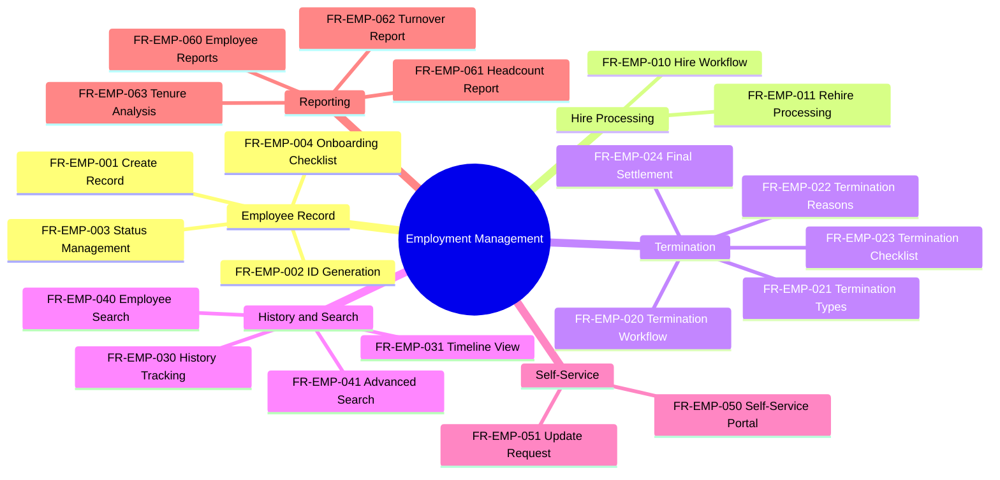

---
# === METADATA ===
id: FRS-CO-EMP
module: CORE
sub_module: EMPLOYMENT
title: "Employment Management Requirements"
version: "1.0.0"
status: DRAFT
owner: "Core HR Team"
last_updated: "2026-01-08"
tags:
  - employment
  - employee
  - hire
  - termination
  - onboarding
  - offboarding

# === REQUIREMENTS DATA ===
requirements:
  # Employee Record (4 FRs)
  - id: FR-EMP-001
    title: "Create Employee Record"
    description: "System must create employee records linked to worker and work relationship."
    priority: MUST
    type: Functional
    risk: high
    status: TODO
    acceptance_criteria:
      - "Worker record must exist before creating employee"
      - "Work relationship linked to employee record"
      - "Employee ID auto-generated sequentially"
      - "Hire date is required"
      - "Employee type (REGULAR, CONTRACT, INTERN) captured"
    dependencies:
      - "[[Employee]]"
      - "[[Worker]]"
      - "[[WorkRelationship]]"
    implemented_by: []

  - id: FR-EMP-002
    title: "Employee ID Generation"
    description: "System must auto-generate unique, sequential employee IDs."
    priority: MUST
    type: Functional
    risk: high
    status: TODO
    acceptance_criteria:
      - "Employee ID format: EMP-{NNNNNN} (6 digits, zero-padded)"
      - "IDs generated sequentially globally"
      - "IDs are immutable once assigned"
      - "No gaps in sequence"
    dependencies:
      - "[[Employee]]"
    implemented_by: []

  - id: FR-EMP-003
    title: "Employee Status Management"
    description: "System must manage employee lifecycle status transitions."
    priority: MUST
    type: Workflow
    risk: high
    status: TODO
    acceptance_criteria:
      - "Status values: ACTIVE, ON_LEAVE, SUSPENDED, TERMINATED"
      - "Status transitions validated (e.g., cannot terminate from ON_LEAVE directly)"
      - "Effective date required for status changes"
      - "Status history maintained"
    dependencies:
      - "[[Employee]]"
    implemented_by: []

  - id: FR-EMP-004
    title: "Employee Onboarding Checklist"
    description: "System should support configurable onboarding checklists."
    priority: SHOULD
    type: Workflow
    risk: medium
    status: TODO
    acceptance_criteria:
      - "Checklist templates configurable per employee type"
      - "Tasks assigned to HR, manager, or employee"
      - "Task completion tracked with dates"
      - "Onboarding progress visible"
    dependencies:
      - "[[Employee]]"
    implemented_by: []

  # Hire Processing (2 FRs)
  - id: FR-EMP-010
    title: "Employee Hire Processing"
    description: "System must support complete hire workflow from offer acceptance to first day."
    priority: MUST
    type: Workflow
    risk: high
    status: TODO
    acceptance_criteria:
      - "Hire creates employee record, work relationship, and assignment"
      - "Hire date validated (cannot be future date more than 90 days)"
      - "Worker profile must exist or be created"
      - "Contract created if applicable"
      - "Onboarding checklist triggered"
    dependencies:
      - "[[Employee]]"
      - "[[Worker]]"
      - "[[WorkRelationship]]"
      - "[[Assignment]]"
    implemented_by: []

  - id: FR-EMP-011
    title: "Employee Rehire Processing"
    description: "System should support rehire workflow for returning employees."
    priority: SHOULD
    type: Workflow
    risk: medium
    status: TODO
    acceptance_criteria:
      - "Previous employee record linked to new employment"
      - "Rehire eligibility checked (termination reason, do-not-rehire flag)"
      - "Previous employment history accessible"
      - "Tenure calculation configurable (continuous vs reset)"
      - "Gap period calculated and stored"
    dependencies:
      - "[[Employee]]"
      - "[[Worker]]"
    implemented_by: []

  # Termination (5 FRs)
  - id: FR-EMP-020
    title: "Employee Termination"
    description: "System must support employee termination workflow."
    priority: MUST
    type: Workflow
    risk: high
    status: TODO
    acceptance_criteria:
      - "Termination date required and validated"
      - "Termination type selected from code list"
      - "Termination reason required"
      - "Final work date captured"
      - "Notice period tracked if applicable"
      - "Offboarding checklist triggered"
    dependencies:
      - "[[Employee]]"
      - "[[WorkRelationship]]"
      - "[[Assignment]]"
    implemented_by: []

  - id: FR-EMP-021
    title: "Termination Type Configuration"
    description: "System must support configurable termination types."
    priority: MUST
    type: Configuration
    risk: low
    status: TODO
    acceptance_criteria:
      - "Termination types: VOLUNTARY, INVOLUNTARY, RETIREMENT, END_OF_CONTRACT"
      - "Types configurable via code list"
      - "Rehire eligibility rules per termination type"
    dependencies:
      - "[[CodeList]]"
    implemented_by: []

  - id: FR-EMP-022
    title: "Termination Reason Configuration"
    description: "System must support configurable termination reasons."
    priority: MUST
    type: Configuration
    risk: low
    status: TODO
    acceptance_criteria:
      - "Reasons grouped by termination type"
      - "Configurable via code list"
      - "Free-text notes supported"
    dependencies:
      - "[[CodeList]]"
    implemented_by: []

  - id: FR-EMP-023
    title: "Termination Checklist"
    description: "System should support offboarding/termination checklists."
    priority: SHOULD
    type: Workflow
    risk: low
    status: TODO
    acceptance_criteria:
      - "Checklist templates per termination type"
      - "Tasks for asset return, access revocation, exit interview"
      - "Task completion tracked"
      - "Clearance status visible"
    dependencies:
      - "[[Employee]]"
    implemented_by: []

  - id: FR-EMP-024
    title: "Final Settlement Calculation"
    description: "System should calculate final settlement amounts on termination."
    priority: SHOULD
    type: Calculation
    risk: medium
    status: TODO
    acceptance_criteria:
      - "Prorated salary calculated"
      - "Unused leave balance converted to payment"
      - "Severance pay calculated per policy"
      - "Deductions applied (loans, advances)"
      - "Final amount calculated and displayed"
    dependencies:
      - "[[Employee]]"
    implemented_by: []

  # History & Search (4 FRs)
  - id: FR-EMP-030
    title: "Employment History Tracking"
    description: "System must maintain complete employment history."
    priority: MUST
    type: Functional
    risk: medium
    status: TODO
    acceptance_criteria:
      - "All employment changes logged (status, assignment, manager)"
      - "Previous values retained"
      - "Change timestamp and user captured"
      - "History queryable by date range"
    dependencies:
      - "[[Employee]]"
    implemented_by: []

  - id: FR-EMP-031
    title: "Employment Timeline View"
    description: "System should provide visual timeline of employment events."
    priority: SHOULD
    type: UI/UX
    risk: low
    status: TODO
    acceptance_criteria:
      - "Timeline shows key events chronologically (hire, promotion, transfer, termination)"
      - "Event filtering by category"
      - "Detail popup on event click"
      - "Export as PDF"
    dependencies:
      - "[[Employee]]"
    implemented_by: []

  - id: FR-EMP-040
    title: "Employee Search & Filter"
    description: "System must provide comprehensive employee search."
    priority: MUST
    type: Functional
    risk: low
    status: TODO
    acceptance_criteria:
      - "Search by employee ID, name, email"
      - "Filter by status (active, terminated)"
      - "Filter by business unit, department, position"
      - "Filter by hire date range"
      - "Results paginated"
    dependencies:
      - "[[Employee]]"
    implemented_by: []

  - id: FR-EMP-041
    title: "Advanced Employee Search"
    description: "System should provide advanced search with multiple criteria."
    priority: SHOULD
    type: Functional
    risk: low
    status: TODO
    acceptance_criteria:
      - "Multi-field search with AND/OR logic"
      - "Search by skills, competencies"
      - "Search by tenure range"
      - "Saved search queries"
      - "Export search results"
    dependencies:
      - "[[Employee]]"
    implemented_by: []

  # Self-Service (2 FRs)
  - id: FR-EMP-050
    title: "Employee Self-Service Portal"
    description: "System should provide employee self-service portal."
    priority: SHOULD
    type: UI/UX
    risk: medium
    status: TODO
    acceptance_criteria:
      - "View personal information (read-only for most fields)"
      - "View employment history and timeline"
      - "Update select fields (emergency contact, address)"
      - "Request document updates"
      - "View pay slips and tax documents"
    dependencies:
      - "[[Employee]]"
      - "[[Worker]]"
    implemented_by: []

  - id: FR-EMP-051
    title: "Personal Info Update Request"
    description: "System should allow employees to request personal info updates."
    priority: SHOULD
    type: Workflow
    risk: low
    status: TODO
    acceptance_criteria:
      - "Request submitted for sensitive fields (name, DOB, ID)"
      - "Approval workflow triggered (manager or HR)"
      - "Request status tracked"
      - "Notification on approval/rejection"
      - "Approved changes applied automatically"
    dependencies:
      - "[[Employee]]"
      - "[[Worker]]"
    implemented_by: []

  # Reporting (4 FRs)
  - id: FR-EMP-060
    title: "Employee Reporting"
    description: "System must provide standard employee reports."
    priority: MUST
    type: Functional
    risk: low
    status: TODO
    acceptance_criteria:
      - "Employee list report with filters"
      - "Export to Excel, PDF"
      - "Configurable columns"
      - "Grouping by department, status"
    dependencies:
      - "[[Employee]]"
    implemented_by: []

  - id: FR-EMP-061
    title: "Headcount Report"
    description: "System must provide headcount reports by various dimensions."
    priority: MUST
    type: Functional
    risk: medium
    status: TODO
    acceptance_criteria:
      - "Headcount by business unit, department, location"
      - "Headcount by employee type (regular, contract)"
      - "Trend analysis over time"
      - "FTE vs headcount comparison"
      - "Export capability"
    dependencies:
      - "[[Employee]]"
      - "[[Assignment]]"
    implemented_by: []

  - id: FR-EMP-062
    title: "Turnover Report"
    description: "System should calculate and report turnover metrics."
    priority: SHOULD
    type: Functional
    risk: medium
    status: TODO
    acceptance_criteria:
      - "Turnover rate calculated (terminations / avg headcount)"
      - "Voluntary vs involuntary turnover"
      - "Turnover by department, location"
      - "Trend analysis (monthly, quarterly, annual)"
      - "Benchmark comparison"
    dependencies:
      - "[[Employee]]"
    implemented_by: []

  - id: FR-EMP-063
    title: "Tenure Analysis Report"
    description: "System should provide tenure analysis reports."
    priority: SHOULD
    type: Functional
    risk: low
    status: TODO
    acceptance_criteria:
      - "Average tenure by department, level"
      - "Tenure distribution (0-1yr, 1-3yr, 3-5yr, 5+yr)"
      - "Tenure trend over time"
      - "Retention risk analysis"
    dependencies:
      - "[[Employee]]"
    implemented_by: []

# === ONTOLOGY REFERENCES ===
related_ontology:
  - "[[Employee]]"
  - "[[Worker]]"
  - "[[WorkRelationship]]"
  - "[[Assignment]]"
  - "[[Contract]]"
  - "[[CodeList]]"
---

# Functional Requirements: Employment Management

> **Scope**: This FRS file defines all functional requirements for Employment Management in the Core module. These requirements cover employee records, hire and termination processing, history tracking, search, self-service, and reporting.

## 1. Functional Scope



## 2. Requirement Catalog

| ID | Requirement Detail | Priority | Type |
|----|-------------------|----------|------|
| `[[FR-EMP-001]]` | **Create Employee Record**<br>Create employee records linked to worker and work relationship | MUST | Functional |
| `[[FR-EMP-002]]` | **Employee ID Generation**<br>Auto-generate unique sequential employee IDs | MUST | Functional |
| `[[FR-EMP-003]]` | **Employee Status Management**<br>Manage employee lifecycle status transitions | MUST | Workflow |
| `[[FR-EMP-004]]` | **Employee Onboarding Checklist**<br>Configurable onboarding checklists | SHOULD | Workflow |
| `[[FR-EMP-010]]` | **Employee Hire Processing**<br>Complete hire workflow from offer to first day | MUST | Workflow |
| `[[FR-EMP-011]]` | **Employee Rehire Processing**<br>Rehire workflow for returning employees | SHOULD | Workflow |
| `[[FR-EMP-020]]` | **Employee Termination**<br>Employee termination workflow | MUST | Workflow |
| `[[FR-EMP-021]]` | **Termination Type Configuration**<br>Configurable termination types | MUST | Configuration |
| `[[FR-EMP-022]]` | **Termination Reason Configuration**<br>Configurable termination reasons | MUST | Configuration |
| `[[FR-EMP-023]]` | **Termination Checklist**<br>Offboarding/termination checklists | SHOULD | Workflow |
| `[[FR-EMP-024]]` | **Final Settlement Calculation**<br>Calculate final settlement on termination | SHOULD | Calculation |
| `[[FR-EMP-030]]` | **Employment History Tracking**<br>Maintain complete employment history | MUST | Functional |
| `[[FR-EMP-031]]` | **Employment Timeline View**<br>Visual timeline of employment events | SHOULD | UI/UX |
| `[[FR-EMP-040]]` | **Employee Search & Filter**<br>Comprehensive employee search | MUST | Functional |
| `[[FR-EMP-041]]` | **Advanced Employee Search**<br>Advanced search with multiple criteria | SHOULD | Functional |
| `[[FR-EMP-050]]` | **Employee Self-Service Portal**<br>Employee self-service portal | SHOULD | UI/UX |
| `[[FR-EMP-051]]` | **Personal Info Update Request**<br>Request personal info updates | SHOULD | Workflow |
| `[[FR-EMP-060]]` | **Employee Reporting**<br>Standard employee reports | MUST | Functional |
| `[[FR-EMP-061]]` | **Headcount Report**<br>Headcount reports by dimensions | MUST | Functional |
| `[[FR-EMP-062]]` | **Turnover Report**<br>Calculate and report turnover metrics | SHOULD | Functional |
| `[[FR-EMP-063]]` | **Tenure Analysis Report**<br>Tenure analysis reports | SHOULD | Functional |

## 3. Detailed Specifications

### [[FR-EMP-001]] Create Employee Record

*   **Description**: System must create employee records that link worker profiles to work relationships, enabling employment tracking.
*   **Acceptance Criteria**:
    *   Worker record must exist before creating employee
    *   Work relationship linked to employee record
    *   Employee ID auto-generated in EMP-NNNNNN format
    *   Hire date is required and validated
    *   Employee type (REGULAR, CONTRACT, INTERN) captured from code list
    *   Initial status set to ACTIVE
*   **Dependencies**: [[Employee]], [[Worker]], [[WorkRelationship]]
*   **Enforces**: Business rules for employee creation

---

### [[FR-EMP-010]] Employee Hire Processing

*   **Description**: System must support a complete hire workflow that creates all necessary records from offer acceptance to employee's first day.
*   **Acceptance Criteria**:
    *   Hire creates employee record, work relationship, and primary assignment
    *   Hire date validated (cannot be more than 90 days in future)
    *   Worker profile must exist or be created as part of hire
    *   Employment contract created if applicable based on employment type
    *   Onboarding checklist automatically triggered
    *   Manager and HR notified of new hire
*   **Dependencies**: [[Employee]], [[Worker]], [[WorkRelationship]], [[Assignment]], [[Contract]]
*   **Enforces**: Hire validation business rules

---

### [[FR-EMP-020]] Employee Termination

*   **Description**: System must support employee termination workflow with complete offboarding process.
*   **Acceptance Criteria**:
    *   Termination date required and validated (not in future beyond notice period)
    *   Termination type selected from configured code list
    *   Termination reason required (from configured list)
    *   Final work date captured (may differ from termination date)
    *   Notice period tracked if applicable
    *   Offboarding checklist triggered automatically
    *   Work relationship and assignments end-dated
    *   Employee status changed to TERMINATED
*   **Dependencies**: [[Employee]], [[WorkRelationship]], [[Assignment]]
*   **Enforces**: Termination validation and process rules

---

### [[FR-EMP-061]] Headcount Report

*   **Description**: System must provide comprehensive headcount reports with multiple dimensional views.
*   **Acceptance Criteria**:
    *   Headcount by business unit, department, location, and job
    *   Headcount by employee type (regular, contract, intern)
    *   Trend analysis over time (monthly, quarterly snapshots)
    *   FTE vs actual headcount comparison
    *   Budgeted vs actual headcount comparison
    *   Export to Excel, PDF formats
    *   Drill-down capability to employee list
*   **Dependencies**: [[Employee]], [[Assignment]], [[BusinessUnit]]
*   **Enforces**: None

---

## 4. Requirement Hierarchy

```mermaid
requirementDiagram

    %% === STYLING ===
    classDef epic fill:#e1bee7,stroke:#7b1fa2,stroke-width:2px
    classDef fr fill:#e3f2fd,stroke:#1565c0,stroke-width:2px
    classDef entity fill:#e8f5e9,stroke:#2e7d32,stroke-width:2px

    %% === CAPABILITY ===
    requirement EmploymentManagement {
        id: FRS_CO_EMP
        text: "Manage employee lifecycle from hire to termination"
        risk: high
        verifymethod: demonstration
    }:::epic

    %% === KEY REQUIREMENTS ===
    functionalRequirement CreateEmployee {
        id: FR_EMP_001
        text: "Create employee record"
        risk: high
        verifymethod: test
    }:::fr

    functionalRequirement HireProcess {
        id: FR_EMP_010
        text: "Complete hire workflow"
        risk: high
        verifymethod: test
    }:::fr

    functionalRequirement Termination {
        id: FR_EMP_020
        text: "Employee termination workflow"
        risk: high
        verifymethod: test
    }:::fr

    functionalRequirement HeadcountReport {
        id: FR_EMP_061
        text: "Headcount reporting"
        risk: medium
        verifymethod: test
    }:::fr

    %% === ENTITIES ===
    element Employee {
        type: "Aggregate Root"
        docref: "employee.onto.md"
    }:::entity

    element Worker {
        type: "Aggregate Root"
        docref: "worker.onto.md"
    }:::entity

    element WorkRelationship {
        type: "Entity"
        docref: "work-relationship.onto.md"
    }:::entity

    %% === RELATIONSHIPS ===
    EmploymentManagement - contains -> CreateEmployee
    EmploymentManagement - contains -> HireProcess
    EmploymentManagement - contains -> Termination
    EmploymentManagement - contains -> HeadcountReport

    CreateEmployee - traces -> Employee
    CreateEmployee - traces -> Worker
    HireProcess - traces -> Employee
    HireProcess - traces -> WorkRelationship
    Termination - traces -> Employee
```

---

## 5. Business Rules Reference

| FR ID | Related Business Rules |
|-------|----------------------|
| FR-EMP-001 | Employee creation validation rules |
| FR-EMP-002 | Employee ID generation rules |
| FR-EMP-010 | Hire validation rules |
| FR-EMP-020 | Termination validation rules |
| FR-EMP-024 | Final settlement calculation rules |
