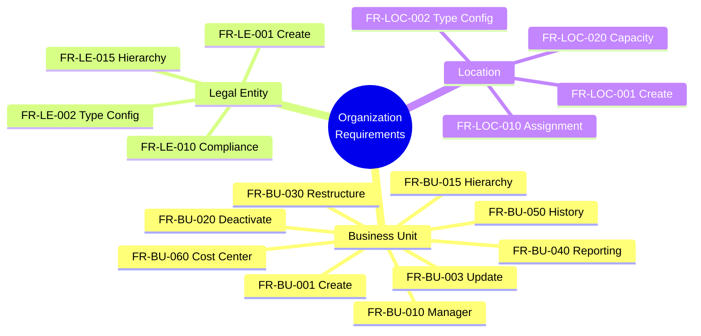
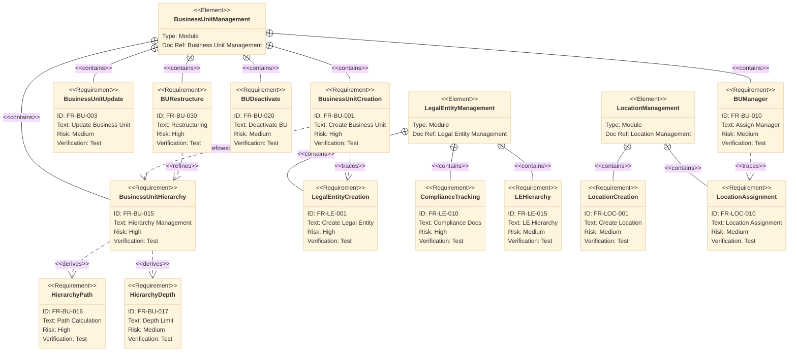

---
# === METADATA ===
id: FRS-CO-ORG
module: CORE
sub_module: ORGANIZATION_STRUCTURE
title: "Organization Structure Functional Requirements"
version: "1.0.0"
status: ACTIVE
owner: "Core Platform Team"
last_updated: "2026-01-08"
tags:
  - organization
  - business-unit
  - legal-entity
  - location
  - hierarchy

# === FUNCTIONAL REQUIREMENTS DATA ===
functional_requirements:
  # Business Unit Requirements
  - id: FR-BU-001
    title: "Create Business Unit"
    description: "System shall allow authorized users to create new business units with required information and hierarchy relationship."
    priority: MUST
    type: Functional
    status: Defined
    related_rules:
      - "[[BR-BU-001]]"
      - "[[BR-BU-002]]"
    related_entities:
      - "[[BusinessUnit]]"
      - "[[LegalEntity]]"

  - id: FR-BU-002
    title: "Business Unit Type Configuration"
    description: "System shall support configuration of business unit types (OPERATIONAL, SUPERVISORY) with inheritance rules."
    priority: MUST
    type: Configuration
    status: Defined
    related_rules:
      - "[[BR-BU-001]]"
    related_entities:
      - "[[BusinessUnit]]"

  - id: FR-BU-003
    title: "Update Business Unit"
    description: "System shall allow authorized users to update business unit information while maintaining hierarchy integrity."
    priority: MUST
    type: Functional
    status: Defined
    related_rules:
      - "[[BR-BU-001]]"
      - "[[BR-BU-002]]"
    related_entities:
      - "[[BusinessUnit]]"

  - id: FR-BU-005
    title: "Business Unit Search & Filter"
    description: "System shall provide search and filter capabilities across all business units with hierarchy navigation."
    priority: MUST
    type: Functional
    status: Defined
    related_entities:
      - "[[BusinessUnit]]"

  - id: FR-BU-010
    title: "Assign Business Unit Manager"
    description: "System shall allow assignment of managers to business units with validation of employee eligibility."
    priority: SHOULD
    type: Functional
    status: Defined
    related_rules:
      - "[[BR-BU-003]]"
    related_entities:
      - "[[BusinessUnit]]"
      - "[[Employee]]"

  - id: FR-BU-011
    title: "Manager Hierarchy Validation"
    description: "System shall validate that assigned managers have active assignments in the unit or parent units."
    priority: SHOULD
    type: Validation
    status: Defined
    related_rules:
      - "[[BR-BU-003]]"
    related_entities:
      - "[[BusinessUnit]]"
      - "[[Employee]]"
      - "[[Assignment]]"

  - id: FR-BU-015
    title: "Business Unit Hierarchy Management"
    description: "System shall maintain business unit hierarchies with parent-child relationships and prevent circular references."
    priority: MUST
    type: Functional
    status: Defined
    related_rules:
      - "[[BR-BU-002]]"
    related_entities:
      - "[[BusinessUnit]]"

  - id: FR-BU-016
    title: "Hierarchy Path Calculation"
    description: "System shall automatically calculate and maintain hierarchy paths for efficient queries and navigation."
    priority: MUST
    type: Functional
    status: Defined
    related_rules:
      - "[[BR-BU-002]]"
    related_entities:
      - "[[BusinessUnit]]"

  - id: FR-BU-017
    title: "Hierarchy Depth Limit"
    description: "System shall enforce maximum hierarchy depth constraints (configurable, default 10 levels)."
    priority: MUST
    type: Validation
    status: Defined
    related_rules:
      - "[[BR-BU-002]]"
    related_entities:
      - "[[BusinessUnit]]"

  - id: FR-BU-020
    title: "Deactivate Business Unit"
    description: "System shall allow deactivation of business units after validating no active dependencies exist."
    priority: SHOULD
    type: Workflow
    status: Defined
    related_rules:
      - "[[BR-BU-004]]"
    related_entities:
      - "[[BusinessUnit]]"
      - "[[Assignment]]"

  - id: FR-BU-021
    title: "Business Unit Closure Validation"
    description: "System shall validate that business units have no active assignments or active child units before closure."
    priority: SHOULD
    type: Validation
    status: Defined
    related_rules:
      - "[[BR-BU-004]]"
    related_entities:
      - "[[BusinessUnit]]"
      - "[[Assignment]]"

  - id: FR-BU-030
    title: "Business Unit Restructuring"
    description: "System shall support moving business units within the hierarchy with automatic path recalculation."
    priority: SHOULD
    type: Workflow
    status: Defined
    related_rules:
      - "[[BR-BU-002]]"
    related_entities:
      - "[[BusinessUnit]]"

  - id: FR-BU-031
    title: "Bulk Unit Transfer"
    description: "System shall support bulk transfer of child units during restructuring operations."
    priority: COULD
    type: Functional
    status: Planned
    related_entities:
      - "[[BusinessUnit]]"

  - id: FR-BU-040
    title: "Business Unit Reporting"
    description: "System shall provide standard reports on business unit structure, headcount, and changes."
    priority: MUST
    type: Functional
    status: Defined
    related_entities:
      - "[[BusinessUnit]]"
      - "[[Assignment]]"

  - id: FR-BU-041
    title: "Organization Chart Visualization"
    description: "System shall provide graphical organization chart view with drill-down capabilities."
    priority: SHOULD
    type: UI/UX
    status: Planned
    related_entities:
      - "[[BusinessUnit]]"
      - "[[Employee]]"

  - id: FR-BU-050
    title: "Business Unit History Tracking"
    description: "System shall maintain complete history of all business unit changes including structure changes."
    priority: MUST
    type: Functional
    status: Defined
    related_entities:
      - "[[BusinessUnit]]"

  - id: FR-BU-051
    title: "Effective Dating"
    description: "System shall support effective dating for business unit changes with historical tracking."
    priority: SHOULD
    type: Functional
    status: Defined
    related_entities:
      - "[[BusinessUnit]]"

  - id: FR-BU-060
    title: "Cost Center Integration"
    description: "System shall support linking business units to cost centers for financial reporting."
    priority: SHOULD
    type: Integration
    status: Defined
    related_entities:
      - "[[BusinessUnit]]"

  - id: FR-BU-061
    title: "Multi-Entity Business Units"
    description: "System shall support business units spanning multiple legal entities with proper compliance tracking."
    priority: COULD
    type: Functional
    status: Planned
    related_entities:
      - "[[BusinessUnit]]"
      - "[[LegalEntity]]"

  # Legal Entity Requirements
  - id: FR-LE-001
    title: "Create Legal Entity"
    description: "System shall allow creation of legal entities with complete registration and compliance information."
    priority: MUST
    type: Functional
    status: Defined
    related_rules:
      - "[[BR-LE-001]]"
    related_entities:
      - "[[LegalEntity]]"
      - "[[Country]]"

  - id: FR-LE-002
    title: "Legal Entity Type Configuration"
    description: "System shall support configuration of legal forms based on country regulations (LLC, GmbH, Plc, etc.)."
    priority: MUST
    type: Configuration
    status: Defined
    related_rules:
      - "[[BR-LE-001]]"
    related_entities:
      - "[[LegalEntity]]"

  - id: FR-LE-010
    title: "Compliance Document Management"
    description: "System shall track required compliance documents per legal entity with expiry monitoring."
    priority: MUST
    type: Functional
    status: Defined
    related_rules:
      - "[[BR-LE-002]]"
    related_entities:
      - "[[LegalEntity]]"
      - "[[Document]]"

  - id: FR-LE-015
    title: "Legal Entity Hierarchy"
    description: "System shall support parent-child relationships between legal entities for corporate structure."
    priority: SHOULD
    type: Functional
    status: Defined
    related_rules:
      - "[[BR-LE-003]]"
    related_entities:
      - "[[LegalEntity]]"

  # Location Requirements
  - id: FR-LOC-001
    title: "Create Location"
    description: "System shall allow creation of physical locations with complete address and facility information."
    priority: MUST
    type: Functional
    status: Defined
    related_entities:
      - "[[Location]]"
      - "[[Address]]"

  - id: FR-LOC-002
    title: "Location Type Configuration"
    description: "System shall support configuration of location types (HQ, BRANCH, REMOTE, WAREHOUSE)."
    priority: MUST
    type: Configuration
    status: Defined
    related_entities:
      - "[[Location]]"

  - id: FR-LOC-010
    title: "Location Assignment"
    description: "System shall support assignment of employees to primary and secondary work locations."
    priority: MUST
    type: Functional
    status: Defined
    related_entities:
      - "[[Location]]"
      - "[[Employee]]"

  - id: FR-LOC-020
    title: "Location Capacity Management"
    description: "System shall track location capacity and occupancy for workspace planning."
    priority: SHOULD
    type: Functional
    status: Planned
    related_entities:
      - "[[Location]]"

# === RELATED ONTOLOGY ===
related_ontology:
  - "[[BusinessUnit]]"
  - "[[LegalEntity]]"
  - "[[Location]]"
  - "[[Employee]]"
  - "[[Assignment]]"
  - "[[Country]]"
  - "[[Document]]"
  - "[[Address]]"

# === RELATED BRS ===
related_brs:
  - "[05-organization.brs.md](../04-business-rules/05-organization.brs.md)"
---

# Functional Requirements: Organization Structure

> **Scope**: This FRS file defines all functional requirements for Organization Structure management in the Core module. These requirements cover Business Units, Legal Entities, and Locations that form the organizational foundation.

## 1. Functional Scope

## 2. Requirement Catalog

| ID | Requirement | Priority | Type | Status |
|----|-------------|----------|------|--------|
| **BUSINESS UNIT** ||||
| `[[FR-BU-001]]` | **Create Business Unit** Create business units with hierarchy and legal entity linkage | MUST | Functional | Defined |
| `[[FR-BU-002]]` | **Business Unit Type Configuration** Configure BU types: OPERATIONAL, SUPERVISORY | MUST | Configuration | Defined |
| `[[FR-BU-003]]` | **Update Business Unit** Update BU info while maintaining hierarchy integrity | MUST | Functional | Defined |
| `[[FR-BU-005]]` | **Business Unit Search & Filter** Search/filter with hierarchy navigation | MUST | Functional | Defined |
| `[[FR-BU-010]]` | **Assign Business Unit Manager** Assign managers with eligibility validation | SHOULD | Functional | Defined |
| `[[FR-BU-011]]` | **Manager Hierarchy Validation** Validate manager assignment in unit or parent | SHOULD | Validation | Defined |
| `[[FR-BU-015]]` | **Business Unit Hierarchy Management** Maintain hierarchies, prevent circular refs | MUST | Functional | Defined |
| `[[FR-BU-016]]` | **Hierarchy Path Calculation** Auto-calculate hierarchy paths | MUST | Functional | Defined |
| `[[FR-BU-017]]` | **Hierarchy Depth Limit** Enforce max depth (default 10 levels) | MUST | Validation | Defined |
| `[[FR-BU-020]]` | **Deactivate Business Unit** Deactivate after dependency validation | SHOULD | Workflow | Defined |
| `[[FR-BU-021]]` | **Business Unit Closure Validation** Validate no active assignments/children | SHOULD | Validation | Defined |
| `[[FR-BU-030]]` | **Business Unit Restructuring** Move units with auto path recalc | SHOULD | Workflow | Defined |
| `[[FR-BU-031]]` | **Bulk Unit Transfer** Bulk transfer child units during reorg | COULD | Functional | Planned |
| `[[FR-BU-040]]` | **Business Unit Reporting** Reports on structure, headcount, changes | MUST | Functional | Defined |
| `[[FR-BU-041]]` | **Organization Chart Visualization** Graphical org chart with drill-down | SHOULD | UI/UX | Planned |
| `[[FR-BU-050]]` | **Business Unit History Tracking** Complete history of all changes | MUST | Functional | Defined |
| `[[FR-BU-051]]` | **Effective Dating** Effective dating with historical tracking | SHOULD | Functional | Defined |
| `[[FR-BU-060]]` | **Cost Center Integration** Link BUs to cost centers | SHOULD | Integration | Defined |
| `[[FR-BU-061]]` | **Multi-Entity Business Units** BUs spanning multiple legal entities | COULD | Functional | Planned |
| **LEGAL ENTITY** ||||
| `[[FR-LE-001]]` | **Create Legal Entity** Create with registration and compliance info | MUST | Functional | Defined |
| `[[FR-LE-002]]` | **Legal Entity Type Configuration** Configure legal forms per country | MUST | Configuration | Defined |
| `[[FR-LE-010]]` | **Compliance Document Management** Track required docs with expiry monitoring | MUST | Functional | Defined |
| `[[FR-LE-015]]` | **Legal Entity Hierarchy** Parent-child for corporate structure | SHOULD | Functional | Defined |
| **LOCATION** ||||
| `[[FR-LOC-001]]` | **Create Location** Create physical locations with address | MUST | Functional | Defined |
| `[[FR-LOC-002]]` | **Location Type Configuration** Configure types: HQ, BRANCH, REMOTE, WAREHOUSE | MUST | Configuration | Defined |
| `[[FR-LOC-010]]` | **Location Assignment** Assign employees to work locations | MUST | Functional | Defined |
| `[[FR-LOC-020]]` | **Location Capacity Management** Track capacity and occupancy | SHOULD | Functional | Planned |

## 3. Detailed Specifications

### [[FR-BU-001]] Create Business Unit

**Priority**: MUST  
**Type**: Functional  
**Status**: Defined

**Description**:  
System shall allow authorized users (HR Admin, Org Design) to create new business units with complete organizational information and hierarchy placement.

**Acceptance Criteria**:
- [ ] User can create business unit with required fields: code, name, type, effective start date
- [ ] System validates business unit code uniqueness (case-insensitive)
- [ ] User can specify parent business unit (optional for root units)
- [ ] System validates parent unit exists and is active
- [ ] System validates unit type compatibility with parent ([[BR-BU-001]])
- [ ] User can link business unit to legal entity
- [ ] System automatically calculates hierarchy path ([[BR-BU-002]])
- [ ] System enforces hierarchy depth limit
- [ ] User can specify optional fields: manager, cost center, description
- [ ] System creates audit trail of creation

**Related Rules**: [[BR-BU-001]], [[BR-BU-002]]  
**Related Entities**: [[BusinessUnit]], [[LegalEntity]]

---

### [[FR-BU-003]] Update Business Unit

**Priority**: MUST  
**Type**: Functional  
**Status**: Defined

**Description**:  
System shall allow authorized users to update business unit information while maintaining hierarchy integrity and data consistency.

**Acceptance Criteria**:
- [ ] User can update business unit name, description, type
- [ ] System prevents code changes (code is immutable identifier)
- [ ] User can update effective dates
- [ ] User can change parent unit (triggers restructuring)
- [ ] System recalculates hierarchy path when parent changes
- [ ] System validates all hierarchy rules during update ([[BR-BU-002]])
- [ ] User can update legal entity linkage
- [ ] System validates no active assignments if changing legal entity
- [ ] System creates audit trail of all changes
- [ ] Changes effective immediately or future-dated

**Related Rules**: [[BR-BU-001]], [[BR-BU-002]]  
**Related Entities**: [[BusinessUnit]]

---

### [[FR-BU-010]] Assign Business Unit Manager

**Priority**: SHOULD  
**Type**: Functional  
**Status**: Defined

**Description**:  
System shall allow assignment of managers to business units with validation of manager eligibility based on employment and assignment status.

**Acceptance Criteria**:
- [ ] User can assign employee as business unit manager
- [ ] System validates manager is an active employee ([[BR-BU-003]])
- [ ] System validates manager has active assignment in unit or parent unit
- [ ] User can specify manager effective dates
- [ ] System supports multiple managers (primary/secondary designation)
- [ ] User can update or remove manager assignment
- [ ] System triggers workflow routing updates when manager changes
- [ ] Manager change creates audit trail
- [ ] System sends notification to new manager
- [ ] Manager appears in approval workflows for unit employees

**Related Rules**: [[BR-BU-003]]  
**Related Entities**: [[BusinessUnit]], [[Employee]]

---

### [[FR-BU-015]] Business Unit Hierarchy Management

**Priority**: MUST  
**Type**: Functional  
**Status**: Defined

**Description**:  
System shall maintain business unit hierarchies with parent-child relationships, prevent circular references, and provide efficient hierarchy queries.

**Acceptance Criteria**:
- [ ] System stores parent-child relationships between business units
- [ ] System prevents circular references ([[BR-BU-002]])
- [ ] System validates unit cannot be its own ancestor
- [ ] System maintains closure table for efficient hierarchy queries
- [ ] User can query all ancestors of a unit
- [ ] User can query all descendants of a unit
- [ ] System calculates hierarchy level/depth
- [ ] System enforces maximum depth limit (configurable)
- [ ] Hierarchy changes trigger descendant path recalculation
- [ ] System provides hierarchy navigation in UI

**Related Rules**: [[BR-BU-002]]  
**Related Entities**: [[BusinessUnit]]

---

### [[FR-BU-016]] Hierarchy Path Calculation

**Priority**: MUST  
**Type**: Functional  
**Status**: Defined

**Description**:  
System shall automatically calculate and maintain materialized hierarchy paths for all business units to enable efficient queries and reporting.

**Acceptance Criteria**:
- [ ] System automatically calculates hierarchy path on unit creation
- [ ] Path format: `/parent_id/current_id/` or `/id1/id2/id3/` for deeper levels
- [ ] System recalculates path when parent unit changes
- [ ] System recalculates paths for all descendants when ancestor moves
- [ ] Path calculation is transactional (all or nothing)
- [ ] System uses path for efficient "subtree" queries
- [ ] Path enables fast "contains descendant" checks
- [ ] System maintains path consistency during bulk operations
- [ ] Path stored in dedicated column for query optimization

**Related Rules**: [[BR-BU-002]]  
**Related Entities**: [[BusinessUnit]]

---

### [[FR-BU-020]] Deactivate Business Unit

**Priority**: SHOULD  
**Type**: Workflow  
**Status**: Defined

**Description**:  
System shall allow deactivation of business units after validating no active dependencies exist, supporting organizational restructuring and unit closure.

**Acceptance Criteria**:
- [ ] User can initiate business unit deactivation
- [ ] System validates no active employee assignments ([[BR-BU-004]])
- [ ] System validates no active child business units
- [ ] System requires end date specification
- [ ] System validates end date >= effective start date
- [ ] User can specify closure reason (optional)
- [ ] System preserves unit data for historical reporting
- [ ] Deactivated units excluded from active views
- [ ] System prevents reactivation (create new unit instead)
- [ ] Deactivation creates audit trail

**Related Rules**: [[BR-BU-004]]  
**Related Entities**: [[BusinessUnit]], [[Assignment]]

---

### [[FR-BU-030]] Business Unit Restructuring

**Priority**: SHOULD  
**Type**: Workflow  
**Status**: Defined

**Description**:  
System shall support moving business units within the hierarchy with automatic path recalculation for the unit and all descendants.

**Acceptance Criteria**:
- [ ] User can change parent unit of existing business unit
- [ ] System validates new parent exists and is active
- [ ] System validates no circular reference would be created
- [ ] System validates hierarchy depth limit not exceeded
- [ ] System recalculates hierarchy path for moved unit
- [ ] System recalculates paths for all descendant units
- [ ] Restructuring can be effective-dated
- [ ] System maintains history of parent changes
- [ ] User can preview impact before confirming
- [ ] System provides rollback if restructuring fails

**Related Rules**: [[BR-BU-002]]  
**Related Entities**: [[BusinessUnit]]

---

### [[FR-BU-040]] Business Unit Reporting

**Priority**: MUST  
**Type**: Functional  
**Status**: Defined

**Description**:  
System shall provide standard reports on business unit structure, headcount distribution, and organizational changes.

**Acceptance Criteria**:
- [ ] Report: Current business unit hierarchy (tree view)
- [ ] Report: Headcount by business unit (including descendants)
- [ ] Report: Business unit changes over time period
- [ ] Report: Units without managers (governance)
- [ ] Report: Units approaching max depth
- [ ] Reports support filtering by legal entity
- [ ] Reports support filtering by unit type
- [ ] Reports exportable to Excel/PDF
- [ ] Reports show as-of-date organizational structure
- [ ] Reports respect user access permissions

**Related Entities**: [[BusinessUnit]], [[Assignment]]

---

### [[FR-BU-050]] Business Unit History Tracking

**Priority**: MUST  
**Type**: Functional  
**Status**: Defined

**Description**:  
System shall maintain complete history of all business unit changes including name, hierarchy, manager, and attribute changes.

**Acceptance Criteria**:
- [ ] System tracks all field changes with timestamps
- [ ] System records user who made each change
- [ ] History includes: name changes, parent changes, manager changes
- [ ] History includes: status changes, effective date changes
- [ ] User can view complete change history for a unit
- [ ] User can view organizational structure as-of any historical date
- [ ] System supports audit reporting on org changes
- [ ] History preserved even if unit is deactivated
- [ ] History accessible via UI and API
- [ ] History exportable for compliance

**Related Entities**: [[BusinessUnit]]

---

### [[FR-LE-001]] Create Legal Entity

**Priority**: MUST  
**Type**: Functional  
**Status**: Defined

**Description**:  
System shall allow creation of legal entities with complete registration information, compliance tracking, and country-specific validation.

**Acceptance Criteria**:
- [ ] User can create legal entity with required fields
- [ ] Required: registration number, country, legal form, legal name
- [ ] System validates registration number uniqueness ([[BR-LE-001]])
- [ ] System validates country code is valid
- [ ] System validates legal form valid for specified country
- [ ] User can enter tax ID with country-specific validation
- [ ] User can enter incorporation date
- [ ] User can specify registered address
- [ ] User can link parent legal entity (for subsidiaries)
- [ ] System initializes compliance document tracking ([[BR-LE-002]])
- [ ] System creates audit trail

**Related Rules**: [[BR-LE-001]]  
**Related Entities**: [[LegalEntity]], [[Country]]

---

### [[FR-LE-010]] Compliance Document Management

**Priority**: MUST  
**Type**: Functional  
**Status**: Defined

**Description**:  
System shall track required compliance documents for each legal entity based on country regulations, monitor expiry dates, and generate alerts.

**Acceptance Criteria**:
- [ ] System defines required documents per country and legal form
- [ ] User can upload compliance documents
- [ ] System tracks document type, issue date, expiry date
- [ ] System calculates compliance status: COMPLIANT, AT_RISK, NON_COMPLIANT ([[BR-LE-002]])
- [ ] System generates alerts at 90, 60, 30 days before expiry
- [ ] User receives dashboard of compliance status
- [ ] System tracks document renewal history
- [ ] User can specify document verification status
- [ ] System supports document version management
- [ ] Compliance status impacts legal entity availability

**Related Rules**: [[BR-LE-002]]  
**Related Entities**: [[LegalEntity]], [[Document]]

---

### [[FR-LE-015]] Legal Entity Hierarchy

**Priority**: SHOULD  
**Type**: Functional  
**Status**: Defined

**Description**:  
System shall support parent-child relationships between legal entities to model corporate structure, subsidiaries, and holding companies.

**Acceptance Criteria**:
- [ ] User can specify parent legal entity
- [ ] System validates parent legal entity exists ([[BR-LE-003]])
- [ ] System prevents circular references in hierarchy
- [ ] System validates parent country allows foreign subsidiaries (if different)
- [ ] User can specify ownership percentage (optional)
- [ ] System supports multiple hierarchy levels
- [ ] User can query all subsidiaries of a legal entity
- [ ] System provides consolidation views across hierarchy
- [ ] Hierarchy changes create audit trail
- [ ] System supports effective dating of ownership changes

**Related Rules**: [[BR-LE-003]]  
**Related Entities**: [[LegalEntity]]

---

### [[FR-LOC-001]] Create Location

**Priority**: MUST  
**Type**: Functional  
**Status**: Defined

**Description**:  
System shall allow creation of physical work locations with complete address information and facility details.

**Acceptance Criteria**:
- [ ] User can create location with required fields: code, name, type
- [ ] System validates location code uniqueness
- [ ] User can specify complete address information
- [ ] User can link location to legal entity
- [ ] User can specify location capacity (optional)
- [ ] User can specify facility amenities (optional)
- [ ] User can mark location as primary/secondary/remote
- [ ] System supports effective dating
- [ ] Location can be linked to business units
- [ ] System creates audit trail

**Related Entities**: [[Location]], [[Address]]

---

### [[FR-LOC-010]] Location Assignment

**Priority**: MUST  
**Type**: Functional  
**Status**: Defined

**Description**:  
System shall support assignment of employees to primary and secondary work locations for workspace management and reporting.

**Acceptance Criteria**:
- [ ] User can assign employee to primary work location
- [ ] User can assign employee to secondary work location(s)
- [ ] System validates location exists and is active
- [ ] Assignment can be effective-dated
- [ ] System tracks location assignment history
- [ ] User can query employees by location
- [ ] System supports bulk location assignments
- [ ] Location assignment triggers workspace allocation
- [ ] System validates capacity constraints (if enabled)
- [ ] Location changes create audit trail

**Related Entities**: [[Location]], [[Employee]]

---

## 4. Requirement Hierarchy

---

## 5. Traceability Matrix

| FR ID | Related BRs | Related Entities | Implemented | Tested |
|-------|-------------|------------------|-------------|--------|
| FR-BU-001 | BR-BU-001, BR-BU-002 | BusinessUnit, LegalEntity | ⬜ | ⬜ |
| FR-BU-002 | BR-BU-001 | BusinessUnit | ⬜ | ⬜ |
| FR-BU-003 | BR-BU-001, BR-BU-002 | BusinessUnit | ⬜ | ⬜ |
| FR-BU-005 | - | BusinessUnit | ⬜ | ⬜ |
| FR-BU-010 | BR-BU-003 | BusinessUnit, Employee | ⬜ | ⬜ |
| FR-BU-011 | BR-BU-003 | BusinessUnit, Employee, Assignment | ⬜ | ⬜ |
| FR-BU-015 | BR-BU-002 | BusinessUnit | ⬜ | ⬜ |
| FR-BU-016 | BR-BU-002 | BusinessUnit | ⬜ | ⬜ |
| FR-BU-017 | BR-BU-002 | BusinessUnit | ⬜ | ⬜ |
| FR-BU-020 | BR-BU-004 | BusinessUnit, Assignment | ⬜ | ⬜ |
| FR-BU-021 | BR-BU-004 | BusinessUnit, Assignment | ⬜ | ⬜ |
| FR-BU-030 | BR-BU-002 | BusinessUnit | ⬜ | ⬜ |
| FR-BU-031 | - | BusinessUnit | ⬜ | ⬜ |
| FR-BU-040 | - | BusinessUnit, Assignment | ⬜ | ⬜ |
| FR-BU-041 | - | BusinessUnit, Employee | ⬜ | ⬜ |
| FR-BU-050 | - | BusinessUnit | ⬜ | ⬜ |
| FR-BU-051 | - | BusinessUnit | ⬜ | ⬜ |
| FR-BU-060 | - | BusinessUnit | ⬜ | ⬜ |
| FR-BU-061 | - | BusinessUnit, LegalEntity | ⬜ | ⬜ |
| FR-LE-001 | BR-LE-001 | LegalEntity, Country | ⬜ | ⬜ |
| FR-LE-002 | BR-LE-001 | LegalEntity | ⬜ | ⬜ |
| FR-LE-010 | BR-LE-002 | LegalEntity, Document | ⬜ | ⬜ |
| FR-LE-015 | BR-LE-003 | LegalEntity | ⬜ | ⬜ |
| FR-LOC-001 | - | Location, Address | ⬜ | ⬜ |
| FR-LOC-002 | - | Location | ⬜ | ⬜ |
| FR-LOC-010 | - | Location, Employee | ⬜ | ⬜ |
| FR-LOC-020 | - | Location | ⬜ | ⬜ |

---

**Document Control**:
- **Version**: 1.0.0
- **Last Updated**: 2026-01-08
- **Status**: ACTIVE
- **Owner**: Core Platform Team
- **Approved By**: [Pending Approval]
