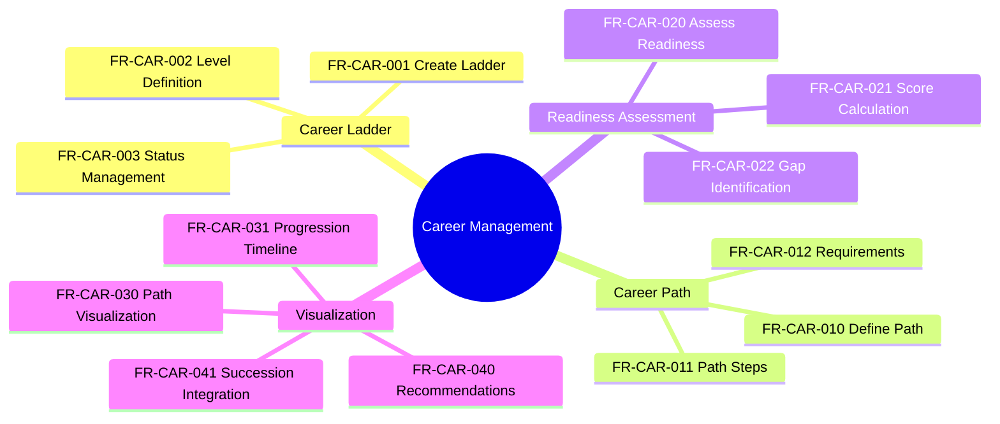

---
# === METADATA ===
id: FRS-CO-CAREER
module: CORE
sub_module: CAREER_MANAGEMENT
title: "Career Management Requirements"
version: "1.0.0"
status: DRAFT
owner: "Core HR Team"
last_updated: "2026-01-08"
tags:
  - career
  - career-path
  - career-ladder
  - succession
  - development
  - progression

# === REQUIREMENTS DATA ===
requirements:
  # Career Ladder (3 FRs)
  - id: FR-CAR-001
    title: "Create Career Ladder"
    description: "System should support defining career ladders with multiple levels."
    priority: SHOULD
    type: Functional
    risk: low
    status: TODO
    acceptance_criteria:
      - "Career ladder linked to job family or job function"
      - "Multiple levels defined (e.g., Junior, Mid, Senior, Lead)"
      - "Level sequence order specified"
      - "Description and requirements per level"
    dependencies:
      - "[[CareerPath]]"
      - "[[JobFamily]]"
    implemented_by: []

  - id: FR-CAR-002
    title: "Career Ladder Level Definition"
    description: "System should support configuring career ladder levels."
    priority: SHOULD
    type: Configuration
    risk: low
    status: TODO
    acceptance_criteria:
      - "Level name and code defined"
      - "Level sequence/order specified"
      - "Minimum experience requirements captured"
      - "Skill requirements linked to levels"
    dependencies:
      - "[[CareerPath]]"
    implemented_by: []

  - id: FR-CAR-003
    title: "Career Ladder Status Management"
    description: "System should manage career ladder lifecycle."
    priority: SHOULD
    type: Workflow
    risk: low
    status: TODO
    acceptance_criteria:
      - "Status: DRAFT, ACTIVE, INACTIVE"
      - "Version control for ladder changes"
      - "Effective dates tracked"
    dependencies:
      - "[[CareerPath]]"
    implemented_by: []

  # Career Path (3 FRs)
  - id: FR-CAR-010
    title: "Define Career Path"
    description: "System should support defining career paths between jobs."
    priority: SHOULD
    type: Functional
    risk: medium
    status: TODO
    acceptance_criteria:
      - "Source job and target job defined"
      - "Path type (vertical, lateral, cross-functional)"
      - "Typical transition timeframe captured"
      - "Prerequisites defined"
    dependencies:
      - "[[CareerPath]]"
      - "[[Job]]"
    implemented_by: []

  - id: FR-CAR-011
    title: "Path Step Configuration"
    description: "System should support multi-step career paths."
    priority: SHOULD
    type: Configuration
    risk: low
    status: TODO
    acceptance_criteria:
      - "Intermediate steps between source and target"
      - "Step sequence defined"
      - "Duration at each step recommended"
    dependencies:
      - "[[CareerPath]]"
    implemented_by: []

  - id: FR-CAR-012
    title: "Path Requirements"
    description: "System should capture requirements for career path transitions."
    priority: SHOULD
    type: Functional
    risk: medium
    status: TODO
    acceptance_criteria:
      - "Required skills for transition"
      - "Required experience (years, projects)"
      - "Required certifications"
      - "Performance rating requirements"
    dependencies:
      - "[[CareerPath]]"
      - "[[SkillMaster]]"
    implemented_by: []

  # Readiness Assessment (3 FRs)
  - id: FR-CAR-020
    title: "Career Readiness Assessment"
    description: "System could assess employee readiness for next career step."
    priority: COULD
    type: Calculation
    risk: medium
    status: TODO
    acceptance_criteria:
      - "Compare employee skills vs target job requirements"
      - "Calculate readiness score (0-100%)"
      - "Identify gaps (skills, experience, certifications)"
      - "Readiness level: Not Ready, Developing, Ready, Exceeds"
    dependencies:
      - "[[CareerPath]]"
      - "[[Employee]]"
      - "[[WorkerSkill]]"
    implemented_by: []

  - id: FR-CAR-021
    title: "Readiness Score Calculation"
    description: "System could calculate career readiness score."
    priority: COULD
    type: Calculation
    risk: low
    status: TODO
    acceptance_criteria:
      - "Weighted scoring algorithm (skills 40%, experience 30%, performance 30%)"
      - "Score displayed as percentage"
      - "Score breakdown by component"
    dependencies:
      - "[[Employee]]"
    implemented_by: []

  - id: FR-CAR-022
    title: "Gap Identification"
    description: "System could identify gaps preventing career progression."
    priority: COULD
    type: Functional
    risk: low
    status: TODO
    acceptance_criteria:
      - "Missing skills listed with priority"
      - "Experience gap calculated (years)"
      - "Missing certifications identified"
      - "Development recommendations generated"
    dependencies:
      - "[[CareerPath]]"
      - "[[WorkerSkill]]"
    implemented_by: []

  # Visualization & Recommendations (4 FRs)
  - id: FR-CAR-030
    title: "Career Path Visualization"
    description: "System could visualize career paths graphically."
    priority: COULD
    type: UI/UX
    risk: low
    status: TODO
    acceptance_criteria:
      - "Graph showing job nodes and transitions"
      - "Path types visually differentiated (vertical, lateral)"
      - "Current position highlighted"
      - "Possible next steps highlighted"
      - "Interactive exploration supported"
    dependencies:
      - "[[CareerPath]]"
    implemented_by: []

  - id: FR-CAR-031
    title: "Career Progression Timeline"
    description: "System could show employee's career progression timeline."
    priority: COULD
    type: UI/UX
    risk: low
    status: TODO
    acceptance_criteria:
      - "Timeline of past job changes"
      - "Projected future progression shown"
      - "Time in current role displayed"
      - "Milestones and achievements marked"
    dependencies:
      - "[[Employee]]"
      - "[[Assignment]]"
    implemented_by: []

  - id: FR-CAR-040
    title: "Career Path Recommendations"
    description: "System could recommend career paths based on employee profile."
    priority: COULD
    type: Calculation
    risk: medium
    status: TODO
    acceptance_criteria:
      - "Analyze employee skills and interests"
      - "Match against available career paths"
      - "Rank recommendations by fit score"
      - "Show readiness level for each path"
      - "Personalized development plan suggested"
    dependencies:
      - "[[CareerPath]]"
      - "[[Employee]]"
      - "[[WorkerSkill]]"
    implemented_by: []

  - id: FR-CAR-041
    title: "Succession Planning Integration"
    description: "System could integrate with succession planning."
    priority: COULD
    type: Integration
    risk: low
    status: TODO
    acceptance_criteria:
      - "Identify high-potential employees on career paths"
      - "Link career paths to succession pools"
      - "Readiness assessment used in succession planning"
      - "Development gaps inform succession plans"
    dependencies:
      - "[[CareerPath]]"
      - "[[Employee]]"
    implemented_by: []

# === ONTOLOGY REFERENCES ===
related_ontology:
  - "[[CareerPath]]"
  - "[[Job]]"
  - "[[JobFamily]]"
  - "[[Employee]]"
  - "[[WorkerSkill]]"
  - "[[SkillMaster]]"
  - "[[Assignment]]"
---

# Functional Requirements: Career Management

> **Scope**: This FRS file defines all functional requirements for Career Management in the Core module. These requirements cover career ladders, career paths, readiness assessment, and visualization to support employee career development and succession planning.

## 1. Functional Scope



## 2. Requirement Catalog

| ID | Requirement Detail | Priority | Type |
|----|-------------------|----------|------|
| `[[FR-CAR-001]]` | **Create Career Ladder**<br>Define career ladders with multiple levels | SHOULD | Functional |
| `[[FR-CAR-002]]` | **Career Ladder Level Definition**<br>Configure career ladder levels | SHOULD | Configuration |
| `[[FR-CAR-003]]` | **Career Ladder Status Management**<br>Manage career ladder lifecycle | SHOULD | Workflow |
| `[[FR-CAR-010]]` | **Define Career Path**<br>Define career paths between jobs | SHOULD | Functional |
| `[[FR-CAR-011]]` | **Path Step Configuration**<br>Multi-step career paths | SHOULD | Configuration |
| `[[FR-CAR-012]]` | **Path Requirements**<br>Requirements for career transitions | SHOULD | Functional |
| `[[FR-CAR-020]]` | **Career Readiness Assessment**<br>Assess readiness for next career step | COULD | Calculation |
| `[[FR-CAR-021]]` | **Readiness Score Calculation**<br>Calculate career readiness score | COULD | Calculation |
| `[[FR-CAR-022]]` | **Gap Identification**<br>Identify career progression gaps | COULD | Functional |
| `[[FR-CAR-030]]` | **Career Path Visualization**<br>Visualize career paths graphically | COULD | UI/UX |
| `[[FR-CAR-031]]` | **Career Progression Timeline**<br>Show employee career timeline | COULD | UI/UX |
| `[[FR-CAR-040]]` | **Career Path Recommendations**<br>Recommend career paths by employee profile | COULD | Calculation |
| `[[FR-CAR-041]]` | **Succession Planning Integration**<br>Integrate with succession planning | COULD | Integration |

## 3. Detailed Specifications

### [[FR-CAR-001]] Create Career Ladder

*   **Description**: System should support defining career ladders that represent hierarchical progression within job families or functions.
*   **Acceptance Criteria**:
    *   Career ladder linked to job family or job function
    *   Multiple levels defined (e.g., Junior → Mid → Senior → Lead → Principal)
    *   Level sequence order specified for progression logic
    *   Description and minimum requirements captured per level
    *   Effective dates for ladder versions
*   **Dependencies**: [[CareerPath]], [[JobFamily]]
*   **Enforces**: None

---

### [[FR-CAR-010]] Define Career Path

*   **Description**: System should support defining career paths that show possible transitions between jobs, including vertical promotions, lateral moves, and cross-functional transitions.
*   **Acceptance Criteria**:
    *   Source job and target job defined (from job catalog)
    *   Path type captured: VERTICAL (promotion), LATERAL (same level), CROSS_FUNCTIONAL (different function)
    *   Typical transition timeframe captured (e.g., 2-3 years)
    *   Prerequisites defined (required experience, skills, certifications)
    *   Multiple paths from same source job supported
*   **Dependencies**: [[CareerPath]], [[Job]]
*   **Enforces**: None

---

### [[FR-CAR-020]] Career Readiness Assessment

*   **Description**: System could assess employee readiness for the next career step by comparing current profile against target job requirements.
*   **Acceptance Criteria**:
    *   Compare employee skills vs target job required skills
    *   Compare employee experience vs target job requirements
    *   Calculate overall readiness score (0-100%)
    *   Identify specific gaps (missing skills, experience shortfall, certifications needed)
    *   Readiness level categorized: NOT_READY (<50%), DEVELOPING (50-74%), READY (75-89%), EXCEEDS (90%+)
    *   Assessment results stored with timestamp
*   **Dependencies**: [[CareerPath]], [[Employee]], [[WorkerSkill]], [[JobProfile]]
*   **Enforces**: None

---

### [[FR-CAR-040]] Career Path Recommendations

*   **Description**: System could provide personalized career path recommendations based on employee skills, interests, performance, and organizational opportunities.
*   **Acceptance Criteria**:
    *   Analyze employee current skills and proficiency levels
    *   Match against all available career paths in system
    *   Rank recommendations by fit score (skills match + interest alignment)
    *   Show readiness level for each recommended path
    *   Provide personalized development plan for top recommendations
    *   Consider organization's strategic priorities (high-demand roles)
*   **Dependencies**: [[CareerPath]], [[Employee]], [[WorkerSkill]]
*   **Enforces**: None

---

## 4. Requirement Hierarchy

```mermaid
requirementDiagram

    %% === STYLING ===
    classDef epic fill:#e1bee7,stroke:#7b1fa2,stroke-width:2px
    classDef fr fill:#e3f2fd,stroke:#1565c0,stroke-width:2px
    classDef entity fill:#e8f5e9,stroke:#2e7d32,stroke-width:2px

    %% === CAPABILITY ===
    requirement CareerManagement {
        id: FRS_CO_CAREER
        text: "Support career development with ladders, paths, and readiness assessment"
        risk: low
        verifymethod: demonstration
    }:::epic

    %% === CORE REQUIREMENTS ===
    functionalRequirement CreateLadder {
        id: FR_CAR_001
        text: "Create career ladder"
        risk: low
        verifymethod: test
    }:::fr

    functionalRequirement DefinePath {
        id: FR_CAR_010
        text: "Define career path"
        risk: medium
        verifymethod: test
    }:::fr

    functionalRequirement AssessReadiness {
        id: FR_CAR_020
        text: "Assess career readiness"
        risk: medium
        verifymethod: test
    }:::fr

    functionalRequirement Recommendations {
        id: FR_CAR_040
        text: "Career path recommendations"
        risk: medium
        verifymethod: test
    }:::fr

    %% === ENTITIES ===
    element CareerPath {
        type: "Entity"
        docref: "career-path.onto.md"
    }:::entity

    element Employee {
        type: "Aggregate Root"
        docref: "employee.onto.md"
    }:::entity

    element WorkerSkill {
        type: "Entity"
        docref: "worker-skill.onto.md"
    }:::entity

    %% === RELATIONSHIPS ===
    CareerManagement - contains -> CreateLadder
    CareerManagement - contains -> DefinePath
    CareerManagement - contains -> AssessReadiness
    CareerManagement - contains -> Recommendations

    CreateLadder - traces -> CareerPath
    DefinePath - traces -> CareerPath
    AssessReadiness - traces -> Employee
    AssessReadiness - traces -> WorkerSkill
    Recommendations - traces -> CareerPath
```

---

## 5. Business Rules Reference

| FR ID | Related Business Rules |
|-------|----------------------|
| FR-CAR-010 | Career path definition rules |
| FR-CAR-020 | Readiness assessment calculation rules |
| FR-CAR-040 | Recommendation algorithm rules |
