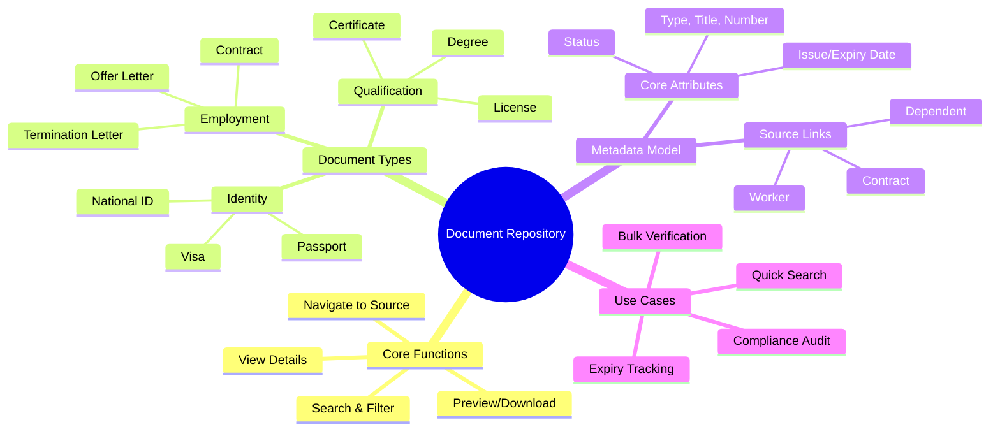
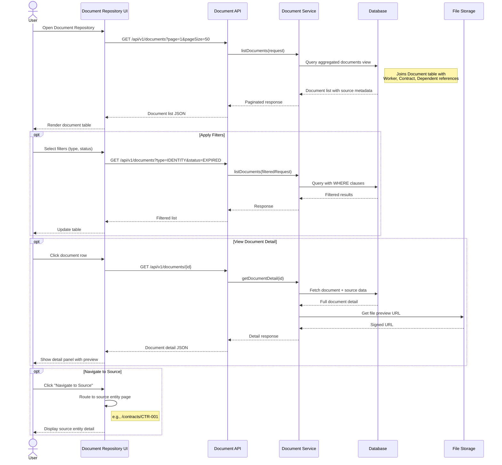

---
# === METADATA ===
id: FEAT-CO-017
type: FEATURE
module: CORE
sub_module: MASTER_DATA
title: "Document Repository (Kho Tài Liệu)"
version: "1.0.0"
status: DRAFT
priority: MEDIUM
phase: 2

# === ACTORS ===
actors:
  - HR Administrator
  - Compliance Officer
  - HR Manager
  - System Auditor

# === TRIGGERS ===
triggers:
  - "User navigates to Document Repository from main menu"
  - "User clicks 'View All Documents' from dashboard"
  - "User needs to find a document without knowing source entity"
  - "Scheduled expiry notification alerts"

# === PRE-CONDITIONS ===
preconditions:
  - "User is authenticated with appropriate role"
  - "User has permission to access document repository"
  - "Documents exist in the system (attached to various entities)"

# === POST-CONDITIONS ===
postconditions:
  - "User can view flat list of all accessible documents"
  - "User can search and filter documents by various criteria"
  - "User can navigate to source entity from document"
  - "Audit trail records document access"

# === USER STORY ===
user_story:
  as: "HR Administrator"
  i_want: "access a centralized repository to search, view, and manage all HR documents across the organization"
  so_that: "I can quickly find documents without navigating through individual employee records, contracts, or other entities, and ensure compliance with document retention policies"

# === ACCEPTANCE CRITERIA (Gherkin) ===
acceptance_criteria:
  - scenario: "View all documents with pagination"
    given: "Organization has 500 documents across various entities"
    when: "HR Admin opens Document Repository"
    then: |
      Document list displays with pagination (50 per page)
      AND Each row shows: Title, Type, Category, Source, Status, Expiry
      AND Default sort is by most recently updated
      AND Total document count is shown

  - scenario: "Search documents by keyword"
    given: "Repository contains documents with various titles and numbers"
    when: "User searches for 'passport'"
    then: |
      Results show all documents where title, number, or type contains 'passport'
      AND Search works across all document metadata fields
      AND Results highlight matching terms

  - scenario: "Filter by document type and status"
    given: "Repository has documents of types IDENTITY, CONTRACT, CERTIFICATE, DEGREE"
    when: "User filters by type=IDENTITY and status=EXPIRED"
    then: |
      Only identity documents with expired status are shown
      AND Filter chips show active filters
      AND Clear all filters option available

  - scenario: "View document details and navigate to source"
    given: "Document is attached to Employee EMP-001 contract"
    when: "User clicks on document row"
    then: |
      Document detail panel shows:
        - Full metadata (title, type, number, dates, issuer)
        - Source information: "Contract #CTR-001 for Nguyễn Văn A (EMP-001)"
        - Preview (if PDF/image)
        - Download action
        - [Navigate to Source] button
      AND Clicking Navigate opens Contract detail page

  - scenario: "Expiry dashboard view"
    given: "Some documents have expiry dates"
    when: "User opens Expiry Dashboard tab"
    then: |
      Dashboard shows:
        - Documents expiring in 30 days: [count]
        - Documents already expired: [count]
        - Timeline chart of upcoming expirations
      AND Click reveals filtered list of affected documents

  - scenario: "Bulk actions for compliance"
    given: "User selects multiple documents"
    when: "User chooses 'Mark as Verified' bulk action"
    then: |
      Confirmation dialog shows selected count
      AND After confirm, all selected documents marked as verified
      AND Audit trail records bulk action with user and timestamp

# === DATA CONTRACT ===
data_contract:
  input:
    listRequest:
      page: "number"
      pageSize: "number"
      sortBy: "string"
      sortOrder: "'asc' | 'desc'"
      filters:
        documentTypes: "string[]?"
        categories: "string[]?"
        statuses: "string[]?"
        sourceTypes: "string[]?"
        legalEntityIds: "string[]?"
        expiryDateRange:
          from: "date?"
          to: "date?"
        issueDateRange:
          from: "date?"
          to: "date?"
      search: "string?"
  
  output:
    listResponse:
      totalCount: "number"
      page: "number"
      pageSize: "number"
      items:
        - documentId: "string"
          documentType: "string"
          documentTypeLabel: "string"
          category: "string?"
          categoryLabel: "string?"
          title: "string"
          documentNumber: "string?"
          issueDate: "date?"
          expiryDate: "date?"
          status: "'VALID' | 'EXPIRED' | 'PENDING_VERIFICATION' | 'REVOKED'"
          issuingAuthority: "string?"
          fileUrl: "string?"
          fileType: "string?"
          fileSize: "number?"
          source:
            sourceType: "'WORKER' | 'EMPLOYEE' | 'CONTRACT' | 'DEPENDENT' | 'ASSIGNMENT'"
            sourceId: "string"
            sourceLabel: "string"
          worker:
            workerId: "string"
            workerName: "string"
          legalEntity:
            legalEntityId: "string?"
            legalEntityName: "string?"
          createdAt: "datetime"
          updatedAt: "datetime"
          verifiedAt: "datetime?"
          verifiedBy: "string?"
    
    detailResponse:
      documentId: "string"
      documentType: "string"
      documentTypeLabel: "string"
      category: "string?"
      categoryLabel: "string?"
      title: "string"
      documentNumber: "string?"
      description: "string?"
      issueDate: "date?"
      expiryDate: "date?"
      status: "string"
      issuingAuthority: "string?"
      issuingCountry: "string?"
      file:
        fileUrl: "string"
        fileType: "string"
        fileSize: "number"
        fileName: "string"
        thumbnailUrl: "string?"
      source:
        sourceType: "string"
        sourceId: "string"
        sourceLabel: "string"
        navigationUrl: "string"
      worker:
        workerId: "string"
        workerName: "string"
        employeeNumber: "string?"
      legalEntity:
        legalEntityId: "string?"
        legalEntityName: "string?"
        legalEntityCode: "string?"
      audit:
        createdAt: "datetime"
        createdBy: "string"
        updatedAt: "datetime"
        updatedBy: "string"
        verifiedAt: "datetime?"
        verifiedBy: "string?"
      customFields: "Record<string, any>?"
    
    expiryDashboard:
      expiringIn30Days: "number"
      expiredTotal: "number"
      expiryByMonth:
        - month: "string"
          count: "number"

# === REFERENCES TO EXTERNAL DOCS ===
requirements:
  - "[[FR-WRK-010]]"  # Worker Documents
  - "[[FR-WRK-015]]"  # Document Verification
  - "[[FR-CTR-010]]"  # Contract Document Attachment

business_rules:
  - "[[BR-WRK-005]]"  # Document Validation Rules
  - "[[BR-WRK-010]]"  # Document Retention Rules

related_ontology:
  - "[[Document]]"
  - "[[Worker]]"
  - "[[Contract]]"
  - "[[Employee]]"

related_features:
  - "[[FEAT-CO-003]]"  # Manage Worker Documents
  - "[[FEAT-CO-011]]"  # Create Employment Contract

concept_guides:
  - "00-global/note/document-repository-analysis.md"
---

# Document Repository (Kho Tài Liệu)

> **Feature**: Centralized document search and management hub for HR Administrators and Compliance Officers

## 1. Overview



## 2. User Story

**As an** HR Administrator  
**I want to** access a centralized repository to search, view, and manage all HR documents across the organization  
**So that** I can quickly find documents without navigating through individual employee records, contracts, or other entities, and ensure compliance with document retention policies

## 3. Business Context

### Problem Statement
Currently, documents are attached to specific entities (Worker, Contract, Dependent). This creates challenges:
- Finding a document requires knowing which entity it belongs to
- Cross-cutting queries (e.g., "all expiring passports") require checking each entity
- Compliance audits need aggregated document views
- No unified search across all document types

### Solution: Document Repository
A "flat" view where **Document is the primary entity**, with metadata linking to source entities. This complements (not replaces) entity-attached documents.

### Industry Benchmark

| Vendor | Solution | Key Features |
|--------|----------|--------------|
| **Workday** | Workday Docs / Workday Drive | Centralized repository, role-based access, eSign, audit trails |
| **SAP SuccessFactors** | Personal Documents + ePFile | Categories, access control, Employee Central integration |
| **Oracle HCM** | Document of Record (DOR) | Employee/employer docs, UCM storage, workflow automation |

### Target Users

| User Role | Primary Use Cases |
|-----------|-------------------|
| **HR Administrator** | Quick document search, verification, data entry support |
| **Compliance Officer** | Expiry tracking, audit reports, retention policy enforcement |
| **HR Manager** | Document status overview, team document review |
| **System Auditor** | Access audit trails, document history |

## 4. Acceptance Criteria

### Scenario 1: View all documents with pagination

```gherkin
Given Organization has 500 documents across Worker, Contract, and Dependent entities
When HR Admin opens Document Repository
Then Document list displays with default pagination (50 per page)
  And Table columns show:
    | Column     | Description                          |
    | Title      | Document title                       |
    | Type       | IDENTITY / CONTRACT / CERTIFICATE    |
    | Number     | Document number (if applicable)      |
    | Source     | "Worker: Nguyễn A" or "Contract #001"|
    | Status     | VALID / EXPIRED / PENDING            |
    | Expiry     | Expiry date or "-"                   |
  And Default sort is by "Updated At" descending
  And Header shows "500 documents found"
```

### Scenario 2: Search documents by keyword

```gherkin
Given Repository contains:
  | Title                  | Type       | Number      |
  | Passport - Nguyen A    | IDENTITY   | C12345678   |
  | National ID            | IDENTITY   | 079190XXXX  |
  | Employment Contract    | CONTRACT   | CTR-001     |
When User types "passport" in search box and presses Enter
Then Results show only "Passport - Nguyen A" row
  And Search icon indicates active search
  And Clear search (X) button available
When User types "C12345678" in search box
Then Results show passport document matching by number
```

### Scenario 3: Filter by document type and status

```gherkin
Given Repository has documents:
  | Type       | Status   | Count |
  | IDENTITY   | VALID    | 120   |
  | IDENTITY   | EXPIRED  | 15    |
  | CONTRACT   | VALID    | 200   |
  | CERTIFICATE| VALID    | 50    |
When User selects filter: Type = IDENTITY, Status = EXPIRED
Then List shows only 15 expired identity documents
  And Filter chips show: "Type: Identity" "Status: Expired"
  And "Clear All Filters" button visible
When User clicks "Clear All Filters"
Then All documents shown again
```

### Scenario 4: View document details and navigate to source

```gherkin
Given Document "Employment Contract - Nguyen A" is attached to Contract CTR-001
When User clicks on the document row
Then Detail side panel opens showing:
  |─────────────────────────────────────────────────|
  | EMPLOYMENT CONTRACT - NGUYEN A                  |
  | ─────────────────────────────────────────────── |
  | Type: Contract          Status: ✅ Valid        |
  | Number: CTR-VN-2024-001                         |
  | Issue Date: 2024-01-15                          |
  | Expiry: -                                       |
  | Issuer: ABC Corporation Vietnam                 |
  |                                                 |
  | 📎 Source: Contract #CTR-001                    |
  |    Employee: Nguyễn Văn A (EMP-001)             |
  |    [Navigate to Contract →]                     |
  |                                                 |
  | ┌─────────────────────────────────────────────┐ |
  | │           📄 PDF Preview                    │ |
  | │                                             │ |
  | │         [Contract content...]               │ |
  | │                                             │ |
  | └─────────────────────────────────────────────┘ |
  |                                                 |
  | [Download] [Open in New Tab]                    |
  |─────────────────────────────────────────────────|
When User clicks "Navigate to Contract"
Then Browser navigates to Contract detail page for CTR-001
```

### Scenario 5: Expiry dashboard view

```gherkin
Given System has documents with various expiry dates
When User clicks "Expiry Dashboard" tab
Then Dashboard displays:
  |─────────────────────────────────────────────────────────|
  | 🕐 DOCUMENT EXPIRY DASHBOARD                            |
  |─────────────────────────────────────────────────────────|
  |                                                         |
  | ┌─────────────┐ ┌─────────────┐ ┌─────────────────────┐ |
  | │ ⚠️ EXPIRING  │ │ 🔴 EXPIRED  │ │ 📊 EXPIRY TIMELINE │ |
  | │   IN 30 DAYS │ │             │ │                    │ |
  | │     12       │ │     7       │ │ [Chart: Next 6 mo] │ |
  | │  [View →]    │ │  [View →]   │ │                    │ |
  | └─────────────┘ └─────────────┘ └─────────────────────┘ |
  |                                                         |
  | DOCUMENTS EXPIRING SOON                                 |
  | ──────────────────────────────────────────────────────  |
  | Passport - Nguyen A        IDENTITY   Expires: 15 Feb   |
  | Work Permit - Tran B       IDENTITY   Expires: 28 Feb   |
  | AWS Certification - Le C   CERT       Expires: 01 Mar   |
  |─────────────────────────────────────────────────────────|
```

## 5. Data Contract

### Input: List Request (JSON5)

```json5
{
  // Pagination
  page: 1,
  pageSize: 50,
  
  // Sorting
  sortBy: "updatedAt",  // or "title", "expiryDate", "documentType"
  sortOrder: "desc",
  
  // Filters
  filters: {
    documentTypes: ["IDENTITY", "CONTRACT"],
    categories: ["PASSPORT", "VISA"],
    statuses: ["VALID", "EXPIRED"],
    sourceTypes: ["WORKER", "CONTRACT"],
    legalEntityIds: ["le-001"],
    expiryDateRange: {
      from: "2026-01-01",
      to: "2026-03-31"
    }
  },
  
  // Full-text search
  search: "passport nguyen"
}
```

### Output: List Response (JSON5)

```json5
{
  totalCount: 385,
  page: 1,
  pageSize: 50,
  
  items: [
    {
      documentId: "doc-001",
      documentType: "IDENTITY",
      documentTypeLabel: "Identity Document",
      category: "PASSPORT",
      categoryLabel: "Passport",
      title: "Passport - Nguyễn Văn A",
      documentNumber: "C12345678",
      issueDate: "2020-05-15",
      expiryDate: "2030-05-14",
      status: "VALID",
      issuingAuthority: "Ministry of Public Security",
      fileUrl: "/files/doc-001.pdf",
      fileType: "application/pdf",
      fileSize: 1024000,
      
      source: {
        sourceType: "WORKER",
        sourceId: "w-001",
        sourceLabel: "Worker: Nguyễn Văn A"
      },
      
      worker: {
        workerId: "W-001",
        workerName: "Nguyễn Văn A"
      },
      
      legalEntity: {
        legalEntityId: "le-abc-vn",
        legalEntityName: "ABC Corporation Vietnam"
      },
      
      createdAt: "2024-01-15T10:30:00Z",
      updatedAt: "2024-01-15T10:30:00Z",
      verifiedAt: "2024-01-16T09:00:00Z",
      verifiedBy: "HR Admin"
    }
    // ... more items
  ]
}
```

## 6. Activities Flow



## 7. UI Sketch

### Desktop View - Document List

```
┌──────────────────────────────────────────────────────────────────────────────┐
│  📁 DOCUMENT REPOSITORY                                    [+ Add Document]  │
├──────────────────────────────────────────────────────────────────────────────┤
│                                                                              │
│  ┌────────────────────────────────────────────────────────────────────────┐  │
│  │ 🔍 Search documents...                                    [Filter ▼]  │  │
│  └────────────────────────────────────────────────────────────────────────┘  │
│                                                                              │
│  ┌─ TABS ─────────────────────────────────────────────────────────────────┐  │
│  │ [All Documents (385)]  [📋 By Type]  [⚠️ Expiry Dashboard (19)]       │  │
│  └────────────────────────────────────────────────────────────────────────┘  │
│                                                                              │
│  Active Filters: [Type: Identity ×] [Status: Valid ×]      [Clear All]      │
│                                                                              │
│  ┌────────────────────────────────────────────────────────────────────────┐  │
│  │ □ │ TITLE              │ TYPE     │ SOURCE          │ STATUS │ EXPIRY │  │
│  ├───┼────────────────────┼──────────┼─────────────────┼────────┼────────┤  │
│  │ □ │ Passport - Nguyen A│ IDENTITY │ Worker: Nguyen A│ ✅ Valid│ 2030-05│  │
│  │ □ │ National ID - Nguyen│ IDENTITY│ Worker: Nguyen A│ ✅ Valid│ -      │  │
│  │ □ │ Contract #CTR-001  │ CONTRACT │ Contract: CTR-01│ ✅ Valid│ -      │  │
│  │ □ │ AWS Cert - Tran B  │ CERTIFIC │ Worker: Tran B  │ ⚠️ Exp  │ 2026-02│  │
│  │ □ │ Visa - Le C        │ IDENTITY │ Worker: Le C    │ 🔴 Expd │ 2025-12│  │
│  │   │ ...                │          │                 │        │        │  │
│  └────────────────────────────────────────────────────────────────────────┘  │
│                                                                              │
│  ◀ 1 2 3 4 5 ... 8 ▶                         Showing 1-50 of 385 documents  │
│                                                                              │
│  ┌─ BULK ACTIONS ────────────────────────────────────────────────────────┐   │
│  │ 3 selected: [Mark Verified] [Export Selected] [Clear Selection]      │   │
│  └───────────────────────────────────────────────────────────────────────┘   │
│                                                                              │
└──────────────────────────────────────────────────────────────────────────────┘
```

### Desktop View - Document Detail Panel

```
┌──────────────────────────────────────────────────────────────────────────────┐
│  ← Back to List                                                              │
├──────────────────────────────────────────────────────────────────────────────┤
│                                                                              │
│  ┌─ DOCUMENT DETAIL ─────────────────────────────────────────────────────┐   │
│  │                                                                       │   │
│  │  📄 PASSPORT - NGUYỄN VĂN A                           Status: ✅ Valid│   │
│  │  ━━━━━━━━━━━━━━━━━━━━━━━━━━━━━━━━━━━━━━━━━━━━━━━━━━━━━━━━━━━━━━━━━━━ │   │
│  │                                                                       │   │
│  │  Type:              Identity Document - Passport                      │   │
│  │  Document Number:   C12345678                                         │   │
│  │  Issue Date:        May 15, 2020                                      │   │
│  │  Expiry Date:       May 14, 2030                                      │   │
│  │  Issuing Authority: Ministry of Public Security                       │   │
│  │  Country:           Vietnam                                           │   │
│  │                                                                       │   │
│  │  ━━━━━━━━━━━━━━━━━━━━━━━━━━━━━━━━━━━━━━━━━━━━━━━━━━━━━━━━━━━━━━━━━━━ │   │
│  │  📎 SOURCE INFORMATION                                                │   │
│  │  ───────────────────────────────────────────────────────────────────  │   │
│  │  Source Type:    Worker                                               │   │
│  │  Worker:         Nguyễn Văn A (W-001)                                │   │
│  │  Legal Entity:   ABC Corporation Vietnam                              │   │
│  │                                                                       │   │
│  │                                    [Navigate to Worker Profile →]     │   │
│  │                                                                       │   │
│  │  ━━━━━━━━━━━━━━━━━━━━━━━━━━━━━━━━━━━━━━━━━━━━━━━━━━━━━━━━━━━━━━━━━━━ │   │
│  │  📄 FILE PREVIEW                                                      │   │
│  │  ┌─────────────────────────────────────────────────────────────────┐  │   │
│  │  │                                                                 │  │   │
│  │  │                     [PDF Passport Scan]                         │  │   │
│  │  │                                                                 │  │   │
│  │  │                      passport-scan.pdf                          │  │   │
│  │  │                          1.2 MB                                 │  │   │
│  │  │                                                                 │  │   │
│  │  └─────────────────────────────────────────────────────────────────┘  │   │
│  │                                                                       │   │
│  │  [📥 Download]  [🔗 Open in New Tab]  [✓ Mark as Verified]           │   │
│  │                                                                       │   │
│  │  ━━━━━━━━━━━━━━━━━━━━━━━━━━━━━━━━━━━━━━━━━━━━━━━━━━━━━━━━━━━━━━━━━━━ │   │
│  │  ⏱️ AUDIT TRAIL                                                       │   │
│  │  ───────────────────────────────────────────────────────────────────  │   │
│  │  Created:   Jan 15, 2024 10:30 AM by Nguyen A (self-upload)          │   │
│  │  Verified:  Jan 16, 2024 09:00 AM by HR Admin                        │   │
│  │  Last View: Jan 8, 2026 04:55 PM by You                              │   │
│  │                                                                       │   │
│  └───────────────────────────────────────────────────────────────────────┘   │
│                                                                              │
└──────────────────────────────────────────────────────────────────────────────┘
```

### Mobile View

```
┌────────────────────────────┐
│ 📁 Document Repository     │
├────────────────────────────┤
│ ┌────────────────────────┐ │
│ │ 🔍 Search...     [⚙️]  │ │
│ └────────────────────────┘ │
│                            │
│ ╭────────────────────────╮ │
│ │ [All] [Expiry ⚠️19]    │ │
│ ╰────────────────────────╯ │
│                            │
│ ┌────────────────────────┐ │
│ │ 📄 Passport - Nguyen A │ │
│ │ IDENTITY • ✅ Valid     │ │
│ │ Worker: Nguyen A       │ │
│ │ Expires: 2030-05-14  → │ │
│ └────────────────────────┘ │
│                            │
│ ┌────────────────────────┐ │
│ │ 📄 Contract #CTR-001   │ │
│ │ CONTRACT • ✅ Valid     │ │
│ │ Contract: CTR-001      │ │
│ │ No expiry            → │ │
│ └────────────────────────┘ │
│                            │
│ ┌────────────────────────┐ │
│ │ 📄 AWS Cert - Tran B   │ │
│ │ CERTIFICATE • ⚠️ Expiring│ │
│ │ Worker: Tran B         │ │
│ │ Expires: 2026-02-28  → │ │
│ └────────────────────────┘ │
│                            │
│        ...more...          │
│                            │
└────────────────────────────┘
```

## 8. Business Rules

### Access Control
- **Super User/HR Admin**: Full access to all documents across organization
- **HR Manager**: Access to documents of employees in their scope (department, location)
- **Compliance Officer**: Read-only access to all documents for audit purposes
- **Regular employees**: No access (they use Worker Documents feature instead)

### Document Status Rules
| Status | Condition | Visual |
|--------|-----------|--------|
| `VALID` | Not expired and verified (if required) | ✅ Green |
| `EXPIRED` | Past expiry date | 🔴 Red |
| `EXPIRING_SOON` | Within 30 days of expiry | ⚠️ Yellow |
| `PENDING_VERIFICATION` | Uploaded but not yet verified | ⏳ Gray |
| `REVOKED` | Manually marked as invalid | ⛔ Dark |

### Audit Trail Rules
- All document views are logged
- Bulk actions record all affected document IDs
- Download events are tracked
- Source entity navigation is recorded

## 9. Integration Points

### Data Sources
Documents are aggregated from:
- `Worker.documents` (FEAT-CO-003)
- `Contract.attachments`
- `Dependent.documents`
- `Assignment.supportingDocs`

### Entry Points
- Main menu → Document Repository
- Dashboard widget → Expiring documents
- Global search → Document results

### Exit Points
- Document detail → Navigate to source entity
- Export → CSV/Excel download
- Print → Document report

## 10. Success Metrics

| Metric | Target | Description |
|--------|--------|-------------|
| Search Response Time | < 500ms | For 10,000 documents |
| Expiry Detection Rate | 100% | All expiring docs identified |
| User Adoption | > 80% | HR Admins using feature weekly |
| Source Navigation | < 2 clicks | From search to source entity |
| Bulk Action Success | > 99% | Reliable bulk operations |
