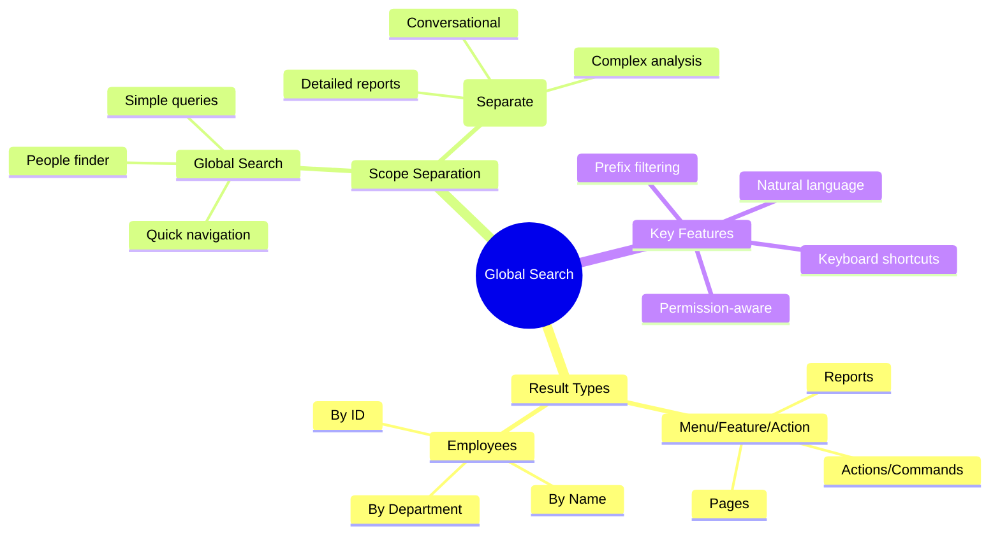
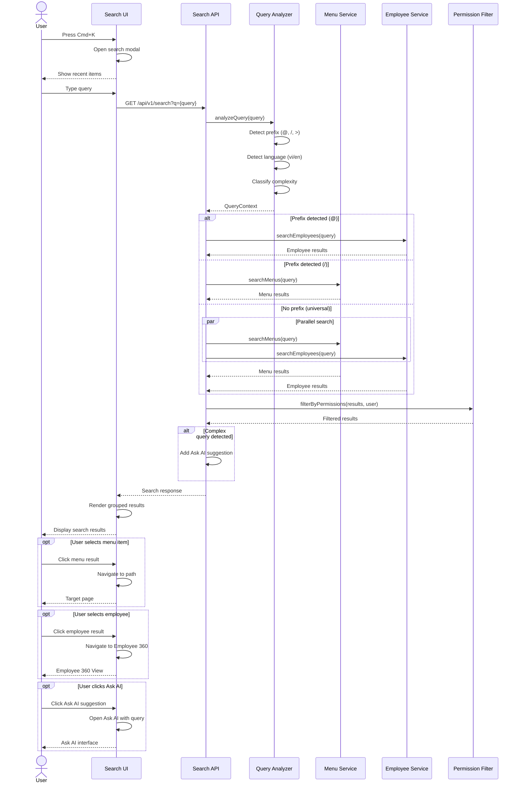

---
# === METADATA ===
id: FEAT-CO-018
type: FEATURE
module: CORE
sub_module: MASTER_DATA
title: "Global Search (Tìm Kiếm Toàn Cục)"
version: "1.0.0"
status: DRAFT
priority: HIGH
phase: 1

# === ACTORS ===
actors:
  - All Users
  - HR Administrator
  - HR Manager
  - Employee

# === TRIGGERS ===
triggers:
  - "User presses Cmd+K / Ctrl+K keyboard shortcut"
  - "User clicks on search bar in global header"
  - "User types in quick search field"

# === PRE-CONDITIONS ===
preconditions:
  - "User is authenticated"
  - "User has access to at least one module/feature"
  - "Search index is available and up-to-date"

# === POST-CONDITIONS ===
postconditions:
  - "Search results displayed within 200ms"
  - "Results filtered by user permissions"
  - "Navigation to selected result"
  - "Search query logged for analytics"

# === USER STORY ===
user_story:
  as: "Any system user"
  i_want: "quickly search for menu items, features, actions, or employees using natural language or keywords"
  so_that: "I can navigate to desired pages or find people without memorizing menu hierarchy or browsing through complex navigation"

# === ACCEPTANCE CRITERIA (Gherkin) ===
acceptance_criteria:
  - scenario: "Search for menu item by keyword"
    given: "User is logged in and has access to Payroll module"
    when: "User opens Global Search and types 'payroll'"
    then: |
      Menu/Feature section shows: "Payroll Dashboard", "Run Payroll", "Payroll Reports"
      AND Each result shows icon, title, and path (e.g., "HR > Payroll > Dashboard")
      AND Click navigates to selected page

  - scenario: "Search for employee by name"
    given: "Employee Nguyễn Văn A exists in system"
    when: "User types 'nguyen van'"
    then: |
      Employee section shows matching employees with:
        - Profile photo (or initials)
        - Full name
        - Position and Department
      AND Click opens Employee 360 View
      AND Shows max 5 employee results with "View All (15)" link

  - scenario: "Natural language query for navigation"
    given: "User wants to add new employee"
    when: "User types 'thêm nhân viên mới' or 'add new employee'"
    then: |
      Menu/Action section shows "Hire Employee" action at top
      AND Related menus like "Employee Management" also shown
      AND Click triggers Hire Employee workflow

  - scenario: "Complex query handoff to Ask AI"
    given: "User types complex question like 'nhân viên nào có thâm niên trên 5 năm trong phòng IT'"
    when: "System detects complex analytical query"
    then: |
      Results show "🤖 Ask AI" option at bottom
      AND Description: "Câu hỏi phức tạp? Hãy thử Ask AI để phân tích chi tiết"
      AND Click opens Ask AI feature with pre-filled query

  - scenario: "Use prefix for targeted search"
    given: "User wants to search only employees"
    when: "User types '@nguyen'"
    then: |
      Only Employee results are shown (no menu/action results)
      AND Prefix indicator shows "Tìm nhân viên: nguyen"
  
  - scenario: "Empty state with recent items"
    given: "User opens Global Search without typing"
    when: "Search bar is focused"
    then: |
      Recent searches shown (up to 5)
      AND Frequently accessed pages shown
      AND Keyboard shortcuts hint displayed

# === DATA CONTRACT ===
data_contract:
  input:
    query: "string"
    options:
      limit: "number"
      includeEmployees: "boolean"
      includeMenus: "boolean"
      employeeOnly: "boolean"
  
  output:
    menus:
      - menuId: "string"
        title: "string"
        titleVi: "string"
        path: "string"
        breadcrumb: "string"
        icon: "string"
        type: "'page' | 'action' | 'report'"
        moduleCode: "string"
        keywords: "string[]"
        matchScore: "number"
    
    employees:
      - employeeId: "string"
        workerId: "string"
        fullName: "string"
        photoUrl: "string?"
        position: "string"
        department: "string"
        email: "string"
        employeeNumber: "string"
        status: "string"
        matchScore: "number"
    
    hasMore:
      employees: "boolean"
      menus: "boolean"
    
    suggestion:
      askAiAvailable: "boolean"
      askAiPrompt: "string?"
      reason: "string?"
    
    meta:
      queryTime: "number"
      totalEmployees: "number"
      totalMenus: "number"

# === REFERENCES TO EXTERNAL DOCS ===
requirements:
  - "[[FR-NAV-001]]"  # Global Navigation
  - "[[FR-WRK-020]]"  # Worker Search

business_rules:
  - "[[BR-SEC-001]]"  # Permission-based visibility

related_ontology:
  - "[[Worker]]"
  - "[[Employee]]"

related_features:
  - "[[FEAT-CO-016]]"  # Employee 360 View (destination from search)

concept_guides:
  - "00-global/note/globalsearch-analyze.md"
---

# Global Search (Tìm Kiếm Toàn Cục)

> **Feature**: Unified search interface for quick navigation and people finding

## 1. Overview



## 2. User Story

**As** any system user  
**I want to** quickly search for menu items, features, actions, or employees using natural language or keywords  
**So that** I can navigate to desired pages or find people without memorizing menu hierarchy or browsing through complex navigation

## 3. Business Context

### Problem Statement
Users often struggle to:
- Find specific features in deep menu hierarchies
- Remember exact menu paths for infrequent tasks
- Quickly locate employees without navigating to Employee List

### Solution: Global Search
A command-palette style search that returns **exactly 2 result types**:
1. **Menu/Feature/Action** - Quick navigation to any page, action, or report
2. **Employees** - Find people and open their profiles

### Scope Separation

| Feature | Purpose | Result Types |
|---------|---------|--------------|
| **Global Search** (this feature) | Quick navigation + People finder | Menu/Action + Employee only |
| **Ask AI** (separate feature) | Complex analysis, conversational AI | Diverse, complex responses |

When query is too complex for Global Search, it offers handoff to Ask AI.

### Industry Benchmark

| Vendor | Feature | Key Pattern |
|--------|---------|-------------|
| **Workday** | Global Search | Prefixes (bp:, worker:), category filters, predictive search |
| **SAP SuccessFactors** | People Search + Action Search | Separate but unified UI, fuzzy matching, paraphrases |
| **Oracle HCM** | Global Search → Spotlight | Search leads to Person Spotlight for actions |

## 4. Acceptance Criteria

### Scenario 1: Search for menu item by keyword

```gherkin
Given User is logged in and has access to Payroll module
When User opens Global Search (Cmd+K) and types "payroll"
Then Menu/Feature section displays:
  | Icon | Title             | Path                         |
  | 📊   | Payroll Dashboard | HR > Payroll > Dashboard     |
  | ▶️   | Run Payroll       | HR > Payroll > Actions       |
  | 📈   | Payroll Reports   | HR > Payroll > Reports       |
And Results are sorted by relevance score
And Clicking any result navigates to that page
And Items user cannot access are NOT shown (permission filter)
```

### Scenario 2: Search for employee by name

```gherkin
Given System has employees:
  | Name           | Position           | Department    |
  | Nguyễn Văn A   | Senior Engineer    | Engineering   |
  | Nguyễn Thị B   | Product Manager    | Product       |
  | Trần Văn C     | HR Specialist      | Human Resources|
When User types "nguyen"
Then Employee section shows (max 5):
  |─────────────────────────────────────────────────────|
  | 👤 EMPLOYEES (2 results)                [View All] |
  |─────────────────────────────────────────────────────|
  | [📷] Nguyễn Văn A                                  |
  |      Senior Engineer • Engineering                  |
  |─────────────────────────────────────────────────────|
  | [📷] Nguyễn Thị B                                  |
  |      Product Manager • Product                      |
  |─────────────────────────────────────────────────────|
And Clicking employee opens their Employee 360 View
And Partial matches work: "ngu", "van a", "nguyen a"
And Vietnamese diacritics handled: "nguyen" matches "Nguyễn"
```

### Scenario 3: Natural language query

```gherkin
Given User wants to add a new employee
When User types "thêm nhân viên mới" OR "add new employee"
Then System recognizes navigation intent
And Menu/Action section shows at top:
  | Icon | Title          | Type   |
  | ▶️   | Hire Employee  | Action |
  | 📋   | Employee List  | Page   |
And "Hire Employee" has highest relevance because it matches intent
```

### Scenario 4: Complex query handoff

```gherkin
Given User types "nhân viên nào có thâm niên trên 5 năm trong phòng IT"
When System analyzes query complexity
Then Query is detected as "analytical" (not navigational)
And Results show normal matches (if any)
And Bottom section shows:
  |─────────────────────────────────────────────────────|
  | 🤖 ASK AI                                    [→]   |
  | Câu hỏi phức tạp? Thử Ask AI để phân tích chi tiết |
  |─────────────────────────────────────────────────────|
And Clicking opens Ask AI with pre-filled query
```

### Scenario 5: Prefix filtering

```gherkin
Given User wants to search only employees
When User types "@nguyen"
Then ONLY employee results shown (no menu/action)
And Header shows: "Tìm nhân viên: nguyen"
And Prefix is visually highlighted

Examples of prefixes:
  | Prefix | Scope                    |
  | @      | Employees only           |
  | /      | Menu/Pages only          |
  | >      | Actions/Commands only    |
  | ?      | Show help with prefixes  |
```

### Scenario 6: Empty state with recent items

```gherkin
Given User opens Global Search without typing
When Search bar is focused (empty query)
Then Display:
  |─────────────────────────────────────────────────────|
  | 🔍 Global Search                          [Cmd+K] |
  |─────────────────────────────────────────────────────|
  | 🕐 RECENT SEARCHES                                 |
  |    • payroll                                       |
  |    • nguyen van a                                  |
  |    • leave request                                 |
  |─────────────────────────────────────────────────────|
  | ⭐ FREQUENTLY ACCESSED                             |
  |    • Employee Management                           |
  |    • My Profile                                    |
  |    • Attendance Dashboard                          |
  |─────────────────────────────────────────────────────|
  | 💡 TIP: @ for people, / for pages, ? for help     |
  |─────────────────────────────────────────────────────|
```

## 5. Data Contract

### Input Schema (JSON5)

```json5
{
  query: "thêm nhân viên",  // User's search query
  
  options: {
    limit: 10,              // Max results per category
    includeEmployees: true, // Include employee search
    includeMenus: true,     // Include menu/action search
    employeeOnly: false     // Force employee-only mode (@ prefix)
  }
}
```

### Output Schema (JSON5)

```json5
{
  // Menu/Feature/Action Results
  menus: [
    {
      menuId: "menu-hire-001",
      title: "Hire Employee",
      titleVi: "Tuyển Nhân Viên",
      path: "/hr/employment/hire",
      breadcrumb: "HR > Employment > Hire",
      icon: "user-plus",
      type: "action",
      moduleCode: "CO",
      keywords: ["hire", "add", "new", "employee", "tuyển", "thêm"],
      matchScore: 0.95
    },
    {
      menuId: "menu-emp-list",
      title: "Employee Management",
      titleVi: "Quản Lý Nhân Viên",
      path: "/hr/employees",
      breadcrumb: "HR > Employees",
      icon: "users",
      type: "page",
      moduleCode: "CO",
      keywords: ["employee", "list", "manage", "nhân viên"],
      matchScore: 0.7
    }
  ],
  
  // Employee Results
  employees: [
    {
      employeeId: "EMP-001",
      workerId: "W-001",
      fullName: "Nguyễn Văn A",
      photoUrl: "/photos/emp-001.jpg",
      position: "Senior Software Engineer",
      department: "Engineering",
      email: "nguyen.a@company.com",
      employeeNumber: "EMP-VN-001",
      status: "ACTIVE",
      matchScore: 0.92
    }
  ],
  
  // Pagination hints
  hasMore: {
    employees: true,      // More employees available
    menus: false          // All menus shown
  },
  
  // Ask AI suggestion (for complex queries)
  suggestion: {
    askAiAvailable: true,
    askAiPrompt: "nhân viên nào có thâm niên trên 5 năm trong phòng IT",
    reason: "Analytical query detected - Ask AI can provide detailed analysis"
  },
  
  // Performance metadata
  meta: {
    queryTime: 45,        // milliseconds
    totalEmployees: 15,   // total matches (before limit)
    totalMenus: 3
  }
}
```

## 6. Activities Flow



## 7. UI Sketch

### Desktop View - Search Modal

```
┌──────────────────────────────────────────────────────────────────────────────┐
│                                                                              │
│  ┌────────────────────────────────────────────────────────────────────────┐  │
│  │ 🔍 | thêm nhân viên                                            [Esc]  │  │
│  └────────────────────────────────────────────────────────────────────────┘  │
│                                                                              │
│  ╭────────────────────────────────────────────────────────────────────────╮  │
│  │                                                                        │  │
│  │  📋 MENU / ACTIONS                                                    │  │
│  │  ──────────────────────────────────────────────────────────────────── │  │
│  │                                                                        │  │
│  │  ▶️  Hire Employee                                          [Enter ↵] │  │
│  │      HR > Employment > Actions                                        │  │
│  │                                                                        │  │
│  │  📋  Employee Management                                              │  │
│  │      HR > Employees                                                   │  │
│  │                                                                        │  │
│  │  📊  Employee Reports                                                 │  │
│  │      HR > Reports > Employees                                         │  │
│  │                                                                        │  │
│  ├────────────────────────────────────────────────────────────────────────┤  │
│  │                                                                        │  │
│  │  👥 EMPLOYEES (2 matches)                              [View All →]   │  │
│  │  ──────────────────────────────────────────────────────────────────── │  │
│  │                                                                        │  │
│  │  [📷] Nguyễn Văn A                                                    │  │
│  │       Senior Engineer • Engineering                                   │  │
│  │                                                                        │  │
│  │  [📷] Nguyễn Thị B                                                    │  │
│  │       HR Manager • Human Resources                                    │  │
│  │                                                                        │  │
│  ╰────────────────────────────────────────────────────────────────────────╯  │
│                                                                              │
│  ┌────────────────────────────────────────────────────────────────────────┐  │
│  │  ↑↓ Navigate   ↵ Select   @ People   / Pages   Esc Close             │  │
│  └────────────────────────────────────────────────────────────────────────┘  │
│                                                                              │
└──────────────────────────────────────────────────────────────────────────────┘
```

### Desktop View - Complex Query with Ask AI Suggestion

```
┌──────────────────────────────────────────────────────────────────────────────┐
│                                                                              │
│  ┌────────────────────────────────────────────────────────────────────────┐  │
│  │ 🔍 | nhân viên có thâm niên trên 5 năm phòng IT                [Esc]  │  │
│  └────────────────────────────────────────────────────────────────────────┘  │
│                                                                              │
│  ╭────────────────────────────────────────────────────────────────────────╮  │
│  │                                                                        │  │
│  │  👥 EMPLOYEES (3 matches)                              [View All →]   │  │
│  │  ──────────────────────────────────────────────────────────────────── │  │
│  │                                                                        │  │
│  │  [📷] Trần Văn B                                                      │  │
│  │       Tech Lead • IT Department                                       │  │
│  │                                                                        │  │
│  │  [📷] Lê Thị C                                                        │  │
│  │       System Administrator • IT Department                            │  │
│  │                                                                        │  │
│  ├────────────────────────────────────────────────────────────────────────┤  │
│  │                                                                        │  │
│  │  🤖 ASK AI                                                     [→]   │  │
│  │  ──────────────────────────────────────────────────────────────────── │  │
│  │  Câu hỏi phức tạp? Ask AI có thể:                                     │  │
│  │  • Phân tích chi tiết theo tiêu chí                                   │  │
│  │  • Lọc nhân viên theo thâm niên chính xác                             │  │
│  │  • Xuất báo cáo đầy đủ                                                │  │
│  │                                                                        │  │
│  ╰────────────────────────────────────────────────────────────────────────╯  │
│                                                                              │
└──────────────────────────────────────────────────────────────────────────────┘
```

### Mobile View

```
┌────────────────────────────┐
│  ← Global Search           │
├────────────────────────────┤
│ ┌────────────────────────┐ │
│ │ 🔍 Search...           │ │
│ └────────────────────────┘ │
│                            │
│ 🕐 RECENT                  │
│ ──────────────────────     │
│ • payroll                  │
│ • nguyen van a             │
│                            │
│ ⭐ QUICK ACCESS            │
│ ──────────────────────     │
│ ▸ My Profile               │
│ ▸ Leave Request            │
│ ▸ Attendance               │
│                            │
│ 💡 @ for people            │
│    / for pages             │
└────────────────────────────┘

After typing "nguyen":

┌────────────────────────────┐
│  ← | nguyen           [×]  │
├────────────────────────────┤
│                            │
│ 👥 EMPLOYEES               │
│ ──────────────────────     │
│ ┌────────────────────────┐ │
│ │ [📷] Nguyễn Văn A      │ │
│ │ Senior Eng • IT      → │ │
│ └────────────────────────┘ │
│ ┌────────────────────────┐ │
│ │ [📷] Nguyễn Thị B      │ │
│ │ HR Manager • HR      → │ │
│ └────────────────────────┘ │
│                            │
│ [View All 15 Results]      │
│                            │
└────────────────────────────┘
```

## 8. Business Rules

### Search Ranking

| Factor | Weight | Description |
|--------|--------|-------------|
| Exact match | 1.0 | Query exactly matches title/name |
| Prefix match | 0.8 | Query is prefix of title/name |
| Contains | 0.6 | Query found within title/name |
| Keyword match | 0.5 | Query matches registered keywords |
| Fuzzy match | 0.3 | Levenshtein distance ≤ 2 |
| Frequency boost | +0.2 | User frequently accesses this item |
| Direct report | +0.1 | Employee reports to current user |

### Permission Rules
- Menu items filtered by user's role & module access
- Employees filtered by data scope (org unit, legal entity)
- Sensitive actions require explicit permission

### Query Complexity Detection
Queries are classified as "complex" (handoff to Ask AI) when:
- Contains comparison operators (>, <, =)
- Contains aggregation words ("tổng", "trung bình", "bao nhiêu")
- Multiple filter conditions combined
- Question words + data analysis intent

## 9. Keyboard Shortcuts

| Shortcut | Action |
|----------|--------|
| `Cmd/Ctrl + K` | Open Global Search |
| `↑ / ↓` | Navigate results |
| `Enter` | Select highlighted result |
| `@` | Switch to employee-only mode |
| `/` | Switch to menu-only mode |
| `Esc` | Close search |
| `Tab` | Autocomplete suggestion |

## 10. Integration Points

### Entry Points
- Global header search bar
- Keyboard shortcut (Cmd+K)
- Mobile app search tab

### Exit Points
- Menu item → Navigate to target page
- Employee → Employee 360 View
- Ask AI suggestion → Ask AI feature (separate)
- View All → Full search results page

### Related Features
- **Ask AI** (FEAT-CO-019) - Handoff for complex queries
- **Employee 360** (FEAT-CO-016) - Destination for employee clicks
- **Menu Registry** - Source for menu/action data

## 11. Success Metrics

| Metric | Target | Description |
|--------|--------|-------------|
| Response Time | < 200ms | P95 search response |
| Accuracy | > 90% | First result is intended target |
| Adoption | > 70% | Users using Global Search weekly |
| Ask AI Handoff | < 15% | Complex queries needing AI |
| Zero Results | < 5% | Searches with no results |
