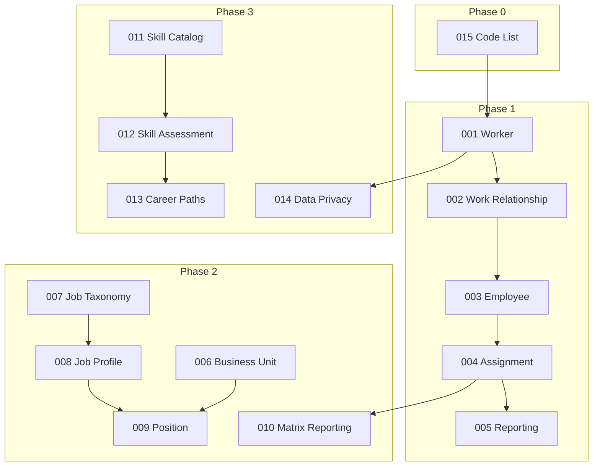

# Core Module Features

> **Thư mục này chứa Feature Specification Documents (`*.feat.md`)** cho module Core HR - xTalent HCM.

## Tổng quan

Mỗi feature document mô tả **HOW to implement** một user journey cụ thể, bao gồm:
- YAML metadata (data for AI)
- User Story, Acceptance Criteria (Gherkin)
- Data Contract (JSON5)
- Activities Flow (sequenceDiagram)
- UI Sketch (wireframe)

## Cấu trúc thư mục

```
03-features/
├── README.md                    # File này
├── _index.md                    # Danh mục features (YAML + Table)
├── 01-person/                   # Person Management
│   ├── create-worker.feat.md
│   ├── update-worker.feat.md
│   └── manage-documents.feat.md
├── 02-employment/               # Employment Management
│   ├── hire-employee.feat.md
│   ├── create-contract.feat.md
│   ├── transfer-employee.feat.md
│   └── terminate-employment.feat.md
├── 03-organization/             # Organization Structure
│   ├── manage-legal-entity.feat.md
│   ├── manage-business-unit.feat.md
│   └── view-org-chart.feat.md
├── 04-job-position/             # Job & Position
│   ├── manage-job-catalog.feat.md
│   ├── create-position.feat.md
│   └── define-career-path.feat.md
├── 05-master-data/              # Master Data & Configuration
│   ├── manage-code-list.feat.md
│   └── manage-skill-catalog.feat.md
└── 06-eligibility/              # Eligibility Management
    ├── create-eligibility-profile.feat.md
    └── evaluate-eligibility.feat.md
```

## Tài liệu liên quan

| Tài liệu | Đường dẫn | Mô tả |
|----------|-----------|-------|
| **FRS** | `01-functional-requirements/` | Chi tiết Functional Requirements |
| **BRS** | `00-business-rules/` | Chi tiết Business Rules |
| **Ontology** | `00-ontology/domain/` | Entity definitions |
| **FEATURE-LIST** | `FEATURE-LIST.yaml` | Master feature catalog |

## Quy ước đặt tên

- **File**: `{action}-{noun}.feat.md` (ví dụ: `create-worker.feat.md`)
- **FEAT ID**: `FEAT-CO-{NNN}` (ví dụ: `FEAT-CO-001`)
- **Sub-module folder**: `{NN}-{sub-module-name}/`

## Phụ thuộc



## Trạng thái

| Status | Count |
|--------|-------|
| PLANNED | 15 |
| IN_PROGRESS | 0 |
| COMPLETED | 0 |
