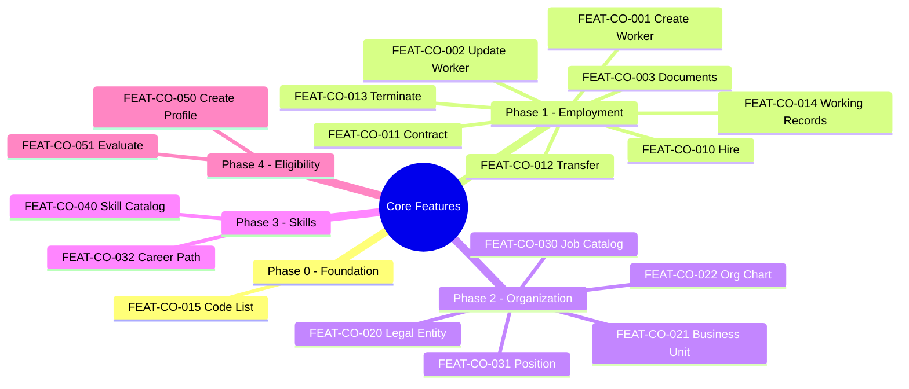
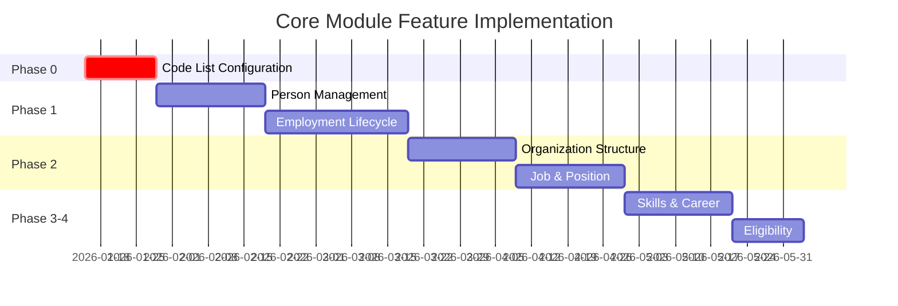

---
# ═══════════════════════════════════════════════════════════════════
# Core Module - Feature Index
# ═══════════════════════════════════════════════════════════════════
module: CO
version: "2.0.0"
last_updated: "2026-01-08"
status: ACTIVE

# Tóm tắt Features
summary:
  total: 18
  by_phase:
    phase_0_foundation: 1
    phase_1_core_employment: 6
    phase_2_organization_jobs: 5
    phase_3_skills_advanced: 4
    phase_4_eligibility: 2
  by_priority:
    CRITICAL: 1
    HIGH: 4
    MEDIUM: 9
    LOW: 4
  by_status:
    PLANNED: 18
    IN_PROGRESS: 0
    COMPLETED: 0

# ═══════════════════════════════════════════════════════════════════
# FEATURE LIST BY SUB-MODULE
# ═══════════════════════════════════════════════════════════════════
features:
  # ─────────────────────────────────────────────────────────────────
  # 01-PERSON: Person/Worker Management
  # ─────────────────────────────────────────────────────────────────
  01-person:
    - id: FEAT-CO-001
      name: create-worker
      title: "Create Worker Profile"
      priority: HIGH
      phase: 1
      status: PLANNED
      file: 01-person/create-worker.feat.md
      frs_refs: ["FR-WRK-001", "FR-WRK-004", "FR-WRK-005"]
      brs_refs: ["BR-WRK-001", "BR-WRK-002", "BR-WRK-003"]
      entities: ["Worker", "Contact", "Address"]
      
    - id: FEAT-CO-002
      name: update-worker
      title: "Update Worker Profile"
      priority: HIGH
      phase: 1
      status: PLANNED
      file: 01-person/update-worker.feat.md
      frs_refs: ["FR-WRK-002", "FR-WRK-003"]
      brs_refs: ["BR-WRK-004"]
      entities: ["Worker"]
      
    - id: FEAT-CO-003
      name: manage-documents
      title: "Manage Worker Documents"
      priority: HIGH
      phase: 1
      status: PLANNED
      file: 01-person/manage-documents.feat.md
      frs_refs: ["FR-WRK-010", "FR-WRK-015"]
      brs_refs: ["BR-WRK-005", "BR-WRK-010"]
      entities: ["Worker", "Document"]

  # ─────────────────────────────────────────────────────────────────
  # 02-EMPLOYMENT: Employment Lifecycle
  # ─────────────────────────────────────────────────────────────────
  02-employment:
    - id: FEAT-CO-010
      name: hire-employee
      title: "Hire Employee"
      priority: HIGH
      phase: 1
      status: PLANNED
      file: 02-employment/hire-employee.feat.md
      frs_refs: ["FR-WR-001", "FR-EMP-001", "FR-ASG-001"]
      brs_refs: ["BR-WR-001", "BR-EMP-001", "BR-ASG-001"]
      entities: ["Worker", "Employee", "WorkRelationship", "Contract", "Assignment"]
      workflow: true
      
    - id: FEAT-CO-011
      name: create-contract
      title: "Create Employment Contract"
      priority: HIGH
      phase: 1
      status: PLANNED
      file: 02-employment/create-contract.feat.md
      frs_refs: ["FR-CTR-001", "FR-CTR-002", "FR-CTR-003"]
      brs_refs: ["BR-CTR-001", "BR-CTR-002"]
      entities: ["Contract", "ContractTemplate"]
      
    - id: FEAT-CO-012
      name: transfer-employee
      title: "Transfer Employee"
      priority: MEDIUM
      phase: 1
      status: PLANNED
      file: 02-employment/transfer-employee.feat.md
      frs_refs: ["FR-ASG-015", "FR-ASG-016"]
      brs_refs: ["BR-ASG-015"]
      entities: ["Employee", "Assignment"]
      workflow: true
      
    - id: FEAT-CO-013
      name: terminate-employment
      title: "Terminate Employment"
      priority: HIGH
      phase: 1
      status: PLANNED
      file: 02-employment/terminate-employment.feat.md
      frs_refs: ["FR-WR-003", "FR-ASG-003"]
      brs_refs: ["BR-WR-010"]
      entities: ["Employee", "WorkRelationship", "Contract"]
      workflow: true
      
    - id: FEAT-CO-014
      name: view-working-records
      title: "View Working Records (Hồ Sơ Làm Việc)"
      priority: MEDIUM
      phase: 1
      status: PLANNED
      file: 02-employment/view-working-records.feat.md
      frs_refs: ["FR-EMP-020", "FR-ASG-025"]
      brs_refs: []
      entities: ["Employee", "Assignment", "Contract", "WorkRelationship"]

  # ─────────────────────────────────────────────────────────────────
  # 03-ORGANIZATION: Organization Structure
  # ─────────────────────────────────────────────────────────────────
  03-organization:
    - id: FEAT-CO-020
      name: manage-legal-entity
      title: "Manage Legal Entities"
      priority: MEDIUM
      phase: 2
      status: PLANNED
      file: 03-organization/manage-legal-entity.feat.md
      frs_refs: ["FR-LE-001", "FR-LE-002"]
      brs_refs: ["BR-LE-001"]
      entities: ["LegalEntity", "EntityProfile"]
      
    - id: FEAT-CO-021
      name: manage-business-unit
      title: "Manage Business Units"
      priority: MEDIUM
      phase: 2
      status: PLANNED
      file: 03-organization/manage-business-unit.feat.md
      frs_refs: ["FR-BU-001", "FR-BU-002", "FR-BU-005"]
      brs_refs: ["BR-BU-001", "BR-BU-002", "BR-BU-003"]
      entities: ["BusinessUnit", "OrgRelationEdge"]
      
    - id: FEAT-CO-022
      name: view-org-chart
      title: "View Organization Chart"
      priority: MEDIUM
      phase: 2
      status: PLANNED
      file: 03-organization/view-org-chart.feat.md
      frs_refs: ["FR-BU-010"]
      brs_refs: []
      entities: ["BusinessUnit", "Position", "Employee"]

  # ─────────────────────────────────────────────────────────────────
  # 04-JOB-POSITION: Job & Position Management
  # ─────────────────────────────────────────────────────────────────
  04-job-position:
    - id: FEAT-CO-030
      name: manage-job-catalog
      title: "Manage Job Catalog"
      priority: MEDIUM
      phase: 2
      status: PLANNED
      file: 04-job-position/manage-job-catalog.feat.md
      frs_refs: ["FR-TAX-001", "FR-TAX-002", "FR-TAX-005"]
      brs_refs: ["BR-TAX-001", "BR-TAX-002"]
      entities: ["TaxonomyTree", "JobTaxonomy", "Job"]
      
    - id: FEAT-CO-031
      name: create-position
      title: "Create Position"
      priority: MEDIUM
      phase: 2
      status: PLANNED
      file: 04-job-position/create-position.feat.md
      frs_refs: ["FR-POS-001", "FR-POS-002", "FR-POS-005"]
      brs_refs: ["BR-POS-001", "BR-POS-002"]
      entities: ["Position", "Job", "BusinessUnit"]
      
    - id: FEAT-CO-032
      name: define-career-path
      title: "Define Career Paths"
      priority: LOW
      phase: 3
      status: PLANNED
      file: 04-job-position/define-career-path.feat.md
      frs_refs: ["FR-CAR-001", "FR-CAR-002"]
      brs_refs: ["BR-CAR-001"]
      entities: ["CareerPath", "JobProgression"]

  # ─────────────────────────────────────────────────────────────────
  # 05-MASTER-DATA: Master Data & Configuration
  # ─────────────────────────────────────────────────────────────────
  05-master-data:
    - id: FEAT-CO-015
      name: manage-code-list
      title: "Code List & Configuration Management"
      priority: CRITICAL
      phase: 0
      status: PLANNED
      file: 05-master-data/manage-code-list.feat.md
      frs_refs: ["FR-CFG-001", "FR-CFG-002", "FR-CFG-010"]
      brs_refs: ["BR-CFG-001", "BR-CFG-002"]
      entities: ["CodeList", "Currency", "TimeZone", "Country"]
      note: "FOUNDATIONAL - must be implemented FIRST"
      
    - id: FEAT-CO-040
      name: manage-skill-catalog
      title: "Skill Catalog Management"
      priority: LOW
      phase: 3
      status: PLANNED
      file: 05-master-data/manage-skill-catalog.feat.md
      frs_refs: ["FR-SKL-001", "FR-SKL-002", "FR-SKL-003"]
      brs_refs: ["BR-SKL-001", "BR-SKL-002"]
      entities: ["SkillMaster", "SkillCategory", "CompetencyMaster"]

  # ─────────────────────────────────────────────────────────────────
  # 06-ELIGIBILITY: Eligibility Management
  # ─────────────────────────────────────────────────────────────────
  06-eligibility:
    - id: FEAT-CO-050
      name: create-eligibility-profile
      title: "Create Eligibility Profile"
      priority: MEDIUM
      phase: 4
      status: PLANNED
      file: 06-eligibility/create-eligibility-profile.feat.md
      frs_refs: ["FR-ELG-001", "FR-ELG-002"]
      brs_refs: ["BR-ELG-001"]
      entities: ["EligibilityProfile", "EligibilityMember"]
      
    - id: FEAT-CO-051
      name: evaluate-eligibility
      title: "Evaluate Eligibility"
      priority: MEDIUM
      phase: 4
      status: PLANNED
      file: 06-eligibility/evaluate-eligibility.feat.md
      frs_refs: ["FR-ELG-010", "FR-ELG-011"]
      brs_refs: ["BR-ELG-010"]
      entities: ["EligibilityProfile", "EligibilityEvaluation", "Worker"]

# ═══════════════════════════════════════════════════════════════════
# DEPRECATED FEATURES
# ═══════════════════════════════════════════════════════════════════
deprecated:
  - id: FEAT-CO-005
    title: "Basic Reporting"
    reason: "Moved to separate Reporting module"
    deprecated_date: "2026-01-08"
    
  - id: FEAT-CO-014
    title: "Data Privacy & Compliance"
    reason: "Merged into cross-cutting Security module"
    deprecated_date: "2026-01-08"
---

# Feature Index: Core Module

> **Note**: YAML above is data for AI processing. Tables below are for human reading.

## Tổng quan

Module Core chứa **18 features** được phân chia theo 5 phases:

## Feature Catalog

### 01-PERSON: Person Management

| ID | Feature | Priority | Phase | Status |
|----|---------|----------|-------|--------|
| FEAT-CO-001 | [Create Worker Profile](01-person/create-worker.feat.md) | HIGH | 1 | PLANNED |
| FEAT-CO-002 | [Update Worker Profile](01-person/update-worker.feat.md) | HIGH | 1 | PLANNED |
| FEAT-CO-003 | [Manage Worker Documents](01-person/manage-documents.feat.md) | HIGH | 1 | PLANNED |

### 02-EMPLOYMENT: Employment Lifecycle

| ID | Feature | Priority | Phase | Status |
|----|---------|----------|-------|--------|
| FEAT-CO-010 | [Hire Employee](02-employment/hire-employee.feat.md) | HIGH | 1 | PLANNED |
| FEAT-CO-011 | [Create Employment Contract](02-employment/create-contract.feat.md) | HIGH | 1 | PLANNED |
| FEAT-CO-012 | [Transfer Employee](02-employment/transfer-employee.feat.md) | MEDIUM | 1 | PLANNED |
| FEAT-CO-013 | [Terminate Employment](02-employment/terminate-employment.feat.md) | HIGH | 1 | PLANNED |
| FEAT-CO-014 | [View Working Records](02-employment/view-working-records.feat.md) | MEDIUM | 1 | PLANNED |

### 03-ORGANIZATION: Organization Structure

| ID | Feature | Priority | Phase | Status |
|----|---------|----------|-------|--------|
| FEAT-CO-020 | [Manage Legal Entities](03-organization/manage-legal-entity.feat.md) | MEDIUM | 2 | PLANNED |
| FEAT-CO-021 | [Manage Business Units](03-organization/manage-business-unit.feat.md) | MEDIUM | 2 | PLANNED |
| FEAT-CO-022 | [View Organization Chart](03-organization/view-org-chart.feat.md) | MEDIUM | 2 | PLANNED |

### 04-JOB-POSITION: Job & Position

| ID | Feature | Priority | Phase | Status |
|----|---------|----------|-------|--------|
| FEAT-CO-030 | [Manage Job Catalog](04-job-position/manage-job-catalog.feat.md) | MEDIUM | 2 | PLANNED |
| FEAT-CO-031 | [Create Position](04-job-position/create-position.feat.md) | MEDIUM | 2 | PLANNED |
| FEAT-CO-032 | [Define Career Paths](04-job-position/define-career-path.feat.md) | LOW | 3 | PLANNED |

### 05-MASTER-DATA: Master Data & Configuration

| ID | Feature | Priority | Phase | Status |
|----|---------|----------|-------|--------|
| FEAT-CO-015 | [Code List Management](05-master-data/manage-code-list.feat.md) | **CRITICAL** | 0 | PLANNED |
| FEAT-CO-040 | [Skill Catalog Management](05-master-data/manage-skill-catalog.feat.md) | LOW | 3 | PLANNED |

### 06-ELIGIBILITY: Eligibility Management

| ID | Feature | Priority | Phase | Status |
|----|---------|----------|-------|--------|
| FEAT-CO-050 | [Create Eligibility Profile](06-eligibility/create-eligibility-profile.feat.md) | MEDIUM | 4 | PLANNED |
| FEAT-CO-051 | [Evaluate Eligibility](06-eligibility/evaluate-eligibility.feat.md) | MEDIUM | 4 | PLANNED |

## Deprecated Features

| ID | Title | Reason | Date |
|----|-------|--------|------|
| ~~FEAT-CO-005~~ | ~~Basic Reporting~~ | Moved to Reporting module | 2026-01-08 |
| ~~FEAT-CO-014~~ | ~~Data Privacy~~ | Merged into Security module | 2026-01-08 |

## Implementation Roadmap

## Tài liệu tham khảo

- **Ontology**: [entity-index.yaml](../../00-ontology/domain/entity-index.yaml)
- **Feature Catalog Research**: [feature-catalog.md](../../_research/feature-catalog.md)
- **FEATURE-LIST**: [FEATURE-LIST.yaml](../FEATURE-LIST.yaml)
