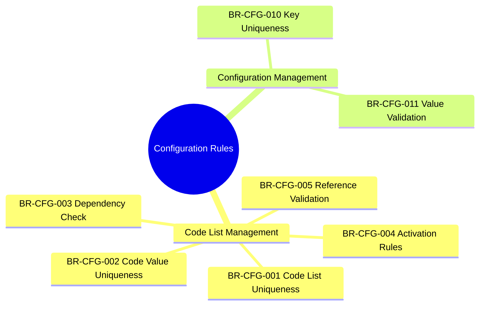
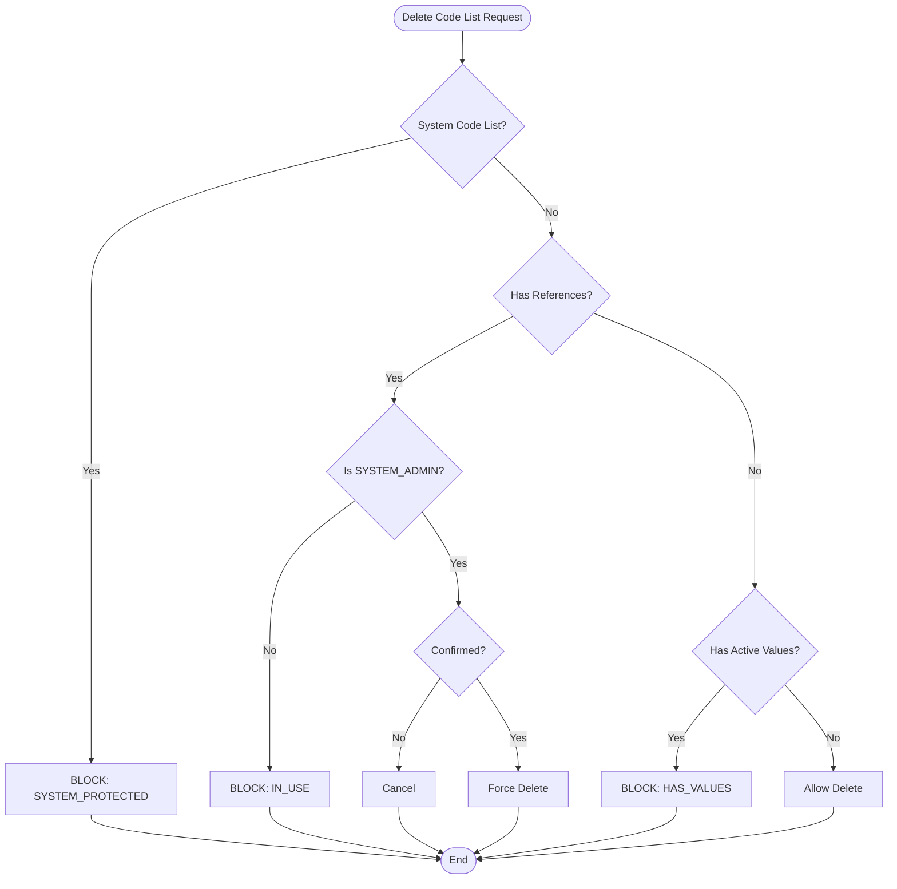
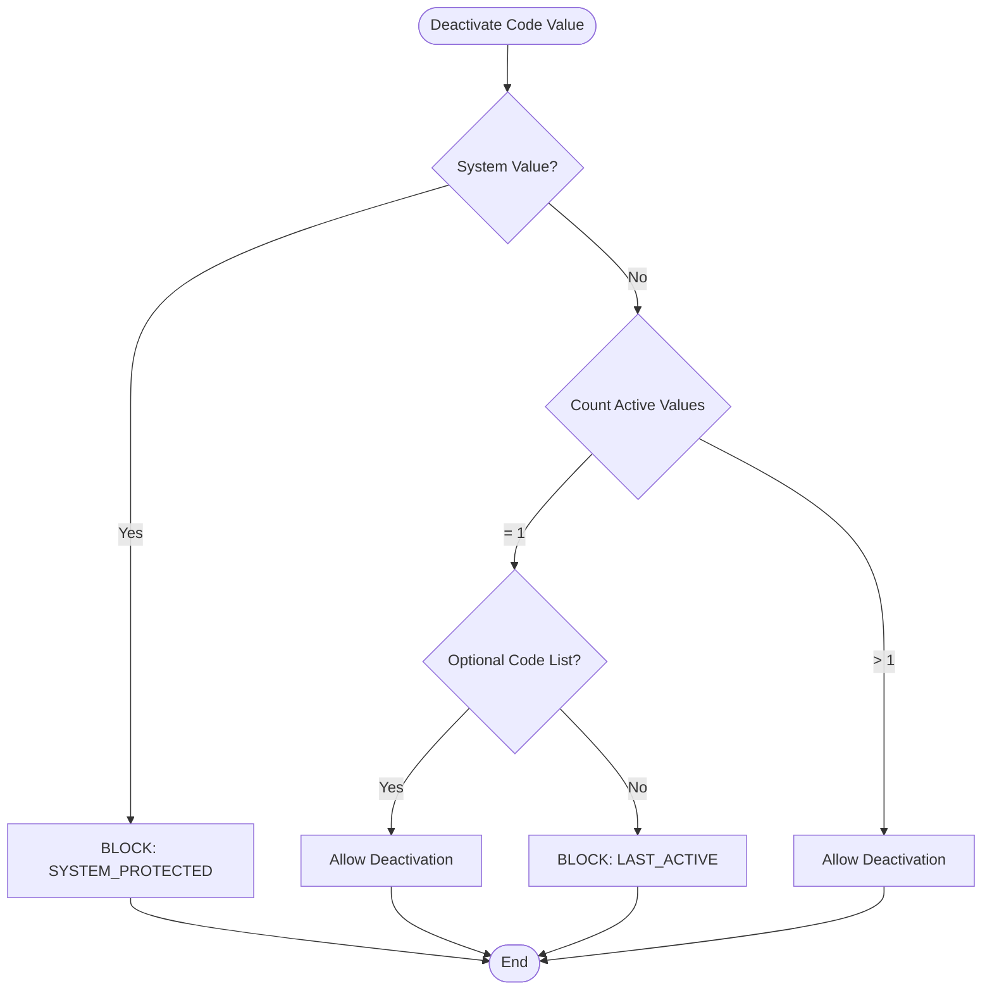

---
# === METADATA ===
id: BRS-CO-CFG
module: CORE
sub_module: CONFIGURATION
title: "Configuration & Code List Business Rules"
version: "1.0.0"
status: ACTIVE
owner: "Core Platform Team"
last_updated: "2026-01-08"
tags:
  - code-list
  - configuration
  - validation
  - master-data

# === BUSINESS RULES DATA ===
business_rules:
  - id: BR-CFG-001
    title: "Code List Uniqueness"
    description: "Code list codes must be unique across the system."
    category: Validation
    severity: BLOCK
    priority: MUST
    status: ACTIVE
    condition: "code_list.code UNIQUE (case-insensitive)"
    action: "Reject with error CODE_LIST_DUPLICATE"
    exception: "None"
    related_entities:
      - "[[CodeList]]"
    enforced_by:
      - "FR-CFG-001"
      - "FR-CFG-003"

  - id: BR-CFG-002
    title: "Code Value Uniqueness"
    description: "Code values within a code list must be unique."
    category: Validation
    severity: BLOCK
    priority: MUST
    status: ACTIVE
    condition: "code_value UNIQUE within code_list AND sort_order UNIQUE within code_list"
    action: "Reject with error CODE_VALUE_DUPLICATE"
    exception: "Inactive code values can have duplicate sort orders"
    related_entities:
      - "[[CodeValue]]"
    enforced_by:
      - "FR-CFG-002"
      - "FR-CFG-004"

  - id: BR-CFG-003
    title: "Code List Dependency Check"
    description: "Code lists with dependencies cannot be deleted."
    category: Workflow
    severity: WARN
    priority: SHOULD
    status: ACTIVE
    condition: "code_list.referenced_by.count > 0 OR code_list.active_values.count > 0"
    action: "Reject deletion with error CODE_LIST_IN_USE"
    exception: "Force delete allowed for SYSTEM_ADMIN with confirmation"
    related_entities:
      - "[[CodeList]]"
    enforced_by:
      - "FR-CFG-005"
      - "FR-CFG-015"

  - id: BR-CFG-004
    title: "Code Value Activation Rules"
    description: "Code value activation/deactivation must preserve system integrity."
    category: Workflow
    severity: WARN
    priority: SHOULD
    status: ACTIVE
    condition: "code_list.active_values.count >= 1 (after deactivation)"
    action: "Reject deactivation with error CODE_VALUE_LAST_ACTIVE"
    exception: "Optional code lists can have all values deactivated"
    related_entities:
      - "[[CodeValue]]"
    enforced_by:
      - "FR-CFG-004"
      - "FR-CFG-006"

  - id: BR-CFG-005
    title: "Code List Reference Validation"
    description: "All code list references must point to valid, active code values."
    category: Validation
    severity: BLOCK
    priority: MUST
    status: ACTIVE
    condition: "code_value EXISTS in code_list AND code_value.is_active = true"
    action: "Reject with error CODE_VALUE_NOT_FOUND or CODE_VALUE_INACTIVE"
    exception: "Historical records can reference inactive code values"
    related_entities:
      - "[[CodeValue]]"
      - "All entities with code list references"
    enforced_by:
      - "FR-CFG-002"
      - "FR-CFG-004"

  - id: BR-CFG-010
    title: "Configuration Key Uniqueness"
    description: "Configuration keys must be unique and follow naming conventions."
    category: Validation
    severity: BLOCK
    priority: MUST
    status: ACTIVE
    condition: "config.key UNIQUE AND key MATCHES '^[a-z0-9_]{3,100}$'"
    action: "Reject with error CONFIG_KEY_DUPLICATE or CONFIG_KEY_INVALID_FORMAT"
    exception: "None"
    related_entities:
      - "[[Configuration]]"
    enforced_by:
      - "FR-CFG-010"
      - "FR-CFG-011"

  - id: BR-CFG-011
    title: "Configuration Value Validation"
    description: "Configuration values must be validated based on data type and constraints."
    category: Validation
    severity: BLOCK
    priority: MUST
    status: ACTIVE
    condition: "value MATCHES config.data_type validation rules"
    action: "Reject with error CONFIG_VALUE_INVALID"
    exception: "None"
    related_entities:
      - "[[Configuration]]"
    enforced_by:
      - "FR-CFG-011"

# === RELATED ONTOLOGY ===
related_ontology:
  - "[[CodeList]]"
  - "[[CodeValue]]"
  - "[[Configuration]]"
  - "[[Currency]]"
  - "[[TimeZone]]"
  - "[[Country]]"
  - "[[AdminArea]]"
---

# Business Rules: Configuration & Code Lists

> **Scope**: This BRS file defines all business rules for Configuration Management and Code List Management in the Core module. These are foundational rules that ensure data integrity across the entire HCM system.

## 1. Rule Scope



## 2. Rule Catalog

| ID | Rule | Category | Severity | Status |
|----|------|----------|----------|--------|
| `[[BR-CFG-001]]` | **Code List Uniqueness**<br>Code list codes must be unique (case-insensitive) | Validation | BLOCK | ACTIVE |
| `[[BR-CFG-002]]` | **Code Value Uniqueness**<br>Code values and sort orders must be unique within code list | Validation | BLOCK | ACTIVE |
| `[[BR-CFG-003]]` | **Code List Dependency Check**<br>Code lists with dependencies cannot be deleted | Workflow | WARN | ACTIVE |
| `[[BR-CFG-004]]` | **Code Value Activation Rules**<br>At least one code value must remain active | Workflow | WARN | ACTIVE |
| `[[BR-CFG-005]]` | **Code List Reference Validation**<br>All code references must be valid and active | Validation | BLOCK | ACTIVE |
| `[[BR-CFG-010]]` | **Configuration Key Uniqueness**<br>Config keys must be unique and use snake_case | Validation | BLOCK | ACTIVE |
| `[[BR-CFG-011]]` | **Configuration Value Validation**<br>Config values must match data type constraints | Validation | BLOCK | ACTIVE |

## 3. Detailed Specifications

### [[BR-CFG-001]] Code List Uniqueness

*   **Priority**: MUST
*   **Description**: Code list codes must be unique across the entire system to prevent conflicts.
*   **Condition**: 
    ```sql
    code_list.code UNIQUE (case-insensitive)
    AND code_list.code MATCHES '^[A-Z0-9_]{2,50}$'
    ```
*   **Action**: Reject creation/update with error `CODE_LIST_DUPLICATE`
*   **Validation Rules**:
    1. Code must be 2-50 characters
    2. Alphanumeric with underscores only
    3. Case-insensitive uniqueness check
    4. System code lists are protected
*   **Exception**: None
*   **Error Messages**:
    - `CODE_LIST_DUPLICATE`: "Code list with code '{code}' already exists"
    - `CODE_LIST_INVALID_FORMAT`: "Code list code must be alphanumeric with underscores"
    - `CODE_LIST_SYSTEM_PROTECTED`: "System code lists cannot be modified"
*   **Related Entities**: `[[CodeList]]`
*   **Enforced By**: FR-CFG-001, FR-CFG-003

---

### [[BR-CFG-002]] Code Value Uniqueness

*   **Priority**: MUST
*   **Description**: Code values within a code list must be unique, and sort orders must not conflict.
*   **Condition**: 
    ```sql
    code_value UNIQUE within code_list
    AND sort_order UNIQUE within active code_values
    ```
*   **Action**: Reject with error `CODE_VALUE_DUPLICATE`
*   **Validation Rules**:
    1. Code value must be 1-50 characters
    2. Alphanumeric with underscores/hyphens allowed
    3. Sort order must be unique among active values
    4. System code values cannot be deleted
*   **Exception**: Inactive code values can have duplicate sort orders
*   **Error Messages**:
    - `CODE_VALUE_DUPLICATE`: "Code value '{code}' already exists in code list '{list}'"
    - `CODE_VALUE_INVALID_FORMAT`: "Code value must be alphanumeric"
    - `CODE_VALUE_SYSTEM_PROTECTED`: "System code values cannot be deleted"
*   **Related Entities**: `[[CodeValue]]`
*   **Enforced By**: FR-CFG-002, FR-CFG-004

---

### [[BR-CFG-003]] Code List Dependency Check

*   **Priority**: SHOULD
*   **Description**: Code lists that are referenced by other entities or have active code values cannot be deleted.
*   **Condition**: 
    ```sql
    (code_list.referenced_by.count > 0 OR code_list.active_values.count > 0)
    AND user.role != 'SYSTEM_ADMIN'
    ```
*   **Action**: Reject deletion with error `CODE_LIST_IN_USE`
*   **Validation Rules**:
    1. Check for entity references
    2. Check for active code values
    3. System code lists are always protected
    4. Suggest deactivation instead of deletion
*   **Exception**: SYSTEM_ADMIN can force delete with confirmation
*   **Error Messages**:
    - `CODE_LIST_IN_USE`: "Code list is referenced by {count} records"
    - `CODE_LIST_HAS_VALUES`: "Code list has {count} active values"
*   **Related Entities**: `[[CodeList]]`
*   **Enforced By**: FR-CFG-005, FR-CFG-015

---

### [[BR-CFG-005]] Code List Reference Validation

*   **Priority**: MUST
*   **Description**: All code list references in entities must point to valid, active code values.
*   **Condition**: 
    ```sql
    code_value EXISTS in code_list
    AND code_value.is_active = true
    AND (code_value.valid_from <= CURRENT_DATE <= code_value.valid_to OR valid_to IS NULL)
    ```
*   **Action**: Reject with error `CODE_VALUE_NOT_FOUND` or `CODE_VALUE_INACTIVE`
*   **Validation Rules**:
    1. Code value must exist
    2. Code value must be active
    3. Date-sensitive validation (if applicable)
    4. Required fields must have values
*   **Exception**: Historical records can reference inactive code values (for audit purposes)
*   **Error Messages**:
    - `CODE_VALUE_NOT_FOUND`: "Code value '{code}' not found in code list '{list}'"
    - `CODE_VALUE_INACTIVE`: "Code value '{code}' is inactive"
    - `CODE_VALUE_REQUIRED`: "Code list '{list}' is required"
*   **Related Entities**: `[[CodeValue]]`, All entities with code list references
*   **Enforced By**: FR-CFG-002, FR-CFG-004

---

### [[BR-CFG-010]] Configuration Key Uniqueness

*   **Priority**: MUST
*   **Description**: Configuration keys must be unique and follow snake_case naming convention.
*   **Condition**: 
    ```sql
    config.key UNIQUE
    AND config.key MATCHES '^[a-z0-9_]{3,100}$'
    ```
*   **Action**: Reject with error `CONFIG_KEY_DUPLICATE` or `CONFIG_KEY_INVALID_FORMAT`
*   **Validation Rules**:
    1. Key must be 3-100 characters
    2. Must use snake_case format (lowercase, numbers, underscores)
    3. System configurations are protected
    4. Value must match declared data type
*   **Exception**: None
*   **Error Messages**:
    - `CONFIG_KEY_DUPLICATE`: "Configuration key '{key}' already exists"
    - `CONFIG_KEY_INVALID_FORMAT`: "Key must use snake_case format"
    - `CONFIG_VALUE_TYPE_MISMATCH`: "Value does not match data type {type}"
*   **Related Entities**: `[[Configuration]]`
*   **Enforced By**: FR-CFG-010, FR-CFG-011

---

### [[BR-CFG-011]] Configuration Value Validation

*   **Priority**: MUST
*   **Description**: Configuration values must be validated based on their declared data type.
*   **Condition**: 
    ```sql
    value VALIDATES against config.data_type
    ```
*   **Action**: Reject with error `CONFIG_VALUE_INVALID`
*   **Validation Rules by Type**:
    1. **STRING**: Max length validation
    2. **INTEGER**: Range validation (min/max)
    3. **DECIMAL**: Precision and scale validation
    4. **BOOLEAN**: Must be true/false
    5. **DATE**: Must be valid ISO 8601 format
    6. **JSON**: Must be valid JSON
*   **Exception**: None
*   **Error Messages**:
    - `CONFIG_VALUE_INVALID`: "Invalid value for configuration '{key}'"
    - `CONFIG_VALUE_OUT_OF_RANGE`: "Value must be between {min} and {max}"
*   **Related Entities**: `[[Configuration]]`
*   **Enforced By**: FR-CFG-011

---

## 4. Decision Logic

### Code List Deletion Flow



### Code Value Activation Flow


