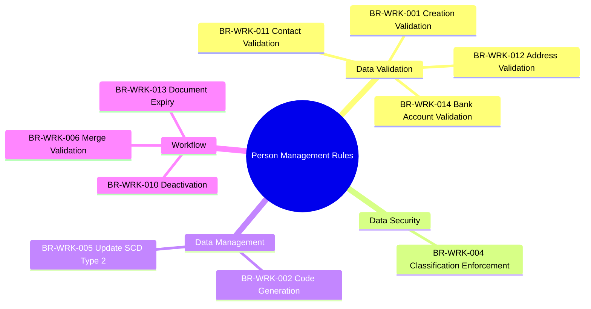
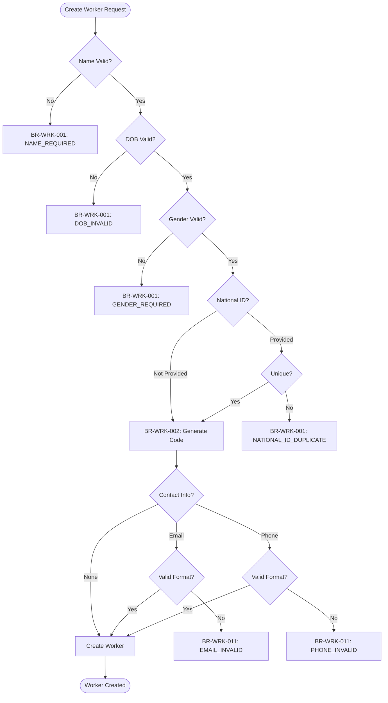
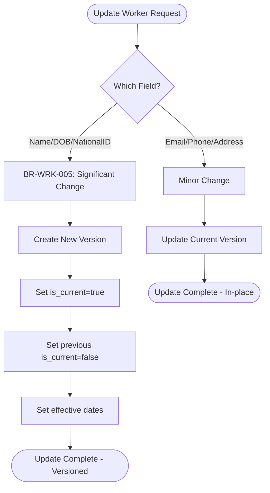
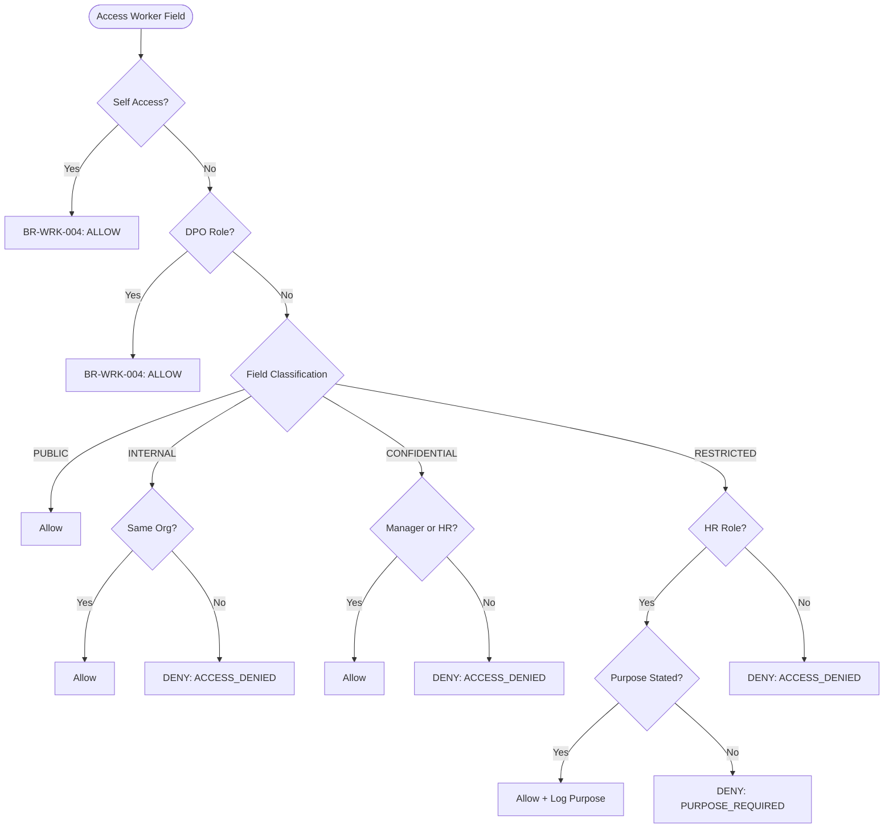

---
# === METADATA ===
id: BRS-CO-PERSON
module: CORE
sub_module: PERSON_MANAGEMENT
title: "Person Management Business Rules"
version: "1.0.0"
status: ACTIVE
owner: "Core Platform Team"
last_updated: "2026-01-08"
tags:
  - worker
  - person
  - validation
  - data-classification
  - master-data

# === BUSINESS RULES DATA ===
business_rules:
  - id: BR-WRK-001
    title: "Worker Creation Validation"
    description: "Worker records must meet minimum data requirements for creation."
    category: Validation
    severity: BLOCK
    priority: MUST
    status: ACTIVE
    condition: "full_name IS NOT NULL AND date_of_birth < CURRENT_DATE AND gender_code IS VALID AND person_type IS VALID"
    action: "Reject creation with appropriate error code"
    exception: "Contractors may have relaxed validation rules for certain fields"
    related_entities:
      - "[[Worker]]"
    enforced_by:
      - "FR-WRK-001"

  - id: BR-WRK-002
    title: "Worker Code Generation"
    description: "Worker codes must be auto-generated using sequential pattern and be permanently unique."
    category: Calculation
    severity: BLOCK
    priority: MUST
    status: ACTIVE
    condition: "WHEN creating new worker record"
    action: "Generate code in format WORKER-{NNNNNN} (6-digit sequential)"
    exception: "None"
    related_entities:
      - "[[Worker]]"
    enforced_by:
      - "FR-WRK-001"

  - id: BR-WRK-004
    title: "Data Classification Enforcement"
    description: "Worker data must be classified and access controlled based on sensitivity levels."
    category: Security
    severity: BLOCK
    priority: MUST
    status: ACTIVE
    condition: "user.role AND field.classification_level"
    action: "Allow or deny access based on role and data classification matrix"
    exception: "Employee can always access their own data; DPO can access for privacy compliance purposes"
    related_entities:
      - "[[Worker]]"
    enforced_by:
      - "FR-WRK-010"
      - "FR-PRI-001"

  - id: BR-WRK-005
    title: "Worker Update Validation (SCD Type 2)"
    description: "Worker updates must follow Slowly Changing Dimension Type 2 rules for significant changes."
    category: Process
    severity: WARN
    priority: SHOULD
    status: ACTIVE
    condition: "field IN (full_name, date_of_birth, national_id)"
    action: "Create new version with is_current_flag=true, set previous version is_current_flag=false"
    exception: "None"
    related_entities:
      - "[[Worker]]"
    enforced_by:
      - "FR-WRK-003"

  - id: BR-WRK-006
    title: "Worker Merge Validation"
    description: "Worker merge operations must validate no active employment conflicts exist."
    category: Workflow
    severity: BLOCK
    priority: SHOULD
    status: ACTIVE
    condition: "source_worker.active_employment_count = 0 AND target_worker.active_employment_count = 0"
    action: "Transfer all relationships to target and mark source as merged"
    exception: "SYSTEM_ADMIN can force merge with confirmation"
    related_entities:
      - "[[Worker]]"
    enforced_by:
      - "FR-WRK-012"

  - id: BR-WRK-010
    title: "Worker Deactivation"
    description: "Worker deactivation must ensure no active dependencies exist."
    category: Workflow
    severity: BLOCK
    priority: SHOULD
    status: ACTIVE
    condition: "worker.active_work_relationships.count = 0 AND worker.active_employee_records.count = 0"
    action: "Set end_date and deactivate worker record"
    exception: "None"
    related_entities:
      - "[[Worker]]"
      - "[[WorkRelationship]]"
      - "[[Employee]]"
    enforced_by:
      - "FR-WRK-005"

  - id: BR-WRK-011
    title: "Contact Validation"
    description: "Contact information must follow format validation rules and uniqueness constraints."
    category: Validation
    severity: BLOCK
    priority: MUST
    status: ACTIVE
    condition: "contact_type IN (EMAIL, PHONE, MOBILE)"
    action: "Validate format: EMAIL (RFC 5322), PHONE (E.164 or local format)"
    exception: "None"
    related_entities:
      - "[[Worker]]"
      - "[[Contact]]"
    enforced_by:
      - "FR-WRK-002"

  - id: BR-WRK-012
    title: "Address Validation"
    description: "Address records must have required fields based on country rules."
    category: Validation
    severity: BLOCK
    priority: MUST
    status: ACTIVE
    condition: "country_code IS PROVIDED"
    action: "Validate required fields per country (e.g., US requires state, ZIP; VN requires province, district)"
    exception: "None"
    related_entities:
      - "[[Worker]]"
      - "[[Address]]"
      - "[[Country]]"
      - "[[AdminArea]]"
    enforced_by:
      - "FR-WRK-002"

  - id: BR-WRK-013
    title: "Document Expiry Tracking"
    description: "Documents with expiry dates must trigger alerts before expiration."
    category: Process
    severity: INFO
    priority: SHOULD
    status: ACTIVE
    condition: "document.expiry_date IS NOT NULL AND (expiry_date - CURRENT_DATE) <= alert_threshold_days"
    action: "Generate expiry alert notification to HR and employee"
    exception: "None"
    related_entities:
      - "[[Worker]]"
      - "[[Document]]"
    enforced_by:
      - "FR-WRK-004"

  - id: BR-WRK-014
    title: "Bank Account Validation"
    description: "Bank account information must be validated for format and completeness."
    category: Validation
    severity: BLOCK
    priority: MUST
    status: ACTIVE
    condition: "bank_account IS PROVIDED FOR payroll"
    action: "Validate: account_number format, bank_code exists, IBAN/SWIFT if international"
    exception: "None"
    related_entities:
      - "[[Worker]]"
      - "[[BankAccount]]"
    enforced_by:
      - "FR-WRK-006"

# === RELATED ONTOLOGY ===
related_ontology:
  - "[[Worker]]"
  - "[[Contact]]"
  - "[[Address]]"
  - "[[Document]]"
  - "[[BankAccount]]"
  - "[[WorkRelationship]]"
  - "[[Employee]]"
  - "[[Country]]"
  - "[[AdminArea]]"
---

# Business Rules: Person Management

> **Scope**: This BRS file defines all business rules for Person Management (Worker) in the Core module. These rules ensure worker data quality, security, and compliance with data protection regulations.

## 1. Rule Scope



## 2. Rule Catalog

| ID | Rule | Category | Severity | Status |
|----|------|----------|----------|--------|
| `[[BR-WRK-001]]` | **Worker Creation Validation**<br>Mandatory fields and format validation for new workers | Validation | BLOCK | ACTIVE |
| `[[BR-WRK-002]]` | **Worker Code Generation**<br>Auto-generate unique sequential worker codes | Calculation | BLOCK | ACTIVE |
| `[[BR-WRK-004]]` | **Data Classification Enforcement**<br>Role-based access control by data sensitivity | Security | BLOCK | ACTIVE |
| `[[BR-WRK-005]]` | **Worker Update Validation (SCD Type 2)**<br>Version control for significant field changes | Process | WARN | ACTIVE |
| `[[BR-WRK-006]]` | **Worker Merge Validation**<br>Prevent merge conflicts with active employment | Workflow | BLOCK | ACTIVE |
| `[[BR-WRK-010]]` | **Worker Deactivation**<br>Ensure no active dependencies before deactivation | Workflow | BLOCK | ACTIVE |
| `[[BR-WRK-011]]` | **Contact Validation**<br>Email and phone format validation | Validation | BLOCK | ACTIVE |
| `[[BR-WRK-012]]` | **Address Validation**<br>Country-specific address field requirements | Validation | BLOCK | ACTIVE |
| `[[BR-WRK-013]]` | **Document Expiry Tracking**<br>Alert before document expiration | Process | INFO | ACTIVE |
| `[[BR-WRK-014]]` | **Bank Account Validation**<br>Bank account format and code validation | Validation | BLOCK | ACTIVE |

## 3. Detailed Specifications

### [[BR-WRK-001]] Worker Creation Validation

*   **Priority**: MUST
*   **Description**: Worker records must meet minimum data requirements for creation to ensure data quality and completeness.
*   **Condition**: 
    ```sql
    full_name IS NOT NULL AND LENGTH(full_name) <= 200
    AND date_of_birth < CURRENT_DATE
    AND gender_code IS VALID (from CodeList)
    AND person_type IS VALID (from CodeList)
    AND (national_id IS NULL OR national_id IS UNIQUE)
    AND (email IS NULL OR email MATCHES RFC5322)
    AND (phone IS NULL OR phone MATCHES E.164)
    ```
*   **Action**: Reject creation with appropriate error code
*   **Validation Rules**:
    1. Full name: Required, max 200 characters
    2. Date of birth: Required, must be past date
    3. Gender code: Required, must exist in GENDER code list
    4. Person type: Required, must exist in PERSON_TYPE code list
    5. National ID: Optional, but must be unique if provided
    6. Email: Optional, must be valid format if provided
    7. Phone: Optional, must be valid format if provided
*   **Exception**: Contractors may have relaxed validation rules for certain fields
*   **Error Messages**:
    - `WORKER_NAME_REQUIRED`: "Full name is required"
    - `WORKER_DOB_INVALID`: "Date of birth must be a past date"
    - `WORKER_NATIONAL_ID_DUPLICATE`: "National ID already exists"
    - `WORKER_EMAIL_INVALID`: "Invalid email format"
*   **Related Entities**: `[[Worker]]`
*   **Enforced By**: FR-WRK-001

---

### [[BR-WRK-002]] Worker Code Generation

*   **Priority**: MUST
*   **Description**: Worker codes must be auto-generated using a sequential pattern and remain permanently unique and immutable.
*   **Condition**: 
    ```sql
    WHEN creating new worker record
    ```
*   **Action**: Generate code in format `WORKER-{NNNNNN}` (6-digit sequential, zero-padded)
*   **Validation Rules**:
    1. Code is auto-generated (not user-provided)
    2. Format: WORKER-000001, WORKER-000002, etc.
    3. Code must be globally unique
    4. Code cannot be changed after creation (immutable)
*   **Exception**: None
*   **Error Messages**:
    - `WORKER_CODE_GENERATION_FAILED`: "Failed to generate unique worker code"
*   **Related Entities**: `[[Worker]]`
*   **Enforced By**: FR-WRK-001

---

### [[BR-WRK-004]] Data Classification Enforcement

*   **Priority**: MUST
*   **Description**: Worker data must be classified by sensitivity level and access controlled based on user roles.
*   **Condition**: 
    ```sql
    user.role AND field.classification_level
    ```
*   **Action**: Apply access control matrix:
    - **PUBLIC**: Full name, preferred name, gender → Accessible to all
    - **INTERNAL**: Email, phone → Accessible to same organization
    - **CONFIDENTIAL**: DOB, address → Accessible to manager + HR
    - **RESTRICTED**: National ID, passport, bank account → HR only with stated purpose
*   **Validation Rules**:
    1. Check user role against field classification
    2. For RESTRICTED fields, require access purpose to be logged
    3. Employee self-access is always allowed
    4. DPO access is always allowed for compliance purposes
*   **Exception**: 
    - Employee can always access their own data
    - DPO can access for privacy compliance purposes
*   **Error Messages**:
    - `WORKER_DATA_ACCESS_DENIED`: "Insufficient permissions to access {field}"
    - `WORKER_DATA_PURPOSE_REQUIRED`: "Purpose required to access RESTRICTED data"
*   **Related Entities**: `[[Worker]]`
*   **Enforced By**: FR-WRK-010, FR-PRI-001

---

### [[BR-WRK-005]] Worker Update Validation (SCD Type 2)

*   **Priority**: SHOULD
*   **Description**: Significant worker field changes must create a new version following Slowly Changing Dimension Type 2 pattern.
*   **Condition**: 
    ```sql
    field IN (full_name, date_of_birth, national_id, passport_number)
    ```
*   **Action**: 
    1. Create new version with updated values
    2. Set `is_current_flag = true` on new version
    3. Set `is_current_flag = false` on previous version
    4. Set `effective_start_date` on new version
    5. Set `effective_end_date` on previous version
*   **Validation Rules**:
    - **Significant changes** (create new version): full_name, date_of_birth, national_id
    - **Minor changes** (update current version): email, phone, address
    - Previous versions are retained for audit trail
*   **Exception**: None
*   **Error Messages**:
    - `WORKER_UPDATE_INVALID`: "Invalid update operation"
*   **Related Entities**: `[[Worker]]`
*   **Enforced By**: FR-WRK-003

---

### [[BR-WRK-006]] Worker Merge Validation

*   **Priority**: SHOULD
*   **Description**: Worker merge operations must validate that neither worker has active employment to prevent data conflicts.
*   **Condition**: 
    ```sql
    source_worker.active_employment_count = 0 
    AND target_worker.active_employment_count = 0
    AND source_worker_id != target_worker_id
    ```
*   **Action**: 
    1. Validate source and target workers exist
    2. Check for no active employment on either worker
    3. Transfer all relationships (contacts, addresses, documents, etc.) to target
    4. Set `merged_into_worker_id` on source worker
    5. Mark source worker as `is_merged = true`
    6. Log merge operation (cannot be undone)
*   **Validation Rules**:
    1. Source and target must both exist and be active
    2. Neither worker can have active employment
    3. Cannot merge worker with itself
    4. Merge operation is logged and permanent
*   **Exception**: SYSTEM_ADMIN can force merge with confirmation dialog
*   **Error Messages**:
    - `WORKER_MERGE_ACTIVE_EMPLOYMENT`: "Cannot merge workers with active employment"
    - `WORKER_MERGE_SAME_WORKER`: "Cannot merge worker with itself"
*   **Related Entities**: `[[Worker]]`
*   **Enforced By**: FR-WRK-012

---

### [[BR-WRK-010]] Worker Deactivation

*   **Priority**: SHOULD
*   **Description**: Worker deactivation must ensure no active dependencies (work relationships, employee records) exist.
*   **Condition**: 
    ```sql
    worker.active_work_relationships.count = 0 
    AND worker.active_employee_records.count = 0
    ```
*   **Action**: 
    1. Set `end_date = CURRENT_DATE`
    2. Set `is_active = false`
    3. Preserve all historical data
    4. Remove from active worker lists/searches
*   **Validation Rules**:
    1. Worker cannot have active work relationships
    2. Worker cannot have active employee records
    3. Historical data must be preserved
    4. Deactivated workers don't appear in active lists
*   **Exception**: None
*   **Error Messages**:
    - `WORKER_HAS_ACTIVE_RELATIONSHIPS`: "Worker has active work relationships"
    - `WORKER_HAS_ACTIVE_EMPLOYEE`: "Worker has active employee records"
*   **Related Entities**: `[[Worker]]`, `[[WorkRelationship]]`, `[[Employee]]`
*   **Enforced By**: FR-WRK-005

---

### [[BR-WRK-011]] Contact Validation

*   **Priority**: MUST
*   **Description**: Contact information must follow standard format validation rules.
*   **Condition**: 
    ```sql
    contact_type IN (EMAIL, PHONE, MOBILE, FAX)
    ```
*   **Action**: Validate format based on contact type:
    - **EMAIL**: RFC 5322 format
    - **PHONE/MOBILE**: E.164 international format or local format with country code
    - **FAX**: Similar to phone validation
*   **Validation Rules**:
    1. Email must match RFC 5322 regex
    2. Phone must be valid E.164 or country-specific format
    3. Primary contact of each type should be marked
    4. Contact value must be unique per worker per type
*   **Exception**: None
*   **Error Messages**:
    - `CONTACT_EMAIL_INVALID`: "Invalid email format"
    - `CONTACT_PHONE_INVALID`: "Invalid phone format"
    - `CONTACT_DUPLICATE`: "Contact already exists for this worker"
*   **Related Entities**: `[[Worker]]`, `[[Contact]]`
*   **Enforced By**: FR-WRK-002

---

### [[BR-WRK-012]] Address Validation

*   **Priority**: MUST
*   **Description**: Address records must have country-specific required fields validated.
*   **Condition**: 
    ```sql
    country_code IS PROVIDED AND country_code IS VALID
    ```
*   **Action**: Validate required fields per country rules:
    - **US**: State, ZIP code required
    - **VN**: Province, district required
    - **UK**: Postcode required
    - **DE**: PLZ (postal code) required
*   **Validation Rules**:
    1. Country code is required and must be valid
    2. Apply country-specific field requirements
    3. Postal/ZIP code must match country format
    4. Administrative areas (state, province) must exist in AdminArea table
*   **Exception**: None
*   **Error Messages**:
    - `ADDRESS_COUNTRY_REQUIRED`: "Country code is required"
    - `ADDRESS_STATE_REQUIRED`: "State is required for country {country}"
    - `ADDRESS_POSTAL_CODE_INVALID`: "Invalid postal code format for {country}"
*   **Related Entities**: `[[Worker]]`, `[[Address]]`, `[[Country]]`, `[[AdminArea]]`
*   **Enforced By**: FR-WRK-002

---

### [[BR-WRK-013]] Document Expiry Tracking

*   **Priority**: SHOULD
*   **Description**: Documents with expiry dates (passport, work permit, etc.) must trigger alerts before expiration.
*   **Condition**: 
    ```sql
    document.expiry_date IS NOT NULL 
    AND (document.expiry_date - CURRENT_DATE) <= alert_threshold_days
    ```
*   **Action**: 
    1. Generate expiry alert notification
    2. Send to assigned HR personnel
    3. Send to worker (employee) if applicable
    4. Alert thresholds: 90 days, 60 days, 30 days, 7 days
*   **Validation Rules**:
    1. Check document expiry daily
    2. Generate alerts at configured thresholds (default: 90, 60, 30, 7 days)
    3. Track alert status (sent, acknowledged)
    4. Prevent system actions if critical documents are expired
*   **Exception**: None
*   **Error Messages**:
    - `DOCUMENT_EXPIRING_SOON`: "Document {type} expires on {date}"
    - `DOCUMENT_EXPIRED`: "Document {type} has expired"
*   **Related Entities**: `[[Worker]]`, `[[Document]]`
*   **Enforced By**: FR-WRK-004

---

### [[BR-WRK-014]] Bank Account Validation

*   **Priority**: MUST
*   **Description**: Bank account information must be validated for format correctness and bank code existence.
*   **Condition**: 
    ```sql
    bank_account IS PROVIDED FOR payroll_payment
    ```
*   **Action**: Validate:
    1. Account number format (numeric, correct length)
    2. Bank code exists in system bank registry
    3. IBAN format if international (ISO 13616)
    4. SWIFT/BIC code format if international (ISO 9362)
    5. Checksum validation where applicable (IBAN)
*   **Validation Rules**:
    1. Account number: Required, numeric, country-specific length
    2. Bank code: Required, must exist in bank registry
    3. Branch code: Optional, depends on country
    4. IBAN: Required for SEPA countries, must pass checksum
    5. SWIFT/BIC: Required for international transfers
*   **Exception**: None
*   **Error Messages**:
    - `BANK_ACCOUNT_INVALID`: "Invalid bank account number format"
    - `BANK_CODE_NOT_FOUND`: "Bank code {code} not found"
    - `IBAN_INVALID_CHECKSUM`: "IBAN checksum validation failed"
    - `SWIFT_INVALID_FORMAT`: "Invalid SWIFT/BIC format"
*   **Related Entities**: `[[Worker]]`, `[[BankAccount]]`
*   **Enforced By**: FR-WRK-006

---

## 4. Decision Logic

### Worker Creation Flow



### Worker Update Flow (SCD Type 2)



### Data Access Control Flow


