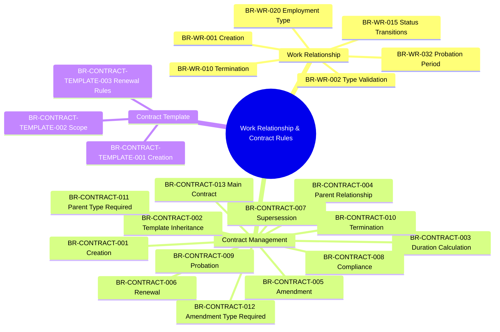
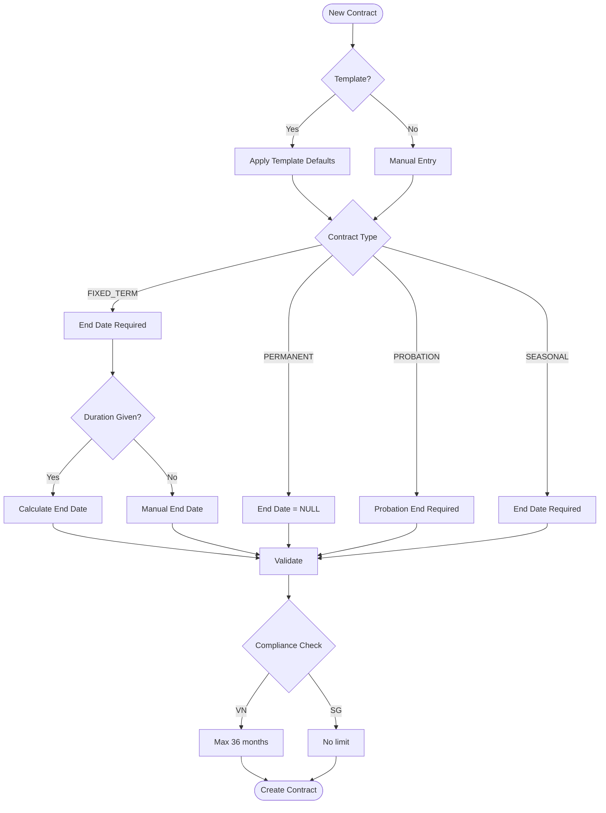
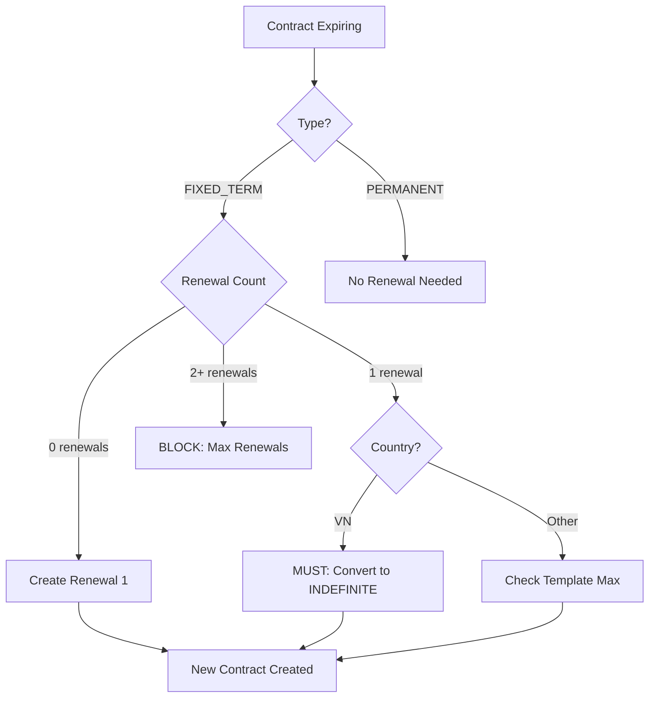
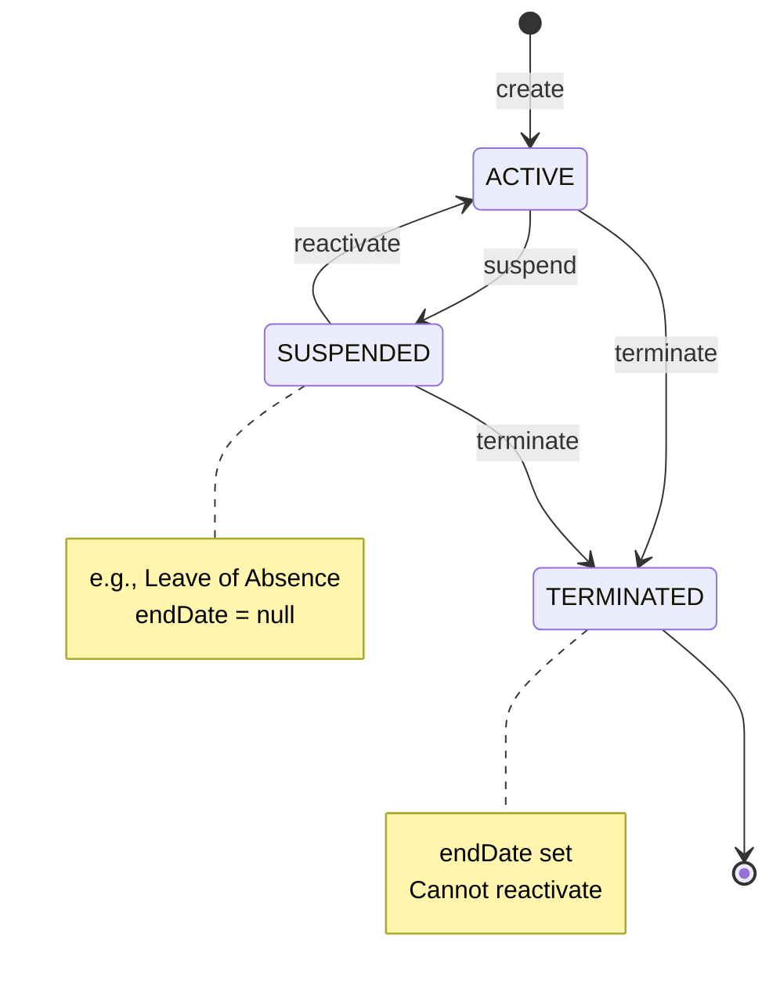

---
# === METADATA ===
id: BRS-CO-WORK-RELATIONSHIP
module: CO
sub_module: work-relationship
title: "Work Relationship & Contract Business Rules"
version: "1.0.0"
status: DRAFT
owner: "Core Team"
last_updated: "2026-01-08"
tags:
  - work-relationship
  - contract
  - contract-template
  - employment

# === BUSINESS RULES DATA ===
business_rules:
  # Work Relationship Rules (6)
  - id: BR-WR-001
    title: "Work Relationship Creation"
    description: "Work relationship must meet minimum requirements"
    category: Validation
    severity: BLOCK
    priority: MUST
    status: ACTIVE
    condition: "WHEN creating new work relationship"
    action: "Validate worker exists, relationship type valid, legal entity required, start date present, no overlapping relationships of same type"
    exception: "Multiple concurrent relationships allowed for different types"
    related_entities:
      - "[[WorkRelationship]]"
      - "[[Worker]]"
      - "[[LegalEntity]]"
    enforced_by:
      - "FR-WR-001"

  - id: BR-WR-002
    title: "Work Relationship Type Validation"
    description: "Work relationship type determines allowed operations"
    category: Validation
    severity: BLOCK
    priority: MUST
    status: ACTIVE
    condition: "WHEN creating or updating work relationship"
    action: "EMPLOYEE requires employee record; CONTRACTOR/CONSULTANT no employee record allowed; INTERN may or may not have employee record"
    exception: "None"
    related_entities:
      - "[[WorkRelationship]]"
      - "[[Employee]]"
    enforced_by:
      - "FR-WR-001"
      - "FR-WR-002"

  - id: BR-WR-010
    title: "Work Relationship Termination"
    description: "Work relationship termination validation"
    category: Workflow
    severity: BLOCK
    priority: MUST
    status: ACTIVE
    condition: "WHEN terminating work relationship"
    action: "Require end date (today or past), after start date; require termination reason; end all active assignments and employee records; document notice period"
    exception: "Emergency termination can bypass notice period"
    related_entities:
      - "[[WorkRelationship]]"
      - "[[Assignment]]"
      - "[[Employee]]"
    enforced_by:
      - "FR-WR-010"

  - id: BR-WR-015
    title: "Work Relationship Status"
    description: "Work relationship status transitions"
    category: Workflow
    severity: WARN
    priority: SHOULD
    status: ACTIVE
    condition: "WHEN changing work relationship status"
    action: "Valid transitions: ACTIVE→SUSPENDED/TERMINATED, SUSPENDED→ACTIVE/TERMINATED; TERMINATED cannot be reversed (except SYSTEM_ADMIN); status change reason required"
    exception: "SYSTEM_ADMIN can reactivate terminated relationships"
    related_entities:
      - "[[WorkRelationship]]"
    enforced_by:
      - "FR-WR-011"

  - id: BR-WR-020
    title: "Employment Type Validation"
    description: "Employment type validation rules"
    category: Validation
    severity: WARN
    priority: SHOULD
    status: ACTIVE
    condition: "WHEN setting employment type"
    action: "Employment type must be valid; FULL_TIME requires FTE=1.0; PART_TIME requires FTE<1.0; changes create new version (SCD Type 2)"
    exception: "None"
    related_entities:
      - "[[WorkRelationship]]"
    enforced_by:
      - "FR-WR-015"

  - id: BR-WR-032
    title: "Probation Period Validation"
    description: "Probation period validation rules"
    category: Validation
    severity: WARN
    priority: SHOULD
    status: ACTIVE
    condition: "WHEN setting probation period"
    action: "Probation period must be positive (1-180 days configurable); probation end date = start + period; can be extended once; must confirm or terminate before end"
    exception: "Senior roles may have longer probation periods"
    related_entities:
      - "[[WorkRelationship]]"
    enforced_by:
      - "FR-WR-023"

  # Contract Rules (13)
  - id: BR-CONTRACT-001
    title: "Contract Creation Validation"
    description: "Contract must meet all prerequisites and validation rules"
    category: Validation
    severity: BLOCK
    priority: MUST
    status: ACTIVE
    condition: "WHEN creating new contract"
    action: "Employee must exist and be active; contract type required; start date required; FIXED_TERM requires end_date; PERMANENT end_date must be null; PROBATION requires probation_end_date; duration auto-calculates end_date if provided; only one active contract per employee"
    exception: "None"
    related_entities:
      - "[[Contract]]"
      - "[[Employee]]"
      - "[[ContractTemplate]]"
    enforced_by:
      - "FR-WR-022"
      - "FR-CONTRACT-001"

  - id: BR-CONTRACT-002
    title: "Contract Template Inheritance"
    description: "When template selected, contract inherits defaults with validation"
    category: Workflow
    severity: BLOCK
    priority: MUST
    status: ACTIVE
    condition: "WHEN creating contract with template_id"
    action: "Template must exist and be active; inherit default duration, probation, notice period from template; validate duration against min/max; validate template scope matches contract context; apply probation requirements"
    exception: "User can override template defaults if within constraints"
    related_entities:
      - "[[Contract]]"
      - "[[ContractTemplate]]"
    enforced_by:
      - "FR-CONTRACT-001"
      - "FR-CONTRACT-002"

  - id: BR-CONTRACT-003
    title: "Contract Duration Calculation"
    description: "Contract end date auto-calculation based on duration"
    category: Calculation
    severity: BLOCK
    priority: MUST
    status: ACTIVE
    condition: "WHEN duration_value and duration_unit provided"
    action: "Calculate end_date = start_date + duration (DAY or MONTH units); use business day rules; validate manual end_date matches calculation (±1 day tolerance); duration must be positive"
    exception: "PERMANENT contracts have no duration"
    related_entities:
      - "[[Contract]]"
    enforced_by:
      - "FR-WR-022"
      - "FR-CONTRACT-002"

  - id: BR-CONTRACT-004
    title: "Contract Parent Relationship"
    description: "Contract parent-child relationship validation rules"
    category: Validation
    severity: BLOCK
    priority: MUST
    status: ACTIVE
    condition: "WHEN parent_contract_id provided"
    action: "parent_relationship_type required; parent must exist and belong to same employee; valid types: AMENDMENT, ADDENDUM, RENEWAL, SUPERSESSION; AMENDMENT requires field changes; SUPERSESSION requires different contract_type; no circular relationships"
    exception: "None"
    related_entities:
      - "[[Contract]]"
    enforced_by:
      - "FR-CONTRACT-003"
      - "FR-CONTRACT-004"
      - "FR-CONTRACT-005"
      - "FR-CONTRACT-006"

  - id: BR-CONTRACT-005
    title: "Contract Amendment Validation"
    description: "Contract amendment specific validation"
    category: Validation
    severity: WARN
    priority: SHOULD
    status: ACTIVE
    condition: "WHEN parent_relationship_type = AMENDMENT"
    action: "Parent must be active; must modify at least one field (salary, hours, location); effective date >= parent start_date; cannot change contract_type or employee_id; multiple amendments allowed"
    exception: "None"
    related_entities:
      - "[[Contract]]"
    enforced_by:
      - "FR-CONTRACT-004"

  - id: BR-CONTRACT-006
    title: "Contract Renewal Validation"
    description: "Contract renewal specific validation"
    category: Workflow
    severity: BLOCK
    priority: MUST
    status: ACTIVE
    condition: "WHEN parent_relationship_type = RENEWAL"
    action: "Parent must be FIXED_TERM and expiring/expired; new start_date = parent.end_date + 1 day; validate renewal count <= max_renewals from template; track renewal count; send notification before expiry"
    exception: "HR_ADMIN can override max_renewals with justification"
    related_entities:
      - "[[Contract]]"
      - "[[ContractTemplate]]"
    enforced_by:
      - "FR-CONTRACT-005"

  - id: BR-CONTRACT-007
    title: "Contract Supersession Validation"
    description: "Contract supersession specific validation"
    category: Workflow
    severity: WARN
    priority: SHOULD
    status: ACTIVE
    condition: "WHEN parent_relationship_type = SUPERSESSION"
    action: "New contract_type must differ from parent; common pattern: PROBATION→PERMANENT; supersession date >= parent start_date; end parent when supersession active; only one supersession per parent"
    exception: "None"
    related_entities:
      - "[[Contract]]"
    enforced_by:
      - "FR-CONTRACT-006"

  - id: BR-CONTRACT-008
    title: "Contract Compliance Validation"
    description: "Country-specific labor law compliance validation"
    category: Compliance
    severity: BLOCK
    priority: MUST
    status: ACTIVE
    condition: "WHEN creating or updating contract"
    action: "VN: FIXED_TERM max 36 months, max 1 renewal; PROBATION max 60 days (non-mgmt) or 180 days (mgmt). SG: PROBATION max 180 days. Validate mandatory clauses and notice period per country"
    exception: "Special contracts (executives) may differ with approval"
    related_entities:
      - "[[Contract]]"
      - "[[ContractTemplate]]"
    enforced_by:
      - "FR-CONTRACT-008"

  - id: BR-CONTRACT-009
    title: "Contract Probation Validation"
    description: "Probation period validation rules"
    category: Validation
    severity: WARN
    priority: SHOULD
    status: ACTIVE
    condition: "WHEN probation_end_date provided"
    action: "probation_end_date > start_date; period must not exceed country limits; required if template.probation_required = true; can be extended once (create AMENDMENT); must confirm before end (create SUPERSESSION to PERMANENT)"
    exception: "Senior/executive roles may have longer probation with approval"
    related_entities:
      - "[[Contract]]"
      - "[[ContractTemplate]]"
    enforced_by:
      - "FR-WR-023"

  - id: BR-CONTRACT-010
    title: "Contract Termination Validation"
    description: "Contract termination validation rules"
    category: Workflow
    severity: BLOCK
    priority: MUST
    status: ACTIVE
    condition: "WHEN terminating contract"
    action: "Termination_date required (>= start_date); termination_reason_code required; respect notice period; FIXED_TERM early termination requires reason; end all assignments; update employee status"
    exception: "Emergency termination can bypass notice period with approval"
    related_entities:
      - "[[Contract]]"
      - "[[Assignment]]"
      - "[[Employee]]"
    enforced_by:
      - "FR-WR-003"

  - id: BR-CONTRACT-011
    title: "Parent Relationship Type Required"
    description: "If contract has parent, relationship type must be specified"
    category: Validation
    severity: BLOCK
    priority: MUST
    status: ACTIVE
    condition: "WHEN parent_contract_id IS NOT NULL"
    action: "parent_relationship_type required (AMENDMENT, ADDENDUM, RENEWAL, SUPERSESSION); parent must exist; no circular references"
    exception: "None"
    related_entities:
      - "[[Contract]]"
    enforced_by:
      - "FR-CONTRACT-002"

  - id: BR-CONTRACT-012
    title: "Amendment Type Required"
    description: "If contract is amendment/addendum, specific type must be specified"
    category: Validation
    severity: BLOCK
    priority: MUST
    status: ACTIVE
    condition: "WHEN parent_relationship_type IN ('AMENDMENT', 'ADDENDUM')"
    action: "amendment_type_code required from CodeList(AMENDMENT_TYPE); valid values: SIGNING_BONUS, STAFF_MOVEMENT, SALARY_CHANGE, POSITION_CHANGE, BENEFITS_CHANGE, WORKING_HOURS_CHANGE, OTHER; should be null for RENEWAL/SUPERSESSION"
    exception: "None"
    related_entities:
      - "[[Contract]]"
    enforced_by:
      - "FR-CONTRACT-002"

  - id: BR-CONTRACT-013
    title: "Main Contract Validation"
    description: "Main contracts should not have parent relationship or amendment type"
    category: Validation
    severity: WARN
    priority: SHOULD
    status: ACTIVE
    condition: "WHEN parent_contract_id IS NULL"
    action: "parent_relationship_type must be null; amendment_type_code must be null; is_main should be true; template_id recommended but not required"
    exception: "template_id can be null for custom contracts"
    related_entities:
      - "[[Contract]]"
    enforced_by:
      - "FR-CONTRACT-001"

  # Contract Template Rules (3)
  - id: BR-CONTRACT-TEMPLATE-001
    title: "Template Creation Validation"
    description: "Contract template must meet all requirements"
    category: Validation
    severity: BLOCK
    priority: MUST
    status: ACTIVE
    condition: "WHEN creating contract template"
    action: "Template code required and unique; template name required; contract_type_code required; FIXED_TERM requires max_duration; PERMANENT max_duration must be null; probation_required=true requires probation_duration; scope requires at least country_code, legal_entity_id, or business_unit_id; legal_requirements must be valid JSON"
    exception: "None"
    related_entities:
      - "[[ContractTemplate]]"
    enforced_by:
      - "FR-CONTRACT-001"

  - id: BR-CONTRACT-TEMPLATE-002
    title: "Template Scope Validation"
    description: "Template scope hierarchy validation"
    category: Validation
    severity: WARN
    priority: SHOULD
    status: ACTIVE
    condition: "WHEN selecting template for contract"
    action: "Selection priority: BU specific > Legal Entity > Country > Global (most specific first); template must be active; effective dates must include contract start_date; only one template per scope combination"
    exception: "None"
    related_entities:
      - "[[ContractTemplate]]"
    enforced_by:
      - "FR-CONTRACT-002"

  - id: BR-CONTRACT-TEMPLATE-003
    title: "Template Renewal Rules"
    description: "Template renewal configuration validation"
    category: Validation
    severity: WARN
    priority: SHOULD
    status: ACTIVE
    condition: "WHEN setting renewal rules in template"
    action: "If allows_renewal=false, max_renewals must be 0 or null; if allows_renewal=true, max_renewals >= 1 and renewal_notice_days required (positive integer, typically 30-90 days)"
    exception: "None"
    related_entities:
      - "[[ContractTemplate]]"
    enforced_by:
      - "FR-CONTRACT-001"

# === RELATED ONTOLOGY ===
related_ontology:
  - "[[WorkRelationship]]"
  - "[[Contract]]"
  - "[[ContractTemplate]]"
  - "[[Employee]]"
  - "[[Worker]]"
  - "[[LegalEntity]]"
  - "[[Assignment]]"
---

# Work Relationship & Contract Business Rules

## 1. Rule Scope



## 2. Rule Catalog

| ID | Rule | Category | Severity | Status |
|----|------|----------|----------|--------|
| `[[BR-WR-001]]` | **Work Relationship Creation**<br>Validate worker, type, legal entity, dates, no overlaps | Validation | BLOCK | ACTIVE |
| `[[BR-WR-002]]` | **Work Relationship Type Validation**<br>Type determines employee record requirements | Validation | BLOCK | ACTIVE |
| `[[BR-WR-010]]` | **Work Relationship Termination**<br>End date, reason, close assignments/employees | Workflow | BLOCK | ACTIVE |
| `[[BR-WR-015]]` | **Work Relationship Status**<br>Valid status transitions with reason | Workflow | WARN | ACTIVE |
| `[[BR-WR-020]]` | **Employment Type Validation**<br>FTE validation by employment type | Validation | WARN | ACTIVE |
| `[[BR-WR-032]]` | **Probation Period Validation**<br>Period limits, extensions, confirmation | Validation | WARN | ACTIVE |
| `[[BR-CONTRACT-001]]` | **Contract Creation Validation**<br>Employee, type, dates, template inheritance | Validation | BLOCK | ACTIVE |
| `[[BR-CONTRACT-002]]` | **Contract Template Inheritance**<br>Apply template defaults, validate constraints | Workflow | BLOCK | ACTIVE |
| `[[BR-CONTRACT-003]]` | **Contract Duration Calculation**<br>Auto-calculate end date from duration | Calculation | BLOCK | ACTIVE |
| `[[BR-CONTRACT-004]]` | **Contract Parent Relationship**<br>Validate parent-child contract relationships | Validation | BLOCK | ACTIVE |
| `[[BR-CONTRACT-005]]` | **Contract Amendment Validation**<br>Amendment must modify fields, parent active | Validation | WARN | ACTIVE |
| `[[BR-CONTRACT-006]]` | **Contract Renewal Validation**<br>FIXED_TERM renewal limits, dates, notifications | Workflow | BLOCK | ACTIVE |
| `[[BR-CONTRACT-007]]` | **Contract Supersession Validation**<br>Contract type change, end parent | Workflow | WARN | ACTIVE |
| `[[BR-CONTRACT-008]]` | **Contract Compliance Validation**<br>Country-specific labor law compliance | Compliance | BLOCK | ACTIVE |
| `[[BR-CONTRACT-009]]` | **Contract Probation Validation**<br>Probation period limits, extensions | Validation | WARN | ACTIVE |
| `[[BR-CONTRACT-010]]` | **Contract Termination Validation**<br>Date, reason, notice period, close assignments | Workflow | BLOCK | ACTIVE |
| `[[BR-CONTRACT-011]]` | **Parent Relationship Type Required**<br>Relationship type mandatory for child contracts | Validation | BLOCK | ACTIVE |
| `[[BR-CONTRACT-012]]` | **Amendment Type Required**<br>Amendment type for AMENDMENT/ADDENDUM | Validation | BLOCK | ACTIVE |
| `[[BR-CONTRACT-013]]` | **Main Contract Validation**<br>Main contracts have no parent/amendment fields | Validation | WARN | ACTIVE |
| `[[BR-CONTRACT-TEMPLATE-001]]` | **Template Creation Validation**<br>Code unique, type, scope, duration rules | Validation | BLOCK | ACTIVE |
| `[[BR-CONTRACT-TEMPLATE-002]]` | **Template Scope Validation**<br>Scope hierarchy: BU > Entity > Country > Global | Validation | WARN | ACTIVE |
| `[[BR-CONTRACT-TEMPLATE-003]]` | **Template Renewal Rules**<br>Renewal configuration consistency | Validation | WARN | ACTIVE |

## 3. Detailed Specifications

### Work Relationship Rules

#### [[BR-WR-001]] Work Relationship Creation

*   **Priority**: MUST
*   **Description**: Validates all prerequisites for creating a new work relationship
*   **Condition**: 
    ```
    WHEN creating new work relationship
    ```
*   **Validation Rules**:
    1. Worker must exist and be active
    2. Relationship type required: EMPLOYEE, CONTINGENT, CONTRACTOR, NON_WORKER
    3. Legal entity required
    4. Start date required (today or future)
    5. End date must be after start date if provided
    6. No overlapping active relationships of same type for worker
*   **Exception**: Multiple concurrent relationships allowed for different types
*   **Error Messages**:
    - `WR_WORKER_REQUIRED`: "Worker is required"
    - `WR_DATES_INVALID`: "End date must be after start date"
    - `WR_OVERLAP_DETECTED`: "Worker already has active {type} relationship"
*   **Related Entities**: `[[WorkRelationship]]`, `[[Worker]]`, `[[LegalEntity]]`
*   **Enforced By**: FR-WR-001

---

#### [[BR-WR-002]] Work Relationship Type Validation

*   **Priority**: MUST
*   **Description**: Work relationship type determines allowed operations and employee record requirements
*   **Condition**:
    ```
    WHEN creating or updating work relationship
    ```
*   **Validation Rules**:
    1. EMPLOYEE: Requires employee record
    2. CONTRACTOR: No employee record allowed
    3. CONSULTANT: No employee record allowed
    4. INTERN: May or may not have employee record
*   **Exception**: None
*   **Error Messages**:
    - `WR_TYPE_EMPLOYEE_REQUIRED`: "EMPLOYEE relationship requires employee record"
    - `WR_TYPE_CONTRACTOR_NO_EMPLOYEE`: "CONTRACTOR cannot have employee record"
*   **Related Entities**: `[[WorkRelationship]]`, `[[Employee]]`
*   **Enforced By**: FR-WR-001, FR-WR-002

---

#### [[BR-WR-010]] Work Relationship Termination

*   **Priority**: MUST
*   **Description**: Validates work relationship termination process
*   **Condition**:
    ```
    WHEN terminating work relationship
    ```
*   **Validation Rules**:
    1. End date required (today or past)
    2. End date must be after start date
    3. Termination reason required
    4. All active assignments must be ended
    5. All active employee records must be terminated
    6. Notice period documented
*   **Exception**: Emergency termination can bypass notice period
*   **Error Messages**:
    - `WR_END_DATE_REQUIRED`: "End date is required for termination"
    - `WR_ACTIVE_ASSIGNMENTS`: "Cannot terminate with active assignments"
    - `WR_ACTIVE_EMPLOYEE`: "Cannot terminate with active employee record"
*   **Related Entities**: `[[WorkRelationship]]`, `[[Assignment]]`, `[[Employee]]`
*   **Enforced By**: FR-WR-010

---

### Contract Management Rules

#### [[BR-CONTRACT-001]] Contract Creation Validation

*   **Priority**: MUST
*   **Description**: Comprehensive contract creation validation
*   **Condition**:
    ```
    WHEN creating new contract
    ```
*   **Validation Rules**:
    1. Employee must exist and be active
    2. Contract type required: PERMANENT, FIXED_TERM, PROBATION, SEASONAL
    3. Start date required
    4. FIXED_TERM → end_date required
    5. PERMANENT → end_date must be null
    6. PROBATION → probation_end_date required
    7. If template_id provided → inherit template defaults
    8. Duration_value and duration_unit: both or neither
    9. If duration provided → end_date auto-calculated
    10. Only one active contract per employee
*   **Exception**: None
*   **Error Messages**:
    - `CONTRACT_EMPLOYEE_REQUIRED`: "Employee is required"
    - `CONTRACT_TYPE_REQUIRED`: "Contract type is required"
    - `CONTRACT_FIXED_TERM_END_DATE_REQUIRED`: "End date required for FIXED_TERM"
    - `CONTRACT_PERMANENT_END_DATE_NOT_ALLOWED`: "End date not allowed for PERMANENT"
    - `CONTRACT_ACTIVE_EXISTS`: "Employee already has active contract"
*   **Related Entities**: `[[Contract]]`, `[[Employee]]`, `[[ContractTemplate]]`
*   **Enforced By**: FR-WR-022, FR-CONTRACT-001

---

#### [[BR-CONTRACT-008]] Contract Compliance Validation

*   **Priority**: MUST
*   **Description**: Country-specific labor law compliance
*   **Condition**:
    ```
    WHEN creating or updating contract
    ```
*   **Validation Rules**:
    1. **Vietnam (VN)**:
       - FIXED_TERM max duration: 36 months
       - FIXED_TERM max consecutive renewals: 1 (total 2 contracts)
       - PROBATION max: 60 days (non-management), 180 days (management)
    2. **Singapore (SG)**:
       - No specific max duration for FIXED_TERM
       - PROBATION max: 180 days
    3. Compliance rules from template.legal_requirements (JSONB)
    4. Validate mandatory clauses per country
    5. Validate notice period per country labor law
*   **Exception**: Special contracts (executives) may differ with approval
*   **Error Messages**:
    - `CONTRACT_COMPLIANCE_VN_DURATION_EXCEEDED`: "VN: Fixed-term cannot exceed 36 months"
    - `CONTRACT_COMPLIANCE_VN_RENEWALS_EXCEEDED`: "VN: Maximum 1 renewal allowed"
    - `CONTRACT_COMPLIANCE_PROBATION_EXCEEDED`: "Probation exceeds legal maximum"
*   **Related Entities**: `[[Contract]]`, `[[ContractTemplate]]`
*   **Enforced By**: FR-CONTRACT-008

---

### Contract Template Rules

#### [[BR-CONTRACT-TEMPLATE-001]] Template Creation Validation

*   **Priority**: MUST
*   **Description**: Contract template must meet all requirements
*   **Condition**:
    ```
    WHEN creating contract template
    ```
*   **Validation Rules**:
    1. Template code required and unique
    2. Template name required
    3. Contract_type_code required
    4. FIXED_TERM → max_duration_value required
    5. PERMANENT → max_duration_value must be null
    6. Default duration must be within min/max range
    7. probation_required = true → probation_duration_value required
    8. Scope: At least one of country_code, legal_entity_id, business_unit_id
    9. Legal_requirements must be valid JSON if provided
*   **Exception**: None
*   **Error Messages**:
    - `TEMPLATE_CODE_DUPLICATE`: "Template code already exists"
    - `TEMPLATE_FIXED_TERM_MAX_DURATION_REQUIRED`: "Max duration required for FIXED_TERM"
    - `TEMPLATE_SCOPE_REQUIRED`: "At least one scope required"
*   **Related Entities**: `[[ContractTemplate]]`
*   **Enforced By**: FR-CONTRACT-001

---

## 4. Decision Logic

### Contract Creation Workflow



### Contract Renewal Decision



### Work Relationship Status Transitions


