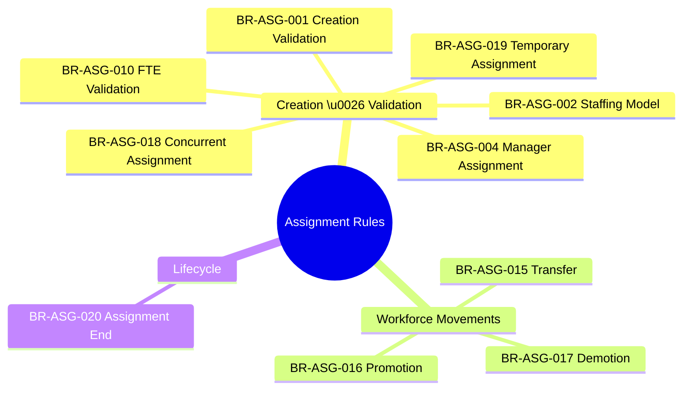
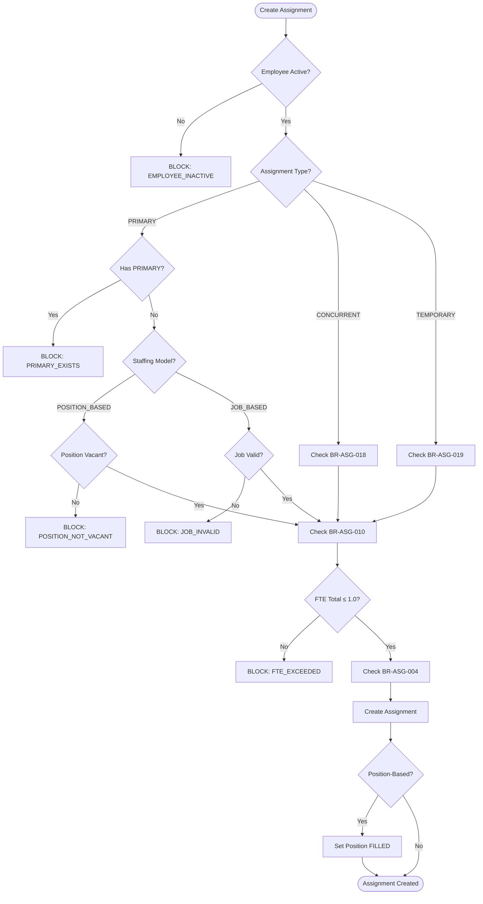
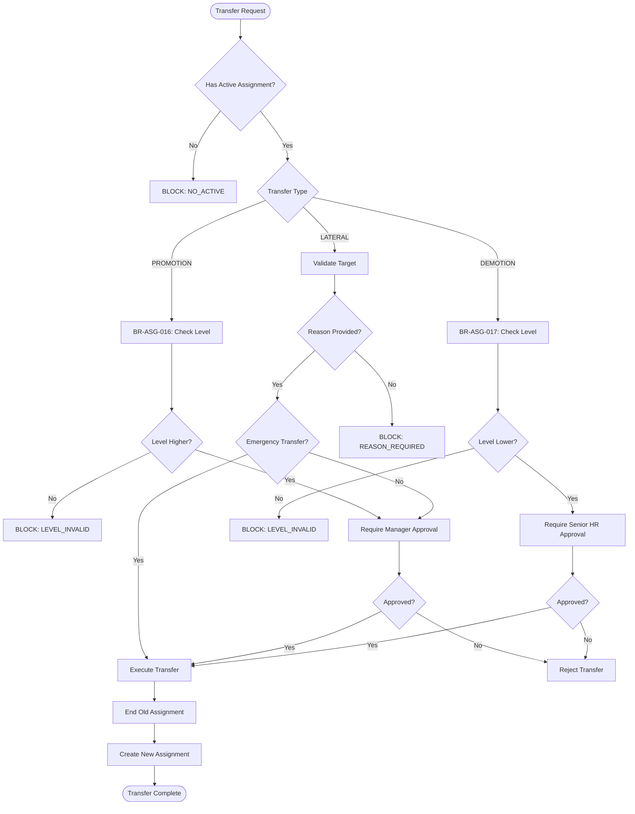
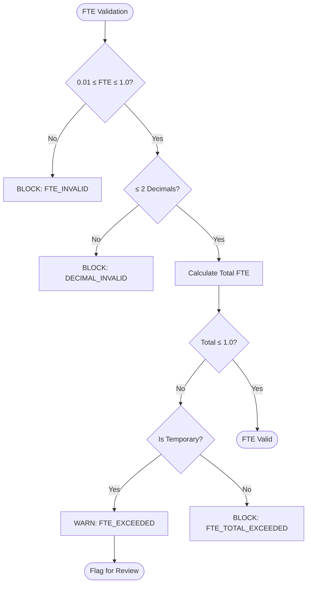

---
# === METADATA ===
id: BRS-CO-ASG
module: CORE
sub_module: ASSIGNMENT_MANAGEMENT
title: "Assignment Management Business Rules"
version: "1.0.0"
status: ACTIVE
owner: "Core Platform Team"
last_updated: "2026-01-08"
tags:
  - assignment
  - staffing
  - transfer
  - promotion
  - fte-validation

# === BUSINESS RULES DATA ===
business_rules:
  - id: BR-ASG-001
    title: "Assignment Creation Validation"
    description: "Assignment must meet all prerequisites including employee, staffing model, and FTE constraints."
    category: Validation
    severity: BLOCK
    priority: MUST
    status: ACTIVE
    condition: "employee IS ACTIVE AND staffing_model IS VALID AND (assignment_type = PRIMARY IMPLIES no_other_primary_exists) AND total_fte <= 1.0"
    action: "Reject creation with appropriate error code"
    exception: "Temporary assignments can temporarily exceed 1.0 FTE total"
    related_entities:
      - "[[Assignment]]"
      - "[[Employee]]"
      - "[[Position]]"
      - "[[Job]]"
    enforced_by:
      - "FR-ASG-001"

  - id: BR-ASG-002
    title: "Staffing Model Validation"
    description: "Staffing model determines which fields are required and how position status is managed."
    category: Validation
    severity: BLOCK
    priority: MUST
    status: ACTIVE
    condition: "staffing_model IN (POSITION_BASED, JOB_BASED)"
    action: "If POSITION_BASED: require position, derive job, update position status to FILLED. If JOB_BASED: require job, disallow position"
    exception: "None"
    related_entities:
      - "[[Assignment]]"
      - "[[Position]]"
      - "[[Job]]"
    enforced_by:
      - "FR-ASG-001"

  - id: BR-ASG-004
    title: "Manager Assignment Validation"
    description: "Manager assignment must follow reporting hierarchy rules and prevent circular reporting."
    category: Validation
    severity: BLOCK
    priority: MUST
    status: ACTIVE
    condition: "manager IS ACTIVE_EMPLOYEE AND manager_id != employee_id AND NOT circular_reporting_detected"
    action: "Assign solid line manager (required) and optional dotted line managers"
    exception: "CEO has no manager"
    related_entities:
      - "[[Assignment]]"
      - "[[Employee]]"
    enforced_by:
      - "FR-ASG-010"
      - "FR-MTX-001"

  - id: BR-ASG-010
    title: "FTE Validation"
    description: "FTE must be within valid range and total across all assignments cannot exceed 1.0."
    category: Validation
    severity: BLOCK
    priority: MUST
    status: ACTIVE
    condition: "fte BETWEEN 0.01 AND 1.0 AND decimal_places <= 2 AND SUM(employee.all_assignments.fte) <= 1.0"
    action: "Reject if FTE invalid or total exceeds 1.0"
    exception: "Temporary assignments can temporarily exceed 1.0 total FTE"
    related_entities:
      - "[[Assignment]]"
    enforced_by:
      - "FR-ASG-020"

  - id: BR-ASG-015
    title: "Transfer Validation"
    description: "Employee transfer must validate active assignment, transfer type, and require approvals."
    category: Workflow
    severity: BLOCK
    priority: MUST
    status: ACTIVE
    condition: "employee HAS active_assignment AND effective_date >= CURRENT_DATE AND transfer_type IS VALID AND target IS VALID"
    action: "End old assignment, create new assignment, require manager approval"
    exception: "Emergency transfers can bypass approval"
    related_entities:
      - "[[Assignment]]"
      - "[[Employee]]"
    enforced_by:
      - "FR-ASG-015"

  - id: BR-ASG-016
    title: "Promotion Validation"
    description: "Promotion must validate higher job level/grade and require manager approval."
    category: Workflow
    severity: WARN
    priority: SHOULD
    status: ACTIVE
    condition: "target_job.level > current_job.level OR target_job.grade > current_job.grade"
    action: "Create new assignment version with higher job level, require manager approval"
    exception: "Lateral moves to same level are allowed"
    related_entities:
      - "[[Assignment]]"
      - "[[Job]]"
    enforced_by:
      - "FR-ASG-016"

  - id: BR-ASG-017
    title: "Demotion Validation"
    description: "Demotion must validate lower job level/grade, require strong justification and senior approval."
    category: Workflow
    severity: WARN
    priority: SHOULD
    status: ACTIVE
    condition: "target_job.level < current_job.level OR target_job.grade < current_job.grade"
    action: "Create new assignment with lower job level, require senior HR approval and documented reason"
    exception: "None"
    related_entities:
      - "[[Assignment]]"
      - "[[Job]]"
    enforced_by:
      - "FR-ASG-017"

  - id: BR-ASG-018
    title: "Concurrent Assignment Validation"
    description: "Concurrent (secondary) assignments must not conflict with primary assignment and respect FTE limits."
    category: Validation
    severity: BLOCK
    priority: MUST
    status: ACTIVE
    condition: "assignment_type = CONCURRENT AND employee HAS primary_assignment AND (primary.fte + concurrent.fte) <= 1.0"
    action: "Allow concurrent assignment if FTE total is valid"
    exception: "None"
    related_entities:
      - "[[Assignment]]"
    enforced_by:
      - "FR-ASG-002"

  - id: BR-ASG-019
    title: "Temporary Assignment Validation"
    description: "Temporary assignments must have defined end dates and can temporarily exceed FTE limits."
    category: Validation
    severity: WARN
    priority: SHOULD
    status: ACTIVE
    condition: "assignment_type = TEMPORARY AND end_date IS NOT NULL AND end_date > start_date"
    action: "Allow temporary assignment even if total FTE temporarily exceeds 1.0, but flag for review"
    exception: "Temporary assignments can exceed FTE limits"
    related_entities:
      - "[[Assignment]]"
    enforced_by:
      - "FR-ASG-003"

  - id: BR-ASG-020
    title: "Assignment End Validation"
    description: "Assignment termination must validate end date, update position status, and handle dependent assignments."
    category: Workflow
    severity: BLOCK
    priority: MUST
    status: ACTIVE
    condition: "end_date >= start_date AND end_date <= CURRENT_DATE + grace_period"
    action: "End assignment, update position status to VACANT (if position-based), handle dependent concurrent assignments"
    exception: "None"
    related_entities:
      - "[[Assignment]]"
      - "[[Position]]"
    enforced_by:
      - "FR-ASG-011"

# === RELATED ONTOLOGY ===
related_ontology:
  - "[[Assignment]]"
  - "[[Employee]]"
  - "[[Position]]"
  - "[[Job]]"
  - "[[BusinessUnit]]"
  - "[[Location]]"
---

# Business Rules: Assignment Management

> **Scope**: This BRS file defines all business rules for Assignment Management in the Core module. These rules govern how employees are assigned to positions/jobs, how transfers and promotions work, and FTE (Full-Time Equivalent) validation.

## 1. Rule Scope



## 2. Rule Catalog

| ID | Rule | Category | Severity | Status |
|----|------|----------|----------|--------|
| `[[BR-ASG-001]]` | **Assignment Creation Validation**<br>Validate employee, staffing model, primary assignment uniqueness, FTE limits | Validation | BLOCK | ACTIVE |
| `[[BR-ASG-002]]` | **Staffing Model Validation**<br>POSITION_BASED requires position, JOB_BASED requires job | Validation | BLOCK | ACTIVE |
| `[[BR-ASG-004]]` | **Manager Assignment Validation**<br>Solid line manager required, prevent circular reporting | Validation | BLOCK | ACTIVE |
| `[[BR-ASG-010]]` | **FTE Validation**<br>FTE must be 0.01-1.0, total across assignments ≤ 1.0 | Validation | BLOCK | ACTIVE |
| `[[BR-ASG-015]]` | **Transfer Validation**<br>Validate transfer type, end old assignment, create new | Workflow | BLOCK | ACTIVE |
| `[[BR-ASG-016]]` | **Promotion Validation**<br>Higher job level/grade required, manager approval | Workflow | WARN | ACTIVE |
| `[[BR-ASG-017]]` | **Demotion Validation**<br>Lower job level/grade, senior HR approval required | Workflow | WARN | ACTIVE |
| `[[BR-ASG-018]]` | **Concurrent Assignment Validation**<br>Secondary assignments respect FTE limits | Validation | BLOCK | ACTIVE |
| `[[BR-ASG-019]]` | **Temporary Assignment Validation**<br>Must have end date, can exceed FTE temporarily | Validation | WARN | ACTIVE |
| `[[BR-ASG-020]]` | **Assignment End Validation**<br>End assignment, update position status, handle dependents | Workflow | BLOCK | ACTIVE |

## 3. Detailed Specifications

### [[BR-ASG-001]] Assignment Creation Validation

*   **Priority**: MUST
*   **Description**: Assignment creation must validate all prerequisites including employee status, staffing model, assignment type uniqueness, and FTE constraints.
*   **Condition**: 
    ```sql
    employee.is_active = true
    AND staffing_model IN ('POSITION_BASED', 'JOB_BASED')
    AND assignment_type IN ('PRIMARY', 'CONCURRENT', 'TEMPORARY')
    AND (assignment_type = 'PRIMARY' IMPLIES 
         NOT EXISTS (SELECT 1 FROM assignments WHERE employee_id = :employee_id AND type = 'PRIMARY' AND is_active = true))
    AND business_unit IS NOT NULL
    AND location IS NOT NULL
    AND start_date IS NOT NULL
    AND (staffing_model = 'POSITION_BASED' IMPLIES position IS NOT NULL AND position.status = 'VACANT')
    AND (staffing_model = 'JOB_BASED' IMPLIES job IS NOT NULL)
    AND (SUM(fte) OVER (PARTITION BY employee_id WHERE is_active = true) + :new_fte) <= 1.0
    ```
*   **Action**: Reject creation with appropriate error code if any condition fails
*   **Validation Rules**:
    1. Employee must exist and be active
    2. Assignment type required: PRIMARY, CONCURRENT, or TEMPORARY
    3. Staffing model required: POSITION_BASED or JOB_BASED
    4. Only one PRIMARY assignment allowed per employee
    5. Business unit and location are required
    6. Start date is required
    7. If POSITION_BASED: Position must be specified and status = VACANT
    8. If JOB_BASED: Job must be specified
    9. FTE total across all active assignments cannot exceed 1.0
*   **Exception**: Temporary assignments can temporarily exceed 1.0 FTE total
*   **Error Messages**:
    - `ASG_EMPLOYEE_REQUIRED`: "Employee is required"
    - `ASG_EMPLOYEE_INACTIVE`: "Employee must be active"
    - `ASG_PRIMARY_EXISTS`: "Employee already has PRIMARY assignment"
    - `ASG_FTE_EXCEEDED`: "Total FTE cannot exceed 1.0"
    - `ASG_POSITION_NOT_VACANT`: "Position is not vacant"
    - `ASG_BUSINESS_UNIT_REQUIRED`: "Business unit is required"
*   **Related Entities**: `[[Assignment]]`, `[[Employee]]`, `[[Position]]`, `[[Job]]`
*   **Enforced By**: FR-ASG-001

---

### [[BR-ASG-002]] Staffing Model Validation

*   **Priority**: MUST
*   **Description**: The staffing model determines which fields are required and how position status is managed.
*   **Condition**: 
    ```sql
    staffing_model IN ('POSITION_BASED', 'JOB_BASED')
    ```
*   **Action**: 
    - **POSITION_BASED**: 
      - Position is required
      - Job is derived from position.job_id
      - Position status updated to FILLED upon assignment creation
    - **JOB_BASED**:
      - Job is required
      - Position is not allowed (must be NULL)
      - No position status update
*   **Validation Rules**:
    1. **POSITION_BASED**: Position required, job derived, position → FILLED
    2. **JOB_BASED**: Job required, position not allowed
    3. Staffing model cannot be changed after creation
*   **Exception**: None
*   **Error Messages**:
    - `ASG_POSITION_REQUIRED`: "Position required for POSITION_BASED staffing"
    - `ASG_JOB_REQUIRED`: "Job required for JOB_BASED staffing"
    - `ASG_POSITION_NOT_ALLOWED`: "Position not allowed for JOB_BASED staffing"
*   **Related Entities**: `[[Assignment]]`, `[[Position]]`, `[[Job]]`
*   **Enforced By**: FR-ASG-001

---

### [[BR-ASG-004]] Manager Assignment Validation

*   **Priority**: MUST
*   **Description**: Manager assignment must follow reporting hierarchy rules and prevent circular reporting.
*   **Condition**: 
    ```sql
    manager IS ACTIVE_EMPLOYEE
    AND manager_id != employee_id
    AND NOT EXISTS (SELECT 1 FROM reporting_chain WHERE manager_id IN (:employee_ancestors))
    AND manager HAS active_assignment
    ```
*   **Action**: Assign solid line manager (required, max 1) and optional dotted line managers (multiple allowed)
*   **Validation Rules**:
    1. Solid line manager is required (except for CEO)
    2. Only one solid line manager per assignment
    3. Multiple dotted line managers allowed
    4. Manager must be an active employee
    5. Employee cannot be their own manager
    6. Circular reporting not allowed (manager cannot report to employee)
    7. Manager must have an active assignment
*   **Exception**: CEO has no manager (solid_line_manager_id = NULL allowed)
*   **Error Messages**:
    - `ASG_MANAGER_REQUIRED`: "Solid line manager is required"
    - `ASG_MANAGER_SELF`: "Employee cannot be their own manager"
    - `ASG_MANAGER_CIRCULAR`: "Circular reporting detected"
    - `ASG_MANAGER_INACTIVE`: "Manager must be active employee"
    - `ASG_MANAGER_NO_ASSIGNMENT`: "Manager must have active assignment"
*   **Related Entities**: `[[Assignment]]`, `[[Employee]]`
*   **Enforced By**: FR-ASG-010, FR-MTX-001

---

### [[BR-ASG-010]] FTE Validation

*   **Priority**: MUST
*   **Description**: FTE (Full-Time Equivalent) must be within valid range and total across all active assignments cannot exceed 1.0.
*   **Condition**: 
    ```sql
    fte BETWEEN 0.01 AND 1.0
    AND fte = ROUND(fte, 2)
    AND (SUM(fte) OVER (PARTITION BY employee_id WHERE is_active = true) + :new_fte) <= 1.0
    ```
*   **Action**: Reject if FTE is invalid or total exceeds 1.0
*   **Validation Rules**:
    1. FTE must be between 0.01 and 1.0
    2. FTE must have maximum 2 decimal places (e.g., 0.75, 0.50)
    3. Total FTE across all active assignments cannot exceed 1.0
    4. PRIMARY assignment typically has the highest FTE
    5. FTE changes create new version (SCD Type 2)
*   **Exception**: Temporary assignments can temporarily exceed 1.0 total FTE (flagged for review)
*   **Error Messages**:
    - `ASG_FTE_INVALID`: "FTE must be between 0.01 and 1.0"
    - `ASG_FTE_DECIMAL_INVALID`: "FTE must have maximum 2 decimal places"
    - `ASG_FTE_TOTAL_EXCEEDED`: "Total FTE across assignments exceeds 1.0"
*   **Related Entities**: `[[Assignment]]`
*   **Enforced By**: FR-ASG-020

---

### [[BR-ASG-015]] Transfer Validation

*   **Priority**: MUST
*   **Description**: Employee transfer must validate active assignment, transfer type, target validity, and require approvals.
*   **Condition**: 
    ```sql
    employee EXISTS (SELECT 1 FROM assignments WHERE employee_id = :employee_id AND is_active = true)
    AND effective_date >= CURRENT_DATE
    AND transfer_type IN ('LATERAL', 'PROMOTION', 'DEMOTION')
    AND target_business_unit IS VALID
    AND (target_job IS VALID OR target_position IS VALID)
    AND transfer_reason IS NOT NULL
    ```
*   **Action**: 
    1. End old assignment (set end_date = effective_date - 1)
    2. Create new assignment (start_date = effective_date)
    3. Require manager approval (unless emergency transfer)
    4. Log transfer with reason
*   **Validation Rules**:
    1. Employee must have active assignment
    2. Effective date must be today or future
    3. Transfer type required: LATERAL, PROMOTION, or DEMOTION
    4. Target business unit/job/position must be valid
    5. Transfer reason is required
    6. Manager approval required (unless emergency)
*   **Exception**: Emergency transfers can bypass approval requirement
*   **Error Messages**:
    - `ASG_TRANSFER_NO_ACTIVE`: "Employee has no active assignment"
    - `ASG_TRANSFER_REASON_REQUIRED`: "Transfer reason is required"
    - `ASG_TRANSFER_EFFECTIVE_DATE_INVALID`: "Effective date must be today or future"
    - `ASG_TRANSFER_TARGET_INVALID`: "Transfer target is invalid"
*   **Related Entities**: `[[Assignment]]`, `[[Employee]]`
*   **Enforced By**: FR-ASG-015

---

### [[BR-ASG-016]] Promotion Validation

*   **Priority**: SHOULD
*   **Description**: Promotion must validate that target job has higher level/grade and require manager approval.
*   **Condition**: 
    ```sql
    (target_job.job_level > current_job.job_level 
     OR (target_job.job_level = current_job.job_level AND target_job.job_grade > current_job.job_grade))
    AND promotion_effective_date >= CURRENT_DATE
    AND promotion_reason IS NOT NULL
    ```
*   **Action**: 
    1. Validate target job level/grade is higher
    2. Create new assignment version with target job
    3. Require manager approval
    4. Log promotion with reason
*   **Validation Rules**:
    1. Target job level must be higher than current OR
    2. Target job grade must be higher (if same level)
    3. Promotion effective date must be today or future
    4. Promotion reason is required
    5. Manager approval required
    6. Promotion creates new assignment version
*   **Exception**: Lateral moves to same level are allowed (not considered promotion)
*   **Error Messages**:
    - `ASG_PROMOTION_LEVEL_INVALID`: "Target level must be higher than current"
    - `ASG_PROMOTION_APPROVAL_REQUIRED`: "Manager approval required for promotion"
    - `ASG_PROMOTION_REASON_REQUIRED`: "Promotion reason is required"
*   **Related Entities**: `[[Assignment]]`, `[[Job]]`
*   **Enforced By**: FR-ASG-016

---

### [[BR-ASG-017]] Demotion Validation

*   **Priority**: SHOULD
*   **Description**: Demotion must validate lower job level/grade and require strong justification and senior HR approval.
*   **Condition**: 
    ```sql
    (target_job.job_level < current_job.job_level 
     OR (target_job.job_level = current_job.job_level AND target_job.job_grade < current_job.job_grade))
    AND demotion_effective_date >= CURRENT_DATE
    AND demotion_reason IS NOT NULL AND LENGTH(demotion_reason) >= 50
    ```
*   **Action**: 
    1. Validate target job level/grade is lower
    2. Create new assignment with lower job
    3. Require senior HR approval (not just manager)
    4. Document reason (minimum 50 characters)
    5. Flag for compliance review
*   **Validation Rules**:
    1. Target job level must be lower than current OR
    2. Target job grade must be lower (if same level)
    3. Demotion effective date must be today or future
    4. Documented reason required (minimum 50 characters)
    5. Senior HR approval required
    6. Compliance flag for review
*   **Exception**: None
*   **Error Messages**:
    - `ASG_DEMOTION_LEVEL_INVALID`: "Target level must be lower than current"
    - `ASG_DEMOTION_APPROVAL_REQUIRED`: "Senior HR approval required for demotion"
    - `ASG_DEMOTION_REASON_INSUFFICIENT`: "Demotion reason must be at least 50 characters"
*   **Related Entities**: `[[Assignment]]`, `[[Job]]`
*   **Enforced By**: FR-ASG-017

---

### [[BR-ASG-018]] Concurrent Assignment Validation

*   **Priority**: MUST
*   **Description**: Concurrent (secondary) assignments must not conflict with primary assignment and respect FTE limits.
*   **Condition**: 
    ```sql
    assignment_type = 'CONCURRENT'
    AND EXISTS (SELECT 1 FROM assignments WHERE employee_id = :employee_id AND type = 'PRIMARY' AND is_active = true)
    AND (primary_assignment.fte + concurrent_assignment.fte) <= 1.0
    ```
*   **Action**: Allow concurrent assignment creation if employee has primary assignment and total FTE is valid
*   **Validation Rules**:
    1. Employee must have active PRIMARY assignment
    2. Concurrent FTE + Primary FTE must be ≤ 1.0
    3. Concurrent assignments cannot overlap dates with each other (same time period)
    4. Business unit can differ from primary assignment
*   **Exception**: None
*   **Error Messages**:
    - `ASG_CONCURRENT_NO_PRIMARY`: "Employee must have primary assignment for concurrent assignment"
    - `ASG_CONCURRENT_FTE_EXCEEDED`: "Primary FTE + Concurrent FTE exceeds 1.0"
*   **Related Entities**: `[[Assignment]]`
*   **Enforced By**: FR-ASG-002

---

### [[BR-ASG-019]] Temporary Assignment Validation

*   **Priority**: SHOULD
*   **Description**: Temporary assignments must have defined end dates and can temporarily exceed FTE limits.
*   **Condition**: 
    ```sql
    assignment_type = 'TEMPORARY'
    AND end_date IS NOT NULL
    AND end_date > start_date
    AND (end_date - start_date) <= max_temporary_duration
    ```
*   **Action**: Allow temporary assignment even if total FTE temporarily exceeds 1.0, but flag for HR review
*   **Validation Rules**:
    1. End date is required for temporary assignments
    2. End date must be after start date
    3. Duration should not exceed maximum (e.g., 12 months)
    4. Temporary assignments can exceed 1.0 FTE total (flagged)
    5. Automatic alerts before end date
*   **Exception**: Temporary assignments can exceed FTE limits (generates warning, not block)
*   **Error Messages**:
    - `ASG_TEMPORARY_END_DATE_REQUIRED`: "End date required for temporary assignment"
    - `ASG_TEMPORARY_DURATION_EXCEEDED`: "Temporary assignment duration exceeds maximum"
    - `ASG_TEMPORARY_FTE_WARNING`: "Warning: Total FTE exceeds 1.0 due to temporary assignment"
*   **Related Entities**: `[[Assignment]]`
*   **Enforced By**: FR-ASG-003

---

### [[BR-ASG-020]] Assignment End Validation

*   **Priority**: MUST
*   **Description**: Assignment termination must validate end date, update position status, and handle dependent assignments.
*   **Condition**: 
    ```sql
    end_date >= start_date
    AND end_date <= CURRENT_DATE + grace_period_days
    AND (assignment_type = 'PRIMARY' IMPLIES handle_dependent_concurrent_assignments)
    ```
*   **Action**: 
    1. Set end_date on assignment
    2. If POSITION_BASED: Update position status to VACANT
    3. If PRIMARY assignment: Handle/end dependent concurrent assignments
    4. Log termination reason
*   **Validation Rules**:
    1. End date must be >= start date
    2. End date cannot be too far in future (e.g., max 90 days grace period)
    3. Termination reason may be required
    4. Position status updated to VACANT (if position-based)
    5. Dependent concurrent assignments handled
*   **Exception**: None
*   **Error Messages**:
    - `ASG_END_DATE_BEFORE_START`: "End date cannot be before start date"
    - `ASG_END_DATE_TOO_FAR`: "End date cannot exceed {days} days in future"
    - `ASG_HAS_DEPENDENT_CONCURRENT`: "Cannot end primary assignment with active concurrent assignments"
*   **Related Entities**: `[[Assignment]]`, `[[Position]]`
*   **Enforced By**: FR-ASG-011

---

## 4. Decision Logic

### Assignment Creation Flow



### Transfer Flow



### FTE Validation Flow


