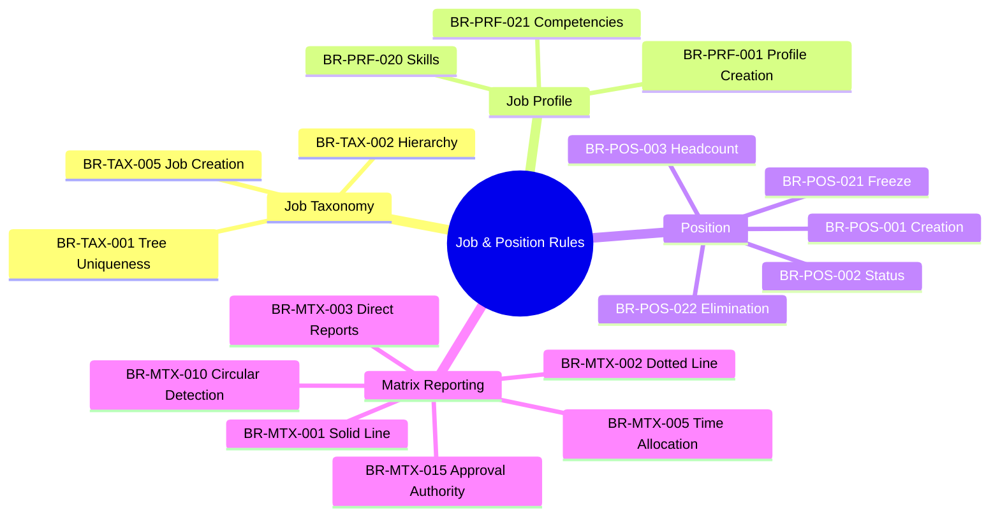
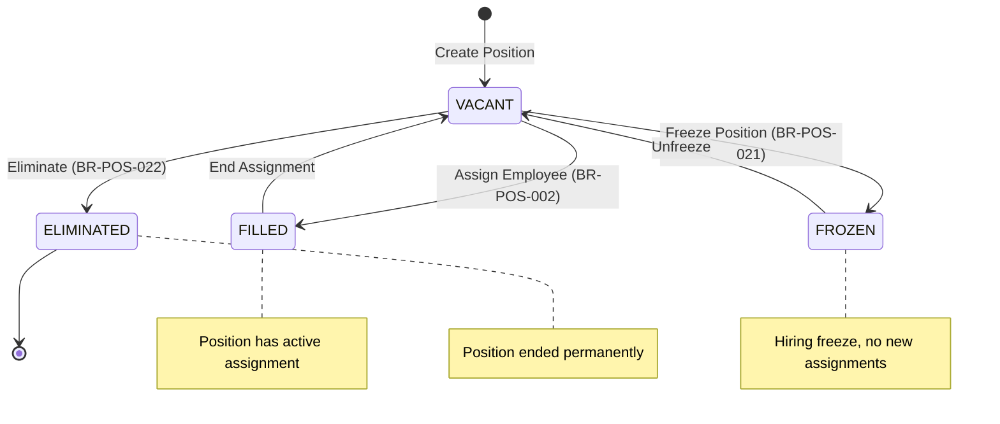
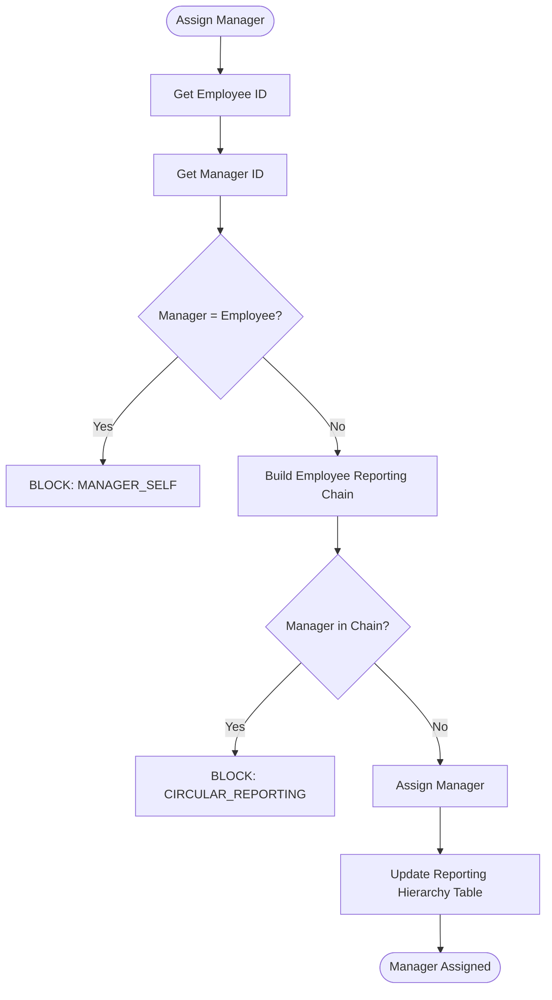
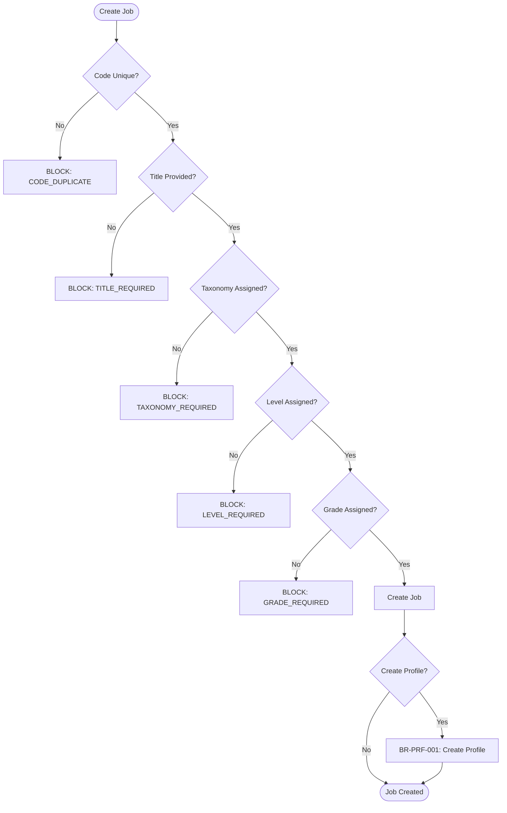

---
# === METADATA ===
id: BRS-CO-JOBPOS
module: CORE
sub_module: JOB_POSITION
title: "Job & Position Management Business Rules"
version: "1.0.0"
status: ACTIVE
owner: "Core Platform Team"
last_updated: "2026-01-08"
tags:
  - job-taxonomy
  - job-profile
  - position
  - matrix-reporting
  - reporting-hierarchy

# === BUSINESS RULES DATA ===
business_rules:
  # Job Taxonomy Rules
  - id: BR-TAX-001
    title: "Taxonomy Tree Uniqueness"
    description: "Taxonomy tree code must be unique to support multiple classification schemes."
    category: Validation
    severity: BLOCK
    priority: MUST
    status: ACTIVE
    condition: "taxonomy_tree_code IS UNIQUE"
    action: "Create taxonomy tree, reject if duplicate"
    exception: "None"
    related_entities:
      - "[[TaxonomyTree]]"
    enforced_by:
      - "FR-TAX-001"

  - id: BR-TAX-002
    title: "Job Taxonomy Hierarchy"
    description: "Job taxonomy hierarchy must prevent circular references and respect maximum depth."
    category: Validation
    severity: BLOCK
    priority: SHOULD
    status: ACTIVE
    condition: "taxonomy_code UNIQUE within tree AND NOT circular_reference AND depth <= 5"
    action: "Create job taxonomy with calculated hierarchy path"
    exception: "Root taxonomy has no parent"
    related_entities:
      - "[[JobTaxonomy]]"
    enforced_by:
      - "FR-TAX-002"

  - id: BR-TAX-005
    title: "Job Creation Validation"
    description: "Job creation must validate code uniqueness, taxonomy assignment, level, and grade assignment."
    category: Validation
    severity: BLOCK
    priority: MUST
    status: ACTIVE
    condition: "job_code IS UNIQUE AND job_title IS NOT NULL AND job_taxonomy IS PROVIDED AND job_level IS PROVIDED"
    action: "Create job with required attributes"
    exception: "None"
    related_entities:
      - "[[Job]]"
      - "[[JobTaxonomy]]"
      - "[[JobLevel]]"
    enforced_by:
      - "FR-TAX-005"

  # Job Profile Rules
  - id: BR-PRF-001
    title: "Job Profile Creation"
    description: "Job profile creation must validate job existence and implement versioning (SCD Type 2)."
    category: Validation
    severity: WARN
    priority: SHOULD
    status: ACTIVE
    condition: "job EXISTS AND description IS NOT NULL AND effective_start_date IS NOT NULL"
    action: "Create job profile version, set is_current flag"
    exception: "None"
    related_entities:
      - "[[JobProfile]]"
      - "[[Job]]"
    enforced_by:
      - "FR-PRF-001"

  - id: BR-PRF-020
    title: "Job Profile Skills"
    description: "Job profile skills must reference valid skills with proficiency levels."
    category: Validation
    severity: WARN
    priority: SHOULD
    status: ACTIVE
    condition: "skill EXISTS in SkillMaster AND proficiency_level IS VALID"
    action: "Assign skill to job profile with proficiency"
    exception: "None"
    related_entities:
      - "[[JobProfile]]"
      - "[[SkillMaster]]"
    enforced_by:
      - "FR-PRF-020"

  - id: BR-PRF-021
    title: "Job Profile Competencies"
    description: "Job profile competencies must reference valid competencies with required levels."
    category: Validation
    severity: WARN
    priority: SHOULD
    status: ACTIVE
    condition: "competency EXISTS in CompetencyMaster AND required_level IS VALID"
    action: "Assign competency to job profile with level"
    exception: "None"
    related_entities:
      - "[[JobProfile]]"
      - "[[CompetencyMaster]]"
    enforced_by:
      - "FR-PRF-021"

  # Position Rules
  - id: BR-POS-001
    title: "Position Creation"
    description: "Position creation must validate business unit, job assignment, and FTE."
    category: Validation
    severity: BLOCK
    priority: MUST
    status: ACTIVE
    condition: "business_unit IS VALID AND job IS VALID AND fte BETWEEN 0.01 AND 1.0"
    action: "Create position with status=VACANT"
    exception: "None"
    related_entities:
      - "[[Position]]"
      - "[[BusinessUnit]]"
      - "[[Job]]"
    enforced_by:
      - "FR-POS-001"

  - id: BR-POS-002
    title: "Position Status Validation"
    description: "Position status transitions must follow valid state machine rules."
    category: Workflow
    severity: BLOCK
    priority: MUST
    status: ACTIVE
    condition: "status transition IS VALID: VACANT->FILLED->VACANT OR VACANT->FROZEN->VACANT"
    action: "Update position status with effective dates"
    exception: "None"
    related_entities:
      - "[[Position]]"
    enforced_by:
      - "FR-POS-002"

  - id: BR-POS-003
    title: "Position Headcount"
    description: "Position creation must respect business unit headcount budget constraints."
    category: Validation
    severity: WARN
    priority: SHOULD
    status: ACTIVE
    condition: "business_unit.active_positions.count < business_unit.headcount_budget"
    action: "Allow position creation, warn if approaching budget"
    exception: "Approval can override budget"
    related_entities:
      - "[[Position]]"
      - "[[BusinessUnit]]"
    enforced_by:
      - "FR-POS-003"

  - id: BR-POS-021
    title: "Position Freeze Validation"
    description: "Position freeze must validate no active assignment and set freeze reason."
    category: Workflow
    severity: BLOCK
    priority: SHOULD
    status: ACTIVE
    condition: "position.status = VACANT AND freeze_reason IS PROVIDED"
    action: "Set status=FROZEN with effective dates"
    exception: "None"
    related_entities:
      - "[[Position]]"
    enforced_by:
      - "FR-POS-021"

  - id: BR-POS-022
    title: "Position Elimination"
    description: "Position elimination must validate no active assignment and set elimination reason."
    category: Workflow
    severity: BLOCK
    priority: SHOULD
    status: ACTIVE
    condition: "position.status = VACANT AND elimination_reason IS PROVIDED"
    action: "Set end_date and eliminate position"
    exception: "None"
    related_entities:
      - "[[Position]]"
    enforced_by:
      - "FR-POS-022"

  # Matrix Reporting Rules
  - id: BR-MTX-001
    title: "Solid Line Manager"
    description: "Solid line manager must be unique per assignment, active, and prevent circular reporting."
    category: Validation
    severity: BLOCK
    priority: MUST
    status: ACTIVE
    condition: "only_one_solid_line_manager AND manager IS ACTIVE AND manager_id != employee_id AND NOT circular"
    action: "Assign solid line manager with approval authority"
    exception: "CEO has no manager"
    related_entities:
      - "[[Assignment]]"
      - "[[Employee]]"
    enforced_by:
      - "FR-MTX-001"

  - id: BR-MTX-002
    title: "Dotted Line Manager"
    description: "Dotted line managers (multiple allowed) for coordination roles without approval authority."
    category: Validation
    severity: WARN
    priority: SHOULD
    status: ACTIVE
    condition: "manager IS ACTIVE AND time_allocation_percentage IS SPECIFIED"
    action: "Assign dotted line manager with coordination role"
    exception: "None"
    related_entities:
      - "[[Assignment]]"
      - "[[Employee]]"
    enforced_by:
      - "FR-MTX-002"

  - id: BR-MTX-003
    title: "Direct Reports"
    description: "Direct reports calculation must aggregate solid line and dotted line reporting relationships."
    category: Calculation
    severity: INFO
    priority: SHOULD
    status: ACTIVE
    condition: "manager HAS active_assignment"
    action: "Calculate direct reports: solid_line_count + dotted_line_count"
    exception: "None"
    related_entities:
      - "[[Assignment]]"
    enforced_by:
      - "FR-MTX-003"

  - id: BR-MTX-005
    title: "Manager Time Allocation"
    description: "Manager time allocation across multiple dotted line relationships must not exceed 100%."
    category: Validation
    severity: WARN
    priority: SHOULD
    status: ACTIVE
    condition: "SUM(dotted_line_managers.time_allocation) <= 100"
    action: "Validate total allocation, warn if excessive"
    exception: "Advisory only, does not block"
    related_entities:
      - "[[Assignment]]"
    enforced_by:
      - "FR-MTX-005"

  - id: BR-MTX-010
    title: "Circular Reporting Detection"
    description: "Circular reporting relationships must be detected and prevented in reporting hierarchy."
    category: Validation
    severity: BLOCK
    priority: MUST
    status: ACTIVE
    condition: "manager NOT IN employee.reporting_chain (recursive ancestors)"
    action: "Reject manager assignment if creates cycle"
    exception: "None"
    related_entities:
      - "[[Assignment]]"
    enforced_by:
      - "FR-MTX-010"

  - id: BR-MTX-015
    title: "Manager Approval Authority"
    description: "Manager approval authority is derived from solid line relationship and can be delegated."
    category: Process
    severity: INFO
    priority: SHOULD
    status: ACTIVE
    condition: "manager HAS solid_line_relationship TO employee"
    action: "Grant approval authority for direct reports"
    exception: "Authority can be delegated temporarily"
    related_entities:
      - "[[Assignment]]"
    enforced_by:
      - "FR-MTX-015"

# === RELATED ONTOLOGY ===
related_ontology:
  - "[[Job]]"
  - "[[Position]]"
  - "[[TaxonomyTree]]"
  - "[[JobTaxonomy]]"
  - "[[JobProfile]]"
  - "[[JobLevel]]"
  - "[[BusinessUnit]]"
  - "[[Assignment]]"
  - "[[Employee]]"
  - "[[SkillMaster]]"
  - "[[CompetencyMaster]]"
---

# Business Rules: Job & Position Management

> **Scope**: This BRS file defines all business rules for Job & Position Management in the Core module. These rules govern Job Taxonomy, Job Profiles, Position management, and Matrix Reporting hierarchies.

## 1. Rule Scope



## 2. Rule Catalog

| ID | Rule | Category | Severity | Status |
|----|------|----------|----------|--------|
| `[[BR-TAX-001]]` | **Taxonomy Tree Uniqueness**<br>Tree code must be unique for multiple classification schemes | Validation | BLOCK | ACTIVE |
| `[[BR-TAX-002]]` | **Job Taxonomy Hierarchy**<br>Prevent circular references, max depth 5 levels | Validation | BLOCK | ACTIVE |
| `[[BR-TAX-005]]` | **Job Creation Validation**<br>Validate code, title, taxonomy, level, grade | Validation | BLOCK | ACTIVE |
| `[[BR-PRF-001]]` | **Job Profile Creation**<br>Versioned profiles (SCD Type 2) per job | Validation | WARN | ACTIVE |
| `[[BR-PRF-020]]` | **Job Profile Skills**<br>Skills with proficiency levels | Validation | WARN | ACTIVE |
| `[[BR-PRF-021]]` | **Job Profile Competencies**<br>Competencies with required levels | Validation | WARN | ACTIVE |
| `[[BR-POS-001]]` | **Position Creation**<br>Validate BU, job, FTE (0.01-1.0) | Validation | BLOCK | ACTIVE |
| `[[BR-POS-002]]` | **Position Status Validation**<br>Valid state transitions (VACANT/FILLED/FROZEN) | Workflow | BLOCK | ACTIVE |
| `[[BR-POS-003]]` | **Position Headcount**<br>Respect BU headcount budget | Validation | WARN | ACTIVE |
| `[[BR-POS-021]]` | **Position Freeze Validation**<br>No active assignment, freeze reason required | Workflow | BLOCK | ACTIVE |
| `[[BR-POS-022]]` | **Position Elimination**<br>No active assignment, elimination reason required | Workflow | BLOCK | ACTIVE |
| `[[BR-MTX-001]]` | **Solid Line Manager**<br>One per assignment, prevents circular reporting | Validation | BLOCK | ACTIVE |
| `[[BR-MTX-002]]` | **Dotted Line Manager**<br>Multiple allowed, coordination role only | Validation | WARN | ACTIVE |
| `[[BR-MTX-003]]` | **Direct Reports**<br>Calculate solid + dotted line reports | Calculation | INFO | ACTIVE |
| `[[BR-MTX-005]]` | **Manager Time Allocation**<br>Dotted line allocation ≤ 100% | Validation | WARN | ACTIVE |
| `[[BR-MTX-010]]` | **Circular Reporting Detection**<br>Prevent manager being subordinate | Validation | BLOCK | ACTIVE |
| `[[BR-MTX-015]]` | **Manager Approval Authority**<br>Solid line grants approval authority | Process | INFO | ACTIVE |

## 3. Detailed Specifications

### [[BR-TAX-001]] Taxonomy Tree Uniqueness

*   **Priority**: MUST
*   **Description**: Taxonomy tree code must be unique to support multiple job classification schemes.
*   **Condition**: `taxonomy_tree_code IS UNIQUE`
*   **Action**: Create taxonomy tree, reject if duplicate
*   **Validation Rules**:
    1. Tree code must be unique (case-insensitive)
    2. Tree name is required
    3. Tree purpose should be documented
    4. Multiple trees can coexist (e.g., ONET, Internal, Industry-specific)
    5. Tree cannot be deleted if has taxonomies
*   **Exception**: None
*   **Error Messages**:
    - `TAX_TREE_CODE_DUPLICATE`: "Taxonomy tree code already exists"
    - `TAX_TREE_HAS_TAXONOMIES`: "Cannot delete tree with taxonomies"
*   **Related Entities**: `[[ TaxonomyTree]]`
*   **Enforced By**: FR-TAX-001

---

### [[BR POS-001]] Position Creation

*   **Priority**: MUST
*   **Description**: Position creation must validate business unit, job assignment, and FTE.
*   **Condition**: 
    ```sql
    business_unit IS VALID
    AND job IS VALID
    AND fte BETWEEN 0.01 AND 1.0
    AND position_code IS UNIQUE
    ```
*   **Action**: Create position with initial status=VACANT
*   **Validation Rules**:
    1. Business unit is required and must be active
    2. Job is required and must be active
    3. FTE must be between 0.01 and 1.0
    4. Position code must be unique
    5. Initial status is VACANT
    6. Effective start date is required
*   **Exception**: None
*   **Error Messages**:
    - `POS_BU_REQUIRED`: "Business unit is required"
    - `POS_JOB_REQUIRED`: "Job is required"
    - `POS_FTE_INVALID`: "FTE must be between 0.01 and 1.0"
    - `POS_CODE_DUPLICATE`: "Position code already exists"
*   **Related Entities**: `[[Position]]`, `[[BusinessUnit]]`, `[[Job]]`
*   **Enforced By**: FR-POS-001

---

### [[BR-MTX-010]] Circular Reporting Detection

*   **Priority**: MUST
*   **Description**: Circular reporting relationships must be detected and prevented.
*   **Condition**: 
    ```sql
    manager_id NOT IN (
      SELECT ancestor_id 
      FROM reporting_hierarchy 
      WHERE descendant_id = employee_id
    )
    ```
*   **Action**: Reject manager assignment if creates cycle
*   **Validation Rules**:
    1. Manager cannot be employee themselves
    2. Manager cannot be a subordinate of employee (direct or indirect)
    3. Recursive hierarchy check through reporting chain
    4. Check applies to both solid and dotted line relationships
*   **Exception**: None
*   **Error Messages**:
    - `MTX_CIRCULAR_REPORTING`: "Circular reporting detected - manager cannot be subordinate"
    - `MTX_MANAGER_SELF`: "Employee cannot be their own manager"
*   **Related Entities**: `[[Assignment]]`
*   **Enforced By**: FR-MTX-010

---

## 4. Decision Logic

### Position Status State Machine



### Circular Reporting Detection Algorithm



### Job Creation Validation Flow


