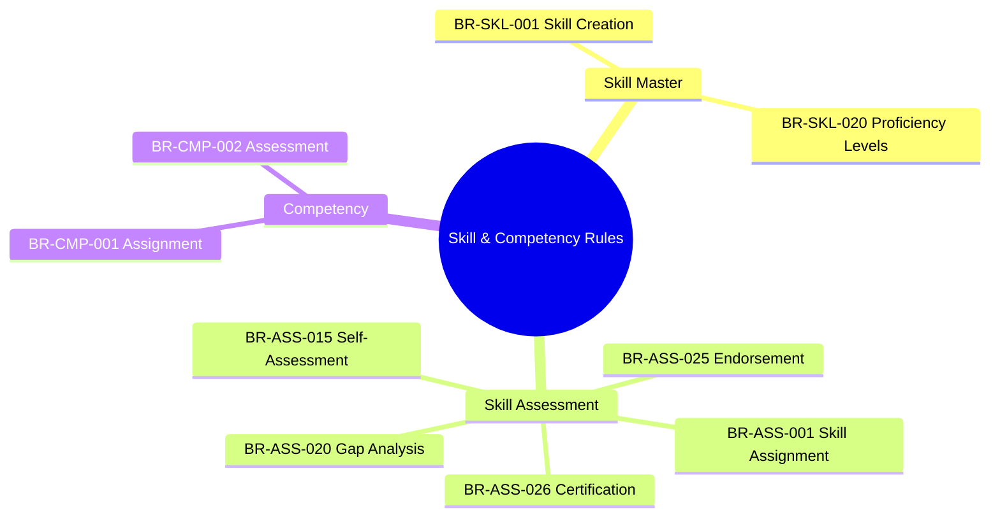
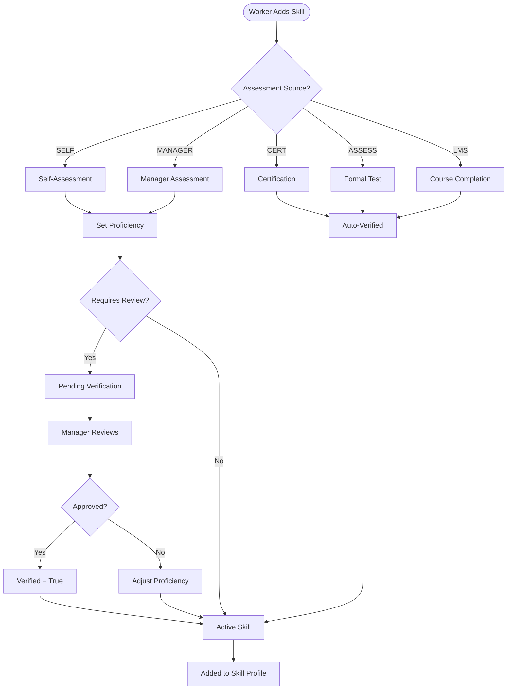
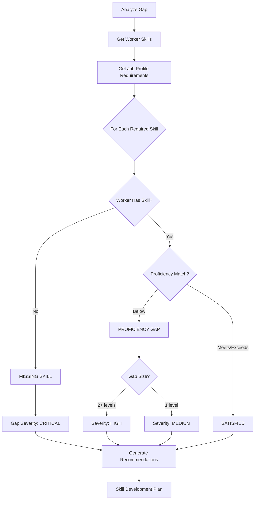
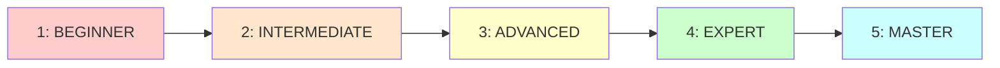

---
# === METADATA ===
id: BRS-CO-SKILL
module: CO
sub_module: skill
title: "Skill & Competency Management Business Rules"
version: "1.0.0"
status: DRAFT
owner: "Core Team"
last_updated: "2026-01-08"
tags:
  - skill
  - competency
  - assessment
  - capability

# === BUSINESS RULES DATA ===
business_rules:
  # Skill Master Rules (2)
  - id: BR-SKL-001
    title: "Skill Creation"
    description: "Skill creation validation rules"
    category: Validation
    severity: BLOCK
    priority: SHOULD
    status: ACTIVE
    condition: "WHEN creating a skill in catalog"
    action: "Validate skill code unique, skill name required, skill category required, description recommended, effective dates set"
    exception: "None"
    related_entities:
      - "[[SkillMaster]]"
      - "[[SkillCategory]]"
    enforced_by:
      - "FR-SKL-001"

  - id: BR-SKL-020
    title: "Proficiency Levels"
    description: "Proficiency level validation and standardization"
    category: Validation
    severity: WARN
    priority: SHOULD
    status: ACTIVE
    condition: "WHEN defining proficiency levels"
    action: "Use standard levels: BEGINNER, INTERMEDIATE, ADVANCED, EXPERT; level code unique; level rank determines ordering; custom levels allowed; minimum 3 levels recommended"
    exception: "None"
    related_entities:
      - "[[SkillMaster]]"
    enforced_by:
      - "FR-SKL-006"

  # Skill Assessment Rules (5)
  - id: BR-ASS-001
    title: "Skill Assignment"
    description: "Skill assignment to worker validation"
    category: Validation
    severity: BLOCK
    priority: SHOULD
    status: ACTIVE
    condition: "WHEN assigning skill to worker"
    action: "Employee must exist; skill must exist; proficiency level required; assessment source required (SELF, MANAGER, CERTIFIED); duplicate skills not allowed; assessment date recorded"
    exception: "None"
    related_entities:
      - "[[WorkerSkill]]"
      - "[[Worker]]"
      - "[[SkillMaster]]"
    enforced_by:
      - "FR-ASS-001"

  - id: BR-ASS-015
    title: "Self-Assessment"
    description: "Self-assessment validation rules"
    category: Workflow
    severity: WARN
    priority: SHOULD
    status: ACTIVE
    condition: "WHEN employee self-assesses skill"
    action: "Employee can self-assess any skill; source marked as SELF_ASSESSED; may require manager approval; can be overridden by manager; assessment date recorded"
    exception: "None"
    related_entities:
      - "[[WorkerSkill]]"
      - "[[Worker]]"
    enforced_by:
      - "FR-ASS-005"

  - id: BR-ASS-020
    title: "Skill Gap Analysis"
    description: "Skill gap analysis calculation rules"
    category: Calculation
    severity: INFO
    priority: SHOULD
    status: ACTIVE
    condition: "WHEN analyzing skill gaps"
    action: "Compare employee skills to job profile requirements; identify missing skills; identify proficiency gaps; calculate gap severity; provide development recommendations"
    exception: "None"
    related_entities:
      - "[[WorkerSkill]]"
      - "[[JobProfile]]"
      - "[[Worker]]"
    enforced_by:
      - "FR-ASS-010"

  - id: BR-ASS-025
    title: "Skill Endorsement"
    description: "Skill endorsement validation"
    category: Workflow
    severity: WARN
    priority: COULD
    status: ACTIVE
    condition: "WHEN endorsing a skill"
    action: "Endorser must be active employee; cannot endorse own skills; can endorse same skill multiple times; endorsement count displayed; endorsement date recorded"
    exception: "None"
    related_entities:
      - "[[WorkerSkill]]"
      - "[[Worker]]"
    enforced_by:
      - "FR-ASS-015"

  - id: BR-ASS-026
    title: "Skill Certification"
    description: "Skill certification validation"
    category: Validation
    severity: WARN
    priority: SHOULD
    status: ACTIVE
    condition: "WHEN recording skill certification"
    action: "Certification name required; issuing organization required; issue date required; expiry date optional; certification document attachable; source marked as CERTIFIED"
    exception: "None"
    related_entities:
      - "[[WorkerSkill]]"
      - "[[Worker]]"
    enforced_by:
      - "FR-ASS-016"

  # Competency Rules (2)
  - id: BR-CMP-001
    title: "Competency Assignment"
    description: "Competency assignment to worker validation"
    category: Validation
    severity: WARN
    priority: SHOULD
    status: ACTIVE
    condition: "WHEN assigning competency to worker"
    action: "Worker must exist; competency must exist in master; proficiency level required; assessment source required; duplicate competencies not allowed; effective dates set"
    exception: "None"
    related_entities:
      - "[[WorkerCompetency]]"
      - "[[Worker]]"
      - "[[CompetencyMaster]]"
    enforced_by:
      - "FR-CMP-001"

  - id: BR-CMP-002
    title: "Competency Assessment"
    description: "Competency assessment workflow rules"
    category: Workflow
    severity: WARN
    priority: SHOULD
    status: ACTIVE
    condition: "WHEN assessing worker competency"
    action: "Assessment must have assessor; assessment date required; rating scale 1-5; evidence/notes recommended; can reassess to track progress; historical assessments retained"
    exception: "None"
    related_entities:
      - "[[WorkerCompetency]]"
      - "[[Worker]]"
      - "[[CompetencyMaster]]"
    enforced_by:
      - "FR-CMP-002"

# === RELATED ONTOLOGY ===
related_ontology:
  - "[[SkillMaster]]"
  - "[[SkillCategory]]"
  - "[[WorkerSkill]]"
  - "[[Worker]]"
  - "[[CompetencyMaster]]"
  - "[[WorkerCompetency]]"
  - "[[JobProfile]]"
---

# Skill & Competency Management Business Rules

## 1. Rule Scope



## 2. Rule Catalog

| ID | Rule | Category | Severity | Status |
|----|------|----------|----------|--------|
| `[[BR-SKL-001]]` | **Skill Creation**<br>Validate skill code, name, category requirements | Validation | BLOCK | ACTIVE |
| `[[BR-SKL-020]]` | **Proficiency Levels**<br>Standardize proficiency scale levels | Validation | WARN | ACTIVE |
| `[[BR-ASS-001]]` | **Skill Assignment**<br>Validate skill-to-worker assignment | Validation | BLOCK | ACTIVE |
| `[[BR-ASS-015]]` | **Self-Assessment**<br>Employee self-assessment workflow | Workflow | WARN | ACTIVE |
| `[[BR-ASS-020]]` | **Skill Gap Analysis**<br>Compare worker skills vs job requirements | Calculation | INFO | ACTIVE |
| `[[BR-ASS-025]]` | **Skill Endorsement**<br>Peer endorsement validation | Workflow | WARN | ACTIVE |
| `[[BR-ASS-026]]` | **Skill Certification**<br>Professional certification validation | Validation | WARN | ACTIVE |
| `[[BR-CMP-001]]` | **Competency Assignment**<br>Assign competency to worker | Validation | WARN | ACTIVE |
| `[[BR-CMP-002]]` | **Competency Assessment**<br>Assess worker competency levels | Workflow | WARN | ACTIVE |

## 3. Detailed Specifications

### Skill Master Rules

#### [[BR-SKL-001]] Skill Creation

*   **Priority**: SHOULD
*   **Description**: Validates all requirements for creating a new skill in the master catalog
*   **Condition**: 
    ```
    WHEN creating a skill
    ```
*   **Validation Rules**:
    1. Skill code must be unique
    2. Skill name is required (max 200 characters)
    3. Skill category is required
    4. Skill description recommended but optional
    5. Effective start date is set
    6. Cannot create duplicate skills
*   **Exception**: None
*   **Error Messages**:
    - `SKL_CODE_DUPLICATE`: "Skill code already exists"
    - `SKL_NAME_REQUIRED`: "Skill name is required"
    - `SKL_CATEGORY_REQUIRED`: "Skill category is required"
*   **Related Entities**: `[[SkillMaster]]`, `[[SkillCategory]]`
*   **Enforced By**: FR-SKL-001

---

#### [[BR-SKL-020]] Proficiency Levels

*   **Priority**: SHOULD
*   **Description**: Defines standardized proficiency levels for consistent skill assessment
*   **Condition**:
    ```
    WHEN defining proficiency levels
    ```
*   **Validation Rules**:
    1. Standard levels: BEGINNER (1), INTERMEDIATE (2), ADVANCED (3), EXPERT (4), MASTER (5)
    2. Level code must be unique
    3. Level rank determines ordering
    4. Custom levels can be added per organization needs
    5. At least 3 levels recommended for meaningful differentiation
    6. Proficiency scale is configurable per skill if needed
*   **Exception**: None
*   **Error Messages**:
    - `SKL_LEVEL_CODE_DUPLICATE`: "Proficiency level code already exists"
    - `SKL_LEVEL_MIN_COUNT`: "At least 3 proficiency levels recommended"
*   **Related Entities**: `[[SkillMaster]]`
*   **Enforced By**: FR-SKL-006

---

### Skill Assessment Rules

#### [[BR-ASS-001]] Skill Assignment

*   **Priority**: SHOULD
*   **Description**: Validates assignment of skills to workers
*   **Condition**:
    ```
    WHEN assigning skill to employee
    ```
*   **Validation Rules**:
    1. Employee (Worker) must exist and be active
    2. Skill must exist in SkillMaster
    3. Proficiency level is required (1-5 scale)
    4. Assessment source is required: SELF, MANAGER, CERT, ASSESS, LMS
    5. Duplicate skills not allowed (one active record per worker-skill)
    6. Assessment date is recorded automatically
    7. Years of experience optional but recommended
*   **Exception**: None
*   **Error Messages**:
    - `ASS_EMPLOYEE_NOT_FOUND`: "Employee not found"
    - `ASS_SKILL_NOT_FOUND`: "Skill not found in catalog"
    - `ASS_SKILL_DUPLICATE`: "Skill already assigned to employee"
    - `ASS_PROFICIENCY_REQUIRED`: "Proficiency level is required"
    - `ASS_SOURCE_REQUIRED`: "Assessment source is required"
*   **Related Entities**: `[[WorkerSkill]]`, `[[Worker]]`, `[[SkillMaster]]`
*   **Enforced By**: FR-ASS-001

---

#### [[BR-ASS-015]] Self-Assessment

*   **Priority**: SHOULD
*   **Description**: Defines rules for employee self-assessment of skills
*   **Condition**:
    ```
    WHEN employee self-assesses skill
    ```
*   **Validation Rules**:
    1. Employee can self-assess any skill from catalog
    2. Source is automatically marked as SELF_ASSESSED
    3. Self-assessment may require manager approval (configurable)
    4. Self-assessment can be overridden by manager assessment
    5. Assessment date is recorded
    6. Unverified flag is set until manager reviews
*   **Exception**: None
*   **Error Messages**: None (business logic rule)
*   **Related Entities**: `[[WorkerSkill]]`, `[[Worker]]`
*   **Enforced By**: FR-ASS-005

---

#### [[BR-ASS-020]] Skill Gap Analysis

*   **Priority**: SHOULD
*   **Description**: Analyzes gaps between worker skills and job requirements
*   **Condition**:
    ```
    WHEN analyzing skill gaps
    ```
*   **Validation Rules**:
    1. Compare employee current skills to job profile requirements
    2. Identify missing skills (required but not possessed)
    3. Identify proficiency gaps (skill present but below required level)
    4. Calculate gap severity: CRITICAL (missing required), HIGH (1-2 levels below), MEDIUM (1 level below)
    5. Provide development recommendations based on gaps
    6. Generate skill development plan
*   **Exception**: None
*   **Error Messages**: None (analysis rule)
*   **Related Entities**: `[[WorkerSkill]]`, `[[JobProfile]]`, `[[Worker]]`
*   **Enforced By**: FR-ASS-010

---

#### [[BR-ASS-025]] Skill Endorsement

*   **Priority**: COULD
*   **Description**: Validates peer endorsements of worker skills
*   **Condition**:
    ```
    WHEN endorsing a skill
    ```
*   **Validation Rules**:
    1. Endorser must be active employee
    2. Cannot endorse own skills
    3. Can endorse same skill multiple times (different endorsers)
    4. Endorsement count is displayed on skill profile
    5. Endorsement date is recorded
    6. Endorser identity is tracked
*   **Exception**: None
*   **Error Messages**:
    - `ASS_ENDORSE_SELF`: "Cannot endorse own skills"
    - `ASS_ENDORSER_INACTIVE`: "Endorser must be active employee"
*   **Related Entities**: `[[WorkerSkill]]`, `[[Worker]]`
*   **Enforced By**: FR-ASS-015

---

#### [[BR-ASS-026]] Skill Certification

*   **Priority**: SHOULD
*   **Description**: Validates recording of professional certifications
*   **Condition**:
    ```
    WHEN recording skill certification
    ```
*   **Validation Rules**:
    1. Certification name is required
    2. Issuing organization is required
    3. Issue date is required
    4. Expiry date is optional (some certs don't expire)
    5. Certification document/credential can be attached
    6. Source is automatically marked as CERTIFIED
    7. Verified flag is set to true
    8. Certification renewals tracked separately
*   **Exception**: None
*   **Error Messages**:
    - `ASS_CERT_NAME_REQUIRED`: "Certification name is required"
    - `ASS_CERT_ISSUER_REQUIRED`: "Issuing organization is required"
    - `ASS_CERT_DATE_REQUIRED`: "Issue date is required"
*   **Related Entities**: `[[WorkerSkill]]`, `[[Worker]]`
*   **Enforced By**: FR-ASS-016

---

### Competency Rules

#### [[BR-CMP-001]] Competency Assignment

*   **Priority**: SHOULD
*   **Description**: Validates assignment of competencies to workers
*   **Condition**:
    ```
    WHEN assigning competency to worker
    ```
*   **Validation Rules**:
    1. Worker must exist and be active
    2. Competency must exist in CompetencyMaster
    3. Proficiency level required (1-5 scale)
    4. Assessment source required (SELF, MANAGER, ASSESS)
    5. Duplicate competencies not allowed (one active per worker-competency)
    6. Effective start date set
    7. Behavioral indicators documented
*   **Exception**: None
*   **Error Messages**:
    - `CMP_WORKER_NOT_FOUND`: "Worker not found"
    - `CMP_NOT_FOUND`: "Competency not found in catalog"
    - `CMP_DUPLICATE`: "Competency already assigned to worker"
    - `CMP_PROFICIENCY_REQUIRED`: "Proficiency level required"
*   **Related Entities**: `[[WorkerCompetency]]`, `[[Worker]]`, `[[CompetencyMaster]]`
*   **Enforced By**: FR-CMP-001

---

#### [[BR-CMP-002]] Competency Assessment

*   **Priority**: SHOULD
*   **Description**: Defines workflow for assessing worker competencies
*   **Condition**:
    ```
    WHEN assessing worker competency
    ```
*   **Validation Rules**:
    1. Assessment must have assessor identified
    2. Assessment date required
    3. Rating scale 1-5 with behavioral anchors
    4. Evidence/notes recommended for justification
    5. Can reassess periodically to track progress
    6. Historical assessments retained for trending
    7. 360-degree feedback can supplement manager assessment
*   **Exception**: None
*   **Error Messages**:
    - `CMP_ASSESSOR_REQUIRED`: "Assessor is required"
    - `CMP_DATE_REQUIRED`: "Assessment date is required"
    - `CMP_RATING_INVALID`: "Rating must be 1-5"
*   **Related Entities**: `[[WorkerCompetency]]`, `[[Worker]]`, `[[CompetencyMaster]]`
*   **Enforced By**: FR-CMP-002

---

## 4. Decision Logic

### Skill Assessment Workflow



### Skill Gap Analysis Flow



### Proficiency Level Scale



**Level Definitions**:
- **Level 1 (Beginner)**: Basic knowledge, needs guidance, learning
- **Level 2 (Intermediate)**: Can work with some supervision, developing
- **Level 3 (Advanced)**: Works independently, competent
- **Level 4 (Expert)**: Can teach others, handles complex cases, proficient
- **Level 5 (Master)**: Industry recognized, thought leader, innovations
