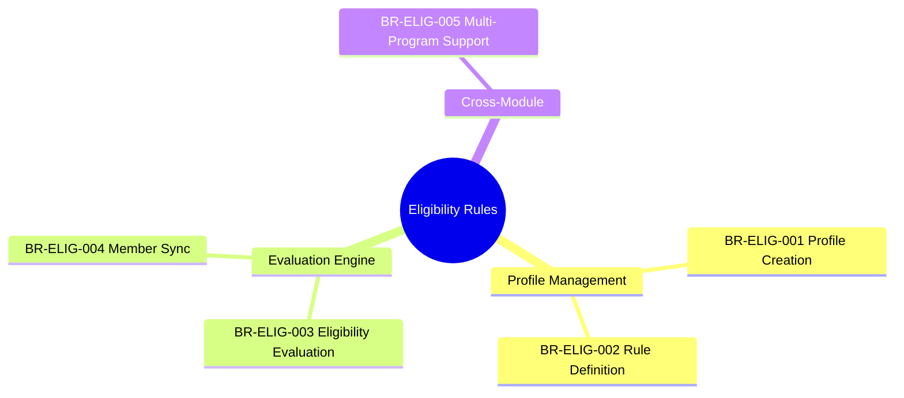
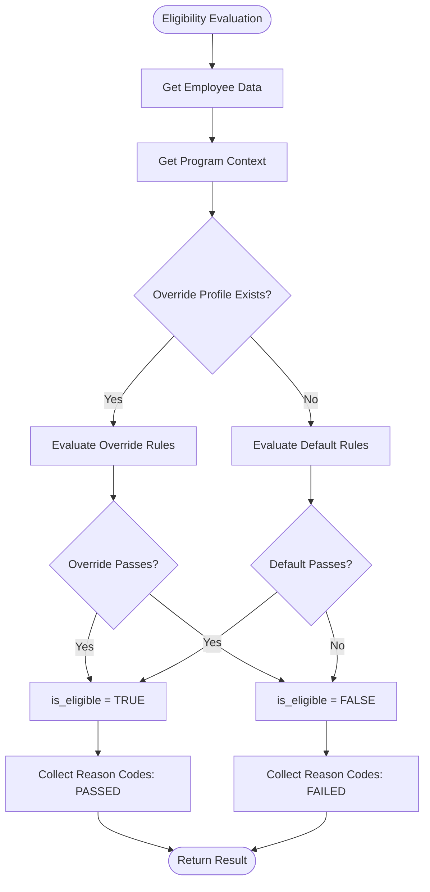
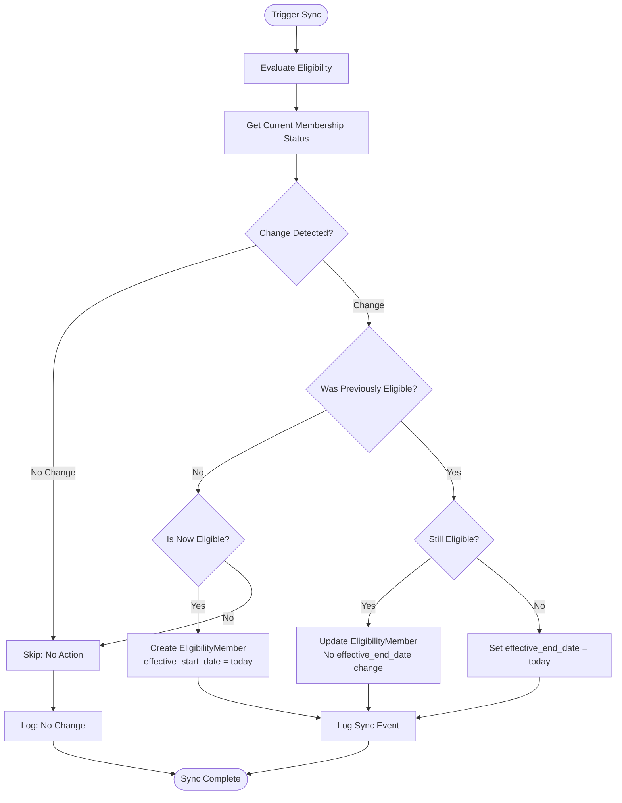
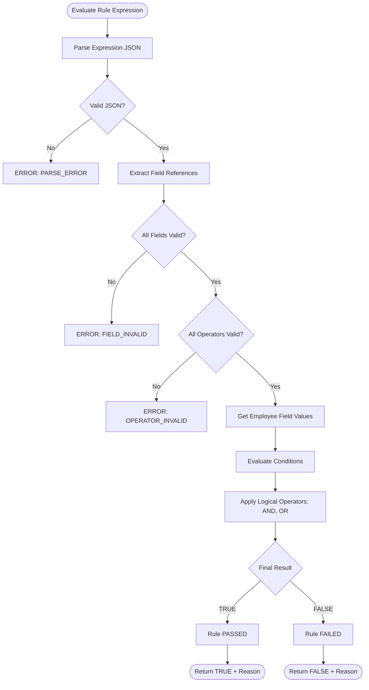

---
# === METADATA ===
id: BRS-CO-ELIG
module: CORE
sub_module: ELIGIBILITY_MANAGEMENT
title: "Eligibility Management Business Rules"
version: "1.0.0"
status: ACTIVE
owner: "Core Platform Team"
last_updated: "2026-01-08"
tags:
  - eligibility
  - eligibility-profile
  - eligibility-evaluation
  - cross-module
  - benefit-eligibility

# === BUSINESS RULES DATA ===
business_rules:
  - id: BR-ELIG-001
    title: "Eligibility Profile Creation"
    description: "Eligibility profile creation must validate program context, rule definition, and default/override model configuration."
    category: Validation
    severity: BLOCK
    priority: MUST
    status: ACTIVE
    condition: "program_context IS VALID AND profile_type IN (DEFAULT, OVERRIDE) AND eligibility_rules ARE DEFINED"
    action: "Create eligibility profile with rule set"
    exception: "None"
    related_entities:
      - "[[EligibilityProfile]]"
    enforced_by:
      - "FR-ELIG-001"

  - id: BR-ELIG-002
    title: "Eligibility Rule Definition"
    description: "Eligibility rules must define valid condition expressions, operator logic, and value constraints."
    category: Validation
    severity: BLOCK
    priority: MUST
    status: ACTIVE
    condition: "rule_expression IS PARSEABLE AND field_references ARE VALID AND operators IN (EQUALS, NOT_EQUALS, IN, NOT_IN, GT, LT, CONTAINS)"
    action: "Validate and store eligibility rule expression"
    exception: "None"
    related_entities:
      - "[[EligibilityProfile]]"
    enforced_by:
      - "FR-ELIG-002"

  - id: BR-ELIG-003
    title: "Eligibility Evaluation"
    description: "Eligibility evaluation must execute rule engine, apply default/override model, and return boolean result with reason codes."
    category: Calculation
    severity: BLOCK
    priority: MUST
    status: ACTIVE
    condition: "employee EXISTS AND program EXISTS AND eligibility_profile EXISTS"
    action: "Execute rule engine: evaluate override profile OR default profile, return is_eligible + reason_codes"
    exception: "None"
    related_entities:
      - "[[EligibilityProfile]]"
      - "[[EligibilityEvaluation]]"
      - "[[Employee]]"
    enforced_by:
      - "FR-ELIG-003"

  - id: BR-ELIG-004
    title: "Eligibility Member Sync"
    description: "Eligibility member list must sync with evaluation results and maintain effective date ranges."
    category: Workflow
    severity: WARN
    priority: SHOULD
    status: ACTIVE
    condition: "eligibility_evaluation.is_eligible = true"
    action: "Add/update EligibilityMember with effective_start_date, remove if no longer eligible with effective_end_date"
    exception: "Manual overrides can bypass automatic sync"
    related_entities:
      - "[[EligibilityMember]]"
      - "[[EligibilityEvaluation]]"
    enforced_by:
      - "FR-ELIG-004"

  - id: BR-ELIG-005
    title: "Cross-module Eligibility"
    description: "Eligibility framework must support cross-module programs (Benefits, Leave, Learning, Compensation) with consistent evaluation model."
    category: Process
    severity: INFO
    priority: MUST
    status: ACTIVE
    condition: "program.module IN (BENEFITS, LEAVE, LEARNING, COMPENSATION) AND eligibility_profile.is_active = true"
    action: "Evaluate eligibility using unified framework across all modules"
    exception: "None"
    related_entities:
      - "[[EligibilityProfile]]"
      - "[[EligibilityEvaluation]]"
    enforced_by:
      - "FR-ELIG-005"

# === RELATED ONTOLOGY ===
related_ontology:
  - "[[EligibilityProfile]]"
  - "[[EligibilityMember]]"
  - "[[EligibilityEvaluation]]"
  - "[[Employee]]"
  - "[[Program]]"
---

# Business Rules: Eligibility Management

> **Scope**: This BRS file defines all business rules for the cross-cutting Eligibility Management framework in the Core module. These rules govern how eligibility profiles are created, how rules are defined, how eligibility is evaluated, and how the framework supports multiple modules (Benefits, Leave, Learning, Compensation).

## 1. Rule Scope



## 2. Rule Catalog

| ID | Rule | Category | Severity | Status |
|----|------|----------|----------|--------|
| `[[BR-ELIG-001]]` | **Eligibility Profile Creation**<br>Validate program context, profile type (DEFAULT/OVERRIDE), rule definition | Validation | BLOCK | ACTIVE |
| `[[BR-ELIG-002]]` | **Eligibility Rule Definition**<br>Valid condition expressions, operators, value constraints | Validation | BLOCK | ACTIVE |
| `[[BR-ELIG-003]]` | **Eligibility Evaluation**<br>Execute rule engine with default/override model, return is_eligible + reasons | Calculation | BLOCK | ACTIVE |
| `[[BR-ELIG-004]]` | **Eligibility Member Sync**<br>Sync member list with evaluation results and effective dates | Workflow | WARN | ACTIVE |
| `[[BR-ELIG-005]]` | **Cross-module Eligibility**<br>Unified framework for Benefits, Leave, Learning, Compensation | Process | INFO | ACTIVE |

## 3. Detailed Specifications

### [[BR-ELIG-001]] Eligibility Profile Creation

*   **Priority**: MUST
*   **Description**: Eligibility profile creation must validate program context, profile type, and rule definition to ensure proper configuration.
*   **Condition**: 
    ```sql
    program_context IS VALID (module + program_id)
    AND profile_type IN ('DEFAULT', 'OVERRIDE')
    AND eligibility_rules ARE DEFINED (at least one rule)
    AND effective_start_date IS NOT NULL
    ```
*   **Action**: Create eligibility profile with rule set
*   **Validation Rules**:
    1. Program context is required (module + program_id)
    2. Profile type must be DEFAULT or OVERRIDE
    3. At least one eligibility rule must be defined
    4. Effective start date is required
    5. Profile name is required
    6. Is_active flag defaults to true
    7. Priority is required for OVERRIDE profiles
*   **Exception**: None
*   **Error Messages**:
    - `ELIG_PROGRAM_REQUIRED`: "Program context is required"
    - `ELIG_PROFILE_TYPE_INVALID`: "Profile type must be DEFAULT or OVERRIDE"
    - `ELIG_NO_RULES`: "At least one eligibility rule must be defined"
*   **Related Entities**: `[[EligibilityProfile]]`
*   **Enforced By**: FR-ELIG-001

---

### [[BR-ELIG-002]] Eligibility Rule Definition

*   **Priority**: MUST
*   **Description**: Eligibility rules must define valid condition expressions with parseable syntax, valid field references, and supported operators.
*   **Condition**: 
    ```sql
    rule_expression IS PARSEABLE
    AND field_references ARE VALID (exist in employee/assignment/contract data model)
    AND operators IN ('EQUALS', 'NOT_EQUALS', 'IN', 'NOT_IN', 'GT', 'LT', 'GTE', 'LTE', 'CONTAINS', 'AND', 'OR')
    AND values ARE TYPE_COMPATIBLE with fields
    ```
*   **Action**: Validate and store eligibility rule expression
*   **Validation Rules**:
    1. Rule expression must be parseable (valid JSON structure)
    2. Field references must exist in data model (e.g., employee.employment_type, assignment.fte)
    3. Operators must be supported
    4. Values must be type-compatible (e.g., numeric field → numeric value)
    5. Logical operators (AND, OR) must have valid operands
    6. Parentheses for grouping must be balanced
*   **Exception**: None
*   **Error Messages**:
    - `ELIG_RULE_PARSE_ERROR`: "Unable to parse rule expression"
    - `ELIG_FIELD_INVALID`: "Field '{field}' does not exist in data model"
    - `ELIG_OPERATOR_INVALID`: "Operator '{operator}' is not supported"
    - `ELIG_TYPE_MISMATCH`: "Value type mismatch for field '{field}'"
*   **Related Entities**: `[[EligibilityProfile]]`
*   **Enforced By**: FR-ELIG-002

---

### [[BR-ELIG-003]] Eligibility Evaluation

*   **Priority**: MUST
*   **Description**: Eligibility evaluation must execute the rule engine using the default/override model and return a boolean result with reason codes.
*   **Condition**: 
    ```sql
    employee EXISTS AND employee.is_active = true
    AND program EXISTS AND program.is_active = true
    AND eligibility_profile EXISTS AND eligibility_profile.is_active = true
    ```
*   **Action**: Execute eligibility evaluation using Default + Override model:
    1. Check for active OVERRIDE profile for this employee + program
    2. If override exists, evaluate override rules
    3. If no override or override not applicable, evaluate DEFAULT profile rules
    4. Return `is_eligible` (boolean) + `reason_codes` (array of matched/failed rules)
*   **Validation Rules**:
    1. Employee must exist and be active
    2. Program must exist and be active
    3. At least one eligibility profile (DEFAULT) must exist for the program
    4. Evaluation date defaults to current date
    5. Override profiles take precedence over default
    6. Reason codes explain which rules passed/failed
*   **Exception**: None
*   **Error Messages**:
    - `ELIG_EMPLOYEE_NOT_FOUND`: "Employee not found"
    - `ELIG_PROGRAM_NOT_FOUND`: "Program not found"
    - `ELIG_NO_PROFILE`: "No eligibility profile found for program"
*   **Related Entities**: `[[EligibilityProfile]]`, `[[EligibilityEvaluation]]`, `[[Employee]]`
*   **Enforced By**: FR-ELIG-003

---

### [[BR-ELIG-004]] Eligibility Member Sync

*   **Priority**: SHOULD
*   **Description**: Eligibility member list must automatically sync with evaluation results and maintain proper effective date ranges.
*   **Condition**: 
    ```sql
    eligibility_evaluation.is_eligible = true
    OR eligibility_evaluation.is_eligible = false (for removal)
    ```
*   **Action**: 
    - **If newly eligible**: Create `EligibilityMember` record with `effective_start_date = evaluation_date`
    - **If still eligible**: Update existing `EligibilityMember` (no action if unchanged)
    - **If no longer eligible**: Set `effective_end_date = evaluation_date` on existing `EligibilityMember`
*   **Validation Rules**:
    1. Sync can be triggered manually or automatically (e.g., on employee data change)
    2. Effective dates create audit trail
    3. Previous eligibility periods are preserved
    4. Manual overrides can bypass automatic sync
    5. Sync status is tracked (last_sync_date)
*   **Exception**: Manual overrides can bypass automatic sync (requires HR approval)
*   **Error Messages**:
    - `ELIG_SYNC_FAILED`: "Failed to sync eligibility member list"
*   **Related Entities**: `[[EligibilityMember]]`, `[[EligibilityEvaluation]]`
*   **Enforced By**: FR-ELIG-004

---

### [[BR-ELIG-005]] Cross-module Eligibility

*   **Priority**: MUST
*   **Description**: Eligibility framework must support cross-module programs (Benefits, Leave, Learning, Compensation) with a consistent evaluation model.
*   **Condition**: 
    ```sql
    program.module IN ('BENEFITS', 'LEAVE', 'LEARNING', 'COMPENSATION')
    AND eligibility_profile.is_active = true
    AND eligibility_profile.program_id = program.id
    ```
*   **Action**: Evaluate eligibility using unified framework across all modules:
    - **Benefits**: Benefit plan eligibility (e.g., health insurance, retirement)
    - **Leave**: Leave type eligibility (e.g., parental leave, sabbatical)
    - **Learning**: Training program eligibility (e.g., leadership development)
    - **Compensation**: Compensation component eligibility (e.g., bonus, equity)
*   **Validation Rules**:
    1. Unified eligibility framework applies to all modules
    2. Each module can define module-specific programs
    3. Eligibility profiles are program-specific
    4. Rule engine is module-agnostic
    5. Default + Override model applies consistently
*   **Exception**: None
*   **Error Messages**:
    - `ELIG_MODULE_NOT_SUPPORTED`: "Module '{module}' does not support eligibility framework"
*   **Related Entities**: `[[EligibilityProfile]]`, `[[EligibilityEvaluation]]`
*   **Enforced By**: FR-ELIG-005

---

## 4. Decision Logic

### Eligibility Evaluation Flow (Default + Override Model)



### Eligibility Member Sync Flow



### Rule Expression Evaluation Flow


