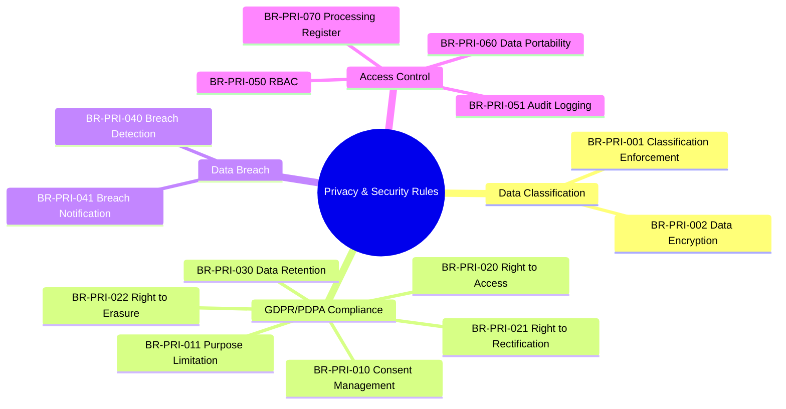
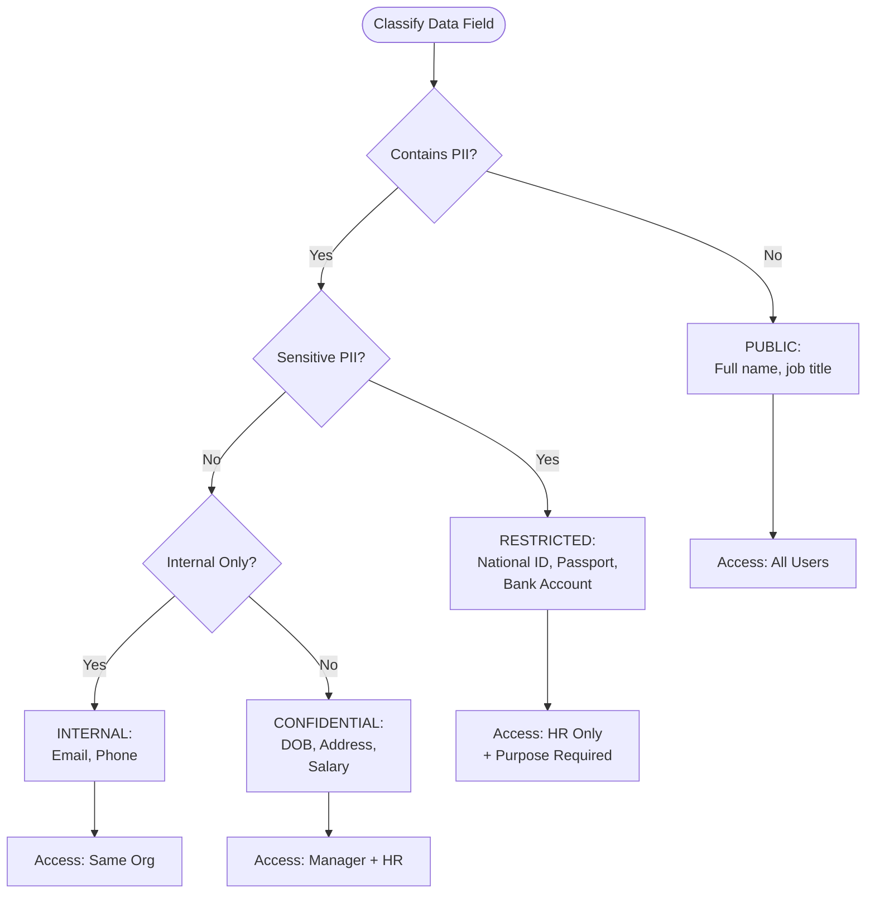
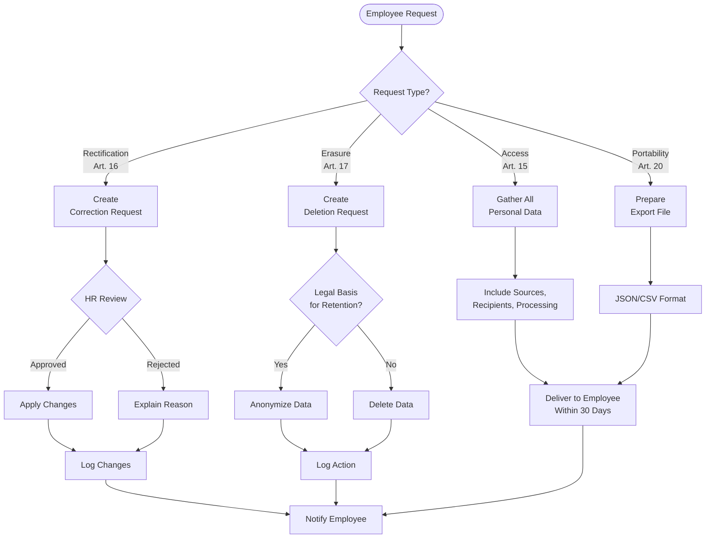
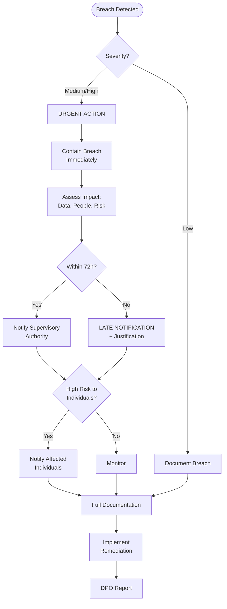

---
# === METADATA ===
id: BRS-CO-PRIVACY
module: CO
sub_module: privacy
title: "Data Privacy & Security Business Rules"
version: "1.0.0"
status: DRAFT
owner: "Core Team"
last_updated: "2026-01-08"
tags:
  - privacy
  - gdpr
  - pdpa
  - security
  - compliance

# === BUSINESS RULES DATA ===
business_rules:
  # Data Classification (2)
  - id: BR-PRI-001
    title: "Data Classification Enforcement"
    description: "Enforce field-level data classification and access control"
    category: Security
    severity: BLOCK
    priority: MUST
    status: ACTIVE
    condition: "WHEN accessing or storing data"
    action: "Enforce classification levels: PUBLIC (all), INTERNAL (same org), CONFIDENTIAL (manager+HR), RESTRICTED (HR only with purpose); document in data dictionary; log all access"
    exception: "Employee can access own data; DPO can access for compliance"
    related_entities:
      - "[[Worker]]"
      - "[[Employee]]"
    enforced_by:
      - "FR-PRI-001"
      - "FR-WRK-010"

  - id: BR-PRI-002
    title: "Data Encryption"
    description: "Encrypt RESTRICTED data at rest and in transit"
    category: Security
    severity: BLOCK
    priority: MUST
    status: ACTIVE
    condition: "WHEN storing RESTRICTED data"
    action: "Use AES-256 encryption; manage keys securely; encrypt at rest; encrypt in transit (HTTPS); decrypt only for authorized access"
    exception: "None"
    related_entities:
      - "[[Worker]]"
      - "[[Employee]]"
    enforced_by:
      - "FR-PRI-002"

  # GDPR/PDPA Compliance (6)
  - id: BR-PRI-010
    title: "Consent Management"
    description: "Manage data processing consent per GDPR/PDPA"
    category: Compliance
    severity: BLOCK
    priority: MUST
    status: ACTIVE
    condition: "WHEN processing personal data"
    action: "Consent purpose clearly stated; can be granted/denied/withdrawn anytime; history tracked; expiry enforced; processing without consent requires legal basis"
    exception: "Employment contract provides legal basis for core HR data"
    related_entities:
      - "[[DataConsent]]"
      - "[[Worker]]"
    enforced_by:
      - "FR-PRI-003"

  - id: BR-PRI-011
    title: "Purpose Limitation"
    description: "Data used only for documented purposes"
    category: Compliance
    severity: BLOCK
    priority: MUST
    status: ACTIVE
    condition: "WHEN accessing personal data"
    action: "Purpose must be specified from approved list; purpose logged; usage audited against purpose; violations reported"
    exception: "None"
    related_entities:
      - "[[Worker]]"
      - "[[Employee]]"
    enforced_by:
      - "FR-PRI-005"

  - id: BR-PRI-020
    title: "Right to Access (GDPR Art. 15)"
    description: "Employee right to access all personal data"
    category: Compliance
    severity: BLOCK
    priority: MUST
    status: ACTIVE
    condition: "WHEN employee requests personal data"
    action: "Provide all personal data in readable format; include processing activities, data sources, recipients; fulfill within 30 days; log access request"
    exception: "None"
    related_entities:
      - "[[Worker]]"
      - "[[Employee]]"
    enforced_by:
      - "FR-PRI-010"

  - id: BR-PRI-021
    title: "Right to Rectification (GDPR Art. 16)"
    description: "Employee right to correct personal data"
    category: Compliance
    severity: BLOCK
    priority: MUST
    status: ACTIVE
    condition: "WHEN employee requests data correction"
    action: "Create correction request; HR reviews; approved corrections applied; rejected requests explained; fulfill within 30 days; log rectification"
    exception: "Some fields require approval (e.g., date of birth)"
    related_entities:
      - "[[Worker]]"
      - "[[Employee]]"
    enforced_by:
      - "FR-PRI-011"

  - id: BR-PRI-022
    title: "Right to Erasure (GDPR Art. 17)"
    description: "Employee right to be forgotten"
    category: Compliance
    severity: BLOCK
    priority: MUST
    status: ACTIVE
    condition: "WHEN employee requests data deletion"
    action: "Create deletion request; check legal basis for retention; delete if no legal basis; anonymize if deletion not possible; fulfill within 30 days; log deletion; notify employee"
    exception: "Legal retention requirements override deletion; anonymization when deletion not possible"
    related_entities:
      - "[[Worker]]"
      - "[[Employee]]"
    enforced_by:
      - "FR-PRI-012"

  - id: BR-PRI-030
    title: "Data Retention Policy"
    description: "Enforce data retention periods and deletion"
    category: Compliance
    severity: BLOCK
    priority: MUST
    status: ACTIVE
    condition: "WHEN data reaches retention limit"
    action: "Define retention periods by data type; flag for review at limit; delete or anonymize after retention; log deletion; legal holds override retention; report compliance"
    exception: "Legal holds prevent deletion; ongoing litigation prevents deletion"
    related_entities:
      - "[[Worker]]"
      - "[[Employee]]"
    enforced_by:
      - "FR-PRI-015"

  # Data Breach (2)
  - id: BR-PRI-040
    title: "Data Breach Detection"
    description: "Monitor and detect potential data breaches"
    category: Security
    severity: BLOCK
    priority: MUST
    status: ACTIVE
    condition: "WHEN unusual data access detected"
    action: "Monitor access patterns; detect unusual volumes, times, unauthorized attempts; trigger security alerts; log suspicious activities"
    exception: "None"
    related_entities:
      - "[[Worker]]"
      - "[[Employee]]"
    enforced_by:
      - "FR-PRI-020"

  - id: BR-PRI-041
    title: "Breach Notification (GDPR)"
    description: "Notify authorities and individuals of data breaches"
    category: Compliance
    severity: BLOCK
    priority: MUST
    status: ACTIVE
    condition: "WHEN data breach confirmed"
    action: "Document breach; notify supervisory authority within 72 hours; notify affected individuals; record breach details; track remediation actions; generate breach report"
    exception: "Low-risk breaches may not require individual notification"
    related_entities:
      - "[[DataBreach]]"
    enforced_by:
      - "FR-PRI-021"

  # Access Control (4)
  - id: BR-PRI-050
    title: "Role-Based Access Control"
    description: "Enforce RBAC for data access"
    category: Security
    severity: BLOCK
    priority: MUST
    status: ACTIVE
    condition: "WHEN accessing data"
    action: "User must have appropriate role; check role permissions; grant or deny access; log access; enforce least privilege principle; periodic access review"
    exception: "Emergency access with approval"
    related_entities:
      - "[[Worker]]"
      - "[[Employee]]"
    enforced_by:
      - "FR-PRI-025"

  - id: BR-PRI-051
    title: "Audit Logging"
    description: "Comprehensive logging of all personal data access"
    category: Security
    severity: BLOCK
    priority: MUST
    status: ACTIVE
    condition: "WHEN personal data accessed"
    action: "Record who, when, what data, purpose; logs tamper-proof; retain per policy"
    exception: "None"
    related_entities:
      - "[[AuditLog]]"
    enforced_by:
      - "FR-PRI-026"

  - id: BR-PRI-060
    title: "Data Portability (GDPR Art. 20)"
    description: "Enable employee data export in machine-readable format"
    category: Compliance
    severity: WARN
    priority: SHOULD
    status: ACTIVE
    condition: "WHEN employee requests data export"
    action: "Export in machine-readable format (JSON, CSV); include all personal data; provide within 30 days; log export; transferable to another system"
    exception: "None"
    related_entities:
      - "[[Worker]]"
      - "[[Employee]]"
    enforced_by:
      - "FR-PRI-027"

  - id: BR-PRI-070
    title: "Data Processing Register (GDPR Art. 30)"
    description: "Maintain register of data processing activities"
    category: Compliance
    severity: WARN
    priority: SHOULD
    status: ACTIVE
    condition: "WHEN data processing occurs"
    action: "Document processing purpose, data categories, data subjects, recipients, retention periods, security measures; register available for audit"
    exception: "None"
    related_entities:
      - "[[DataProcessingActivity]]"
    enforced_by:
      - "FR-PRI-029"

# === RELATED ONTOLOGY ===
related_ontology:
  - "[[Worker]]"
  - "[[Employee]]"
  - "[[DataConsent]]"
  - "[[DataBreach]]"
  - "[[AuditLog]]"
  - "[[DataProcessingActivity]]"
---

# Data Privacy & Security Business Rules

## 1. Rule Scope



## 2. Rule Catalog

| ID | Rule | Category | Severity | Status |
|----|------|----------|----------|--------|
| `[[BR-PRI-001]]` | **Data Classification Enforcement**<br>Field-level access control by classification | Security | BLOCK | ACTIVE |
| `[[BR-PRI-002]]` | **Data Encryption**<br>AES-256 encryption for RESTRICTED data | Security | BLOCK | ACTIVE |
| `[[BR-PRI-010]]` | **Consent Management**<br>Manage data processing consent | Compliance | BLOCK | ACTIVE |
| `[[BR-PRI-011]]` | **Purpose Limitation**<br>Use data only for documented purposes | Compliance | BLOCK | ACTIVE |
| `[[BR-PRI-020]]` | **Right to Access (GDPR Art. 15)**<br>Employee access to personal data | Compliance | BLOCK | ACTIVE |
| `[[BR-PRI-021]]` | **Right to Rectification (GDPR Art. 16)**<br>Employee correction of personal data | Compliance | BLOCK | ACTIVE |
| `[[BR-PRI-022]]` | **Right to Erasure (GDPR Art. 17)**<br>Employee right to be forgotten | Compliance | BLOCK | ACTIVE |
| `[[BR-PRI-030]]` | **Data Retention Policy**<br>Enforce retention periods and deletion | Compliance | BLOCK | ACTIVE |
| `[[BR-PRI-040]]` | **Data Breach Detection**<br>Monitor for potential breaches | Security | BLOCK | ACTIVE |
| `[[BR-PRI-041]]` | **Breach Notification (GDPR)**<br>72-hour notification requirement | Compliance | BLOCK | ACTIVE |
| `[[BR-PRI-050]]` | **Role-Based Access Control**<br>RBAC enforcement for data access | Security | BLOCK | ACTIVE |
| `[[BR-PRI-051]]` | **Audit Logging**<br>Comprehensive access logging | Security | BLOCK | ACTIVE |
| `[[BR-PRI-060]]` | **Data Portability (GDPR Art. 20)**<br>Export data in machine-readable format | Compliance | WARN | ACTIVE |
| `[[BR-PRI-070]]` | **Data Processing Register (GDPR Art. 30)**<br>Document processing activities | Compliance | WARN | ACTIVE |

## 3. Detailed Specifications

### Data Classification Rules

#### [[BR-PRI-001]] Data Classification Enforcement

*   **Priority**: MUST
*   **Description**: Enforces field-level data classification and access control based on sensitivity
*   **Condition**: 
    ```
    WHEN accessing or storing data
    ```
*   **Validation Rules**:
    1. **PUBLIC**: Accessible to all authenticated users (name, job title)
    2. **INTERNAL**: Accessible to same organization (email, phone)
    3. **CONFIDENTIAL**: Accessible to manager + HR (DOB, address, salary)
    4. **RESTRICTED**: Accessible to HR only with documented purpose (national ID, passport, bank account)
    5. Classification documented in data dictionary
    6. All access logged with timestamp, user, purpose
*   **Exception**: Employee can always access their own data; DPO can access for compliance purposes
*   **Error Messages**:
    - `PRI_ACCESS_DENIED`: "Insufficient permissions to access {field}"
    - `PRI_PURPOSE_REQUIRED`: "Purpose required to access RESTRICTED data"
*   **Related Entities**: `[[Worker]]`, `[[Employee]]`
*   **Enforced By**: FR-PRI-001, FR-WRK-010

---

#### [[BR-PRI-002]] Data Encryption

*   **Priority**: MUST
*   **Description**: Encrypts RESTRICTED classification data at rest and in transit
*   **Condition**:
    ```
    WHEN storing RESTRICTED data
    ```
*   **Validation Rules**:
    1. Use AES-256 encryption algorithm
    2. Encryption keys managed in secure key vault
    3. Data encrypted at rest in database
    4. Data encrypted in transit (HTTPS/TLS 1.3)
    5. Decryption only for authorized access with valid purpose
    6. Key rotation performed regularly
*   **Exception**: None
*   **Error Messages**:
    - `PRI_ENCRYPTION_FAILED`: "Failed to encrypt data"
    - `PRI_DECRYPTION_UNAUTHORIZED`: "Unauthorized decryption attempt"
*   **Related Entities**: `[[Worker]]`, `[[Employee]]`
*   **Enforced By**: FR-PRI-002

---

### GDPR/PDPA Compliance Rules

#### [[BR-PRI-010]] Consent Management

*   **Priority**: MUST
*   **Description**: Manages data processing consent per GDPR/PDPA requirements
*   **Condition**:
    ```
    WHEN processing personal data
    ```
*   **Validation Rules**:
    1. Consent purpose must be clearly stated (no bundled consents)
    2. Consent can be granted or denied
    3. Consent can be withdrawn at any time
    4. Consent history tracked with timestamps
    5. Consent expiry is enforced
    6. Processing without consent requires legal basis (employment contract, legal obligation, legitimate interest)
*   **Exception**: Employment contract provides legal basis for core HR data (name, job, salary)
*   **Error Messages**:
    - `PRI_CONSENT_REQUIRED`: "Consent required for {purpose}"
    - `PRI_CONSENT_WITHDRAWN`: "Consent has been withdrawn"
    - `PRI_CONSENT_EXPIRED`: "Consent has expired, renewal required"
*   **Related Entities**: `[[DataConsent]]`, `[[Worker]]`
*   **Enforced By**: FR-PRI-003

---

#### [[BR-PRI-020]] Right to Access (GDPR Article 15)

*   **Priority**: MUST
*   **Description**: Enables employee to access all personal data per GDPR Article 15
*   **Condition**:
    ```
    WHEN employee requests personal data
    ```
*   **Validation Rules**:
    1. All personal data must be provided
    2. Data must be in readable format
    3. Include all processing activities
    4. Include data sources (where obtained)
    5. Include data recipients (who has access)
    6. Request fulfilled within 30 days (EU) or 21 days (SG PDPA)
    7. Access request logged
*   **Exception**: None
*   **Error Messages**:
    - `PRI_ACCESS_REQUEST_FAILED`: "Failed to process access request"
    - `PRI_ACCESS_REQUEST_OVERDUE`: "Request fulfillment overdue"
*   **Related Entities**: `[[Worker]]`, `[[Employee]]`
*   **Enforced By**: FR-PRI-010

---

#### [[BR-PRI-022]] Right to Erasure (GDPR Article 17)

*   **Priority**: MUST
*   **Description**: Employee right to be forgotten per GDPR Article 17
*   **Condition**:
    ```
    WHEN employee requests data deletion
    ```
*   **Validation Rules**:
    1. Deletion request is created and tracked
    2. Legal basis for retention is checked
    3. Data deleted if no legal basis exists
    4. Data anonymized if deletion not possible (legal hold, ongoing litigation)
    5. Request fulfilled within 30 days
    6. Deletion logged with audit trail
    7. Employee notified of outcome
*   **Exception**: Legal retention requirements override deletion (tax records 7 years); anonymization used when deletion not possible
*   **Error Messages**:
    - `PRI_ERASURE_DENIED`: "Erasure denied due to legal retention requirement: {reason}"
    - `PRI_ERASURE_PARTIAL`: "Partial erasure: {fields} anonymized due to legal hold"
*   **Related Entities**: `[[Worker]]`, `[[Employee]]`
*   **Enforced By**: FR-PRI-012

---

#### [[BR-PRI-030]] Data Retention Policy

*   **Priority**: MUST
*   **Description**: Enforces data retention periods and automated deletion/anonymization
*   **Condition**:
    ```
    WHEN data reaches retention limit
    ```
*   **Validation Rules**:
    1. Retention periods defined by data type (e.g., payroll 7 years, recruitment 2 years)
    2. Data flagged for review at retention limit
    3. Data deleted or anonymized after retention period expires
    4. Deletion logged with audit trail
    5. Legal holds override retention policy
    6. Retention compliance reported quarterly
*   **Exception**: Legal holds prevent deletion; ongoing litigation prevents deletion
*   **Error Messages**:
    - `PRI_RETENTION_HOLD`: "Data under legal hold, cannot delete"
    - `PRI_RETENTION_VIOLATION`: "Data retention violation detected"
*   **Related Entities**: `[[Worker]]`, `[[Employee]]`
*   **Enforced By**: FR-PRI-015

---

### Data Breach Rules

#### [[BR-PRI-040]] Data Breach Detection

*   **Priority**: MUST
*   **Description**: Monitors and detects potential data breaches through pattern analysis
*   **Condition**:
    ```
    WHEN unusual data access detected
    ```
*   **Validation Rules**:
    1. Monitor access patterns for anomalies
    2. Detect unusual access volumes (bulk downloads)
    3. Detect unusual access times (off-hours)
    4. Detect unauthorized access attempts (failed logins)
    5. Trigger security alerts to security team
    6. Log all suspicious activities
*   **Exception**: None
*   **Error Messages**:
    - `PRI_BREACH_DETECTED`: "Potential data breach detected: {details}"
    - `PRI_SUSPICIOUS_ACTIVITY`: "Suspicious activity detected for user {user}"
*   **Related Entities**: `[[Worker]]`, `[[Employee]]`
*   **Enforced By**: FR-PRI-020

---

#### [[BR-PRI-041]] Breach Notification (GDPR)

*   **Priority**: MUST
*   **Description**: Manages data breach notification per GDPR requirements
*   **Condition**:
    ```
    WHEN data breach confirmed
    ```
*   **Validation Rules**:
    1. Breach is documented with full details
    2. Supervisory authority notified within 72 hours (GDPR)
    3. Affected individuals notified without undue delay
    4. Breach details recorded (nature, categories, approximate number affected)
    5. Remediation actions tracked to completion
    6. Breach report generated for DPO review
*   **Exception**: Low-risk breaches may not require individual notification (encrypted data, limited scope)
*   **Error Messages**:
    - `PRI_BREACH_NOTIFICATION_OVERDUE`: "Breach notification overdue (>72 hours)"
    - `PRI_BREACH_NOTIFICATION_FAILED`: "Failed to send breach notification"
*   **Related Entities**: `[[DataBreach]]`
*   **Enforced By**: FR-PRI-021

---

### Access Control Rules

#### [[BR-PRI-050]] Role-Based Access Control

*   **Priority**: MUST
*   **Description**: Enforces role-based access control for all data access
*   **Condition**:
    ```
    WHEN accessing data
    ```
*   **Validation Rules**:
    1. User must have appropriate role assigned
    2. Role permissions are checked against data classification
    3. Access granted or denied based on permissions
    4. All access logged (who, what, when, why)
    5. Least privilege principle enforced (minimum necessary access)
    6. Access permissions reviewed periodically (quarterly)
*   **Exception**: Emergency access allowed with approval and enhanced logging
*   **Error Messages**:
    - `PRI_ACCESS_DENIED`: "Insufficient permissions to access {resource}"
    - `PRI_ROLE_REQUIRED`: "Role {role} required for this operation"
*   **Related Entities**: `[[Worker]]`, `[[Employee]]`
*   **Enforced By**: FR-PRI-025

---

#### [[BR-PRI-051]] Audit Logging

*   **Priority**: MUST
*   **Description**: Comprehensive audit logging of all personal data access
*   **Condition**:
    ```
    WHEN personal data accessed
    ```
*   **Validation Rules**:
    1. Who accessed data is recorded (user ID, role)
    2. When access occurred is recorded (timestamp)
    3. What data was accessed is recorded (entity, fields)
    4. Purpose of access is recorded (required for RESTRICTED)
    5. Logs are tamper-proof (append-only, checksums)
    6. Logs retained per policy (7 years minimum)
*   **Exception**: None
*   **Error Messages**: None (logging rule)
*   **Related Entities**: `[[AuditLog]]`
*   **Enforced By**: FR-PRI-026

---

#### [[BR-PRI-060]] Data Portability (GDPR Article 20)

*   **Priority**: SHOULD
*   **Description**: Enables employee to export personal data in machine-readable format
*   **Condition**:
    ```
    WHEN employee requests data export
    ```
*   **Validation Rules**:
    1. Data exported in machine-readable format (JSON or CSV)
    2. All personal data included
    3. Export provided within 30 days
    4. Export is logged
    5. Export can be transferred to another system (structured format)
*   **Exception**: None
*   **Error Messages**:
    - `PRI_EXPORT_FAILED`: "Failed to export data: {reason}"
*   **Related Entities**: `[[Worker]]`, `[[Employee]]`
*   **Enforced By**: FR-PRI-027

---

#### [[BR-PRI-070]] Data Processing Register (GDPR Article 30)

*   **Priority**: SHOULD
*   **Description**: Maintains register of data processing activities per GDPR Article 30
*   **Condition**:
    ```
    WHEN data processing occurs
    ```
*   **Validation Rules**:
    1. Processing purpose is documented
    2. Data categories are listed (employee data, recruitment data, etc.)
    3. Data subjects are identified (employees, candidates, etc.)
    4. Recipients are documented (who receives data)
    5. Retention periods are specified
    6. Security measures are described
    7. Register available for audit and supervisory authority review
*   **Exception**: None
*   **Error Messages**: None (documentation rule)
*   **Related Entities**: `[[DataProcessingActivity]]`
*   **Enforced By**: FR-PRI-029

---

## 4. Decision Logic

### Data Classification Decision Tree



### GDPR Rights Processing Flow



### Data Breach Response Workflow



### Access Control Matrix

| User Role | PUBLIC | INTERNAL | CONFIDENTIAL | RESTRICTED |
|-----------|--------|----------|--------------|------------|
| **Employee (Self)** | ✅ Read | ✅ Read | ✅ Read | ✅ Read |
| **Employee (Other)** | ✅ Read | ❌ No Access | ❌ No Access | ❌ No Access |
| **Manager** | ✅ Read | ✅ Read<br>(same org) | ✅ Read<br>(direct reports) | ❌ No Access |
| **HR Admin** | ✅ Read/Write | ✅ Read/Write | ✅ Read/Write | ✅ Read/Write<br>(with purpose) |
| **DPO** | ✅ Read | ✅ Read | ✅ Read | ✅ Read<br>(compliance) |
| **System Admin** | ✅ Read | ❌ No Access | ❌ No Access | ❌ No Access<br>(technical only) |
