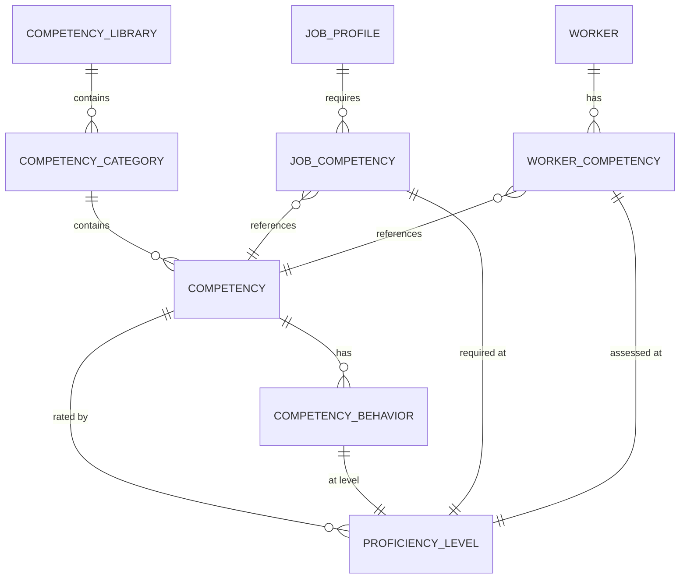
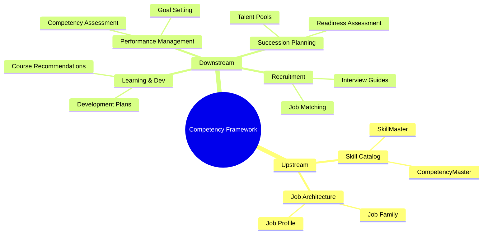

# Competency Framework Analysis

## Executive Summary

Tài liệu này tổng hợp nghiên cứu về Competency Framework từ các giải pháp HCM hàng đầu (Workday, SAP SuccessFactors, Oracle HCM) để xây dựng tính năng quản lý khung năng lực cho xTalent.

## 1. Industry Research

### 1.1 Workday

**Competency Framework:**
- Flexible competency library với specialties
- Competencies gắn với Job Families, Job Profiles, Management Levels
- Core actions, knowledge domains, skills, và behaviors theo rating level
- Competency categories và classes để nhóm competencies

**Skills Cloud:**
- Universal skills ontology với machine learning
- Auto-identify skills từ resumes, job descriptions
- Skill suggestions và inference
- Skill leveling để đo proficiency

**Proficiency Scales:**
```
- Not Applicable
- Beginner              (1)
- Intermediate          (2)
- Experienced           (3)
- Advanced              (4)
- Expert                (5)
```

### 1.2 SAP SuccessFactors

**3 Frameworks:**
1. **Job Description Manager (JDM 1.0)** - Legacy
2. **Center of Capabilities (CoC)** - Capabilities Library
3. **Talent Intelligence Hub (TIH)** - Latest, AI-powered

**Competency Library Structure:**
```
Library (Collection)
├── Category
│   ├── Group (optional)
│   │   ├── Competency
│   │   │   └── Behaviors
│   │   └── Competency
│   └── Competency
└── Category
```

**Key Features:**
- Competencies mapped to Job Roles
- Integration với Performance, Career Dev, Succession
- Proficiency rating scales
- Standard vs Custom competency libraries

### 1.3 Oracle HCM

**Oracle Dynamic Skills:**
- **Skills Nexus**: Tailored skills inventory
- **Skills Advisor**: AI-powered skill recommendations
- **Skills Center**: Employee self-service skill management

**Talent Profiles:**
- Person-based, Job-based, or Position-based
- Skills, qualifications, accomplishments, career aspirations
- Competency comparison: employee vs job requirements

**Integration:**
- Performance Management: Goals, evaluations, feedback
- Learning: Skill gaps → Training courses
- Succession Planning: Talent reviews, leadership pipeline

---

## 2. Current State Analysis in xTalent

### 2.1 Existing Entities

| Entity | Status | Notes |
|--------|--------|-------|
| `SkillMaster` | ✅ Defined | Master data for skills |
| `SkillCategory` | ✅ Defined | Skill categorization |
| `CompetencyMaster` | ⚠️ Minimal | Referenced but not fully detailed |
| `WorkerSkill` | ✅ Defined | Skill assignment to worker |
| `WorkerCompetency` | ⚠️ Minimal | Referenced but not fully detailed |
| `ProficiencyScale` | ✅ Defined | Rating scales |

### 2.2 Existing Features

| Feature | ID | Status | Relationship to Competency |
|---------|------|--------|---------------------------|
| Skill Catalog Management | FEAT-CO-040 | PLANNED | Manages SkillMaster, CompetencyMaster |

**Gap**: No dedicated feature for **Competency Framework Management** including:
- Competency library design and structure
- Competency-to-Job mapping
- Competency assessment workflows
- Behavior indicators per proficiency level

---

## 3. Proposed Competency Framework Design

### 3.1 Competency Model



### 3.2 Key Entities

| Entity | Type | Description |
|--------|------|-------------|
| `CompetencyLibrary` | AGGREGATE_ROOT | Collection of competencies (org-specific or standard) |
| `CompetencyCategory` | ENTITY | Grouping mechanism (e.g., Leadership, Technical) |
| `Competency` | ENTITY | Individual competency definition |
| `CompetencyBehavior` | VALUE_OBJECT | Behavioral indicators per proficiency level |
| `JobCompetency` | JUNCTION | Mapping competency to job with required level |
| `WorkerCompetency` | ENTITY | Worker's assessed competency level |

### 3.3 Competency Categories

Based on industry standards:

| Category | Description | Examples |
|----------|-------------|----------|
| **Core** | Required for all employees | Integrity, Teamwork, Communication |
| **Leadership** | For managerial roles | Strategic Thinking, People Development |
| **Functional** | Role-specific capabilities | Project Management, Data Analysis |
| **Technical** | Domain expertise | Software Development, Financial Modeling |

### 3.4 Proficiency Scales

**Recommended 5-Level Scale:**

| Level | Name | Description |
|-------|------|-------------|
| 1 | **Developing** | Learning the competency, needs guidance |
| 2 | **Basic** | Applies with supervision, limited independence |
| 3 | **Competent** | Applies independently in standard situations |
| 4 | **Proficient** | Applies in complex situations, coaches others |
| 5 | **Expert** | Mastery level, thought leader, shapes best practices |

### 3.5 Behavior Indicators

Each competency should have behaviors defined per proficiency level:

```yaml
competency:
  code: "LEADERSHIP_001"
  name: "Team Leadership"
  category: "Leadership"
  
  behaviors:
    - level: 1  # Developing
      indicators:
        - "Understands basic team dynamics"
        - "Follows team norms and processes"
    - level: 3  # Competent
      indicators:
        - "Effectively delegates tasks"
        - "Provides regular feedback to team members"
        - "Resolves team conflicts appropriately"
    - level: 5  # Expert
      indicators:
        - "Builds high-performing teams consistently"
        - "Develops leadership capabilities in others"
        - "Influences organizational culture"
```

---

## 4. Feature Scope

### 4.1 In Scope

1. **Competency Library Management**
   - Create/edit competency libraries (org-specific)
   - Import standard competency libraries
   - Organize by categories and groups

2. **Competency Definition**
   - Create competencies with metadata
   - Define behavior indicators per proficiency level
   - Link to related skills

3. **Competency-to-Job Mapping**
   - Assign competencies to Job Profiles
   - Define required proficiency levels
   - Distinguish mandatory vs preferred

4. **Worker Competency Assessment**
   - Record competency ratings for employees
   - Support self-assessment and manager assessment
   - Track assessment history

5. **Gap Analysis**
   - Compare worker competencies vs job requirements
   - Identify development needs
   - Integration with Learning (future)

### 4.2 Out of Scope (Phase 1)

- AI-powered competency inference
- 360-degree competency feedback
- Competency-based interview guides
- Integration with external competency libraries

---

## 5. Recommended Feature Placement

| Attribute | Value |
|-----------|-------|
| **Feature ID** | FEAT-CO-019 |
| **Name** | competency-framework |
| **Title** | Competency Framework Management |
| **Sub-module** | 05-master-data |
| **Priority** | MEDIUM |
| **Phase** | 2 |
| **Dependencies** | FEAT-CO-040 (Skill Catalog) |

---

## 6. Integration Points



---

## 7. Success Metrics

| Metric | Target | Description |
|--------|--------|-------------|
| Library Coverage | 100% | All core roles have competency requirements |
| Assessment Rate | > 80% | Employees with competency assessments |
| Gap Identification | > 90% | Gaps identified vs total possible |
| Development Alignment | > 70% | Dev plans linked to competency gaps |

---

## 8. Conclusion

**Recommendation**: ✅ NÊN XÂY DỰNG

Competency Framework là tính năng cần thiết vì:
1. **Industry Standard** - Workday, SAP, Oracle đều có competency libraries
2. **Foundation for Talent** - Cần thiết cho Performance, Learning, Succession
3. **Existing Entity Gap** - CompetencyMaster đã có nhưng chưa đủ chi tiết
4. **Separate from Skill Catalog** - Skills (technical) vs Competencies (behavioral) là khác nhau

**Next Step**: Xây dựng feature spec `competency-framework.feat.md`
