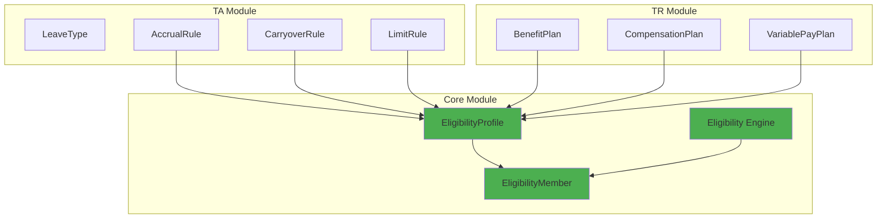

# Phân Tích Kiến Trúc Eligibility - Chuyển Sang Core Module

**Ngày**: 2025-12-11  
**Người phân tích**: System Analysis  
**Mục đích**: Xác nhận ý tưởng chuyển Eligibility từ TA module sang Core module

---

## 📋 Tóm Tắt Vấn Đề

### Hiện Trạng
Trong thiết kế hiện tại của **TA (Time & Absence) module**, các **absence rules** như:
- `AccrualRule` (tích lũy phép)
- `CarryoverRule` (chuyển phép sang năm sau)
- `LimitRule` (giới hạn)
- `OverdraftRule` (cho phép âm)
- `ProrationRule` (tính tỷ lệ)
- `RoundingRule` (làm tròn)

Đều có **scope riêng** được định nghĩa trong từng rule (ví dụ: `leaveTypeId`, `leaveClassId`).

### Đề Xuất
Thay vì mỗi rule tự quản lý scope, **tách riêng việc quản lý scope** thông qua **Eligibility Profile** theo mô hình **Dynamic Group** như đã thiết kế trong `TR/01-concept/09-eligibility-rules-guide.md`.

Sau đó, **chuyển Eligibility về Core module** để các module khác (TR, Benefits, Compensation) có thể tái sử dụng thay vì phải tự định nghĩa lại.

---

## 🔍 Phân Tích Kiến Trúc Hiện Tại

### 1. TA Module - Absence Ontology

Từ file [`absence-ontology.yaml`](file:///Users/nguyenhuyvu/Library/CloudStorage/OneDrive-VNGCorporation/Apps/mygit/a4b-doc-xtalent/product/xTalent/docs/01-modules/TA/00-ontology/absence-ontology.yaml):

#### Cấu Trúc Hiện Tại

```yaml
LeaveClass:
  relationships:
    - hasEligibilityRules: EligibilityRule[]
    - hasAccrualRules: AccrualRule[]
    - hasCarryoverRules: CarryoverRule[]
    - hasLimitRules: LimitRule[]
    - hasOverdraftRules: OverdraftRule[]
    - hasProrationRules: ProrationRule[]
    - hasRoundingRules: RoundingRule[]

LeaveType:
  relationships:
    - hasEligibilityRules: EligibilityRule[]
    - hasAccrualRules: AccrualRule[]
    - hasCarryoverRules: CarryoverRule[]
    # ... (tương tự)
```

#### EligibilityRule Entity

```yaml
EligibilityRule:
  attributes:
    - leaveTypeId: string (UUID, nullable)
    - leaveClassId: string (UUID, nullable)
    - ruleType: enum [TENURE, EMPLOYMENT_TYPE, LOCATION, DEPARTMENT, JOB_LEVEL, CUSTOM]
    - operator: enum [EQUALS, NOT_EQUALS, GREATER_THAN, LESS_THAN, IN, NOT_IN, CONTAINS]
    - value: string
    - minTenureMonths: integer (nullable)
    - employmentTypes: string[] (nullable)
    - locations: string[] (nullable)
    - priority: integer
  
  rules:
    - "Either leaveTypeId OR leaveClassId must be set, not both"
```

#### Các Rule Khác (AccrualRule, CarryoverRule, etc.)

```yaml
AccrualRule:
  attributes:
    - leaveTypeId: string (UUID, nullable)
    - leaveClassId: string (UUID, nullable)
    - accrualMethod: enum
    - accrualAmount: decimal
    # ...

CarryoverRule:
  attributes:
    - leaveTypeId: string (UUID, nullable)
    - leaveClassId: string (UUID, nullable)
    - carryoverType: enum
    - maxCarryoverAmount: decimal
    # ...
```

> ⚠️ **Vấn Đề**: Mỗi rule đều có `leaveTypeId` hoặc `leaveClassId` để xác định scope. Điều này dẫn đến:
> - **Trùng lặp logic scope** trong mỗi rule
> - **Khó tái sử dụng** cho các module khác
> - **Phức tạp khi cần thay đổi scope** (phải update nhiều rule)

---

### 2. TR Module - Eligibility Rules Guide

Từ file [`09-eligibility-rules-guide.md`](file:///Users/nguyenhuyvu/Library/CloudStorage/OneDrive-VNGCorporation/Apps/mygit/a4b-doc-xtalent/product/xTalent/docs/01-modules/TR/01-concept/09-eligibility-rules-guide.md):

#### Mô Hình Hybrid (Dynamic Rules + Cached Membership)

```yaml
EligibilityProfile:
  - code: Unique identifier
  - name: Display name
  - domain: BENEFITS | ABSENCE | COMPENSATION
  - rule_json: Dynamic criteria
  - is_active: boolean

EligibilityMember:
  - profile_id: FK to EligibilityProfile
  - employee_id: FK to Employee
  - start_date: When eligibility began
  - end_date: When eligibility ended (NULL if active)
  - last_evaluated_at: Last evaluation timestamp
```

#### Ưu Điểm Của Mô Hình Này

| Khía Cạnh | Mô Hình Hiện Tại (TA) | Mô Hình Eligibility (TR) |
|-----------|----------------------|--------------------------|
| **Performance** | ❌ Phải evaluate mỗi lần | ✅ Cached, O(1) lookup |
| **Maintenance** | ❌ Update nhiều rule | ✅ Update 1 profile |
| **Flexibility** | ⚠️ Hạn chế | ✅ Rất linh hoạt |
| **Auditability** | ❌ Khó trace | ✅ Full audit trail |
| **Reusability** | ❌ Không tái sử dụng được | ✅ Dùng cho nhiều module |

#### Ví Dụ Sử Dụng

```yaml
# Absence Integration
Leave Policy: Senior Annual Leave (15 days)
Eligibility Profile: ELIG_SENIOR_LEAVE

Profile Rule:
  min_tenure_months: 36
  grades: ["G4", "G5", "M3", "M4", "M5"]

# Benefits Integration
Benefit Plan: Premium Health Insurance
Eligibility Profile: ELIG_PREMIUM_HEALTH

Profile Rule:
  grades: ["G4", "G5", "M3", "M4", "M5"]
  employment_types: ["FULL_TIME"]
  locations: ["VN", "SG"]

# Compensation Integration
Bonus Plan: Annual STI
Eligibility Profile: ELIG_STI_2025

Profile Rule:
  employment_types: ["FULL_TIME"]
  min_tenure_months: 6
  performance_rating: ["MEETS", "EXCEEDS", "OUTSTANDING"]
```

---

## ✅ Xác Nhận Ý Tưởng

### Câu Hỏi Của Bạn

> "Trong các rule của absence ví dụ như accrual, carryover,... sẽ **không giữ scope** mà nó sẽ **link đến eligibility** để quản lý scope; nghĩa là tôi mong muốn quản lý scope theo dạng **dynamic group** như chúng ta có đề cập trong TR/01-concept/09-eligibility-rules-guide"

### Xác Nhận

✅ **ĐÚNG** - Đây là một thiết kế tốt và nhất quán với best practices. Cụ thể:

#### 1. Tách Biệt Concerns

```yaml
# BEFORE (Current TA Design)
AccrualRule:
  leaveTypeId: UUID
  leaveClassId: UUID
  accrualMethod: MONTHLY
  accrualAmount: 1.67
  # Scope được nhúng trực tiếp trong rule

# AFTER (Proposed Design)
AccrualRule:
  eligibilityProfileId: UUID  # Link to Eligibility
  accrualMethod: MONTHLY
  accrualAmount: 1.67
  # Scope được quản lý bởi EligibilityProfile

EligibilityProfile:
  code: "ELIG_SENIOR_LEAVE"
  domain: ABSENCE
  rule_json:
    min_tenure_months: 36
    grades: ["G4", "G5", "M3", "M4", "M5"]
```

#### 2. Tái Sử Dụng Eligibility Profile

```yaml
# Một EligibilityProfile có thể được dùng cho nhiều rules
EligibilityProfile: ELIG_SENIOR_STAFF
  rule_json:
    grades: ["G4", "G5", "M3", "M4", "M5"]
    employment_types: ["FULL_TIME"]

# Sử dụng cho Absence
AccrualRule:
  eligibilityProfileId: ELIG_SENIOR_STAFF
  accrualAmount: 1.67

CarryoverRule:
  eligibilityProfileId: ELIG_SENIOR_STAFF
  maxCarryoverAmount: 5

# Sử dụng cho Benefits
BenefitPlan: Premium Health
  eligibilityProfileId: ELIG_SENIOR_STAFF

# Sử dụng cho Compensation
BonusPlan: Executive Bonus
  eligibilityProfileId: ELIG_SENIOR_STAFF
```

#### 3. Performance Optimization

```yaml
# Khi cần check eligibility
Query: "Is Employee A eligible for AccrualRule X?"

# OLD WAY (Slow)
1. Get AccrualRule X
2. Get leaveTypeId or leaveClassId
3. Evaluate employee against rule criteria
4. Return result

# NEW WAY (Fast)
1. Get AccrualRule X
2. Get eligibilityProfileId
3. Lookup in EligibilityMember table (O(1))
4. Return result (instant)
```

---

## 🎯 Đề Xuất Chuyển Eligibility Sang Core Module

### Lý Do

1. **Cross-Module Reusability**
   - TA module: Leave eligibility
   - TR module: Benefits, Compensation eligibility
   - Future modules: Training, Recognition, etc.

2. **Centralized Management**
   - Một nơi quản lý tất cả eligibility logic
   - Consistent audit trail
   - Unified API

3. **Separation of Concerns**
   - Core: WHO is eligible (Eligibility Engine)
   - TA: WHAT they get (Accrual, Carryover rules)
   - TR: WHAT benefits/compensation (Plans, Policies)

### Kiến Trúc Đề Xuất



### Schema Changes

#### Core Module - New Tables

```sql
-- Core Module
CREATE TABLE core.eligibility_profile (
  id                uuid PRIMARY KEY,
  code              varchar(50) UNIQUE,
  name              varchar(255),
  domain            varchar(50),  -- ABSENCE | BENEFITS | COMPENSATION | CORE
  rule_json         jsonb,
  is_active         boolean DEFAULT true,
  effective_start_date date,
  effective_end_date   date,
  is_current_flag      boolean DEFAULT true,
  created_at        timestamp DEFAULT now(),
  updated_at        timestamp
);

CREATE TABLE core.eligibility_member (
  id                uuid PRIMARY KEY,
  profile_id        uuid REFERENCES core.eligibility_profile(id),
  employee_id       uuid REFERENCES employment.employee(id),
  start_date        date,
  end_date          date,
  last_evaluated_at timestamp,
  evaluation_source varchar(50),  -- AUTO | MANUAL | OVERRIDE
  metadata          jsonb,
  
  UNIQUE (profile_id, employee_id, start_date)
);

CREATE INDEX idx_eligibility_member_lookup 
  ON core.eligibility_member(profile_id, employee_id, start_date, end_date);
```

#### TA Module - Updated Tables

```sql
-- TA Module - Remove scope fields, add eligibility link
ALTER TABLE absence.accrual_rule 
  DROP COLUMN leave_type_id,
  DROP COLUMN leave_class_id,
  ADD COLUMN eligibility_profile_id uuid REFERENCES core.eligibility_profile(id);

ALTER TABLE absence.carryover_rule 
  DROP COLUMN leave_type_id,
  DROP COLUMN leave_class_id,
  ADD COLUMN eligibility_profile_id uuid REFERENCES core.eligibility_profile(id);

ALTER TABLE absence.limit_rule 
  DROP COLUMN leave_type_id,
  DROP COLUMN leave_class_id,
  ADD COLUMN eligibility_profile_id uuid REFERENCES core.eligibility_profile(id);

-- Similar for other rules...
```

---

## 🚀 Migration Strategy

### Phase 1: Create Core Eligibility Tables
- [ ] Add `core.eligibility_profile` table
- [ ] Add `core.eligibility_member` table
- [ ] Add indexes and constraints

### Phase 2: Migrate Existing TA Eligibility Rules
- [ ] Extract existing `EligibilityRule` from TA
- [ ] Convert to `EligibilityProfile` in Core
- [ ] Populate `EligibilityMember` cache

### Phase 3: Update TA Rules to Use Core Eligibility
- [ ] Add `eligibility_profile_id` to all rule tables
- [ ] Migrate data from old scope fields
- [ ] Update application logic
- [ ] Deprecate old fields

### Phase 4: Extend to TR Module
- [ ] Update Benefits module to use Core Eligibility
- [ ] Update Compensation module to use Core Eligibility
- [ ] Update Variable Pay module to use Core Eligibility

### Phase 5: Cleanup
- [ ] Remove deprecated fields
- [ ] Update documentation
- [ ] Update API contracts

---

## ⚠️ Considerations

### 1. Backward Compatibility

```yaml
# Option A: Dual Support (Transition Period)
AccrualRule:
  eligibilityProfileId: UUID (NEW)
  leaveTypeId: UUID (DEPRECATED)
  leaveClassId: UUID (DEPRECATED)

# Option B: Hard Migration
AccrualRule:
  eligibilityProfileId: UUID (REQUIRED)
```

### 2. Performance Impact

```yaml
# Before: Direct scope check
SELECT * FROM accrual_rule WHERE leave_type_id = ?

# After: Join with eligibility
SELECT ar.* 
FROM accrual_rule ar
JOIN core.eligibility_member em ON em.profile_id = ar.eligibility_profile_id
WHERE em.employee_id = ? AND em.end_date IS NULL

# Mitigation: Proper indexing + caching
```

### 3. Domain Isolation

```yaml
# Ensure each module can only access its own eligibility profiles
EligibilityProfile:
  domain: ABSENCE | BENEFITS | COMPENSATION | CORE

# Application layer validation
if (profile.domain !== 'ABSENCE' && profile.domain !== 'CORE') {
  throw new Error('Invalid eligibility profile for Absence module');
}
```

---

## 📊 Impact Analysis

### Benefits

| Aspect | Before | After | Impact |
|--------|--------|-------|--------|
| **Code Reusability** | ❌ Each module defines own eligibility | ✅ Shared eligibility engine | 🟢 High |
| **Maintenance** | ❌ Update multiple places | ✅ Update once in Core | 🟢 High |
| **Performance** | ⚠️ Evaluate every time | ✅ Cached lookup | 🟢 High |
| **Consistency** | ❌ Different implementations | ✅ Unified logic | 🟢 High |
| **Auditability** | ⚠️ Scattered logs | ✅ Centralized audit trail | 🟢 Medium |

### Risks

| Risk | Severity | Mitigation |
|------|----------|------------|
| Migration complexity | 🟡 Medium | Phased rollout, dual support period |
| Performance regression | 🟡 Medium | Proper indexing, caching strategy |
| Breaking changes | 🔴 High | Backward compatibility layer |
| Data migration errors | 🟡 Medium | Extensive testing, rollback plan |

---

## ✅ Kết Luận

### Xác Nhận

✅ **YÊU CẦU CỦA BẠN LÀ ĐÚNG VÀ HỢP LÝ**

1. ✅ Các rule của absence (accrual, carryover, etc.) **không nên giữ scope riêng**
2. ✅ Nên **link đến eligibility profile** để quản lý scope
3. ✅ Eligibility nên được **chuyển về Core module** để tái sử dụng
4. ✅ Sử dụng mô hình **Dynamic Group** (EligibilityProfile + EligibilityMember)

### Lợi Ích Chính

1. **Tái sử dụng**: Một eligibility profile dùng cho nhiều module
2. **Performance**: Cached membership, O(1) lookup
3. **Maintainability**: Update một nơi, áp dụng toàn hệ thống
4. **Consistency**: Unified eligibility logic
5. **Scalability**: Dễ mở rộng cho module mới

### Next Steps

1. Review và approve kiến trúc này
2. Tạo detailed design cho Core Eligibility module
3. Plan migration strategy
4. Update ontology documents
5. Update database design (DBML)

---

**Bạn có muốn tôi tiếp tục với:**
- [ ] Tạo detailed design cho Core Eligibility module?
- [ ] Update TA ontology để reflect thay đổi này?
- [ ] Tạo migration script?
- [ ] Update database design (DBML)?
