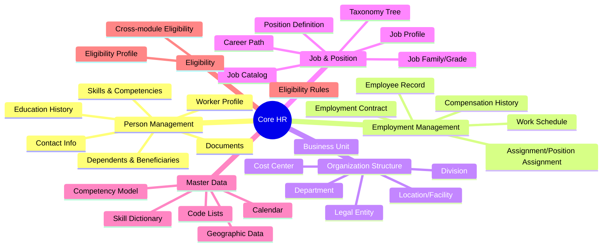

# Domain Research: Core HR (Human Capital Management)

## 1. Executive Summary

**Core HR** là nền tảng (foundation) của bất kỳ giải pháp Human Capital Management nào. Module này quản lý:
- **Person/Worker Master Data**: Thông tin cá nhân, hồ sơ nhân viên
- **Employment Relationships**: Hợp đồng lao động, phân công công việc
- **Organization Structure**: Pháp nhân, phòng ban, cây tổ chức
- **Job & Position**: Định nghĩa công việc, vị trí trong tổ chức
- **Reference Data**: Dữ liệu tra cứu dùng chung (kỹ năng, địa lý, danh mục)

**Business Value**:
- Single source of truth cho dữ liệu nhân sự
- Foundation cho các module khác (Payroll, Time & Attendance, Benefits)
- Compliance với luật lao động và GDPR

**Key Competitors Analyzed**: Workday, SAP SuccessFactors, Oracle HCM, ADP

## 2. Domain Map

## 3. Strategic Insights

### Best Practices (từ Competitors)

| Practice | Source | Description |
|----------|--------|-------------|
| **Flexible Org Structure** | Workday | Support nhiều loại hierarchy: supervisory, matrix, cost center, geographic |
| **Position Management** | All | Theo dõi positions (budgeted vs filled) thay vì chỉ employees |
| **Global Compliance** | SAP | Built-in localization cho 100+ quốc gia |
| **Self-Service Portal** | All | Employee/Manager self-service để giảm tải HR |
| **Org Studio** | Workday | Drag-drop org chart với real-time execution |
| **Configurable Foundation Objects** | SAP | Legal Entity, Business Unit, Division có thể customize |

### Industry Standards

| Standard | Relevance |
|----------|-----------|
| **GDPR** | Data protection, right to be forgotten, PII handling |
| **ISO 27001** | Information security management |
| **SOC 2** | Security, availability, processing integrity |
| **Local Labor Laws** | Specific to each country (Vietnam Labor Code) |

### Gaps & Risks

| Gap/Risk | Mitigation |
|----------|------------|
| **Data Migration Complexity** | Plan early, cleanse data before migration |
| **Multi-country Support** | Design flexible schema for localization |
| **Integration Points** | Clear API contracts với Payroll, Time & Attendance |
| **Audit Trail Requirements** | Full history tracking (SCD Type 2) |

### Recommendations

1. **ERD-First Approach**: Start from database design, enrich with business rules
2. **Position-centric Model**: Track positions, not just employees
3. **Flexible Org Trees**: Support multiple hierarchy types
4. **Reference Data Management**: Centralize skill, competency, geographic data
5. **Self-Service First**: Design với employee/manager self-service in mind

## 4. Next Steps

- [ ] Review `entity-catalog.md` → Generate `*.onto.md` files
- [ ] Review `feature-catalog.md` → Generate `*.frs.md` files
- [ ] Build ontology using `/build-ontology` workflow
- [ ] Define features using `feature-builder` skill
