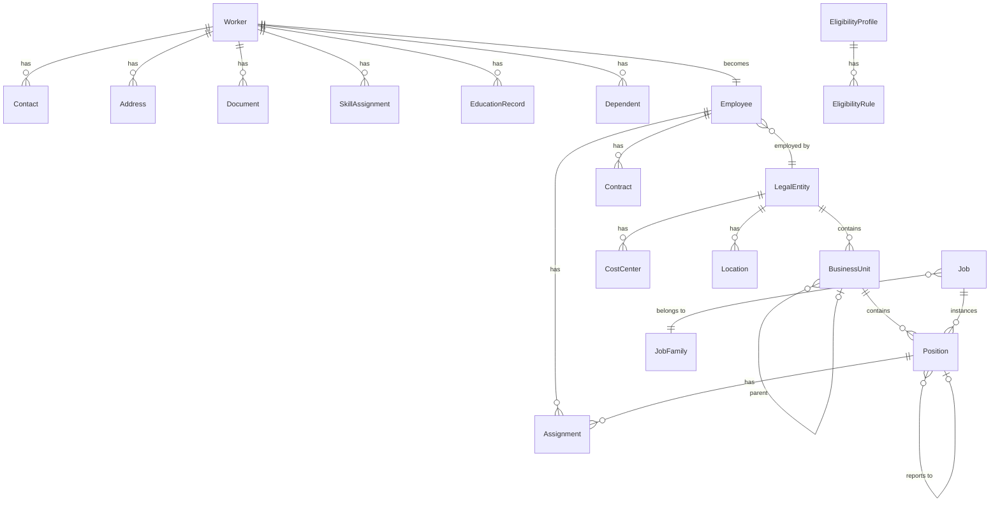

# Entity Catalog: Core HR

> **Note**: YAML above is for AI processing. Tables below for human reading.

## A. Core Master Data (AGGREGATE_ROOT)

| ID | Entity | Sub-module | Definition |
|----|--------|------------|------------|
| E-CO-001 | **[[Worker]]** | Person | Central person master data |
| E-CO-010 | **[[Employee]]** | Employment | Employment relationship |
| E-CO-020 | **[[LegalEntity]]** | Org Structure | Legal company entity |
| E-CO-021 | **[[BusinessUnit]]** | Org Structure | Business unit/department |
| E-CO-030 | **[[Job]]** | Job & Position | Job catalog definition |
| E-CO-031 | **[[Position]]** | Job & Position | Position in org structure |
| E-CO-033 | **[[CareerPath]]** | Job & Position | Career progression path |
| E-CO-050 | **[[EligibilityProfile]]** | Eligibility | Cross-module eligibility |

## B. Child Entities (ENTITY)

| ID | Entity | Parent | Definition |
|----|--------|--------|------------|
| E-CO-002 | [[Contact]] | Worker | Phone, email contacts |
| E-CO-003 | [[Address]] | Worker | Physical addresses |
| E-CO-004 | [[Document]] | Worker | Identity documents |
| E-CO-005 | [[SkillAssignment]] | Worker | Skills with proficiency |
| E-CO-006 | [[EducationRecord]] | Worker | Education history |
| E-CO-007 | [[Dependent]] | Worker | Family dependents |
| E-CO-011 | [[Contract]] | Employee | Employment contract |
| E-CO-012 | [[Assignment]] | Employee | Position assignment |
| E-CO-022 | [[CostCenter]] | LegalEntity | Cost center |
| E-CO-023 | [[Location]] | LegalEntity | Work location |
| E-CO-032 | [[JobFamily]] | - | Job grouping |
| E-CO-051 | [[EligibilityRule]] | EligibilityProfile | Eligibility condition |

## C. Reference Data (REFERENCE_DATA)

| ID | Entity | Sub-module | Definition |
|----|--------|------------|------------|
| E-CO-040 | [[Skill]] | Master Data | Skill dictionary |
| E-CO-041 | [[Competency]] | Master Data | Competency definitions |
| E-CO-042 | [[Country]] | Master Data | Country reference |
| E-CO-043 | [[Currency]] | Master Data | Currency reference |

## D. Entity Relationship Map

