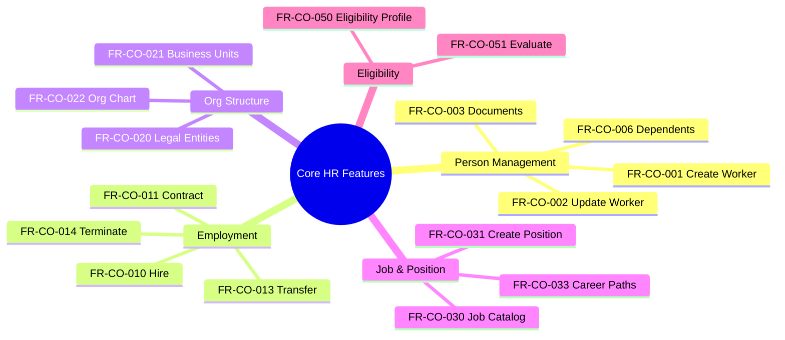

# Feature Catalog: Core HR

> **Note**: YAML above is for AI processing. Tables below for human reading.

## Capability: Person Management

| ID | Feature | User Story | Priority | Type |
|----|---------|------------|----------|------|
| FR-CO-001 | **Create Worker Profile** | As an HR Admin, create new worker | MUST | Functional |
| FR-CO-002 | **Update Worker Profile** | As an Employee, update personal info | MUST | Functional |
| FR-CO-003 | **Manage Worker Documents** | As an HR Admin, store identity docs | MUST | Functional |
| FR-CO-004 | **Manage Worker Skills** | As an HR Manager, track skills | SHOULD | Functional |
| FR-CO-005 | **View Education History** | As an HR Admin, view education | SHOULD | Functional |
| FR-CO-006 | **Manage Dependents** | As an Employee, add dependents | MUST | Functional |

## Capability: Employment Management

| ID | Feature | User Story | Priority | Type |
|----|---------|------------|----------|------|
| FR-CO-010 | **Hire Employee** | As an HR Admin, convert to employee | MUST | Workflow |
| FR-CO-011 | **Create Contract** | As an HR Admin, create contract | MUST | Functional |
| FR-CO-012 | **Assign to Position** | As an HR Admin, assign to position | MUST | Functional |
| FR-CO-013 | **Transfer Employee** | As an HR Admin, transfer employee | MUST | Workflow |
| FR-CO-014 | **Terminate Employment** | As an HR Admin, process termination | MUST | Workflow |
| FR-CO-015 | **Renew Contract** | As an HR Admin, renew contract | MUST | Workflow |

## Capability: Organization Structure

| ID | Feature | User Story | Priority | Type |
|----|---------|------------|----------|------|
| FR-CO-020 | **Manage Legal Entities** | As a System Admin, configure entities | MUST | Configuration |
| FR-CO-021 | **Manage Business Units** | As an HR Admin, create org structure | MUST | Functional |
| FR-CO-022 | **View Organization Chart** | As an Employee, view org chart | MUST | UI/UX |
| FR-CO-023 | **Manage Cost Centers** | As a Finance Admin, define cost centers | SHOULD | Configuration |
| FR-CO-024 | **Manage Locations** | As an HR Admin, define locations | SHOULD | Configuration |

## Capability: Job & Position Management

| ID | Feature | User Story | Priority | Type |
|----|---------|------------|----------|------|
| FR-CO-030 | **Manage Job Catalog** | As an HR Admin, define jobs | MUST | Functional |
| FR-CO-031 | **Create Position** | As an HR Manager, create position | MUST | Functional |
| FR-CO-032 | **Manage Position Hierarchy** | As an HR Admin, define reporting | MUST | Functional |
| FR-CO-033 | **Define Career Paths** | As an HR Admin, define career paths | SHOULD | Configuration |

## Capability: Master Data Management

| ID | Feature | User Story | Priority | Type |
|----|---------|------------|----------|------|
| FR-CO-040 | **Manage Skill Dictionary** | As an HR Admin, define skills | SHOULD | Configuration |
| FR-CO-041 | **Manage Competency Model** | As an HR Admin, define competencies | SHOULD | Configuration |
| FR-CO-042 | **Manage Geographic Data** | As a System Admin, configure countries | MUST | Configuration |

## Capability: Eligibility Management

| ID | Feature | User Story | Priority | Type |
|----|---------|------------|----------|------|
| FR-CO-050 | **Create Eligibility Profile** | As an HR Admin, create profiles | MUST | Functional |
| FR-CO-051 | **Evaluate Eligibility** | As a System, evaluate eligibility | MUST | Calculation |

## Feature Summary

| Priority | Count |
|----------|-------|
| MUST | 19 |
| SHOULD | 6 |
| **Total** | **25** |

## Feature Mindmap

