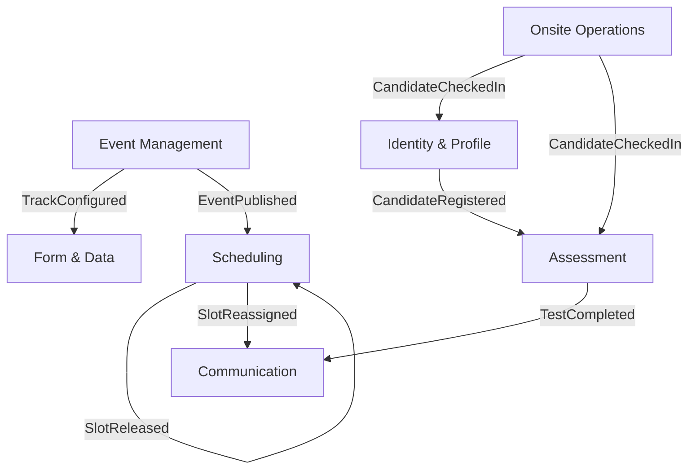

# ECR Module: Ontology Object Analysis

> Tài liệu phân tích và thống kê các loại Ontology Objects cho module Event-Centric Recruitment (ECR)

---

## 1. Executive Summary

Module **Event-Centric Recruitment (ECR)** được thiết kế để giải quyết bài toán **tuyển dụng số lượng lớn** (Mass Hiring, Fresher, Job Fair) với kiến trúc **Event-Centric thay vì Job-Centric**. 

### Thống Kê Ontology Objects

Phân tích này xác định **9 Bounded Contexts** với:

| Object Type | Số lượng |
|-------------|----------|
| **Entity objects** | 45+ |
| **Action objects** | 25+ |
| **Enum objects** | 15+ |
| **Business Rules (BRS-*)** | 35+ |

### Đặc điểm Kiến trúc

- **Triết lý**: Event (Sự kiện) là container chứa nhiều Track (Luồng tuyển dụng), mỗi Track map với 1 hoặc nhiều Request (Yêu cầu tuyển dụng)
- **Vòng đời**: Master Event lifecycle kéo dài từ trước → trong → sau sự kiện vật lý
- **Hybrid**: Kết hợp Online (Test remote) + Onsite (Check-in Kiosk, Phỏng vấn trực tiếp)

---

## 2. Phân Loại Ontology Objects theo Bounded Context

### 2.1 Event Management Context

**Vai trò**: Quản lý cấu trúc sự kiện, track, stage, và mapping với Request.

| Ontology Type | Object Name | Mô tả | Annotations |
|---------------|-------------|-------|-------------|
| **Entity** | `Event` | Aggregate Root - Sự kiện tuyển dụng (Fresher 2026) | `oracle_hcm_term`: "Recruiting Event", `module`: "ecr" |
| **Entity** | `Track` | Luồng chuyên môn trong Event (Game Dev, QC) | `workday_term`: "Job Family" |
| **Entity** | `Stage` | Giai đoạn trong quy trình (Check-in → Test → Interview) | `sap_term`: "Recruitment Phase" |
| **Entity** | `RequestMapping` | Liên kết Track ↔ Request ID | - |
| **Enum** | `EventStatusEnum` | Draft, Published, Ongoing, Archived | - |
| **Enum** | `TrackTypeEnum` | Technical, Business, Creative | - |
| **Action** | `CreateEventAction` | POST /api/events - Tạo sự kiện mới | `http_method`: "POST" |
| **Action** | `PublishEventAction` | POST /api/events/{id}/publish | - |
| **Action** | `MapTrackToRequestAction` | POST /api/events/{id}/tracks/{track}/map | - |

**Business Rules**:
- `BRS-EVT-001`: Event chỉ map với Request loại "Fresher" đã Approved nhưng chưa Posted
- `BRS-EVT-002`: Event phải có ≥1 Track để chuyển sang Published
- `BRS-EVT-003`: Track.QuestionSet phải locked trước khi tạo Report cố định

---

### 2.2 Form & Data Management Context

**Vai trò**: Quản lý metadata (câu hỏi, schema) chứ KHÔNG lưu giá trị dữ liệu.

| Ontology Type | Object Name | Mô tả | Annotations |
|---------------|-------------|-------|-------------|
| **Entity** | `QuestionBank` | Aggregate Root - Kho câu hỏi trung tâm | `oracle_hcm_term`: "Content Library" |
| **Entity** | `QuestionItem` | Một câu hỏi cụ thể (MCQ, Text, File Upload) | - |
| **Entity** | `FieldBlueprint` | Bộ câu hỏi (Question Set) cho một Track | - |
| **Entity** | `RenderingSchema` | JSON schema UI (field order, validation, dependencies) | - |
| **Entity** | `Validator` | Logic validation (Regex, Max Length) | - |
| **Enum** | `QuestionTypeEnum` | MCQ, MultiSelect, Text, FileUpload, CodeEditor, VideoResponse | - |
| **Enum** | `DifficultyLevelEnum` | Easy, Medium, Hard (Bloom's Taxonomy) | - |
| **Action** | `RenderFormByTrackAction` | GET /api/forms/schema?track_id={id} - Trả về schema động | - |
| **Action** | `LockQuestionSetAction` | POST /api/forms/blueprints/{id}/lock | - |

**Business Rules**:
- `BRS-FORM-001`: QuestionSet phải lock trước khi tạo Report hoặc Request
- `BRS-FORM-002`: Track "Game Dev" hiển thị câu hỏi về ngôn ngữ lập trình, "Game Design" hiển thị Portfolio
- `BRS-FORM-003`: Dynamic Column trong Report phải flatten JSON theo Track

---

### 2.3 Identity & Profile Context

**Vai trò**: Single Source of Truth về con người. Định danh = {PhoneNumber + StudentID}.

| Ontology Type | Object Name | Mô tả | Annotations |
|---------------|-------------|-------|-------------|
| **Entity** | `Candidate` | Aggregate Root - Ứng viên (định danh duy nhất) | `oracle_hcm_term`: "Person" |
| **Entity** | `Profile` | Dữ liệu chi tiết (Tên, Email, CV, Answers) | - |
| **Entity** | `DuplicateRecord` | Bản ghi tạm chứa hồ sơ trùng lặp | - |
| **Entity** | `MergeRule` | Policy quyết định cách merge data | - |
| **Enum** | `DuplicateActionEnum` | Remove, Replace, Merge, Allow | - |
| **Action** | `DetectDuplicateAction` | POST /api/candidates/detect-duplicate | - |
| **Action** | `MergeProfileAction` | POST /api/candidates/merge | - |

**Business Rules**:
- `BRS-ID-001`: Định danh chính = PhoneNumber AND/OR StudentID (không dùng Email)
- `BRS-ID-002`: Trùng 100% (SĐT + StudentID) → đề xuất **Remove**
- `BRS-ID-003`: Trùng partial (chỉ SĐT hoặc chỉ StudentID) → đề xuất **Replace/Merge**
- `BRS-ID-004`: Duplicate Tab phải lưu audit trail trước khi xóa vĩnh viễn

---

### 2.4 Scheduling & Resource Context

**Vai trò**: Quản lý "kho" (inventory) thời gian và không gian. Hoạt động "mù" (blind) - chỉ quan tâm ID, không quan tâm tên ứng viên.

| Ontology Type | Object Name | Mô tả | Annotations |
|---------------|-------------|-------|-------------|
| **Entity** | `Capacity` | Aggregate Root - Tổng tài nguyên cho khung thời gian | - |
| **Entity** | `Shift` | Ca thi (Sáng/Chiều, 08:00-12:00) | - |
| **Entity** | `Slot` | Đơn vị nguyên tử (1 ghế, 1 máy tính) | - |
| **Entity** | `Reservation` | Xác nhận SlotID ↔ CandidateID | - |
| **Entity** | `Waitlist` | Hàng đợi ưu tiên khi Capacity = 0 | - |
| **Entity** | `Room` | Phòng vật lý (với Max Capacity) | - |
| **Entity** | `Panel` | Hội đồng phỏng vấn (gắn với Room) | - |
| **Enum** | `SlotStatusEnum` | Available, Locked, Reserved, Blocked | - |
| **Action** | `CheckAvailabilityAction` | GET /api/schedule/availability?shift_id={id} | - |
| **Action** | `LockSlotAction` | POST /api/schedule/slots/{id}/lock | - |
| **Action** | `ReleaseSlotAction` | POST /api/schedule/slots/{id}/release | - |
| **Action** | `AutoDistributeAction` | POST /api/schedule/shifts/auto-distribute | - |
| **Action** | `ProcessWaitlistAction` | POST /api/schedule/waitlist/process | - |

**Business Rules**:
- `BRS-SCH-001`: AvailableSlots = TotalCapacity - ConfirmedReservations - LockedSlots
- `BRS-SCH-002`: Slot không được Overbook trừ khi có config "Waitlist Overflow"
- `BRS-SCH-003`: Lock Slot (Optimistic Locking) tối đa 5-10 phút, sau đó auto Release
- `BRS-SCH-004`: Capacity của Shift = Tổng Max Capacity các Room trong Shift
- `BRS-SCH-005`: Khi SlotReleased → quét Waitlist (FIFO) → auto-assign → gửi email

---

### 2.5 Assessment & Examination Context

**Vai trò**: Sinh đề, tổ chức thi, chấm điểm. Tách biệt với quản lý thông tin cá nhân.

| Ontology Type | Object Name | Mô tả | Annotations |
|---------------|-------------|-------|-------------|
| **Entity** | `Blueprint` | Aggregate Root - Ma trận đề thi (3 Dễ, 2 Khó) | - |
| **Entity** | `TestInstance` | Bài thi cụ thể được sinh cho 1 phiên | - |
| **Entity** | `TestItem` | Reference đến QuestionItem (có thể snapshot) | - |
| **Entity** | `Submission` | Bài làm của ứng viên | - |
| **Entity** | `ProctorSession` | Log giám sát (vi phạm, ảnh webcam) | - |
| **Entity** | `Assignment` | Bài tập lớn (Portfolio, Code Project) | - |
| **Enum** | `TestTypeEnum` | MCQ, Coding, Essay, Portfolio | - |
| **Enum** | `GradingStatusEnum` | Pending, AutoGraded, ManualGraded, Reviewed | - |
| **Action** | `GenerateTestAction` | POST /api/assessment/blueprints/{id}/generate | - |
| **Action** | `SubmitTestAction` | POST /api/assessment/tests/{id}/submit | - |
| **Action** | `ScoreSubmissionAction` | POST /api/assessment/submissions/{id}/score | - |
| **Action** | `DetectPlagiarismAction` | POST /api/assessment/submissions/{id}/plagiarism | - |

**Business Rules**:
- `BRS-ASM-001`: TestInstance sinh ngẫu nhiên từ Blueprint để chống gian lận
- `BRS-ASM-002`: Randomization theo độ khó tương đương (Psychometric Equivalence)
- `BRS-ASM-003`: Plagiarism check dùng MOSS (Measure Of Software Similarity)
- `BRS-ASM-004`: Auto-grading cho MCQ + Coding (test cases), Manual-grading cho Essay
- `BRS-ASM-005`: Assignment file tự động rename: `{FullName}__{Submission Date}`

---

### 2.6 Onsite Operations Context

**Vai trò**: Cầu nối Offline ↔ Online. Check-in Kiosk, QR Code, OCR CV.

| Ontology Type | Object Name | Mô tả | Annotations |
|---------------|-------------|-------|-------------|
| **Entity** | `KioskSession` | Phiên làm việc của 1 Kiosk device | - |
| **Entity** | `CheckInRecord` | Bản ghi check-in (SBD, Time, Photo) | - |
| **Entity** | `QRToken` | Mã QR duy nhất chứa CandidateID | - |
| **Entity** | `Badge` | Thẻ đeo in ra (Name, SBD, Room, Photo) | - |
| **Entity** | `CVScanRecord` | Bản ghi scan CV giấy qua OCR | - |
| **Enum** | `CheckInStatusEnum` | Pending, Checked In, No Show, Late | - |
| **Action** | `ScanQRCodeAction` | POST /api/onsite/check-in/qr | - |
| **Action** | `CapturePhotoAction` | POST /api/onsite/check-in/{id}/photo | - |
| **Action** | `QuickApplyAction` | POST /api/onsite/walk-in/register | - |
| **Action** | `PrintBadgeAction` | POST /api/onsite/badges/{id}/print | - |
| **Action** | `ScanCVAction` | POST /api/onsite/cv-scan | - |

**Business Rules**:
- `BRS-OPS-001`: Check-in cho phép sớm 30 phút, muộn 15 phút so với giờ Shift
- `BRS-OPS-002`: Sai Shift → cảnh báo nhưng cho phép Admin Override nếu còn ghế
- `BRS-OPS-003`: Offline Mode: cache dữ liệu local (SQLite), đồng bộ khi có mạng
- `BRS-OPS-004`: Photo Capture bắt buộc để Hội đồng đối chiếu (tránh thi hộ)
- `BRS-OPS-005`: Walk-in Lite Registration chỉ cần: Tên, SĐT, Email, Track → sinh SBD ngay

---

### 2.7 Communication & Notification Context

**Vai trò**: Quản lý toàn bộ luồng thông tin (Email, SMS) ra/vào người dùng.

| Ontology Type | Object Name | Mô tả | Annotations |
|---------------|-------------|-------|-------------|
| **Entity** | `MessageTemplate` | Template email/SMS (với placeholders) | - |
| **Entity** | `TriggerRule` | Điều kiện kích hoạt (Event-driven) | - |
| **Entity** | `Campaign` | Chiến dịch gửi hàng loạt | - |
| **Entity** | `NotificationLog` | Lịch sử gửi (Success/Fail, Timestamp) | - |
| **Enum** | `MessageTypeEnum` | Invitation, Reminder, Confirmation, ThankYou, Result | - |
| **Enum** | `ChannelEnum` | Email, SMS, Push, InApp | - |
| **Action** | `SendBulkInvitationAction` | POST /api/communication/bulk/invite | - |
| **Action** | `SendReminderAction` | POST /api/communication/reminders | - |
| **Action** | `SendSessionDigestAction` | POST /api/communication/managers/digest | - |

**Business Rules**:
- `BRS-COM-001`: Consolidated Email cho Manager = 1 email duy nhất/session (không spam)
- `BRS-COM-002`: Email Digest chứa Secure Link → "Digital Interview Kit" (không đính kèm 50 CV)
- `BRS-COM-003`: Bulk Action có Confirmation Modal: quét → loại bỏ Failed/Rejected → hiện "Ready: 45, Skipped: 5"
- `BRS-COM-004`: Template tự động chọn theo Stage (Screening Fail, Interview Fail)
- `BRS-COM-005`: Sau khi gửi "Thank You" (Từ chối) → nút gửi lại bị disabled

---

### 2.8 Gamification & Engagement Context

**Vai trò**: Tăng tương tác ứng viên qua điểm, nhiệm vụ, quay số.

| Ontology Type | Object Name | Mô tả | Annotations |
|---------------|-------------|-------|-------------|
| **Entity** | `Mission` | Nhiệm vụ (Check-in, Nộp CV, Hoàn thành Test) | - |
| **Entity** | `PointLedger` | Sổ cái điểm của ứng viên | - |
| **Entity** | `LuckyDrawSession` | Phiên quay số trúng thưởng | - |
| **Entity** | `Reward` | Quà tặng (Gift Voucher, Badge) | - |
| **Enum** | `MissionStatusEnum` | Pending, Completed, Expired | - |
| **Action** | `TrackMissionAction` | POST /api/gamification/missions/{id}/complete | - |
| **Action** | `ExecuteLuckyDrawAction` | POST /api/gamification/lucky-draw/execute | - |

**Business Rules**:
- `BRS-GAM-001`: Lucky Draw chỉ gồm ứng viên có Status = Attended
- `BRS-GAM-002`: Điểm cộng khi hoàn thành Mission (Check-in sớm: +50 điểm)

---

### 2.9 Analytics & Reporting Context

**Vai trò**: Tổng hợp dữ liệu, báo cáo động.

| Ontology Type | Object Name | Mô tả | Annotations |
|---------------|-------------|-------|-------------|
| **Entity** | `ReportSchema` | Cấu trúc báo cáo (Fixed/Dynamic Columns) | - |
| **Entity** | `DashboardWidget` | Widget KPI (Funnel, Source, Time to Hire) | - |
| **Entity** | `FunnelStage` | Giai đoạn phễu (Registered → Hired) | - |
| **Action** | `GenerateDynamicReportAction` | POST /api/reports/dynamic?track_id={id} | - |
| **Action** | `CalculateFunnelAction` | GET /api/analytics/funnel?event_id={id} | - |

**Business Rules**:
- `BRS-RPT-001`: Dynamic Column Flattening - JSON → CSV với cột động theo Track
- `BRS-RPT-002`: Fixed Report Templates cần lock QuestionSet trước

---

## 3. Thống Kê Tổng Quan

| Metric | Số lượng |
|--------|----------|
| **Total Bounded Contexts** | 9 |
| **Total Entity Objects** | 45+ |
| **Total Action Objects** | 25+ |
| **Total Enum Objects** | 15+ |
| **Total Business Rules (BRS-*)** | 35+ |

### Phân Bố Theo Context

| Context | Entities | Actions | Enums | Rules |
|---------|----------|---------|-------|-------|
| Event Management | 4 | 3 | 2 | 3 |
| Form & Data | 5 | 2 | 2 | 3 |
| Identity & Profile | 4 | 2 | 1 | 4 |
| Scheduling & Resource | 7 | 5 | 1 | 5 |
| Assessment | 6 | 4 | 2 | 5 |
| Onsite Operations | 5 | 5 | 1 | 5 |
| Communication | 4 | 3 | 2 | 5 |
| Gamification | 4 | 2 | 1 | 2 |
| Analytics | 3 | 2 | 0 | 2 |

---

## 4. Kiến Trúc Integration (Context Mapping)

### 4.1 Event-Driven Architecture

### 4.2 Integration Patterns

| Pattern | Contexts Involved | Ví dụ |
|---------|-------------------|-------|
| **Shared Kernel** | All | SBD, TrackID, CandidateID shared across contexts |
| **Anti-Corruption Layer (ACL)** | Event ↔ ATS Core | Event Context converts JobRequisition → Track config |
| **Open Host Service (OHS)** | Form → Frontend | `GET /schema?track={id}` API cho Web/Kiosk |
| **Event-Driven** | Onsite → Identity + Assessment | `CandidateCheckedIn` event triggers multiple contexts |

---

## 5. Ưu Tiên Triển Khai (Roadmap)

### Phase 1: Nền Tảng (Core Foundation)
- Event Management Context
- Form & Data Context
- Identity Context

### Phase 2: Vận Hành (Operations Layer)
- Scheduling & Resource Context
- Onsite Operations Context

### Phase 3: Nâng Cao (Intelligence & Experience)
- Assessment Context (Blueprinting, Proctoring)
- Gamification Context
- Analytics Context

---

## 6. Ánh Xạ Terminology với Top Vendors

| ECR Object | Oracle HCM | SAP SuccessFactors | Workday |
|-----------|------------|---------------------|---------|
| `Event` | Recruiting Event | Recruiting Campaign | Recruiting Event |
| `Track` | Job Family | Job Category | Job Family |
| `Candidate` | Person | Personnel | Worker |
| `Shift` | Interview Schedule | Time Slot | Interview Time Block |
| `Blueprint` | Assessment Template | Test Template | Assessment Blueprint |
| `Panel` | Interview Panel | Interview Team | Hiring Committee |

---

## 7. Lưu ý Implementation

### 7.1 Data Model
- **Định danh chính**: PhoneNumber + StudentID (không dùng Email)
- **SBD**: Sinh độc lập khỏi email, format configurable `{EventCode}-{TrackPrefix}-{Random}`
- **Consistency**: SBD giữ nguyên qua các vòng (Check-in → Test → Interview)

### 7.2 Scalability
- **Concurrency**: Hệ thống phải chịu 1,000 ứng viên cùng lúc đổi lịch (Lock slot database)
- **Real-time Sync**: Kiosk check-in → Manager screen delay < 5s
- **Offline Mode**: Kiosk cache local → đồng bộ khi có mạng (Timestamp conflict resolution)

### 7.3 Security & Privacy
- **Link expiry**: Secure Link cho Manager hết hạn sau 24h
- **Proctoring**: Browser lockdown, Tab switch detection, Image capture
- **Audit Trail**: Duplicate Tab lưu lịch sử trước khi xóa

---

## 8. Tài Liệu Tham Khảo

1. Product Specs: Event-Centric Recruitment (ECR) Module.md
2. Phân tích Bounded Context từ BRD.md
3. Nghiên cứu Tuyển dụng Số lượng Lớn.md
4. Bổ sung tính năng tuyển dụng tập trung sự kiện.md
5. LinkML Ontology Standards (ECR/standards/linkml-ontology-guide.md)

---

**Document Version**: 1.0.0  
**Created**: 2026-02-10  
**Module**: Event-Centric Recruitment (ECR)  
**Ontology Standard**: LinkML YAML
