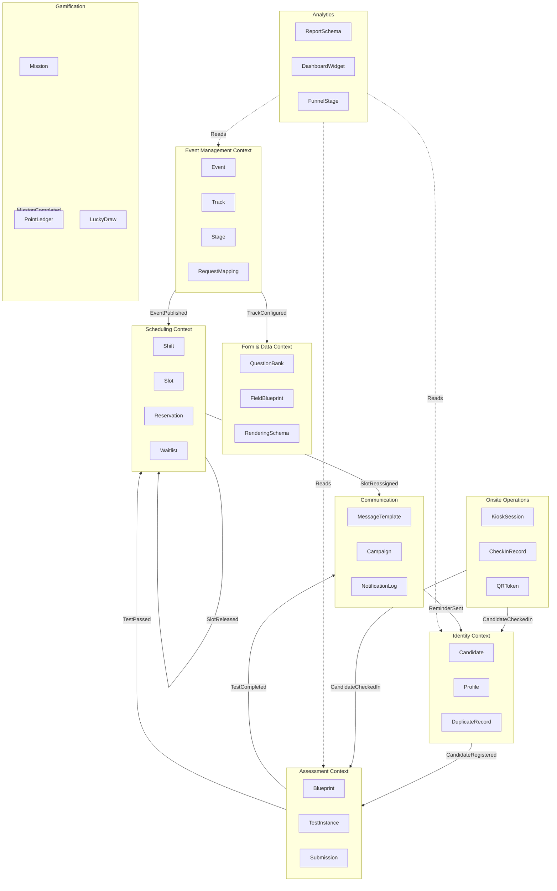

# ECR Module - Entity Relationship Diagram (ERD)

> **Generated from:** ecr-schema.dbml
> **Module:** Event-Centric Recruitment (ECR)
> **Database:** PostgreSQL
> **Last Updated:** 2026-03-10

---

## Overview

This ERD diagram represents the database schema for the Event-Centric Recruitment module, organized by 9 Bounded Contexts:

1. **Event Management** - Event, Track, Stage, RequestMapping
2. **Form & Data Management** - QuestionBank, FieldBlueprint, RenderingSchema
3. **Identity & Profile** - Candidate, Profile, DuplicateRecord
4. **Scheduling & Resource** - Shift, Slot, Room, Panel, Reservation, Waitlist
5. **Assessment & Examination** - Blueprint, TestInstance, Submission, ProctorSession
6. **Onsite Operations** - KioskSession, CheckInRecord, QRToken, Badge
7. **Communication & Notification** - MessageTemplate, Campaign, NotificationLog
8. **Gamification & Engagement** - Mission, PointLedger, LuckyDrawSession
9. **Analytics & Reporting** - ReportSchema, DashboardWidget, FunnelStage

---

## ERD Diagram

```mermaid
erDiagram
    %% ========================================================================
    %% EVENT MANAGEMENT CONTEXT
    %% ========================================================================
    events ||--o{ tracks : contains
    events ||--o{ request_mappings : maps_to
    events ||--o{ capacities : defines
    events ||--o{ shifts : has
    events ||--o{ rooms : contains
    events ||--o{ panels : contains
    events ||--o{ reservations : books
    events ||--o{ waitlists : queues
    events ||--o{ checkin_records : receives
    events ||--o{ qr_tokens : issues
    events ||--o{ badges : prints
    events ||--o{ campaigns : sends
    events ||--o{ missions : offers
    events ||--o{ point_ledgers : tracks
    events ||--o{ lucky_draw_sessions : conducts
    events ||--o{ rewards : grants
    events ||--o{ report_schemas : reports
    events ||--o{ dashboard_widgets : displays
    events ||--o{ funnel_stages : analyzes
    events ||--o{ profiles : registers
    events ||--o{ test_instances : assesses
    events ||--o{ assignments : assigns
    events ||--o{ cv_scan_records : processes
    events ||--o{ event_documents : stores

    tracks ||--o{ stages : defines
    tracks ||--o{ request_mappings : mapped_to
    tracks ||--o{ field_blueprints : uses
    tracks ||--o{ rendering_schemas : renders
    tracks ||--o{ blueprints : assesses
    tracks ||--o{ reservations : schedules
    tracks ||--o{ waitlists : queues
    tracks ||--o{ test_instances : evaluates
    tracks ||--o{ assignments : assigns
    tracks ||--o{ profiles : collects
    tracks ||--o{ funnel_stages : measures
    tracks ||--o{ report_schemas : reports
    tracks ||--o{ campaigns : notifies
    tracks ||--o{ event_documents : stores

    stages {
        uuid id PK
        uuid track_id FK
        varchar name
        stage_type type
        int order_index
        bool is_required
        jsonb config
    }

    request_mappings {
        uuid id PK
        uuid track_id FK
        uuid requisition_id
        varchar requisition_code
        varchar mapping_type
        varchar status
        timestamp mapped_at
    }

    %% ========================================================================
    %% FORM & DATA MANAGEMENT CONTEXT
    %% ========================================================================
    question_banks ||--o{ question_items : contains
    question_banks ||--o{ blueprint_question_items : referenced_in

    field_blueprints ||--o{ rendering_schemas : renders
    field_blueprints ||--o{ validators : validates
    field_blueprints ||--o{ blueprint_question_items : contains

    question_items ||--o{ blueprint_question_items : included_in
    question_items ||--o{ test_items : instantiated_in

    question_banks {
        uuid id PK
        varchar code UK
        varchar title
        varchar category
        difficulty_level difficulty
        text[] tags
    }

    question_items {
        uuid id PK
        uuid question_bank_id FK
        question_type type
        text content
        text correct_answer
        decimal score_weight
    }

    field_blueprints {
        uuid id PK
        varchar code UK
        varchar name
        uuid track_id FK
        blueprint_status status
        jsonb fields
        timestamp locked_at
    }

    rendering_schemas {
        uuid id PK
        uuid blueprint_id FK
        uuid track_id FK
        int version
        jsonb schema
        bool is_active
    }

    %% ========================================================================
    %% IDENTITY & PROFILE CONTEXT
    %% ========================================================================
    candidates ||--o{ profiles : has
    candidates ||--o{ duplicate_records : flagged_as
    candidates ||--o{ reservations : makes
    candidates ||--o{ waitlists : joins
    candidates ||--o{ test_instances : takes
    candidates ||--o{ submissions : submits
    candidates ||--o{ assignments : completes
    candidates ||--o{ checkin_records : checks_in
    candidates ||--o{ qr_tokens : owns
    candidates ||--o{ badges : wears
    candidates ||--o{ point_ledgers : earns
    candidates ||--o{ rewards : receives
    candidates ||--o{ notification_logs : receives
    candidates ||--o{ cv_scan_records : originates

    profiles {
        uuid id PK
        uuid candidate_id FK
        uuid event_id FK
        uuid track_id FK
        jsonb attributes
        text cv_url
        text photo_url
        text checkin_photo_url
        bool is_primary
    }

    duplicate_records {
        uuid id PK
        uuid candidate_id FK
        uuid new_candidate_id FK
        varchar match_type
        decimal confidence_score
        duplicate_action suggested_action
        duplicate_action resolved_action
        jsonb audit_data
    }

    merge_rules {
        uuid id PK
        varchar name
        int priority
        jsonb match_conditions
        duplicate_action action
        jsonb field_mapping
        bool is_active
    }

    %% ========================================================================
    %% SCHEDULING & RESOURCE CONTEXT
    %% ========================================================================
    shifts ||--o{ capacities : has
    shifts ||--o{ slots : contains

    rooms ||--o{ panels : hosts
    rooms ||--o{ slots : assigned_to

    panels ||--o{ slots : conducts
    panels ||--o{ panel_interviewers : comprises

    slots ||--o{ reservations : booked_by

    capacities {
        bigint id PK
        uuid event_id FK
        bigint shift_id FK
        date date
        int total_capacity
        int confirmed_count
        int locked_count
        int available_count
    }

    shifts {
        bigint id PK
        uuid event_id FK
        varchar code
        varchar name
        date date
        time start_time
        time end_time
        int total_capacity
    }

    slots {
        bigint id PK
        bigint shift_id FK
        bigint room_id FK
        bigint panel_id FK
        int slot_number
        time start_time
        time end_time
        slot_status status
        timestamp locked_until
        uuid reserved_by
    }

    reservations {
        uuid id PK
        uuid candidate_id FK
        bigint slot_id FK
        uuid event_id FK
        uuid track_id FK
        reservation_status status
        timestamp confirmed_at
        timestamp cancelled_at
        uuid rescheduled_from
    }

    waitlists {
        uuid id PK
        uuid event_id FK
        uuid track_id FK
        uuid candidate_id FK
        int priority
        varchar status
        bigint assigned_slot_id
        timestamp notified_at
        timestamp expires_at
    }

    rooms {
        bigint id PK
        uuid event_id FK
        varchar code
        varchar name
        int max_capacity
        varchar room_type
        bool is_active
    }

    panels {
        bigint id PK
        uuid event_id FK
        bigint room_id FK
        varchar code
        varchar name
        uuid lead_interviewer
        uuid[] interviewers
        int max_capacity
        bool is_active
    }

    panel_interviewers {
        uuid id PK
        bigint panel_id FK
        uuid interviewer_id
        varchar role
    }

    %% ========================================================================
    %% ASSESSMENT & EXAMINATION CONTEXT
    %% ========================================================================
    blueprints ||--o{ test_instances : generates
    blueprints ||--o{ blueprint_question_items : contains
    blueprints ||--o{ assignments : defines

    test_instances ||--o{ test_items : contains
    test_instances ||--o{ submissions : receives
    test_instances ||--o{ proctor_sessions : monitored_by

    test_items ||--o{ submissions : answered_by

    blueprints {
        uuid id PK
        varchar code UK
        varchar name
        uuid track_id FK
        uuid event_id FK
        blueprint_status status
        varchar test_type
        int duration_minutes
        decimal passing_score
        jsonb question_matrix
        decimal total_score
    }

    test_instances {
        uuid id PK
        uuid blueprint_id FK
        uuid candidate_id FK
        uuid event_id FK
        uuid track_id FK
        test_status status
        timestamp started_at
        timestamp submitted_at
        timestamp expires_at
        decimal score
        uuid proctor_session_id
    }

    test_items {
        uuid id PK
        uuid test_instance_id FK
        uuid question_item_id FK
        uuid question_bank_id FK
        int order_index
        decimal score_weight
        jsonb content_snapshot
    }

    submissions {
        uuid id PK
        uuid test_instance_id FK
        uuid test_item_id FK
        text answer_content
        timestamp submitted_at
        decimal auto_score
        decimal manual_score
        decimal final_score
        grading_status grading_status
        uuid graded_by
        jsonb plagiarism_check
    }

    proctor_sessions {
        uuid id PK
        uuid test_instance_id FK
        varchar status
        bool browser_lockdown_enabled
        int tab_switch_count
        text[] screenshots
        jsonb violations
        text[] webcam_photos
        timestamp started_at
        timestamp ended_at
    }

    assignments {
        uuid id PK
        uuid blueprint_id FK
        uuid candidate_id FK
        uuid event_id FK
        uuid track_id FK
        varchar title
        text description
        text submission_url
        varchar status
        decimal score
        uuid graded_by
    }

    blueprint_question_items {
        uuid id PK
        uuid blueprint_id FK
        uuid question_item_id FK
        uuid question_bank_id FK
        int min_count
        int max_count
        int priority
    }

    %% ========================================================================
    %% ONSITE OPERATIONS CONTEXT
    %% ========================================================================
    kiosk_sessions ||--o{ checkin_records : processes
    kiosk_sessions ||--o{ cv_scan_records : performs

    checkin_records ||--o{ badges : prints
    checkin_records ||--o{ reservations : confirms

    qr_tokens {
        uuid id PK
        uuid candidate_id FK
        uuid event_id FK
        varchar token_hash UK
        varchar token_type
        varchar status
        timestamp expires_at
        timestamp used_at
        int usage_count
    }

    badges {
        uuid id PK
        uuid candidate_id FK
        uuid event_id FK
        uuid checkin_record_id FK
        varchar badge_number UK
        text qr_code_data
        timestamp printed_at
        int reprint_count
    }

    cv_scan_records {
        uuid id PK
        uuid candidate_id FK
        uuid event_id FK
        uuid kiosk_session_id FK
        text original_file_url
        text ocr_text
        jsonb extracted_data
        varchar processing_status
        varchar linked_candidate_sbd
    }

    kiosk_sessions {
        uuid id PK
        varchar device_id UK
        uuid event_id FK
        varchar location
        varchar status
        timestamp last_sync_at
        timestamp started_at
        timestamp ended_at
    }

    checkin_records {
        uuid id PK
        uuid candidate_id FK
        uuid event_id FK
        uuid reservation_id FK
        uuid kiosk_session_id FK
        checkin_status status
        timestamp checkin_time
        bigint scheduled_shift_id
        bigint actual_shift_id
        text photo_url
        bool badge_printed
        bool is_override
        uuid override_by
    }

    %% ========================================================================
    %% COMMUNICATION & NOTIFICATION CONTEXT
    %% ========================================================================
    message_templates ||--o{ campaigns : used_by
    message_templates ||--o{ trigger_rules : defines

    trigger_rules ||--o{ campaigns : triggers

    campaigns ||--o{ notification_logs : generates

    notification_logs {
        uuid id PK
        uuid campaign_id FK
        uuid candidate_id FK
        message_type message_type
        channel channel_type
        varchar recipient
        varchar status
        text error_message
        timestamp sent_at
        timestamp delivered_at
    }

    message_templates {
        uuid id PK
        varchar code UK
        varchar name
        message_type message_type
        channel channel_type
        varchar subject_template
        text body_template
        text[] variables
        varchar locale
        bool is_active
    }

    trigger_rules {
        uuid id PK
        varchar code UK
        uuid event_id FK
        uuid track_id FK
        varchar trigger_event
        uuid template_id FK
        jsonb conditions
        int delay_seconds
        bool is_active
    }

    campaigns {
        uuid id PK
        uuid event_id FK
        uuid track_id FK
        varchar name
        message_type message_type
        uuid template_id FK
        varchar status
        jsonb recipient_criteria
        timestamp scheduled_at
        int total_recipients
        int success_count
        int failed_count
    }

    %% ========================================================================
    %% GAMIFICATION & ENGAGEMENT CONTEXT
    %% ========================================================================
    missions ||--o{ point_ledgers : awards

    point_ledgers {
        uuid id PK
        uuid candidate_id FK
        uuid event_id FK
        uuid mission_id FK
        int points
        int balance_after
        varchar transaction_type
        uuid reference_id
        timestamp expires_at
    }

    lucky_draw_sessions {
        uuid id PK
        uuid event_id FK
        varchar name
        varchar status
        jsonb eligibility_criteria
        int total_prizes
        uuid[] drawn_winners
        timestamp drawn_at
    }

    rewards {
        uuid id PK
        uuid event_id FK
        uuid candidate_id FK
        varchar reward_type
        varchar reward_name
        varchar reward_value
        varchar status
        timestamp issued_at
        timestamp delivered_at
        timestamp expires_at
    }

    %% ========================================================================
    %% ANALYTICS & REPORTING CONTEXT
    %% ========================================================================
    report_schemas {
        uuid id PK
        uuid event_id FK
        uuid track_id FK
        varchar code UK
        varchar name
        varchar report_type
        jsonb columns
        jsonb filters
        bool is_default
        bool is_active
    }

    dashboard_widgets {
        uuid id PK
        uuid event_id FK
        varchar code UK
        varchar name
        varchar widget_type
        jsonb config
        int position_x
        int position_y
        int width
        int height
        bool is_active
    }

    funnel_stages {
        uuid id PK
        uuid event_id FK
        uuid track_id FK
        varchar stage_name
        int stage_order
        int candidate_count
        decimal conversion_rate
        decimal avg_time_hours
        timestamp calculated_at
    }

    %% ========================================================================
    %% MAIN ENTITIES
    %% ========================================================================
    events {
        uuid id PK
        varchar code UK
        varchar name
        event_status status
        timestamp start_date
        timestamp end_date
        timestamp registration_start
        timestamp registration_end
        varchar location
        jsonb metadata
    }

    tracks {
        uuid id PK
        uuid event_id FK
        varchar code
        varchar name
        track_type type
        int quota
        uuid blueprint_id FK
        event_status status
    }

    candidates {
        uuid id PK
        varchar sbd UK
        varchar phone
        varchar student_id
        varchar email
        varchar full_name
        date date_of_birth
        varchar university
        int graduation_year
        candidate_status status
    }

    %% ========================================================================
    %% SUPPORTING TABLES
    %% ========================================================================
    event_documents {
        uuid id PK
        uuid event_id FK
        uuid track_id FK
        varchar document_type
        text document_url
        varchar title
        bool is_public
    }

    validators {
        uuid id PK
        uuid blueprint_id FK
        varchar field_name
        varchar validator_type
        text rule_expression
        text error_message
    }
```

---

## Context Mapping

### Integration Patterns



---

## Key Relationships

| Relationship | Type | Description |
|--------------|------|-------------|
| Event → Track | 1:N | One event contains multiple tracks |
| Track → Stage | 1:N | Track defines workflow stages |
| Track → RequestMapping | 1:N | Track maps to ATS requisitions |
| Candidate → Profile | 1:N | Candidate has multiple profiles (per event) |
| Event → Shift → Slot | 1:N:N | Hierarchical schedule structure |
| Slot → Reservation | 1:1 | Slot reserved by one candidate |
| Blueprint → TestInstance | 1:N | Blueprint generates multiple test instances |
| TestInstance → TestItem → Submission | 1:N:1 | Test contains items, items have submissions |
| Campaign → NotificationLog | 1:N | Campaign generates multiple notifications |

---

## Index Strategy

### Composite Indexes

| Table | Index Columns | Purpose |
|-------|--------------|---------|
| candidates | (phone, deleted_at) | Duplicate check with soft delete |
| candidates | (student_id, deleted_at) | Duplicate check with soft delete |
| profiles | attributes (GIN) | JSONB query on dynamic fields |
| slots | (shift_id, status) | Available slot lookup |
| reservations | (candidate_id, event_id) | Candidate's reservations |
| test_instances | (status, expires_at) | In-progress test cleanup |
| waitlists | (status, expires_at) | Expired waitlist cleanup |
| notification_logs | (status, created_at) | Failed notification retry |

### Partial Indexes

```sql
-- Active slots only
CREATE INDEX idx_slots_available ON slots(shift_id)
WHERE status = 'available';

-- Locked slots with expiry
CREATE INDEX idx_slots_locked ON slots(status, locked_until)
WHERE status = 'locked';

-- Active waitlist entries
CREATE INDEX idx_waitlists_active ON waitlists(status, expires_at)
WHERE status = 'waiting';

-- In-progress tests
CREATE INDEX idx_tests_in_progress ON test_instances(status, expires_at)
WHERE status = 'in_progress';

-- Non-deleted records
CREATE INDEX idx_events_active ON events(deleted_at, status)
WHERE deleted_at IS NULL;
```

---

## Notes

- **UUID v7** recommended for time-ordered inserts in distributed systems
- **BIGINT** used for Shift, Slot, Room, Panel tables (single-server, sequential)
- **JSONB** columns use GIN indexes for flexible querying
- **Soft delete** pattern: `deleted_at TIMESTAMP NULL`
- All foreign key columns should be indexed for JOIN performance
