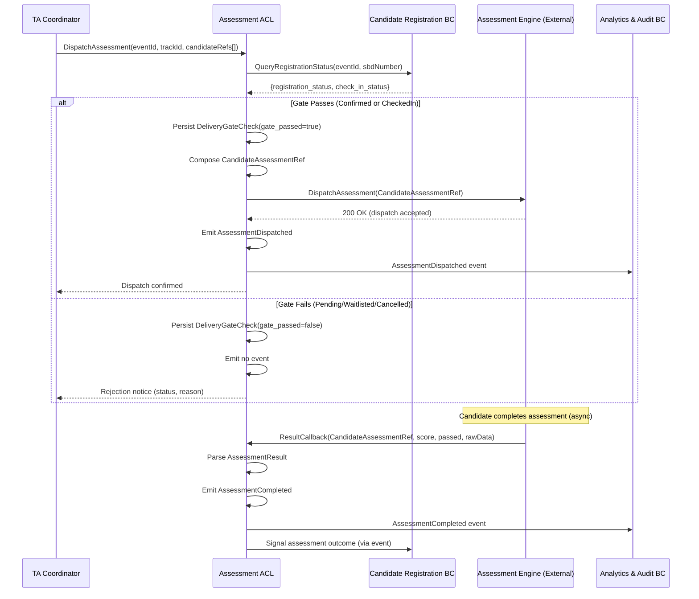

# Use Case: Deliver Assessment
## Bounded Context: Assessment (ACL)
## ECR Module | 2026-03-25

**Actor:** TA Coordinator (manual trigger) or System (automated trigger on event start)
**Trigger:** TA Coordinator selects "Dispatch Assessment" for eligible candidates, or
             system automatically triggers dispatch when event enters In Progress
**Preconditions:**
- Event exists and is In Progress
- Track has a BlueprintID configured
- TA Coordinator has Proctor role for this event (validated via xTalent RBAC)

**Postconditions (success):**
- Assessment link delivered to candidate via Assessment Engine
- `DeliveryGateCheck` record persisted (gate_passed = true)
- `AssessmentDispatched` domain event emitted
- Candidate's assessment status visible in TA Coordinator dashboard

**Business Rules:** BR-07 (delivery gate — Confirmed/Checked-In only)

---

## Happy Path

1. TA Coordinator triggers "Dispatch Assessment" for a batch of candidates in a Track.
2. System (ACL) receives the dispatch command with: eventId, trackId, list of candidateRefs.
3. For each candidate in the batch:
   a. ACL queries current registration status from Candidate Registration BC.
   b. ACL evaluates Delivery Gate (BR-07):
      - Candidate `registration_status = CONFIRMED` → gate passes, OR
      - Candidate `check_in_status = CHECKED_IN` → gate passes.
   c. ACL persists `DeliveryGateCheck` record (gate_passed = true).
   d. ACL composes `CandidateAssessmentRef`:
      - eventId, sbdNumber, trackId, blueprintId (from Track config)
      - deliveryContext: dispatched_at = now(), dispatched_by = actorId
   e. ACL calls Assessment Engine with `CandidateAssessmentRef`.
   f. Assessment Engine confirms receipt and begins delivery.
   g. ACL emits `AssessmentDispatched` domain event.
4. System updates dispatch status in TA Coordinator dashboard.
5. System displays: "Assessment dispatched to N candidates."

---

## Alternate Flows

### A1: Automated Dispatch on Event Start

**Trigger:** System receives `EventStarted` domain event from Event Management BC.

At step 2:
- Actor is "system" (automated).
- Batch is all Confirmed candidates in the Track.
- Steps 3a–3g execute identically.
- No manual TA Coordinator interaction required.

### A2: Dispatch to Checked-In Candidates Only

At step 2:
- TA Coordinator selects "Dispatch to Checked-In candidates only."
- Gate check at step 3b uses only `check_in_status = CHECKED_IN` criterion.
- Confirmed-but-not-checked-in candidates are excluded from this batch.
- Separate dispatch can be triggered for remaining Confirmed candidates later.

### A3: Re-Dispatch After Engine Failure

At step 3f:
- Assessment Engine previously failed (see E2).
- TA Coordinator selects "Retry dispatch" for failed candidates.
- ACL re-composes CandidateAssessmentRef with updated deliveryContext timestamp.
- Engine receives the re-dispatch request; generates a new access link.
- ACL emits a new `AssessmentDispatched` event (correlated via same sbdNumber + trackId).

---

## Error Flows

### E1: Delivery Gate Rejected — Candidate Not Eligible

At step 3b:
- Candidate registration status is PENDING, WAITLISTED, or CANCELLED.
- ACL rejects dispatch for this candidate.
- ACL persists `DeliveryGateCheck` record (gate_passed = false, rejection_reason = STATUS_*).
- Candidate is excluded from this dispatch batch.
- System displays: "Assessment not dispatched to [SBD]. Candidate status: [status]. Eligibility requires Confirmed or Checked-In."
- Recovery: TA Coordinator confirms the candidate first, then retries.

### E2: Assessment Engine Unavailable

At step 3e:
- ACL call to Assessment Engine times out or returns 5xx.
- ACL does not emit `AssessmentDispatched`.
- ACL emits `AssessmentFailed` (failure_reason = ENGINE_UNAVAILABLE).
- Candidate appears in "Dispatch Failed" queue in dashboard.
- Recovery: TA Coordinator retries (see A3) once engine recovers.

### E3: No Blueprint Configured for Track

At step 3d:
- Track has no blueprintId configured.
- ACL cannot compose CandidateAssessmentRef.
- ACL persists `DeliveryGateCheck` (gate_passed = false, rejection_reason = NO_BLUEPRINT_CONFIGURED).
- Entire batch for that Track is rejected.
- System displays: "Cannot dispatch assessment. Track [name] has no assessment blueprint configured."
- Recovery: TA Coordinator configures BlueprintID on the Track (Event Management BC action), then retries.

### E4: Insufficient RBAC

At step 2:
- xTalent RBAC returns: actor does not have Proctor role for this event.
- ACL rejects the command with 403.
- System displays: "You do not have permission to dispatch assessments for this event."
- No DeliveryGateCheck record created. No domain event emitted.

---

## Sequence Diagram

---

## Domain Events Emitted

- `AssessmentDispatched` — when ACL successfully submits dispatch to engine (per eligible candidate)
- `AssessmentCompleted` — when ACL receives and parses a result callback from engine
- `AssessmentFailed` — when engine is unavailable, dispatch is rejected, or result cannot be parsed

---

## Notes

- The Delivery Gate (BR-07) is non-bypassable. Even TA Coordinators with full admin role cannot override the gate. This is a business rule implemented as an invariant in the ACL, not a permission check.
- The ACL does not expose the Assessment Engine's internal candidate IDs to the ECR domain. CandidateAssessmentRef uses sbdNumber as the correlation key.
- If a candidate's status changes between dispatch and result callback (e.g., registration cancelled after dispatch), the ACL still processes the result and emits AssessmentCompleted. The pipeline advancement decision is made by downstream contexts, not the ACL.
- rawData in AssessmentResult is stored as-is and forwarded in AssessmentCompleted for audit consumption by BC-08. The ECR domain never parses rawData.
