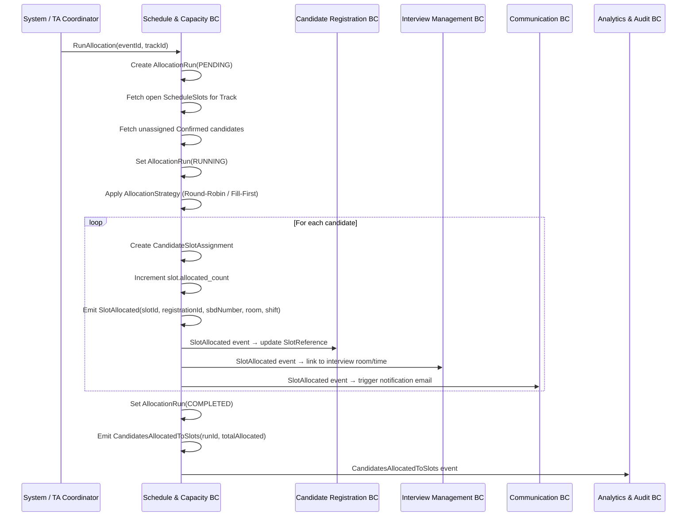

# Use Case: Allocate Candidates to Schedule Slots
## Bounded Context: Schedule & Capacity
## ECR Module | 2026-03-25

**Actor:** System (triggered automatically) or TA Coordinator (manual run)
**Trigger:** A batch of `CandidateConfirmed` events has accumulated, or TA Coordinator manually triggers allocation
**Preconditions:**
- EventSchedule exists for the Event and is in DRAFT or ACTIVE state (not LOCKED)
- At least one ScheduleSlot exists for the target Track with available capacity
- TA Coordinator has Schedule Manager role for this event (for manual trigger)

**Postconditions:**
- Each eligible confirmed candidate is assigned to exactly one ScheduleSlot
- `SlotAllocated` domain event emitted per candidate
- `CandidatesAllocatedToSlots` event emitted on run completion
- Candidate Registration BC receives slot reference for each allocated candidate
- AllocationRun record persisted with run summary

**Business Rules:** BR-06 (no allocation on locked schedule — implies Event not yet In Progress), BR-10 (FCFS for any waitlist-derived confirmations)

---

## Happy Path

1. System accumulates `CandidateConfirmed` events for a Track until batch threshold reached, or TA Coordinator clicks "Run Allocation."
2. System creates an AllocationRun record (status = PENDING) for the event + track.
3. System fetches all ScheduleSlots for the Track with available capacity (allocated_count < effective_capacity).
4. System fetches confirmed candidates without a slot assignment for this Track, ordered by confirmed_at timestamp.
5. System sets AllocationRun status to RUNNING.
6. System applies the configured AllocationStrategy:
   - **Round-Robin**: Distribute candidates across all open slots in rotating order. Slot 1 → Slot 2 → Slot 3 → Slot 1 → etc.
   - **Fill-First**: Assign candidates to Slot 1 until full, then Slot 2, etc.
7. For each assignment:
   a. System creates a CandidateSlotAssignment record.
   b. System increments ScheduleSlot.allocated_count.
   c. System updates ScheduleSlot.slot_allocation_state (PARTIAL or FULL).
   d. System emits `SlotAllocated` domain event: slotId, registrationId, sbdNumber, trackId, roomName, shiftStart, shiftEnd.
8. System sets AllocationRun status to COMPLETED.
9. System emits `CandidatesAllocatedToSlots` domain event with run summary.
10. Communication BC receives `SlotAllocated` events and triggers slot assignment notification emails.

---

## Alternate Flows

### A1: Manual Trigger by TA Coordinator

At step 1:
- TA Coordinator selects "Run Allocation Now" from the Schedule management screen.
- System validates RBAC: actor has Schedule Manager role.
- triggered_by = actorId (not "system").
- Steps 2–10 proceed identically.

### A2: Partial Allocation (Insufficient Slot Capacity)

At step 6:
- The total effective capacity across all slots for the Track is less than the number of confirmed candidates.
- System allocates until all slots are FULL.
- Remaining unallocated confirmed candidates are left without a slot.
- AllocationRun status = PARTIAL.
- System emits `CandidatesAllocatedToSlots` with partial = true.
- System notifies TA Coordinator: "N candidates could not be allocated. All slots are full. Add capacity or create additional slots."
- Recovery: TA Coordinator applies CapacityOverride or adds new ScheduleSlots, then re-runs allocation.

### A3: Re-Run Allocation (Idempotent)

At step 1:
- An AllocationRun has already completed for this batch.
- TA Coordinator requests re-run (e.g., after adding more slots).
- System checks: candidates already assigned to slots are excluded from the new run.
- System only allocates unassigned confirmed candidates.
- Result is consistent with a fresh run for the same remaining unassigned set.

---

## Error Flows

### E1: No Schedule Slots Exist

At step 3:
- EventSchedule has no ScheduleSlots for the Track.
- System aborts the AllocationRun (status = FAILED).
- System notifies TA Coordinator: "Allocation failed. No schedule slots configured for Track [name]."
- Recovery: TA Coordinator creates ScheduleSlots for the Track.

### E2: Schedule Is Locked (Event In Progress)

At step 2:
- EventSchedule.structural_locked = true (Event is In Progress, BR-06).
- System rejects the run creation.
- System notifies: "Cannot run allocation. Event is In Progress and schedule is locked."
- Note: Individual slot swaps (operational, not structural) are still permitted with TA Coordinator authorization.

### E3: Insufficient RBAC (Manual Trigger)

At step 1 (manual trigger path):
- xTalent RBAC returns: actor does not have Schedule Manager role.
- System rejects with 403.
- No AllocationRun created.

---

## Sequence Diagram

---

## Domain Events Emitted

- `SlotAllocated` — emitted per candidate assigned (consumed by CR, IM, Communication)
- `CandidatesAllocatedToSlots` — emitted once per AllocationRun completion

---

## Notes

- AllocationRun idempotency: If the run is triggered twice for the same candidate set (e.g., due to a retry), candidates already assigned to slots are excluded from the second run. The second run only processes unassigned candidates.
- AllocationStrategy cannot be changed once the Event is In Progress (BR-06). Strategy selection is a structural configuration, not an operational parameter.
- The FCFS ordering (BR-10) applies to waitlist activation, not to the AllocationRun itself. Within the AllocationRun, candidates are ordered by confirmed_at timestamp — this naturally preserves earlier-confirming candidates getting preferred slots (though both strategies are deterministic regardless).
