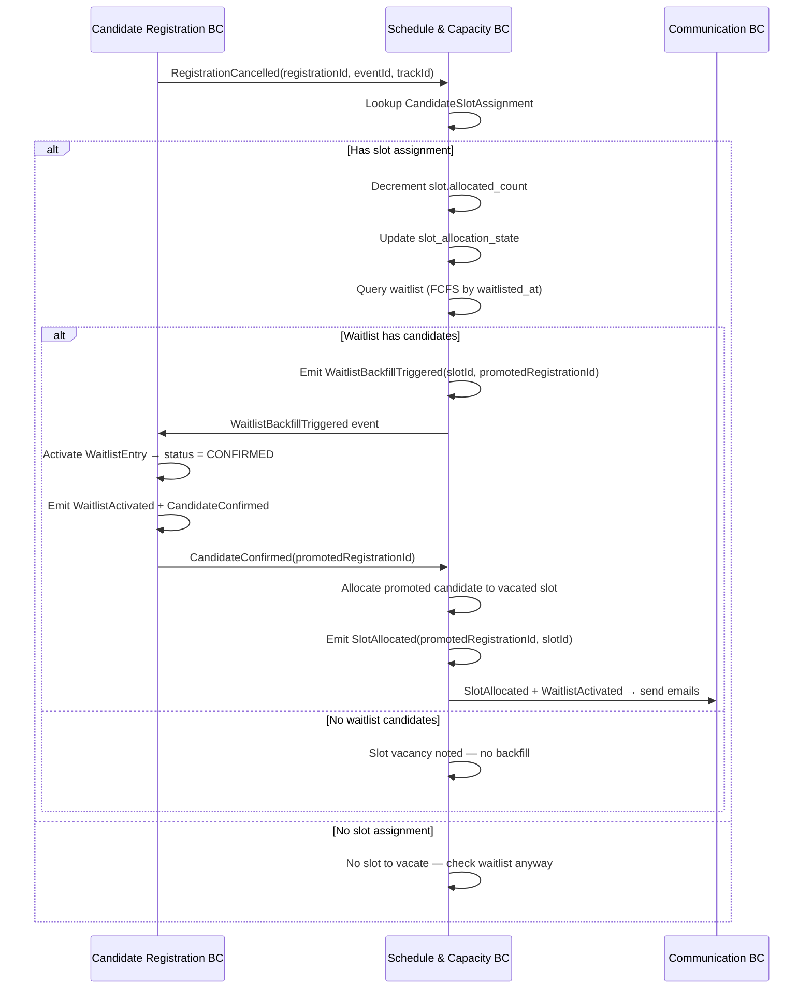

# Use Case: Waitlist Backfill on Slot Vacancy
## Bounded Context: Schedule & Capacity
## ECR Module | 2026-03-25

**Actor:** System (fully automated)
**Trigger:** `RegistrationCancelled` domain event received from Candidate Registration BC, where the cancelled candidate had an allocated slot
**Preconditions:**
- EventSchedule exists and is not in LOCKED state (or if LOCKED, operational backfill is still permitted)
- The cancelled candidate had a CandidateSlotAssignment record
- At least one candidate remains on the waitlist for the Track (WaitlistEntry.activation_state = WAITING)

**Postconditions:**
- Vacated slot's allocated_count decremented
- Next waitlisted candidate (FCFS order by waitlisted_at) promoted
- `WaitlistBackfillTriggered` domain event emitted
- Candidate Registration BC activates the WaitlistEntry and transitions candidate to Confirmed
- `SlotAllocated` domain event emitted for the promoted candidate

**Business Rules:** BR-10 (FCFS only — no manual waitlist reorder)

---

## Happy Path

1. System receives `RegistrationCancelled` event: {registrationId, eventId, trackId, sbdNumber}.
2. System looks up CandidateSlotAssignment for the cancelled registration.
3. System finds an existing slot assignment (candidate had been allocated).
4. System decrements ScheduleSlot.allocated_count by 1.
5. System updates ScheduleSlot.slot_allocation_state (FULL → PARTIAL, or PARTIAL if it stays below capacity).
6. System queries the waitlist for the Track, ordered by waitlisted_at ascending (FCFS, BR-10).
7. System finds the first WAITING WaitlistEntry.
8. System emits `WaitlistBackfillTriggered` event: {slotId, promotedRegistrationId, promotedSbdNumber}.
9. Candidate Registration BC receives the event and activates the WaitlistEntry (status → Confirmed).
10. Candidate Registration BC emits `WaitlistActivated` and then `CandidateConfirmed`.
11. System receives `CandidateConfirmed` for the promoted candidate and allocates them to the now-available slot.
12. System emits `SlotAllocated` for the promoted candidate.
13. Communication BC sends waitlist promotion email and slot assignment email.

---

## Alternate Flows

### A1: No Waitlist Candidates Available

At step 7:
- No WaitlistEntry in WAITING state exists for the Track.
- System decrements ScheduleSlot.allocated_count (step 4–5) but takes no further action.
- Slot remains PARTIAL (or OPEN if all candidates cancelled).
- No `WaitlistBackfillTriggered` event emitted.
- Vacancy is noted in the TA Coordinator dashboard as an unfilled slot.

### A2: Cancellation Without Prior Slot Assignment

At step 2:
- The cancelled registration has no CandidateSlotAssignment (candidate was confirmed but not yet allocated, e.g., EventSchedule is still in DRAFT).
- System skips steps 3–5 (no slot to vacate).
- Steps 6–13 proceed normally if there is a waitlist — the next run of the allocation algorithm will include the slot.
- If no waitlist, no action taken.

### A3: Backfill During Event In Progress (Operational Change)

- EventSchedule.structural_locked = true (Event is In Progress).
- Structural changes are blocked, but operational backfill is permitted.
- Steps 1–13 proceed identically.
- The promoted candidate gets the same slot the cancelled candidate occupied (slot is already allocated to the right room/time — this is an operational swap, not a structural change).

---

## Error Flows

### E1: Waitlist Candidate Has Also Cancelled

At step 8:
- The promoted WaitlistEntry's registration was subsequently cancelled (edge case: candidate cancelled while on waitlist before being promoted).
- System detects registration_status = CANCELLED for the promoted candidate.
- System skips this WaitlistEntry and moves to the next one in FCFS order.
- Repeats until a valid WAITING candidate is found or the waitlist is exhausted.

### E2: Concurrent Backfill Conflict

- Two RegistrationCancelled events arrive simultaneously for the same Track.
- System processes them sequentially (optimistic locking on ScheduleSlot.allocated_count).
- Each cancellation triggers its own independent backfill cycle.
- Two different waitlisted candidates are promoted (one per vacancy).
- FCFS ordering is preserved by the waitlisted_at sort.

---

## Sequence Diagram

---

## Domain Events Emitted

- `WaitlistBackfillTriggered` — emitted when a waitlisted candidate is identified for promotion
- `SlotAllocated` — emitted after the promoted candidate is assigned to the vacated slot

---

## Notes

- Waitlist backfill is fully automatic. No TA Coordinator intervention is needed or permitted for the promotion order (BR-10). Manual slot reassignment bypasses this flow and requires a separate audit-logged operation.
- The promoted candidate may or may not receive the exact slot that was vacated. The allocation algorithm re-evaluates which slot to assign based on current state and the configured strategy. However, for simplicity in most cases (especially Fill-First), the vacated slot is the most natural target.
- FCFS order (BR-10) is enforced by sorting on waitlisted_at. No other reorder key is supported by the domain model.
